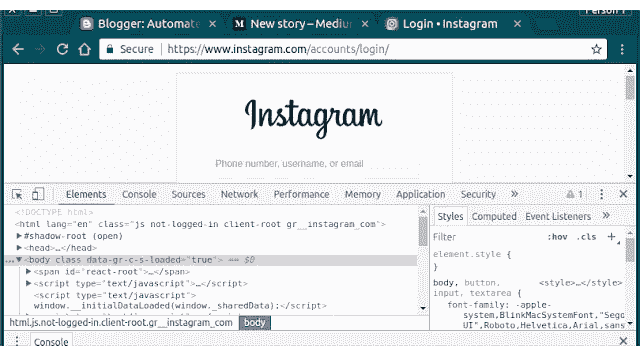
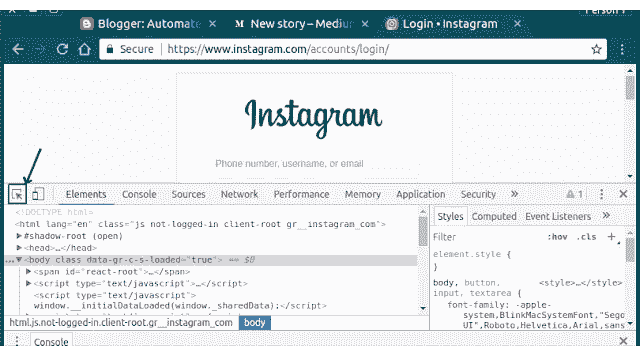
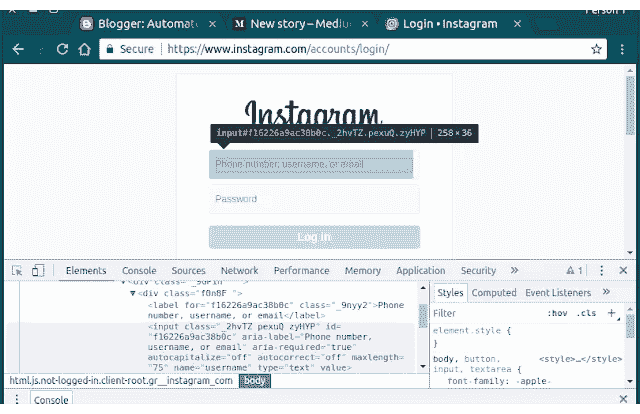
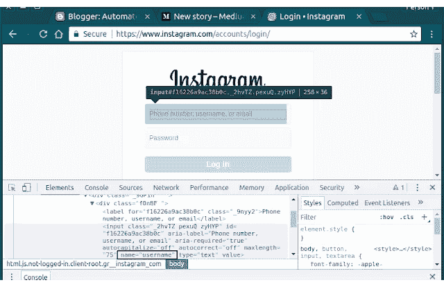

# Python 2019 中使用 Selenium WebDriver 的自动化登录系统

> 原文：<https://medium.com/analytics-vidhya/automate-login-system-using-selenium-webdriver-in-python-2019-8844718b06e?source=collection_archive---------0----------------------->

# 要求:

1.  **Selenium WebDriver(下面给出了链接)**
2.  **蟒 3**
3.  **任意文字编辑**

**让我们从 selenium web 驱动程序开始，它是什么？**

我不会用技术上的东西来烦你们，只是要记住，这就像一个驱动程序，有能力自动化网络上的一切。

你可以通过这个链接下载-

[https://www.seleniumhq.org/download/](https://www.seleniumhq.org/download/)

[选择 python]

或者你可以通过这个下载非官方的 ChromeDriver 文件:

[https://sites . Google . com/a/chrome . org/chrome driver/downloads](https://sites.google.com/a/chromium.org/chromedriver/downloads)

如何选择正确的版本？

进入 chrome://settings/help 检查你的 chrome 版本

**现在你已经完成了基本设置，让我们开始吧。**

**将 ChromeDriver 文件保存在创建程序的同一文件夹中。**

**在您编码或复制粘贴本代码之前，请理解代码。**

**现在让我们看看代码:**

**从时间进口睡眠**

**从 selenium 导入 webdriver**

#这将定位并调用您的 chrome 驱动程序

**浏览器= webdriver。chrome(’。/chrome driver’)**

# get()函数将您的浏览器重定向到您提供的链接

#这里我们提供 instagram 登录站点**browser . get(' https://www . insta gram . com/accounts/log in/？hl=en')**

#这将获取元素名称，即您的用户名字段。

#我们稍后会学习如何做到这一点(如果你好奇的话)

**用户名=浏览器.查找元素名('用户名')**

#当然，现在我们点击它。用户名.点击()

# send_keys()就像在元素**username . send _ keys(' Rahul . Bhatt 18 ')**上键入单词

#密码字段也是如此

**password = browser . find _ element _ by _ name(' password ')password . click()password . send _ keys(' putYourPassword ')**

#点击提交按钮

**用户名.提交()**

**睡眠(100)**

**browser.close()**

**现在在你的终端上运行程序或者使用你的 IDLE (PyCham)使用这个命令:**

**python3 filename.py**

**Vola！你的自动登录系统准备好了！**

现在，如果你想学习 web scrapping(从 DOM 中获取 web 元素)，请跟随我:

如果你是一名 web 开发人员，你可以很容易地理解，但是对于那些对 web 开发一无所知的人，不要担心，我会支持你的！

这一部分你必须手动从 DOM 中抓取 web 元素，这样你的 web 驱动才能选择正确的元素。现在我已经这样做了，所以代码将不管工作，这只是为了让你理解，以便你可以用它做更多的事情。

现在打开 Instagram 登录网站，按 F12。你可以看到很好的元素编辑器。

如何去检查元素

然后选择这个:

这是选择元素的方法

然后将光标移到**用户名**字段:

现在查看 Inspect 元素中的选定文本:

检查输入类中的“name”属性。

同样，对密码字段也是如此。

**这就是你如何抓取网页元素。**

**我很感激，感谢阅读:)**