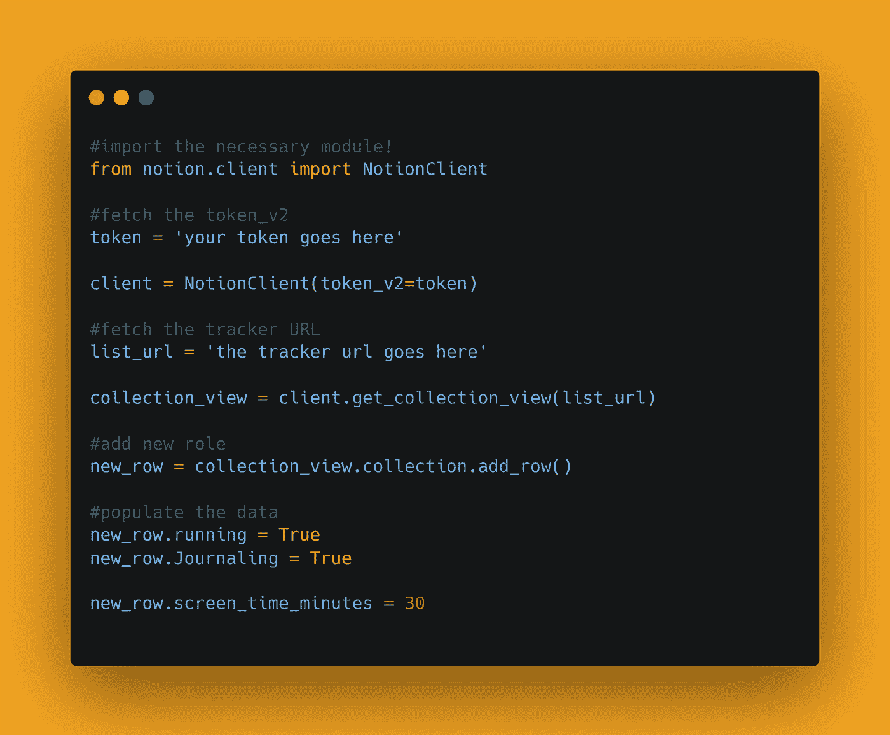

# 用 Python 自动化概念

> 原文：<https://medium.com/analytics-vidhya/automate-notion-with-python-29259c750262?source=collection_archive---------3----------------------->

你好世界！


你听说过概念吗？你用概念吗？

[概念](https://www.notion.so/)是一款超级干净、看似极简的笔记应用。我仍然在学习如何使用概念，因为我最近才开始使用它，如果你是一个普通读者，你现在一定知道，我是一个 Python 的忠实粉丝。一周前，我在探索如何使用概念，突然想到，有没有一种方法可以用 Python 来自动化它。所以在这篇博客文章中，我们将学习如何自动化概念。我们将看到 Python 中的实现。

[查看 python 的终极资源库](https://github.com/ayushi7rawat/Ultimate-Python-Resource-Hub)。发现有用就掉颗星！有什么要补充的吗？开个 PR 就一样了！

你可以参考我的 YouTube 视频教程，看一个工作教程来更好的理解和一步一步的指导。

# 这个博客将会涵盖什么

```
1\. What is Notion?
2\. Modules Used
2\. How to Automate Notion Using Python
```

*我们开始吧！*

# 观念是什么？：

字典定义:

> opinion 是一个应用程序，它提供了数据库、看板、wikis、日历和提醒等组件。用户可以连接这些组件来创建自己的知识管理、笔记、数据管理、项目管理等系统。

将您的日常工作应用融为一体的新工具。这是您和您的团队的一体化工作空间。如果你想了解更多，你可以参考:

*   [观念的维基百科页面](https://en.wikipedia.org/wiki/ZIP_(file_format)。
*   [概念是关于页面](https://www.notion.so/about)

# 使用的模块:

# 概念模块:

`Notion`模块是[概念的非官方 Python API 客户端，所以](http://notion.so/)。它也适用于免费和付费账户。

## 让我们来看看它的一些特性:

*   它具有面向对象的接口(将数据库表映射到 Python 类/属性)
*   内部概念格式和适当的 Python 对象之间的自动转换。
*   用于响应概念变化的回调系统(例如，用于触发动作、更新另一个 API 等)
*   统一数据存储中数据的本地缓存*(注意:磁盘缓存现在默认禁用；要启用，在初始化* `*NotionClient*` *)* 时添加 `*enable_caching=True*`

*如果你想了解更多，可以参考[概念模块文档](https://notion-py.readthedocs.io/en/latest/py-modindex.html)。*

*现在你已经熟悉了*概念用例*，并且已经获得了*概念模块*的基本知识，我们可以前进到*编码部分。**

# *该编码了！*

*你可以在我的 [GitHub 库](https://github.com/ayushi7rawat/Youtube-Projects/tree/master/Automate%20Notion)找到所有代码。发现有用就掉颗星。*

**

*为了访问 Python 库，您需要将它安装到您的 Python 环境中，使用下面的命令来安装`Notion`*

```
*pip install notion*
```

*我将利用习惯跟踪模板。我们将准备一个脚本，该脚本将在末尾添加一个带有正确格式日期的新行。*

**

*一旦你打开概念，你可以在导航左侧栏中找到模板。*

**

*如果您打开它，将会打开一个新的 pop 窗口，展开个人选项卡。*

**

*一旦你展开个人标签，你将能够发现习惯跟踪模板。成功选择后，点击使用此模板。*

**

*如果模板出现在您的左侧导航栏中，则您已经成功地将其导入到您的概念中。*

*现在，我们需要在 python 脚本中导入包。使用以下命令来完成此操作。*

```
*from notion.client import NotionClient*
```

*接下来，我们需要身份验证令牌。为此，在你的浏览器中打开概念。成功登录后，打开 DevTools。*

**

*要打开 DevTools，点击右键并选择 Inspect。对于 Windows，您也可以使用快捷键(Ctrl + Shift + I)。*

**

*接下来，*

*   *导航至应用程序选项卡*
*   *转到左侧菜单中的存储部分*
*   *展开 Cookies*
*   *搜索名为`token_v2`的行*
*   *复制`token_v2`的值并保存在安全的地方。*

**

*关闭 DevTools 窗口。接下来，复制追踪器的网址，暂时保存下来。*

```
*token = 'your token goes here'client = NotionClient(token_v2=token)*
```

*您为`token_v2`复制的值在这里被称为`token`。*

```
*tracker_url = 'Your collection url goes here'collection_view = client.get_collection_view(tracker_url)*
```

*习惯跟踪器的 URL 在这里被称为收藏 URL。*

*一旦我们建立了连接，让我们添加一个新行。这里我们将使用`add_row`方法。*

```
*new_row = collection_view.collection.add_row()*
```

*现在让我们在新创建的行中填充值。*

```
*new_row.running = True
new_row.Journaling = True
new_row.screen_time_minutes = 30*
```

*保存并运行 python 脚本。您将看到创建了一个新行*

*   *运行复选框已启用。*
*   *启用了日志复选框。*
*   *屏幕时间分钟值设置为 30 分钟*

*它看起来会像这样:*

**

*最后，让我们通过格式化习惯跟踪器中新条目的日期来自动化我们的脚本。*

```
*from datetime import datetimetoday = datetime.today()
new_row.title = today.strftime('%d.%m.%Y')*
```

*通过这些步骤，我们已经成功地创建了一个简单的机器人来使用 Python 自动化 concept 中的工作流。就是这样！*

*很简单，不是吗？希望这篇教程有所帮助。我强烈推荐你去看看 YouTube 上的视频，别忘了订阅我的频道。*

*您可以使用概念库，甚至探索更多的特性。当你这样做的时候，在推特上给我加标签。*

*你可以在我的 [GitHub 库](https://github.com/ayushi7rawat/Youtube-Projects/tree/master/Automate%20Notion)找到所有代码。发现有用就掉颗星。*

*感谢您的阅读，我很乐意通过 [Twitter](https://twitter.com/ayushi7rawat) | [LinkedIn](https://www.linkedin.com/in/ayushi7rawat/) 与您联系。*

*请分享您的宝贵建议，感谢您的真诚反馈！*

*你绝对应该看看我的其他博客:*

*   *[Python 3.9:你需要知道的一切](https://ayushirawat.com/python-39-all-you-need-to-know)*
*   *[终极 Python 资源枢纽](https://ayushirawat.com/the-ultimate-python-resource-hub)*
*   *[GitHub CLI 1.0:您需要知道的一切](https://ayushirawat.com/github-cli-10-all-you-need-to-know)*
*   *[成为更好的程序员](https://ayushirawat.com/become-a-better-programmer)*
*   *[如何制作自己的谷歌 Chrome 扩展](https://ayushirawat.com/how-to-make-your-own-google-chrome-extension-1)*
*   *[使用 Python 从任何 pdf 创建您自己的有声读物](https://ayushirawat.com/create-your-own-audiobook-from-any-pdf-with-python)*
*   *你很重要，你的心理健康也很重要！*

# *资源:*

*   *[notion-py.readthedocs.io/en/latest/py-modin..](https://notion-py.readthedocs.io/en/latest/py-modindex.html)*
*   *[pypi.org/project/notion](https://pypi.org/project/notion/)*
*   *[github.com/jamalex/notion-py](https://github.com/jamalex/notion-py)*
*   *[en . Wikipedia . org/wiki/ideation _(app)](https://en.wikipedia.org/wiki/Notion_(app))*
*   *[所以](https://www.notion.so/)*

*在我的下一篇博客文章中再见，保重！！*