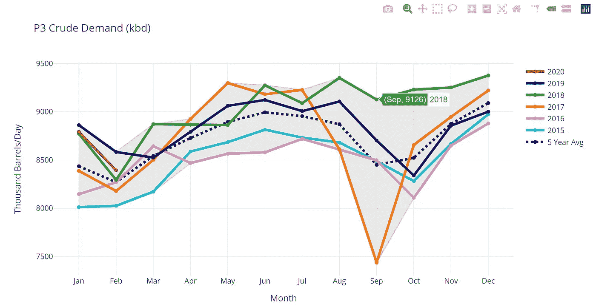
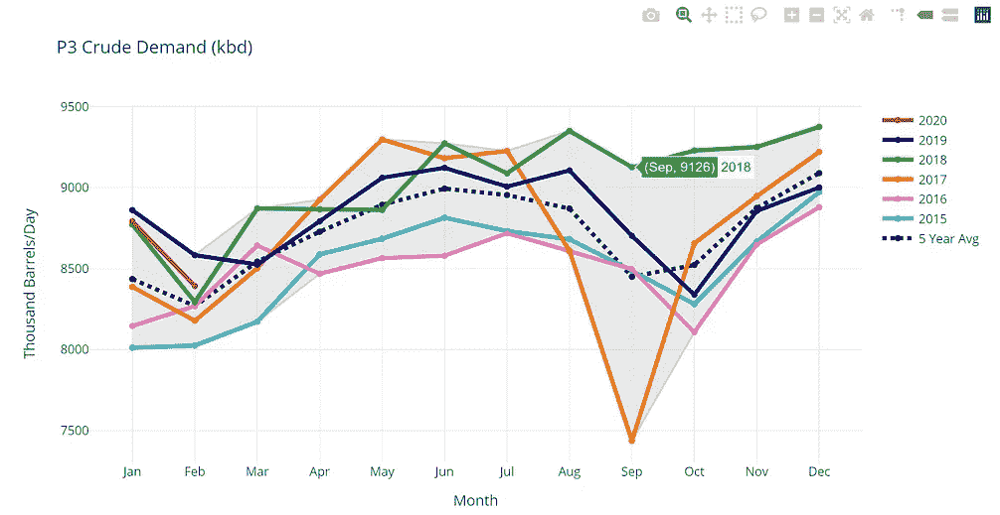
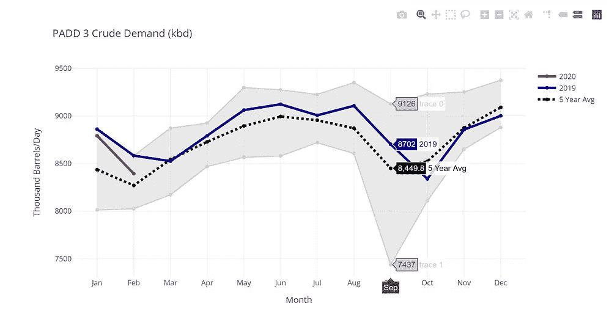
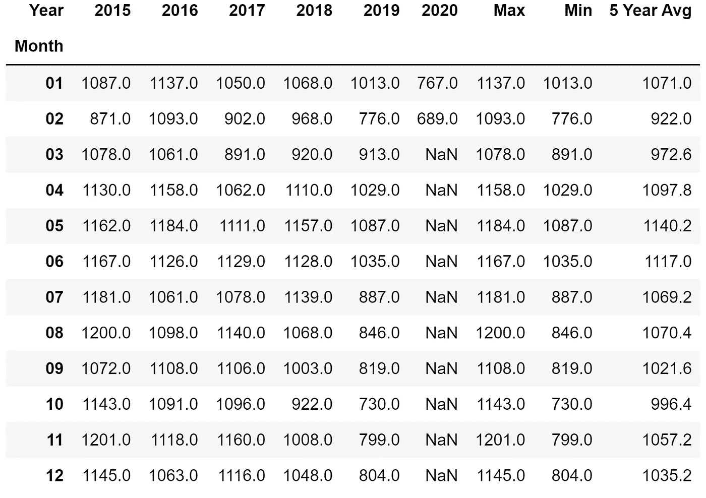
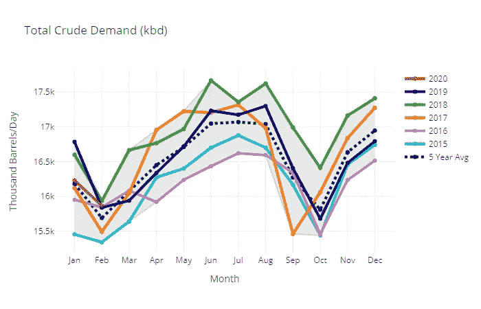
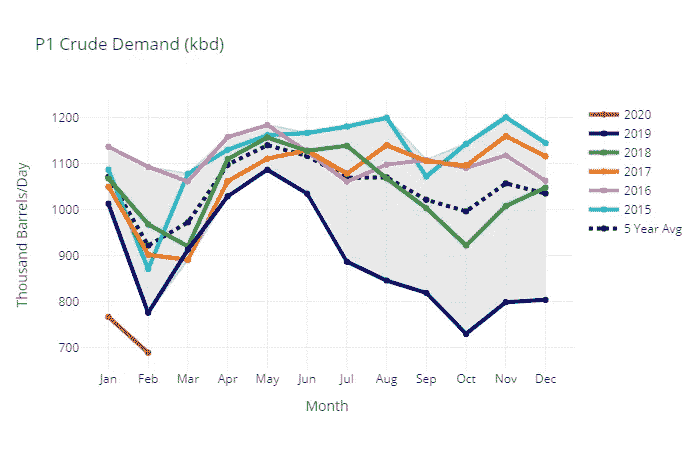
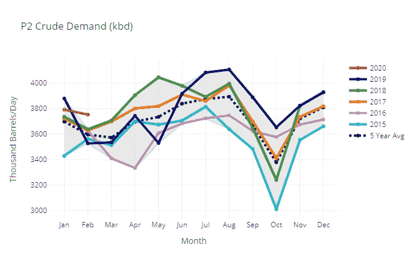
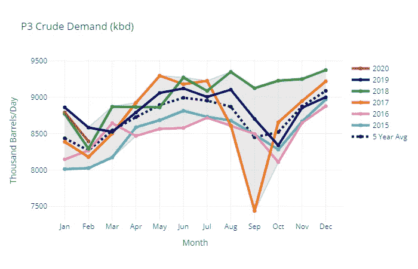
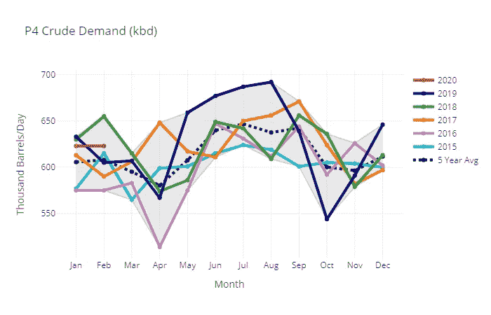
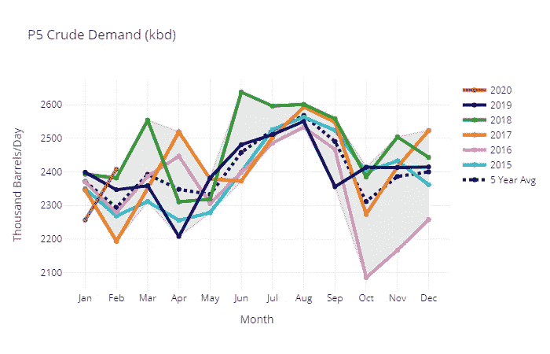

# 使用 Plotly 和 Python 自动绘制季节性图

> 原文：<https://medium.com/analytics-vidhya/automate-seasonality-plots-with-plotly-and-python-23e7fef065a2?source=collection_archive---------6----------------------->


不溅

这是我上一篇文章的延续。在那篇文章中，我将向你展示如何从美国能源信息署(EIA)的 API 中提取能源数据。这篇文章将向你展示如何利用 API 来创建可以快速刷新的季节性图表。

作为一名分析师，我花了太多时间重新制作图表，几乎没有时间做分析。通过用 Python 自动化我的所有图表，我在一天中创造了更多的时间来进行分析和需要更深入思考的项目。我希望这段代码能帮助你实现图表自动化，让你的一天变得自由。

# 什么是季节性？

季节性是时间序列数据中出现的重复模式或变化。这些模式可以在任何时间间隔内出现—每小时、每天、每月、每年等等。例如，美国的汽油需求在夏季会上升，因为人们会在暑假自驾游。因此，能源公司知道，与其他季节相比，他们必须在夏季向美国供应更多的汽油。这些信息对于商业计划是必要的。天气是季节性的另一个典型例子——夏天较热，冬天较冷。飓风季节发生在每年的六月到十一月。

# 什么是季节性图表？

季节性图表有助于阐明时间序列数据中的季节性模式。下图是季节性图表的一个例子。它显示了美国墨西哥湾沿岸的炼油厂原油需求(PADD 3)。横过 x 轴是月份。y 轴显示原油需求，单位为千桶/天(kbd)。每条线代表不同的年份。黑色虚线是 5 年平均值(2015-2019 年的平均数据)。灰色阴影区域是 2015 年至 2019 年的所有数据范围。我从平均值和范围中排除了 2020 年的数据，因为我想将 2020 年的数据与历史进行比较。

*参考消息——PADDs 代表石油管理防御区，是 50 个州的地理集合。它们是在第二次世界大战中为定量供应汽油而创建的。*



炼油商对 PADD 3 号(美国墨西哥湾沿岸)原油的需求

# 分析季节性图表

我们现在可以用这张季节性图表快速分析事物。2020 年红线显示当年需求和 2018 年差不多。绿色和橙色的线看起来像异常值；我们应该多调查那几年。这个范围有助于我们理解墨西哥湾沿岸炼油系统的局限性；在任何一个月里，它的平均消耗量都不会超过 940 万桶。

1.  **5 年平均**——这表明美国原油需求在夏季平均上升，秋季开学时下降，年底时再次上升。2 月和 10 月的两次下跌与炼油厂的常规维修时间相吻合。
2.  **范围** —该范围告诉我们，在峰值时，美国墨西哥湾沿岸消耗约 930 万桶原油。最低时，墨西哥湾沿岸的炼油厂一个月消耗不到 750 万桶石油。
3.  **异常值**——当我们看这个图表时，立刻有两条线突出出来——绿线和橙线。这些线条也恰好分别创造了区间的顶部和底部。是什么导致了 2017 年如此剧烈的下跌(橙线)？为什么 2018 年原油运行没有像往常一样在秋季下降？2017 年，飓风哈维袭击了墨西哥湾沿岸，淹没了主要的炼油区——休斯顿、博蒙特/亚瑟港、科珀斯克里斯蒂，并进入路易斯安那州。随着该地区的恢复，许多炼油厂停止运营数周。2018 年，墨西哥和中南美洲其他地区对清洁产品的需求很高。这有助于维持 2018 年整个冬季的高原油价格。
4.  **将 2020 年与其他年份进行比较—** 到目前为止，2020 年的需求与 2018 年相似。然而，随着当前冠状病毒形势和油价在几周前跌至负值，我预计 3 月和 4 月数据中原油需求将下降。一旦数据公布，我将拭目以待！这个数据在每个月底出来，滞后两个月。5/29/20，将发布 2020 年 3 月的数据。

# 用 Plotly 创建季节性图表

为什么是 Plotly？Plotly 非常适合可视化，因为您可以与图形进行交互。下面的两个图表显示了不同的悬停能力。左图显示了一个简单的悬停功能——悬停在任何一个数据点上，它会立即显示月、年和原油需求。在右侧图表中，如果您将鼠标悬停在某个数据点上，该月的所有其他数据点也会弹出。现在，您可以立即看到 2019 年 9 月与 5 年平均值、最大值和最小值的对比。



用 Plotly 创建的原油需求季节性图表

好了，现在来看实际代码。你也可以[在我的 GitHub](https://github.com/shuzlee/Crude_Seasonality/blob/master/EIA%20API%20Pull%20Plotly%20Seasonality.ipynb) 获取代码。请参考[我以前的文章](/analytics-vidhya/use-python-to-pull-energy-data-from-the-us-department-of-energys-api-11d6f724927e)中从 EIA 的 API 中提取数据的代码。

从 API 中提取数据后，按月份和年份透视数据。然后制作最大值、最小值和 5 年平均值列。这将返回如下表所示的数据框。从这里，你可以创建一个季节性图表。



PADD 1 原油需求数据透视表(kbd)

下面的代码创建了上面的表。在所有其他 PADDs 的代码中重复。每个 PADD 和总计都有不同的数据透视表。

数据透视表代码

下面是在 Plotly 中创建图形的代码。此代码显示了绘制 2015–2020 年所有年份的方法。要查看仅显示 2020 年和 2019 年的代码，请查看我的 GitHub 上的完整代码。

任何时候新的数据出来，重新运行代码，你所有的图表都会更新！每月 EIA 数据在每个月底发布。



# Github 链接和参考

Github 链接:[https://github . com/shuzlee/Crude _ 季节性/blob/master/EIA % 20 API % 20 pull % 20 plot ly % 20 季节性. ipynb](https://github.com/shuzlee/Crude_Seasonality/blob/master/EIA%20API%20Pull%20Plotly%20Seasonality.ipynb)

参考资料:

```
*# COLOR LIST: https://community.plotly.com/t/plotly-colours-list/11730/3*
*# FILL IN AREA: https://plotly.com/python/filled-area-plots/*
*# LINE CHARTS: https://plotly.com/python/line-charts/*
*# PIVOT TABLES: https://pandas.pydata.org/pandas-docs/stable/reference/api/pandas.pivot_table.html*
```