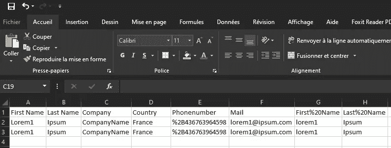
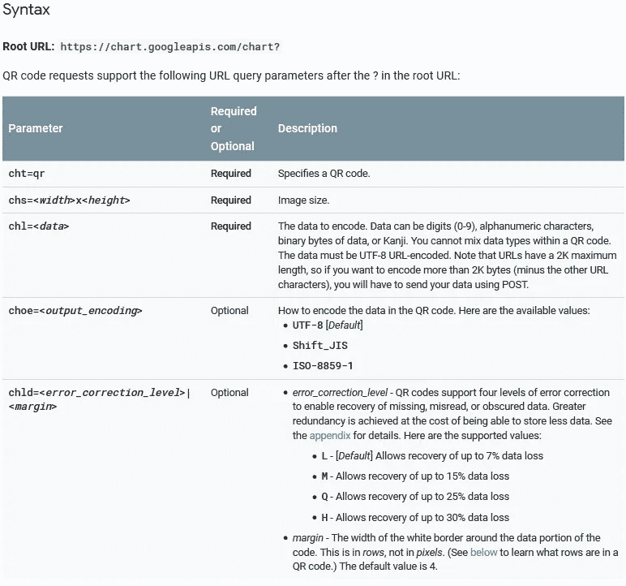
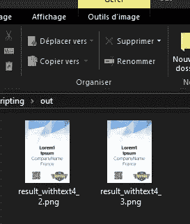
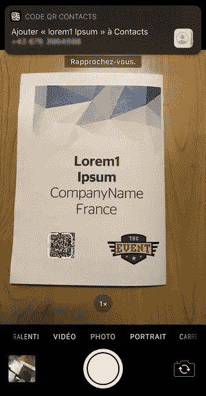

# 为所有与会者自动生成会议徽章

> 原文：<https://medium.com/analytics-vidhya/automate-your-conference-badges-generation-for-all-attendees-c075e83e380?source=collection_archive---------17----------------------->


作为一个**开发者会议团队**的成员，我在网上搜索一个**简单的**和**开源的**解决方案来**生成会议徽章**却没有任何成功。我找到了一些商业解决方案，但就活动的成熟度而言，成本太高了。

所以我决定创建一个简单的方法来从一个模板和一个与会者列表中自动生成所有的会议徽章。我还希望与会者能够在徽章上闪烁二维码，并保留持有者的详细信息作为电话联系。


# 构建解决方案

我选择 **bash 脚本**来编写应用程序。

## 步骤 1 —阅读与会者名单

我选择 **csv** 作为阅读与会者名单的格式。这是一个你可以很容易从事件管理系统得到的输出，比如 [Eventbrite](https://www.eventbrite.com/)



```
while IFS=";" read f1 f2 f3 f4 f5 f6 f7 f8
do

...
done < $CSV_FILENAME
```

## 步骤 2-描述徽章格式

```
CSV_FILENAME="data.csv"
BADGE_TEMPLATE_FILENAME="badge_template.jpg"

QRCODE_OFFSET_X_Y=-300+670 #FORMAT: +XXX-YYY
QRCODE_SIZE="250x250"       #FORMAT: 800x800

TEXT1_OFFSET_X_Y=+00-100
TEXT1_FONT_FILENAME="fonts/StagSans-Medium.otf"

TEXT2_OFFSET_X_Y=+00+50
TEXT2_FONT_FILENAME="fonts/StagSans-Medium.otf"

TEXT3_OFFSET_X_Y=+00+200
TEXT3_FONT_FILENAME="fonts/StagSans-Light.otf"

TEXT4_OFFSET_X_Y=+00+350
TEXT4_FONT_FILENAME="fonts/StagSans-Light.otf"

TEXT_SIZE=130
TEXT_COLOR="black"
```

## 第 3 步—生成二维码

我使用 [Google Chart API](https://chart.googleapis.com/chart) 使用 **VCard 格式**的数据来正确触发 **iOS** 和 **Android** 上的二维码



```
url="https://chart.googleapis.com/chart?chld=L|0&chs=255x255&cht=qr&chl=BEGIN%3AVCARD%0AN%3A${f7}%20${f8}%0ATEL%3A${f5}%0AEMAIL%3A${f6}%0AEND%3AVCARD"
wget -O out/temp_qrcode.png $url
```

## 步骤 4 —在工卡上插入文本数据

首先，我创建我的徽章模板，如下所示:


为了插入**文本**和**图像**如名称、标志……我使用了 [imagemagick](https://imagemagick.org/) ，一个命令行工具来创建、编辑、合成或转换位图图像。

```
convert -resize $QRCODE_SIZE out/temp_qrcode.png out/temp_qrcode.png
composite -gravity center  -quality 100 -geometry $QRCODE_OFFSET_X_Y out/temp_qrcode.png $BADGE_TEMPLATE_FILENAME out/result.png

# insert the firsname of a participant
convert -font $TEXT1_FONT_FILENAME -fill $TEXT_COLOR -pointsize $TEXT_SIZE -gravity center  -quality 100  -draw "text $TEXT1_OFFSET_X_Y '${f1}'" out/result.png out/result_withtext1_${counter}.png
# insert the lastname of a participant
convert -font $TEXT2_FONT_FILENAME -fill $TEXT_COLOR -pointsize $TEXT_SIZE -gravity center  -quality 100  -draw "text $TEXT2_OFFSET_X_Y '${f2}'" out/result_withtext1_${counter}.png out/result_withtext2_${counter}.png
# insert the company of a participant
convert -font $TEXT3_FONT_FILENAME -fill $TEXT_COLOR -pointsize $TEXT_SIZE -gravity center  -quality 100  -draw "text $TEXT3_OFFSET_X_Y '${f3}'" out/result_withtext2_${counter}.png out/result_withtext3_${counter}.png
# insert the country of a participant
convert -font $TEXT4_FONT_FILENAME -fill $TEXT_COLOR -pointsize $TEXT_SIZE -gravity center  -quality 100  -draw "text $TEXT4_OFFSET_X_Y '${f4}'" out/result_withtext3_${counter}.png out/result_withtext4_${counter}.png
```

# 使用

1.  在脚本 sh 文件上定义所有**变量**，为文本字体、徽章图像模板、csv 数据提供路径。
2.  然后，您可以**调用**脚本，如下所示:

```
user:/home/user$./badge_generator.sh
--2019-07-26 17:34:11--  https://chart.googleapis.com/chart?chld=L%7C0&chs=255x255&cht=qr&chl=BEGIN%3AVCARD%0AN%3Alorem1%20Ipsum%0D%0ATEL%3A%2B436763964598%0AEMAIL%3Alorem1@ipsum.com%0AEND%3AVCARD
Length: 1641 (1.6K) [image/png]
Saving to: ‘out/temp_qrcode.png’
out/temp_qrcode.png           100%[=================================================>]   1.60K  --.-KB/s    in 0s
2019-07-26 17:34:11 (6.28 MB/s) - ‘out/temp_qrcode.png’ saved [1641/1641]

--2019-07-26 17:34:20--  https://chart.googleapis.com/chart?chld=L%7C0&chs=255x255&cht=qr&chl=BEGIN%3AVCARD%0AN%3Alorem1%20Ipsum%0D%0ATEL%3A%2B436763964598%0AEMAIL%3Alorem1@ipsum.com%0AEND%3AVCARD
Length: 1641 (1.6K) [image/png]
Saving to: ‘out/temp_qrcode.png’
out/temp_qrcode.png           100%[=================================================>]   1.60K  --.-KB/s    in 0s

2019-07-26 17:34:20 (6.21 MB/s) - ‘out/temp_qrcode.png’ saved [1641/1641]
```



检查`out`文件夹… tadaa！您的所有徽章都已生成！



# 丰富

*   更好的命令行管理:**参数**代替变量
*   脚本表演:30 分钟，700 人参加。或许一个本地二维码生成系统可以做到这一点？
*   特殊字符支持:现在你需要 VCard 直接对 CSV 文件中的特殊字符进行 HTML 编码
*   开发一个 web 应用程序:能够**在云上使用它**有更好的 UX

# 今天就到这里吧！

项目可以**分叉**与最终脚本[在这里](https://gitlab.com/gharbi.tech-articles/2019-04-10-conference-badges-automation)

[***@ _ _ 布拉***](https://twitter.com/__brah)