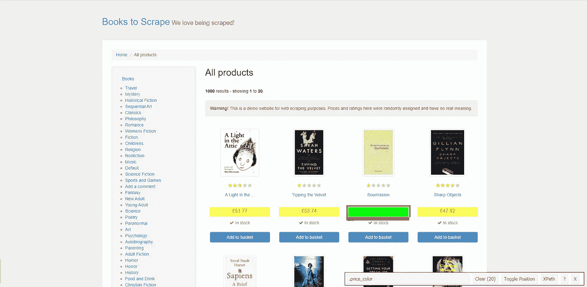
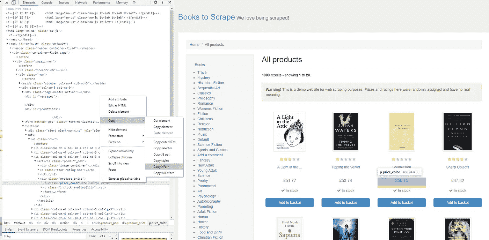

# 自动化浏览器，抓取和爬行—第 2 部分

> 原文：<https://medium.com/analytics-vidhya/automated-browsers-scraping-and-crawling-part-2-cc9e2149a64?source=collection_archive---------22----------------------->

## 一种可重用的、面向对象的浏览器自动化方式


**摄影:萨法尔·萨法罗夫，Unsplash**

如果你是一个完全的初学者，我强烈建议你先看看本教程的 [**第一部分**](/swlh/automated-browsers-scraping-and-crawling-easier-than-it-looks-af37bd765bca) 。本教程的开头是面向初学者的，所以我将讲述 Python 类和方法的基础知识，但它只讲述最基本的知识。你可以找到 TL；博士就在它下面。

为什么不重用第 1 部分的代码？

您可能已经注意到，在前面的过程中有许多手动输入。我们需要将大量代码复制粘贴到一个新的 Python 文件中，或者全部重新输入。我使用的一个经验法则是:如果你发现自己需要复制代码，尽可能地尝试自动化这个过程。

# **类和方法**

为了自动化，理解什么是类和方法是至关重要的。让我给你举个例子:假设我们希望能够在你的代码中轻松高效地创建‘狗’。我们需要一个狗类——一个包含狗通常具有的基本特征的蓝图。在 dog 类中，我们首先定义了我们的**构造函数**，在这里我们定义了属于我们创建的所有 dog 的所有属性和对象(这并不完全是一个构造函数方法所做的事情，但是为了有一个初步的概念理解，我们将会处理它)。构造函数(在 Python 中显示为 __init__)是一个**方法，**是在类内执行的东西。方法不限于构造函数；方法只是我们的类可以执行的特定功能的总称。

我们的 __init__ 方法接受我们认为所有狗都必须给出的所有默认参数，在本例中是品种和名字。我们的 bark 方法接受我们传递的名称和物种，并根据这些属性打印出一个句子。下面是一个被大量评论的例子:

# 只是简单回顾一下…

*   **类**是一只狗的蓝图
*   类中的 **__init__** **构造函数**定义了属于该类所有方法的所有属性。
*   bark 方法只接受 __init__ 方法的属性(即品种和名称)，在调用时打印出狗的类别名称和狗的类别。

同样，这非常简单，但这是理解我们为无头浏览编写的代码所需要的视图。

# **TL；博士——给我代码**

# 定位器类别

# 导航器类

# **利用率**

# 让我们来分解一下:定位器类

__init__ 构造函数接受一个参数；我们创建的驱动程序对象。我们看到 web 元素也包含在构造函数中，但是它已经被赋值为“None”当我们实例化这个类的对象时，我们不需要提供它。它在构造函数中的原因是因为我们以后会覆盖它，我们希望能够在类中的任何地方使用这个元素。一旦我们覆盖了它，它将属于整个类，类中的所有方法都可以使用它。

```
def __init__(self, driver):
    self.driver = driver
    # We will overwrite the element later
    self.element = None
```

接下来的两个方法为我们找到了 web 元素。第一个使用 XPath，第二个使用 CSS。我们使用一个**预期条件，selenium.webdriver.support 的**部分。

注意，一旦我们定位了元素，我们就把它分配给类的 element 对象。这样我们知道它现在可以被类中的任何方法访问。

```
# Finding an element via XPATHdef locate_xpath(self, seconds, val):

      locator = (By.XPATH, val)

      ele = WebDriverWait(self.driver,    seconds).until(EC.visibility_of_all_elements_located(locator = locator))

     self.element = ele # Doing it with CSS instead def locate_css(self, seconds, val):

      locator = (By.CSS_SELECTOR, val)

      ele = WebDriverWait(self.driver,  seconds).until(EC.visibility_of_all_elements_located(locator = locator))

      self.element = ele
```

前两种方法找到了多个元素，而这种方法只找到了一个元素。这对于在输入框中点击和输入非常有用。

```
def find_single_xpath(self, seconds, val):
      locator = (By.XPATH, val)
      ele = WebDriverWait(self.driver,  seconds).until(EC.visibility_of_element_located(locator = locator))
      self.element = ele
```

这些方法相对来说是不言自明的。一个点击，一个输入，一个拉出网页上的元素。我们看到在 scrape()方法中 append_list 默认为 none。如果我们传递一个列表，它会为我们追加。否则它只会返回列表。

```
def scrape(self, append_list = None):
     scraped_list = [x.text for x in self.element]
     if append_list is not None:
     scraped_list = append_list + scraped_list
     return(scraped_list)

 def click(self):
     self.element.click()

 def typein(self, text):
     self.element.sendKeys(text)
```

# 导航器类

这个比我们的定位器类简单多了。我们的 __init__ 只包含驱动程序，所以只有我们传递的驱动程序对所有方法都可用。back()和 fwd()方法允许我们传递想要移动的页数。

```
 def __init__ (self, driver):
     self.driver = driver

 def get_pg(self, url):
     self.driver.get(url) def back(self, num_pg):
        for i in range(1,num_pg+1):
            self.driver.back() def fwd(self, num_pg):
        for i in range(1,num_pg+1):
            self.driver.forward()
```

这种方法允许我们最小化、最大化或全屏显示浏览器窗口。如果需要，可以跟踪更改，如果没有必要，可以将浏览器从屏幕上移除。

```
 def change_window(self, how):
     if how == “min”:
          self.driver.minimize_window()
     elif how == “max”:
          self.driver.maximize_window()
     elif how == “full”:
          self.driver.fullscreen_window()
```

# 使用类

一旦创建了类，使用它们就相对简单了。我们确保每个类中的所有方法都易于理解，这样任何人看了你的代码都能立即知道每个方法的作用。

我们在这里做的是创建一个 navigator 和 locator 类的对象。一旦我们这样做了，我们就可以利用我们写在类中的所有可重用的功能

```
# Creating our navigator object
nav = navigator.navigator(driver)# Creating our locator object
loc = locator.locator(driver)# Now we can easily move to our website
nav.get_pg("https://www.google.com")# And then locate whichever xpath we want
loc.locate_xpath(10, "your/xpath/here")
```

# 预期条件

使用 time.sleep()，我们在算法的每次迭代之间有一个静态的、不变的等待期。如果我们节流，比方说每次 10 秒，并且需要运行算法数百次，这可能导致巨大的等待时间。Selenium 提供了一个很好的方法来降低 web 浏览器的速度，或者在不使其静态化的情况下优化其效率。

有了预期的条件，我们可以让驱动程序等待它需要等待的时间，而不再…例如，一旦元素被加载，驱动程序就继续执行它的任务。你可以在这里[得到所有的文档](https://www.selenium.dev/selenium/docs/api/py/webdriver_support/selenium.webdriver.support.expected_conditions.html)，但是这里有一些有用的预期条件:

```
# Executes the script once the exact element is found. NOTE: this does mean that it is loaded; only found!
**visibility_of_element_located**# Executes the script once the exact element is clickable
**element_to_be_clickable**# Executes the script when at least one element is present. Once all are loaded, it can return all of the elements at once
**presence_of_all_elements_located**
```

# 更简单的定位方法

有很多方法可以找到你想要的元素。最耗时的方法是像我在第 1 部分中描述的那样手工编写 XPath 或 CSS。当您在 contains()、starts-with()等上分层时，这对于一些高级情况很有用。，但在大多数初学者的情况下，你可以做得更快。如果你想深入研究更复杂的方法，可以看看这篇关于[](https://www.swtestacademy.com/xpath-selenium/)****的文章。****

1.  ****使用**[**SelectorGadget**](https://selectorgadget.com/)**:**这个插件对于快速 CSS 选择和 XPath 生成非常棒。只需启动插件并点击所需的元素。它会突出显示所有类似的元素，并让您选择获取 XPath。**

****

**这个插件向我们展示了。价格 _ 颜色 web 元素**

**2.在检查特定元素时，只需转到**复制→复制 XPath** 。只需记住在导出到 Python 之前在您的控制台中测试这一点！你不一定总能得到你想要的。**

****

# **在你走之前…**

**就像我在第 1 部分提到的，在做这些之前，请阅读 ToS 和 Robots.txt。自动化浏览器的好处是巨大的，但是请负责任地自动化。**

**感谢您对第 1 部分的所有积极反馈，祝您浏览愉快！**