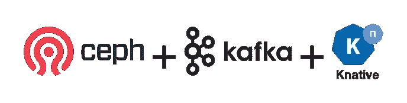
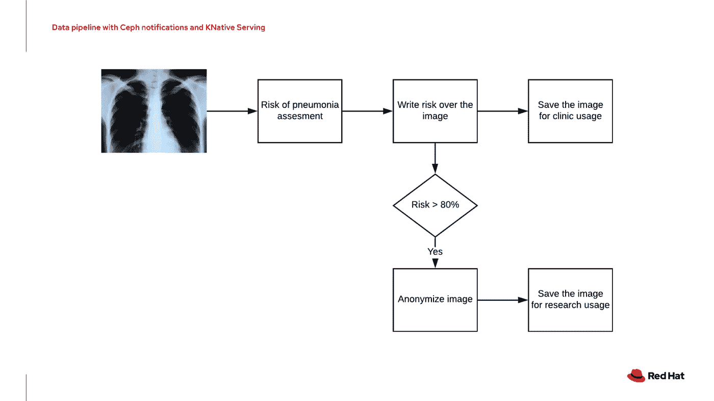
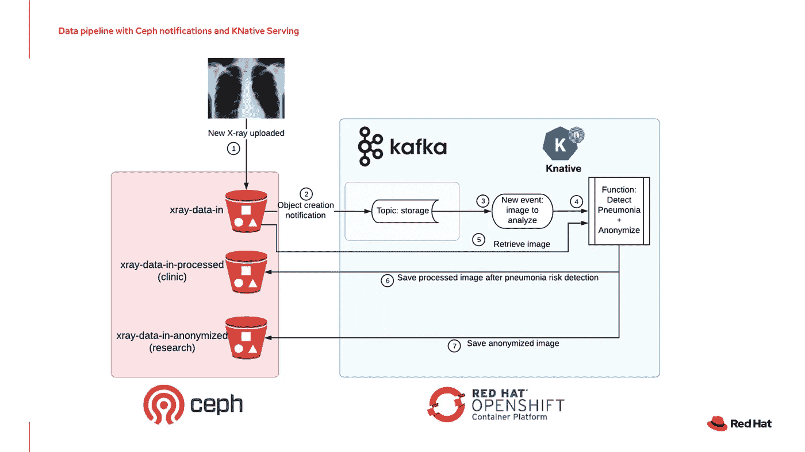
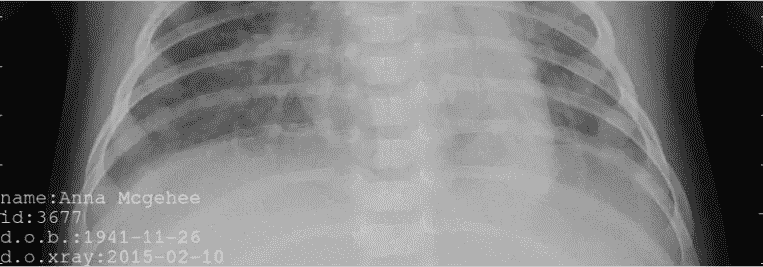
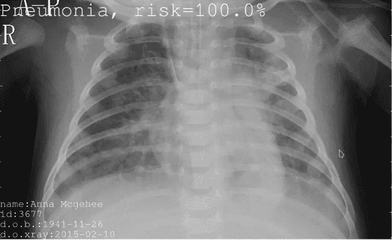
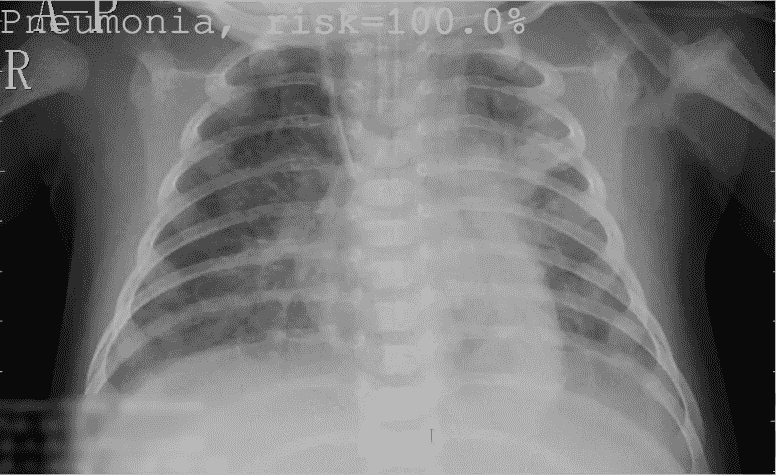

# 使用 Ceph 通知和被动服务的自动化数据管道

> 原文：<https://medium.com/analytics-vidhya/automated-data-pipeline-using-ceph-notifications-and-kserving-5e1e9b996661?source=collection_archive---------6----------------------->

## 实施解决方案和创建演示的完整指南！



我最近分享了一个视频，演示了如何利用 Ceph 的新通知功能以及 Kafka 和 KNative 事件和服务来创建全自动的数据管道。如果你还没有做的话，最好快点检查一下，因为这会帮助你理解这篇文章的其余部分！

如果您没有时间，下面是我们将实施的场景的摘要:



既然我们都在同一页面上，让我们看看如何在您舒适的(家|隔间|机场休息室|蝙蝠洞)中重现此演示…

**注**:这里使用的所有代码都可以在 https://github.com/guimou/dataprep-code[获得](https://github.com/guimou/dataprep-code/tree/master/examples/xray)

# 准备数据

这些步骤并不完全必要，因为我所分享的代码已经包含了一个经过训练的模型和一些演示图片，您可以使用。但如果你想知道整个事情是如何运作的，或者你想从头开始重现一切，那就试一试吧！

## 数据集

该演示基于以下数据集，可从 Kaggle 获得:[https://www . ka ggle . com/paultimothymooney/chest-x ray-pneumonia](https://www.kaggle.com/paultimothymooney/chest-xray-pneumonia)。这是一组胸部 x 光图像，分别来自有肺炎症状的患者(约 1300 张图像)和健康人(约 3900 张图像)。当然，它们已经被分类，并分成不同的批次进行训练、验证和测试。所以第一步当然是下载并解压到某个地方(~1.2GB)。这就给出了下面的结构(demo_base 来自后面的操作):

```
.
└── data
    └── chest_xray
        ├── demo_base
        │   ├── NORMAL
        │   └── PNEUMONIA
        ├── test
        │   ├── NORMAL
        │   └── PNEUMONIA
        ├── train
        │   ├── NORMAL
        │   └── PNEUMONIA
        └── val
            ├── NORMAL
            └── PNEUMONIA
```

## 训练模型

我用来训练模型的笔记本“x-ray-predict-pneumonia-keras-training . ipynb”可以在 repo 中的 examples/xray/utils 下获得。如果您有上面的目录结构，您可以从项目的根目录使用它。

这只是一个运行笔记本电脑的问题，耐心点，在 GTX1070Ti 的帮助下，对我来说大约 2000 万(是的，我不仅做演示和发布，虽然我肯定会得到一个 RTX…😁).如果一切顺利，您应该获得用于预测的“pneumonia_model.h5”文件。

## 创建演示图像

当然，我们从原始数据集中获得的图像是完全匿名的。但是对于匿名化演示，我们想上传包含个人信息的图像…好吧，让我们创建它们吧！这是在“make_demo_images.ipynb”笔记本的帮助下完成的，位置与上一个笔记本相同。这里没有火箭科学:我们只是从原始数据集(在 val/PNEUMONIA 文件夹中)获取图像，并生成一些随机的个人信息，然后粘贴到图像上。

这就是数据部分，我们现在有一个模型，和一些我们可以在演示中使用的图像！

# 主菜前的一些开胃菜(听起来比先决条件要好)

## Ceph

对于这个演示，您当然需要一个 Ceph 集群，但是对于完整的安装过程，那是另外一个故事了……不过，快速提示:为了执行演示的其余部分，您还需要 OpenShift 或另一种类型的 Kubernetes 集群(虽然没有经过测试！)，您可以使用 [Rook-Ceph](https://rook.io/docs/rook/v1.2/ceph-quickstart.html) 来部署您的 Ceph 实例(这就是我在这里使用的)。到目前为止，我正在使用的 Kafka 通知只在 Ceph 的 master 分支上可用(但是 HTTP 和 AMQ 通知已经在最新版本中了)。因此，如果您使用 rook-ceph，请确保您的集群 yaml 文件在某个时间点读取:

```
cephVersion:
 image: ceph/daemon-base:latest-master-devel
 allowUnsupported: true
```

*(当该功能在标准版本中可用时，我会更新帖子)。*

## 卡夫卡

这里就不多说了，因为部署卡夫卡和创造话题本身也是另一回事。因此，我假设您已经准备好 Kafka 集群，所有必要的端点信息，并且您已经创建了一个主题，在我们的示例中称为“存储”。不过还有一个小提示:您可以使用 [Strimzi](https://strimzi.io/) 操作符在 OpenShift 上快速轻松地部署 Kafka。

## KNative / OpenShift 无服务器

最后，KNative 必须安装在集群上。同样，本文的目的不是详述这种操作，已经有很多关于这方面的文档了。

但是要小心！为了让这个演示运行，您必须安装 KafkaSource 资源。这是 KNative eventing 的一个“附加组件”，你可以按照这里的说明安装:[https://github . com/KNative/eventing-contrib/tree/v 0 . 12 . 4/Kafka/source](https://github.com/knative/eventing-contrib/tree/v0.12.4/kafka/source)

# 创建管道

如果您还记得视频中的内容(或者如果您没有看过，就不记得了)，这是我们将要建立的管道:



您可以从创建我们将在本演示中使用的 3 个存储桶开始:x 射线数据输入、x 射线数据处理和 x 射线数据匿名。

## 设置 Kafka 的存储桶通知

现在到桶通知！为了帮助您完成这些步骤，您将在 utils 文件夹中找到所有请求的 Postman 集合“Ceph notifications pipeline . Postman _ collection . JSON”。无论您是否使用它，**不要忘记设置您的凭证**(用户访问密钥和秘密密钥)以便能够与网关交互。在 Postman 中，您必须编辑集合参数(授权选项卡)，或者您可以逐个请求地设置它们。

涉及两个不同的步骤:

*   创建一个 Kafka 主题:这是一个简单的对网关的 POST 请求，传递所需的参数:

```
POST [http://your.ceph.rgw.url/?Action=CreateTopic&Name=storage&push-endpoint=kafka://my-cluster-kafka-bootstrap.kafka:9092&kafka-ack-level=broker](http://your.ceph.rgw.url/?Action=CreateTopic&Name=storage&push-endpoint=kafka://my-cluster-kafka-bootstrap.kafka:9092&kafka-ack-level=broker)
```

它会以**arn:AWS:SNS:my-store::storage**的形式返回主题信息

*   创建通知:这是对您希望启用通知的 bucket 上的网关的 PUT 请求。在我们的示例中，它是 x 射线数据输入:

```
PUT [http://your.ceph.rgw.url/](http://your.ceph.rgw.url/data-bckt?notification)xray-data-in[?notification](http://your.ceph.rgw.url/data-bckt?notification)
```

在请求体中以 XML 形式传递参数(包括您刚刚创建的主题):

```
<NotificationConfiguration xmlns=”[http://s3.amazonaws.com/doc/2006-03-01/](http://s3.amazonaws.com/doc/2006-03-01/)">
 <TopicConfiguration>
 <Id>storage</Id>
 <Topic>arn:aws:sns:my-store::storage</Topic>
 </TopicConfiguration>
</NotificationConfiguration>
```

就这么简单！

## 部署 KNative 服务容器

容器将进行图像分析，并最终实现匿名化。源代码位于 repo 的 examples/Xray/Xray-event-container 文件夹中。以下是 Python 代码本身:

这几乎是不言自明的和评论，但如果你有任何问题，请留下评论。你可以自己建造它，或者使用 quay.io/guimou/xray:master 的图像

在创建了项目/名称空间“xray”之后，我们将创建一个秘密，其中包含访问容器将与之交互的不同存储桶所需的凭证(不要忘记创建它们！对于本演示，您应该有 x 射线数据输入、x 射线数据处理和 x 射线数据匿名。下面是“secret.yaml”文件(您必须输入实际的密钥/秘密值):

```
apiVersion: v1
kind: Secret
metadata:
 name: s3-secret
 namespace: xray
stringData:
 AWS_ACCESS_KEY_ID: replace_me 
 AWS_SECRET_ACCESS_KEY: replace_me
```

我们部署的:

```
oc create -f secret.yaml
```

然后我们用“service-xray.yaml”定义我们的服务(您必须输入正确的 service_point URL):

```
apiVersion: serving.knative.dev/v1alpha1 
kind: Service
metadata:
 name: xray
 namespace: xray
spec:
 template:
   spec:
     containers:
     — image: quay.io/guimou/xray:master
       env:
       — name: AWS_ACCESS_KEY_ID
         valueFrom:
           secretKeyRef:
             name: s3-secret
             key: AWS_ACCESS_KEY_ID 
       — name: AWS_SECRET_ACCESS_KEY
         valueFrom:
           secretKeyRef:
             name: s3-secret
             key: AWS_SECRET_ACCESS_KEY 
       — name: service_point
         value: http://your.gateway.url
```

我们部署的:

```
oc create -f service-xray.yaml
```

## 部署已知事件源

该组件将使用我们的 Kafka 主题，并将消息传递给我们刚刚创建的服务。

它由“kafkasource.yaml”定义:

```
apiVersion: sources.eventing.knative.dev/v1alpha1
kind: KafkaSource
metadata:
 name: kafka-source
 namespace: xray
spec:
 consumerGroup: xray
 bootstrapServers: my-cluster-kafka-bootstrap.kafka:9092
 topics: storage
 sink:
   apiVersion: serving.knative.dev/v1alpha1
   kind: Service
   name: xray
```

并且再次部署有:

```
oc create -f kafkasource.yaml
```

一切都准备好了，应该可以工作了！

# 审查整个管道

为了更好地理解正在发生的事情，或者如果您需要做一些调试，这里是这个管道中正在发生的事情的一步一步。

*   当图像被推送到 x 射线数据输入桶时，Ceph 将向 Kafka 发送通知。



原象

*   该通知将是这样一条消息:

```
{“Records”: [{“eventVersion”: “2.2”, “eventSource”: “ceph:s3”, “awsRegion”: “”, “eventTime”: “2019–12–12T02:42:43.692977Z”, “eventName”: “s3:ObjectCreated:Put”, “userIdentity”: {“principalId”: “ceph-user-bp3UfKOG”}, “requestParameters”: {“sourceIPAddress”: “”}, “responseElements”: {“x-amz-request-id”: “645c86a7–8062–43b1–972b-f6c6ccd4bc6f.134312.15301”, “x-amz-id-2”: “20ca8-my-store-my-store”}, “s3”: {“s3SchemaVersion”: “1.0”, “configurationId”: “storage”, “bucket”: {“name”: “xray-data-in”, “ownerIdentity”: {“principalId”: “ceph-user-bp3UfKOG”}, “arn”: “arn:aws:s3:::xray-data-in”, “id”: “645c86a7–8062–43b1–972b-f6c6ccd4bc6f.29026.2”}, “object”: {“key”: “data/chest_xray/demo/PNEUMONIA/demo_Anna Mcgehee_3677_1941–11–26_2015–02–10.jpeg”, “size”: 253130, “etag”: “a7d65d30ba7a639a017aa7d2c6fdc28a”, “versionId”: “”, “sequencer”: “23A9F15D4FBC632A”, “metadata”: [{“key”: “x-amz-content-sha256”, “val”: “95fe6dd24fc010ee526e40457ff34ef057d257c71b22ac9fd312094d4d7b2a37”}, {“key”: “x-amz-date”, “val”: “20191212T024243Z”}]}}, “eventId”: “1576118563.711179.a7d65d30ba7a639a017aa7d2c6fdc28a”}]}
```

*   Kafka 将通过“存储”主题处理此消息，因为我们在那里发布了它。
*   我们定义的 KNative 事件组件是“存储”主题的消费者。它将获取消息，并传递给它的“接收器”，即我们的服务服务。
*   该服务将启动一个图像处理容器(如果尚未运行的话)，或者最终根据工作负载对其进行缩放，并向其传递消息内容。
*   图像处理容器将解析消息，检索图像，施展魔法(评估肺炎风险并将其打印在图像上)，然后保存它。



风险评估图像，PII 还在

*   最终(取决于风险)，我们的 KNative 服务将对图像进行匿名化，并按照我们的场景将其保存到另一个桶中。



匿名图像

*   当该过程完成时，图像处理容器简单地终止。

# 最终注释

## 值得一提的问题

在创建这个演示的过程中，棘手的部分是弄清楚如何监听 KNative 事件消息。从理论上讲，这是有据可查的，但是我真的没有找到任何简单的 Python 实现(至少简单到我能理解，因为我不是真正的开发人员😁).直到我找到了[这个帖子](https://blog.elegantmonkeys.com/python-serverless-event-driven-with-knative-728e96e9b35)和这个[项目](https://github.com/elegantmonkeys/python-kncloudevents)。这是一个非常好的简单的包，如果你想玩 KNative 和 Python，它会让你很快上手。

但是如果你读完了所有的代码，你会问“那你为什么不使用它呢？”。这就是为什么我想在这里提到它，这个包使用 ThreadedHTTPServer 来监听事件。但是当从线程内部启动预测时，Keras 似乎有一些问题(我必须再次承认，我并不完全理解这个问题)，预测功能将会失败。这就是为什么我用 ForkedHTTPServer 从包中重新实现了整个 CloudeventsServer 类，而不只是调用它。

## 观点

这个简单的演示表明，现在比以往任何时候都更容易构建自动化数据管道，而不需要一些 orchestrator 或其他工具。我们可以只使用存储层和容器/应用层的本地函数，并以我们能想到的任何方式将它们绑定在一起。请继续关注其他实现！如果您有您认为可以利用这种交互的用例，请随时联系我们。