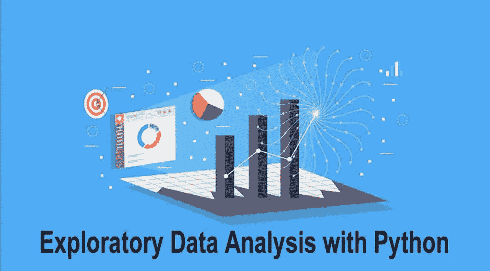

# 用于分类的自动化 EDA

> 原文：<https://medium.com/analytics-vidhya/automated-eda-for-classification-77c25b847e43?source=collection_archive---------3----------------------->

探索性数据分析通过几行代码变得简单！

探索性数据分析是指对数据进行初步调查的关键过程，以便在汇总统计和图形表示的帮助下发现模式、发现异常、检验假设和检查假设。

> 然而，EDA 通常需要花费大量的时间和精力