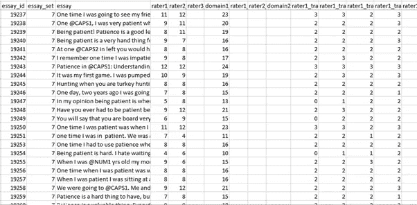
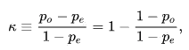

# 自动化论文评分:Kaggle 竞赛——端到端项目实施

> 原文：<https://medium.com/analytics-vidhya/automated-essay-scoring-kaggle-competition-end-to-end-project-implementation-part-1-b75a043903c4?source=collection_archive---------4----------------------->

## 第 1 部分:问题定义、构建架构和先决条件

请通过[第一部分](/@mayurmorin/automated-essay-scoring-kaggle-competition-end-to-end-project-implementation-part-1-b75a043903c4)、[第二部分](/@mayurmorin/automated-essay-scoring-kaggle-competition-end-to-end-project-implementation-part-2-a9fb4c31aed8)和[第三部分](/@mayurmorin/automated-essay-scoring-kaggle-competition-end-to-end-project-implementation-part-3-ccd8ae110fd4)完整理解和项目执行给定的 [Github](https://github.com/mayurmorin/Automated-Essay--Scoring) 。

我们先来了解一下自动化作文评分的意义。在我们的教育系统中，不同的学生写文章作为他们考试的一部分，老师根据他们的文章写作技巧给他们评分。这里的问题是这能自动化吗？自动化到什么程度？

**定义**:根据维基百科，它已经被很好地解释如下:

> **自动论文评分** ( **AES** )是使用专门的计算机程序给在教育环境中撰写的论文打分。它是[教育评估](https://en.wikipedia.org/wiki/Educational_assessment)的一种，也是[自然语言处理](https://en.wikipedia.org/wiki/Natural_language_processing)的一种应用。它的目标是将大量的文本实体分类到少量的离散类别中，对应于可能的等级—例如，数字 1 到 6。所以可以认为是一个[统计分类](https://en.wikipedia.org/wiki/Statistical_classification)的问题。

**竞赛**:2012 年，休利特基金会在 Kaggle 上发起了一项名为“自动学生评估奖”的竞赛。你可以通过这个链接[尽快](https://www.kaggle.com/c/asap-aes/overview)了解更多详情。

**数据集**:本次比赛，共有八个作文集。每组论文都是由一个提示产生的。所选文章的平均长度从 150 到 550 字不等。有些文章依赖于原始资料，有些则不依赖。所有的回答都是由 7 年级到 10 年级的学生写的。所有的论文都是手工评分，并且是双重评分。八个数据集中的每一个都有其独特的特征。可变性旨在测试评分引擎的能力极限。

训练数据以三种格式提供:制表符分隔值(TSV)文件、Microsoft Excel 2010 电子表格和 Microsoft Excel 2003 电子表格。当前发布的训练数据包含论文集 1-6。第 7-8 集将于 2012 年 2 月 10 日发布。每个文件包含 28 列:

*   essay_id:每个学生论文的唯一标识符
*   essay _ set:1–8，每组文章的 id
*   论文:学生回答的 ascii 文本
*   评价人 1 _ 域 1:评价人 1 的域 1 分数；所有的文章都有这个
*   评价人 2 _ 域 1:评价人 2 的域 1 分数；所有的文章都有这个
*   评价人 3 _ 域 1:评价人 3 的域 1 分数；只有第八套的一些作文有这个。
*   domain1_score:评分人之间的解析得分；所有的文章都有这个
*   评价人 1 _ 域 2:评价人 1 的域 2 分数；只有第二套的文章有这个
*   评价人 2 _ 域 2:评价人 2 的域 2 分数；只有第二套的文章有这个
*   domain2_score:评分人之间的解析得分；只有集合 2 中的文章具有此评分者 1_trait1 分数-评分者 3_trait6 分数:集合 7–8 的特质分数

正如 Kaggle 竞赛中提到的，我们在编码中使用了 training_set_rel3.tsv 文件。

**图 1 training_set_rel3.tsv**

在征文专栏里可以看到，@CAPS1，@CAPS2，@NUM1 都有提到。因此，比赛赞助商已经努力使用斯坦福自然语言处理小组的[命名实体识别器(NER)](http://nlp.stanford.edu/software/CRF-NER.shtml) 和各种其他方法来删除论文中的个人身份信息。相关的实体在文本中被标识，然后被替换为一个字符串，比如“@PERSON1”。

NER 确定的实体是:“人”、“组织”、“地点”、“日期”、“时间”、“金钱”和“百分比”。

我在这里给出了对 Kaggle 竞赛实际要求的基本了解，但对于要求和数据集的详细研究，请尽快通过链接。

**极其重要**:注意这次比赛发生在 **8 年前**，在排行榜中获得第一名的**得分为 0.81407** 。我们要打破这个记录，达到 0.96 的**分。当然，我们可以说，当时深度学习有一些我们现在没有的局限性。**

请浏览所有代码的 [Github](https://github.com/mayurmorin/Automated-Essay--Scoring) 链接，你可以像一个网络应用程序一样运行，用户可以从 1 到 8 中选择文章，然后学生可以写关于这篇文章的上下文。通过点击按钮**给我打分**，学生们将会当场得到他们所写文章的分数。

以下几点给出了对项目的基本理解:

*   这个项目是在 Django 框架上开发的。我在 ASP.NET、MVC Web API、Angular JS 和 latest on the Flask 上工作并交付了许多 Web 应用程序项目。为了在服务器上执行这个 web 应用程序，您可能不需要完全理解 Django 框架。按照 Github 的指导方针，你将能够很容易地在服务器上托管。
*   作为数据科学生命周期的一部分，我们已经清除了数据接收步骤和少量数据预处理步骤，因为训练数据已经作为匿名化的一部分与少量预处理一起提供。
*   我们还使用深度学习 LSTM 算法，它具有学习信息序列的能力。我们在这里寻找分数，所以我们可以说，多对一 LSTM 算法需要应用。
*   在这里，我们用统计方法计算出的分数称为科恩卡帕分数。还有其他可用的统计方法，可用于进一步探索，并从下面提到的[维基百科](https://en.wikipedia.org/wiki/Cohen's_kappa)中了解 Cohen Kappa 的一些细节(示例)。

> 1.Cohen 的 kappa 测量两个评分者之间的一致程度，他们各自将 N 个项目分为 C 个互斥的类别。的定义是:

> 其中 po 是评价人之间的相对观察一致(等同于准确性)，pe 是偶然一致的假设概率，使用观察数据计算每个观察者随机看到每个类别的概率。
> 
> 2.如果评定者完全同意，那么 k=1。如果评定者之间没有达成一致意见，除了偶然预期的以外(如 pe 给出的)，k=0。统计值可能是负的，这意味着两个评价人之间没有有效的一致，或者一致程度比随机差。

*   根据 NLP 的一部分，文章将在句子下进一步处理，然后使用 NLTK 库和正则表达式转换成标记。我们将使用 Word2Vec 算法，并使用手套的预训练模型，转换成矢量来馈送 LSTM。
*   我们将使用 LSTM 创建神经网络架构，并将我们的特征向量提供给这个神经网络。我们可以准备 n 种不同的神经网络结构，并检查哪种神经网络给出最佳输出。
*   我们还将浏览两篇与自动论文评分相关的研究论文，并对其有所了解。最后在 Github link 中已经提到了研究论文的链接。
*   在这里，我们将训练模型并将这个模型保存为 **h5 格式**，这是 **Keras** 的格式。请注意 **Scikit 学习模型**你将被保存为 **pickle 文件格式 pkl** 。 **Tensorflow 模型**可以保存为 **protobuf 文件格式(。pb)** 。
*   我也将解释文章加载网页的一些代码片段，当我们点击给我评分按钮时，我们将加载这些保存的模型，以及我们如何计算分数。
*   我将主要浏览两个文件:

1.  **训练 LSTM 模型，ipynb** 用于训练和保存模型。([第二部分](/@mayurmorin/automated-essay-scoring-kaggle-competition-end-to-end-project-implementation-part-2-a9fb4c31aed8))
2.  **/my site/gradier/views . py**用于从网页获取上下文和从保存的模型中为文章打分。([第三部分](/@mayurmorin/automated-essay-scoring-kaggle-competition-end-to-end-project-implementation-part-3-ccd8ae110fd4))

请通过[第二部分](/@mayurmorin/automated-essay-scoring-kaggle-competition-end-to-end-project-implementation-part-2-a9fb4c31aed8)和[第三部分](/@mayurmorin/automated-essay-scoring-kaggle-competition-end-to-end-project-implementation-part-3-ccd8ae110fd4)来全面了解和执行项目。

# 参考资料:

1.  特别感谢 Ronit Mankad 的 Github 回购，我已经分叉，并得到了对这个项目的理解。
2.  引用自维基百科和其他网站。
3.  [自动论文评分的神经方法](http://aclweb.org/anthology/D/D16/D16-1193.pdf)
4.  [使用神经网络的自动文本评分](https://arxiv.org/pdf/1606.04289.pdf)

**如果你真的喜欢这个文章系列，就善意的鼓掌，跟我来，跟下面的小黄人一样享受人工智能的极致力量。**

