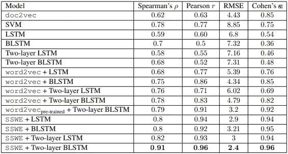

# 自动化论文评分— Kaggle 竞赛端到端项目实施

> 原文：<https://medium.com/analytics-vidhya/automated-essay-scoring-kaggle-competition-end-to-end-project-implementation-part-2-a9fb4c31aed8?source=collection_archive---------7----------------------->

## 第二部分:数据预处理和 LSTM 训练

请通过[第一部分](/@mayurmorin/automated-essay-scoring-kaggle-competition-end-to-end-project-implementation-part-1-b75a043903c4)、[第二部分](/@mayurmorin/automated-essay-scoring-kaggle-competition-end-to-end-project-implementation-part-2-a9fb4c31aed8)和[第三部分](/@mayurmorin/automated-essay-scoring-kaggle-competition-end-to-end-project-implementation-part-3-ccd8ae110fd4)完整理解和项目执行，并给出 [Github](https://github.com/mayurmorin/Automated-Essay--Scoring) 。

1.  **训练 LSTM 模型，ipynb** 用于训练和保存模型。

# **导入数据**

*   增加了 Gensim、NLTK、Django 库。
*   在 DATASET_DIR、GLOVE_DIR 和 SAVE_DIR 路径中添加了常量。
*   使用 pandas 库从 training_set_rel3.tsv 加载数据。
*   删除不必要的列，如 domain_score 和 raters_domain。
*   定义我们将在预测实际分数时使用的最低和最高分数。

# 预处理数据

我们将对所有文章进行预处理，并将其转换为特征向量，以便输入 RNN。

这些都是用来清理论文的辅助函数。

*   定义了 4 个函数:

1.  **getAvgFeatureVecs** :该函数接受 3 个参数:文章、模型、数量 _ 特征。它内部调用 **makeFeatureVec** 函数将短文转换成 FeatureVector。
2.  **makeFeatureVec:** 该函数接受 3 个参数:单词、模型、num_features。使用 Word2Vec index2word 函数和 np.divide 最终给出所传递模型的平均特征向量。
3.  **essay _ to _ sentence**:该函数接受两个参数:essay_v，remove_stopwords。它在内部调用 essay_to_wordlist，将短文转换成句子。
4.  **essay_to_wordlist** :这个函数接受两个参数:essay_v，remove_stopwords。它删除停用词并返回单词。

*   每当你处理 NLP 机器学习和深度学习任务时，上面提到的步骤几乎是必要的，因为机器理解数字，或者我们可以说计算非常容易，当我们在这里使用数字时，我们指的是向量。
*   我们正试图将短文或语料库转换成句子，然后转换成单词，单词也可以称为标记，然后将它们转换成向量。

> 我强烈建议浏览一些自然语言处理的术语和概念，如分词器、词干、限定、停用词，以及将单词转换成向量的不同方法，如 BOW、TF-IDF、n-gram。这些是在馈送到任何机器学习算法或深度学习算法之前的 NLP 数据预处理技术。

# 定义模型

这里我们定义一个两层 LSTM 模型。

请注意，我们将使用 Relu，而不是在输出层使用 sigmoid 激活，因为我们没有标准化训练标签。

*   /models 文件夹包含 6 个不同的模型，您应该尝试并检查其准确性。
*   作为培训的一部分，你只需要用那些模型文件代码替换上面的代码

# 培训阶段

现在我们在数据集上训练模型。

我们将使用 5 重交叉验证，并测量每一重的二次加权 Kappa。然后我们将计算所有折叠的平均 Kappa。

*   我们首先使用 gensim 库中可用的 Word2Vec 模型训练文章。稍后，我们将保存到 word2vecmodel.bin 文件中，我们将在预测分数时使用该文件。

```
print("Training Word2Vec Model...")
    model = Word2Vec(sentences, workers=num_workers, size=num_features, min_count = min_word_count, window = context, sample = downsampling)

    model.init_sims(replace=**True**)
    model.wv.save_word2vec_format('word2vecmodel.bin', binary=**True**)
```

*   现在，我们使用之前定义的函数将短文转换为向量表示。
*   我们还将这个向量传递到 LSTM 模型中，并将模型保存在 final_lstm.h5 文件中。
*   作为结果的一部分，我们使用 KFold 交叉验证用二次加权计算 cohen kapp 分数 5 次，然后取平均值。如你所见，结果将会是

```
print("Average Kappa score after a 5-fold cross validation: ",np.around(np.array(results).mean(),decimals=4))
**Average Kappa score after a 5-fold cross validation:  0.9615**
```

# 参考

1.  [自动论文评分的神经方法](http://aclweb.org/anthology/D/D16/D16-1193.pdf)
2.  [使用神经网络的自动文本评分](https://arxiv.org/pdf/1606.04289.pdf)



**研究论文**

上述研究论文清楚地解释了使用 Cohen kappa 评分的重要性，以及他们在研究中尝试的不同模型，以及哪个模型给出了最好的结果。

**重要提示:在实际项目实施中，您必须尝试不同的模型以获得最大的准确性，这一点也非常重要，然后该模型将被保存并作为生产的一部分使用。**

接下来，我们将浏览 Web 应用程序代码，从中我们将看到保存的模型实际上是如何预测第 3 部分中的分数的。

# 参考资料:

1.  特别感谢 Ronit Mankad 的 Github 回购，我已经分叉，并得到了对这个项目的理解。
2.  引用自维基百科和其他网站。
3.  [自动论文评分的神经方法](http://aclweb.org/anthology/D/D16/D16-1193.pdf)
4.  [使用神经网络的自动文本评分](https://arxiv.org/pdf/1606.04289.pdf)

**如果你真的喜欢这个文章系列，请鼓掌，跟我来，就像下面的小喽啰一样享受人工智能的极致力量。**

