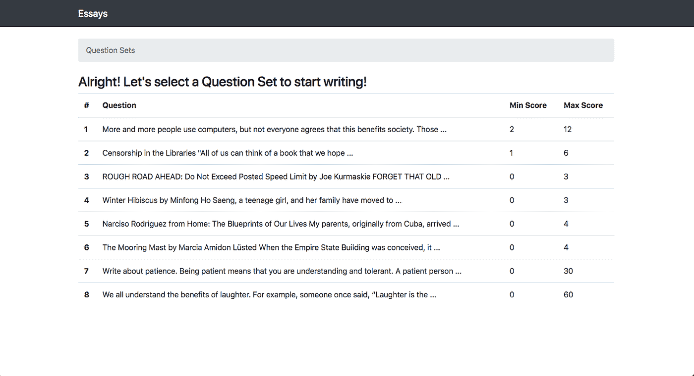

# 自动化论文评分— Kaggle 竞赛端到端项目实施

> 原文：<https://medium.com/analytics-vidhya/automated-essay-scoring-kaggle-competition-end-to-end-project-implementation-part-3-ccd8ae110fd4?source=collection_archive---------13----------------------->

## 第 3 部分:为项目构建一个 Web 应用程序并部署 ML 模型

请通过[第一部分](/@mayurmorin/automated-essay-scoring-kaggle-competition-end-to-end-project-implementation-part-1-b75a043903c4)、[第二部分](/@mayurmorin/automated-essay-scoring-kaggle-competition-end-to-end-project-implementation-part-2-a9fb4c31aed8)和[第三部分](/@mayurmorin/automated-essay-scoring-kaggle-competition-end-to-end-project-implementation-part-3-ccd8ae110fd4)完整理解和项目执行给定的 [Github](https://github.com/mayurmorin/Automated-Essay--Scoring) 。

**2。/my site/gradier/views . py**用于从网页中获取上下文和从保存的模型中对文章评分。

*   Django 和 utils 库被导入，每当用户浏览 web 应用程序时，第一个索引函数将被调用，该函数将在内部调用 index.html 文件并加载该文件。
*   文章定义将调用 essay.html 文件，其中将列出所有的文章，用户或学生可以选择他/她想写的文章。



*   问题定义根据内容从表格中提取数据。学生写的文章将根据帖子的要求获得并存储在内容中。

```
content = form.cleaned_data.get('answer') 
```

*   使用以下代码将内容转换为 testdataVectors，其中 Word2Vec 保存的模型与之前定义的函数 getAvgFeatureVec 一起使用。

```
num_features = 300
                model = word2vec.KeyedVectors.load_word2vec_format(os.path.join(current_path, "deep_learning_files/word2vec.bin"), binary=True)
                clean_test_essays = []
                clean_test_essays.append(essay_to_wordlist( content, remove_stopwords=True ))
                testDataVecs = getAvgFeatureVecs( clean_test_essays, model, num_features )
                testDataVecs = np.array(testDataVecs)
                testDataVecs = np.reshape(testDataVecs, (testDataVecs.shape[0], 1, testDataVecs.shape[1]))
```

*   现在已经加载了 final_lstm.h5 模型权重，并且根据分数进行了预测。

```
lstm_model = get_model()
  lstm_model.load_weights(os.path.join(current_path, "deep_learning_files/final_lstm.h5"))
preds = lstm_model.predict(testDataVecs)
**if** math.isnan(preds):
                    preds = 0
                **else**:
                    preds = np.around(preds)

                **if** preds < 0:
                    preds = 0
                **if** preds > question.max_score:
                    preds = question.max_score
            **else**:
                preds = 0
```


```
essay = Essay.objects.create(
                content=content,
                question=question,
                score=preds
            )
        **return** redirect('essay', question_id=question.set, essay_id=essay.id)
    **else**:
        form = AnswerForm()

    context = {
        "question": question,
        "form": form,
    }
    **return** render(request, 'grader/question.html', context)
```

*   这里预测的分数已经传回 question.html，分数已经显示在 html 页面中。

**这是自动化论文评分的完整端到端项目实施。嘻哈万岁！！！**

# **概要:**

1.  你可以尝试模型文件夹中提到的不同的神经网络模型，并尝试检查不同的准确性，看看是否可以提高分数。
2.  你也可以在这里使用预先训练的模型，如 GloVe、FastText 或其他当前正在使用的艺术模型作为迁移学习的一部分。


3.如果有些代码，你不能理解，那么请谷歌出来更好地理解，这样做你的概念会变得更加清晰。

4.这里提到了两篇研究论文，很值得一读，这样你就可以得到实践，而且它们也清楚地展示了整个项目。

请浏览第 1 部分和第 2 部分以完全理解 Github 链接和项目执行。

# **参考文献:**

1.  特别感谢 Ronit Mankad 的 Github 回购，我已经分叉，并得到了对这个项目的理解。
2.  引用自维基百科和其他网站。
3.  自动论文评分的神经方法
4.  [使用神经网络的自动文本评分](https://arxiv.org/pdf/1606.04289.pdf)

**如果你真的喜欢这个文章系列，请鼓掌，跟我来，就像下面的小喽啰一样享受人工智能的极致力量。**

