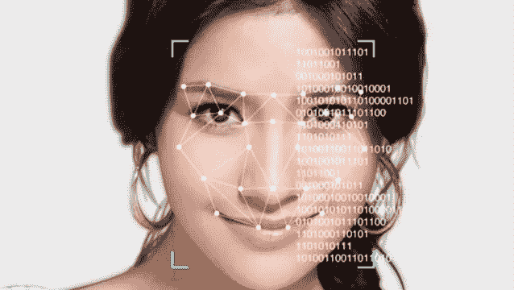

# 自动面部特征检测

> 原文：<https://medium.com/analytics-vidhya/automated-facial-features-detection-baedbf06a43b?source=collection_archive---------6----------------------->

用几行代码识别人脸并提取最多 6 个面部特征！

面部标志点及其特征点的检测在许多与面部图像相关的应用中起着重要的作用，例如面部识别或验证、面部表情分析、姿态归一化和 3D 面部重建。

> 面部特征的检测对于人来说是容易的；然而，对于…