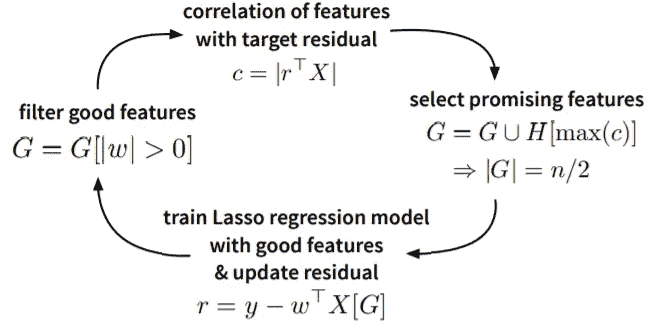
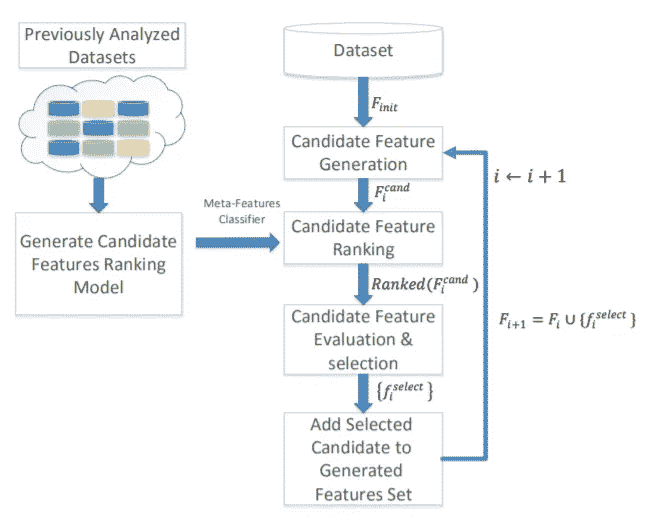

# 自动化特征工程工具

> 原文：<https://medium.com/analytics-vidhya/automated-feature-engineering-tools-44d00be56e3a?source=collection_archive---------1----------------------->

原故事:[https://www . technoskool . com/post/automated-feature-engineering-tools](https://www.technoskool.com/post/automated-feature-engineering-tools)

特征工程是一种将原始数据列转换为有意义内容的技术，有助于预测机器学习任务的结果。在机器学习的生命周期中，特征工程可能是非常乏味的，并且通常是最耗时的。

但是一些很酷的工具拯救了我们，它们自动化了整个特征工程过程，并在很短的时间内为分类和回归任务创建了大量的特征。

我们发现了以下工具，这些工具自动化了整个特征工程过程，并为关系和非关系数据创建了大量特征。虽然它们中的一些只执行特征工程，但是我们有一些工具也执行特征选择。很多时候，这些工具可以生成大量的特征，这些特征之间可能相互关联，并且没有任何预测能力来改善结果度量，因此最好放弃这些特征，从而使特征选择成为特征工程过程的一个组成部分。

以下是一些可用的最佳工具列表

**1。** **功能工具**

**2。** **自动调整**

**3。****t 新鲜**

**4。** **认知到**

**5。** **OneBM**

6。explore kit

**7。** **PyFeat**

**功能工具:-**

自动化特征工程最流行的 Python 库之一是 **FeatureTools** ，它使用**“深度特征合成”**生成一个大型特征集。该库面向关系数据，其中可以通过聚合(例如，给定一些客户(数据表 1)及其相关贷款(在表 2 中)，新特征可以是每个客户贷款的总和)或转换(例如，自上次贷款支付以来的时间)来创建特征。DFS 需要结构化数据和关系数据来创建新功能。

功能工具有两个主要组件:-

**实体和实体集**:实体可以被认为是一个单独的数据帧，而实体集是多个数据帧的组合。

**原语**:这些是基本操作，如均值、众数、最大值等。可以应用于数据。它可以是一个**转换或聚合。**

优点:-

1)最受欢迎，因此有大量资源可用。

2)我们可以指定变量类型。

3)可以创建自定义原语。

4)可以创建相对于时间的扩展特征。

5)最擅长处理关系数据库。

限制:-

1)创建大量特征，导致维数灾难。

2)对于非关系数据库，我们必须使用规范化。

3)不支持非结构化数据。

4)提取的特征是独立于目标变量的其他列聚集的基本统计特征。

自动吃饭:

**AutoFeat** 是 python 库中的一个，它自动化了特征工程和特征选择，以及拟合线性回归模型。他们通常使用线性回归模型来使这个过程更容易解释。

**autofat**遵循的策略与 **FeatureTools** 的策略有些正交:它不是针对关系数据的，在许多业务应用领域都可以找到，而是根据科学用例构建的，例如，实验测量将存储在单个表中。因此，**自动调整**也可以指定输入变量的单位，以防止创建物理上无意义的特征。

以下是 AutoFeat 使用的功能选择过程:

**优点:-**

唯一一个不关心关系数据的通用自动特征工程开源框架。

还进行特征选择以减少维数问题。

不产生物理上无意义的特征，因此在逻辑数据中有用。

**限制** **:-**

不擅长处理关系型数据。

只做比较简单的特征，像比率、乘积和其他基本变换。

制作新特征时不考虑特征交互。

只适合回归数据的自动模型，不适合分类问题。

**TsFresh** **:**

**TsFresh** ，代表“基于可伸缩假设检验的时间序列特征提取”，是一个用于时间序列分析的 Python 包，包含特征提取方法和特征选择算法。目前，它从描述一个时间序列的基本和复杂特征的时间序列数据中自动提取出 [64 个特征](https://tsfresh.readthedocs.io/en/latest/text/list_of_features.html)(如峰值数、平均值、最大值、[时间反转对称统计量](https://en.wikipedia.org/wiki/T-symmetry)等)。)，并且这些特征可以用于建立基于回归或分类的机器学习模型。

**优势** **:**

时间序列分类和回归的最佳开源 python 工具。

可以轻松地与 FeatureTools 集成。

**局限性** **:**

只能用于只适合监督学习的时间序列数据。

**PyFeat :**

PyFeat 是一个用 Python 实现的实用易用的工具包，用于从蛋白质、DNA 和 RNA 中提取各种特征。

它只能与基因组数据一起使用，因此对于日常分类和回归任务不是很有用，但在制药行业却很有用**。**

**ExploreKit :**

**ExploreKit** 基于这样一种直觉，即高信息量的特征通常来自于对基本特征的操作，它们识别共同的操作符来单独转换每个特征或将它们组合在一起。它使用这些运算符来生成许多候选特征，并根据添加了候选特征的模型的经验性能来选择要添加的子集。

生成和选择过程如下:

**优点:**

使用元学习对候选特征进行排序，而不是对所有创建的特征进行特征选择，这有时会非常大。

**局限性:**

Python 和 r 中都没有开源实现。

OneBM :

OneBM 直接处理数据库中的多个原始表。它沿着关系图上的不同路径递增地连接表。它自动识别联合结果的数据类型，包括简单数据类型(数字或分类)和复杂数据类型(数字集、类别集、序列、时间序列和文本)，并对给定类型应用相应的预定义特征工程技术。在这样做的时候，新的特征工程技术可以通过接口与它的特征提取器模块一起插入，以提取特定领域中的期望类型的特征。它通过在不同的结构化和非结构化数据上自动化最流行的特征工程技术来支持数据科学家。

特征选择用于移除先前步骤中提取的不相关特征。首先，移除重复的特征。第二，如果训练和测试数据具有由列定义的隐含顺序，例如时间戳，则通过比较训练和验证集中的特征值之间的分布来检测漂移特征。如果两个分布不同，则该特征被识别为可能导致过拟合的漂移特征。漂移特征将全部从特征集中移除。此外，我们还采用卡方假设检验来检验一个特征和目标变量之间是否存在相关性。与目标变量无关的特征被移除。

**优点:**

适用于关系数据和非关系数据。

与 FeatureTools 相比，可生成简单和复杂的特征。

在 Kaggle 比赛中测试，它的表现超过了最先进的模型。

也可用于创建大数据的特征。

**限制:**

没有开源实现。

**科宁托:**

Cognito 是一个自动进行特征工程的系统，但只通过一个数据库表。在每一步中，它递归地对表的列应用一组预定义的数学变换，以从原始表中获得新的要素。这样，特征的数量与步骤的数量成指数关系。为此，提出了一种去除冗余特征的特征选择策略。它提高了 UCI 数据集的预测精度。由于它不支持包含多个表的关系数据库，为了使用 Cognito，数据科学家需要获得一个从多个表的原始数据生成的表作为输入。

**限制:**

没有开源实现。

关系数据需要额外的努力。

我们可以使用这些技术来获得大量功能，而无需投入太多时间，并更多地关注机器学习的其他方面，即建模和大规模部署。