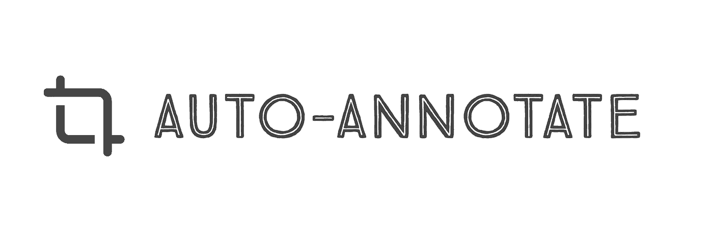
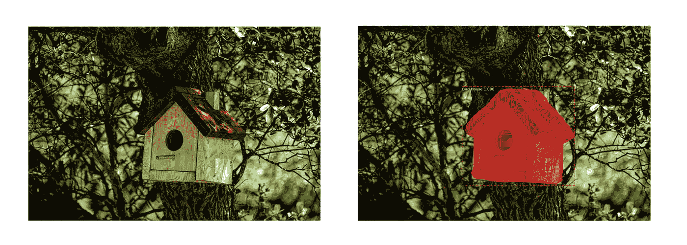

# 使用自动注释工具的自动图像注释

> 原文：<https://medium.com/analytics-vidhya/automated-image-annotation-using-auto-annotate-tool-f8fff8ea4900?source=collection_archive---------1----------------------->



自动注释透明徽标

## 就像说“注释自动驾驶汽车数据集(目录)中的所有街道标志(标签)”一样简单，然后嘭！完成了。

在平均来说，创建一个多边形遮罩并使用一些工具对其进行注释大约需要 30 多秒。使用 Auto-Annotate，可以通过点击单个命令来自动化注释图像的这一令人厌烦的手动重叠部分。开源的自动注释工具基于标签为某个目录中的图像中的对象提供了分割掩模的自动注释。

> **在本文中，**我将带您了解图像注释的基础知识、功能、代码以及自动注释工具的用法。 [GitHub 自动注释库可以在这里找到。](https://www.github.com/mdhmz1/Auto-Annotate)


由 [Austin Distel](https://unsplash.com/@austindistel?utm_source=medium&utm_medium=referral) 在 [Unsplash](https://unsplash.com?utm_source=medium&utm_medium=referral) 上拍摄的照片

# 图像注释

图像注释形成了为计算机视觉模型建立数据集的基础。图像注释是将标签形式的元数据分配给图像中各种实体的过程。这是一种数据标记技术，它标记了我们希望机器学习模型进行训练的图像中的特征。

最常见的图像注释类型有:

*   2D 包围盒
*   多边形分割
*   直线和样条曲线
*   语义分割
*   三维长方体

在这个工具中，我们执行多边形分割，并为它们提供注释，因为它们减少了噪声，并让模型专注于所需的一组预期像素。

# 自动注释工具

自动注释工具建立在[遮罩 R-CNN](https://github.com/matterport/Mask_RCNN) 之上，以支持图像中对象片段的每个实例的自动图像注释。Auto-Annotate 能够为 COCO 数据集中定义的标签提供自动图像注释，并且还支持自定义标签。

自动注释工具以两种模式工作:

*   COCO 标签注释— **无需培训**。只需使用 Coco 数据集的权重，指向图像数据集目录，注释就准备好了。
*   自定义标签注释-为自定义标签训练模型。在图像数据集目录上使用新训练的权重，注释很快就准备好了。

> **注:**已知问题及其解决方法请参考回购中的 [knownIssues.md](https://github.com/mdhmz1/Auto-Annotate/blob/main/knownIssues.md) 文件。如果在工具的安装和使用过程中出现任何错误/问题，请不吝赐教。

## 示例 JSON 注释:

(下面的这个例子说明了**定制标签注释，**其中被训练的模型被训练来识别和注释“鸟舍”)

> 注意:JSON 响应结构对于两种风格的自动注释工具都是一样的，并且可以高度定制以满足您的需要。有关任何定制，请参考下面代码演练一节中的“JSON 格式”一节。



由 MaskRCNN 执行的图像遮罩。

上面鸟巢图片的 JSON 注释示例。

## JSON 格式描述:

*   ***文件名* :** 图像文件名。
*   ***id* :** 唯一 id。
*   ***标签* :** 标签进行标注。(可可标签或定制标签)
*   ***bbox*:**【x，y，w，h】—包围盒左上角点的 x，y 坐标。指定边界框的宽度和高度。
    “格式对应于包围盒的 Coco JSON 响应格式。”
*   ***分割*:**【x1，y1，x2，y2，…】—对于，Yi 属于掩膜段的像素位置。
    “格式对应于用于分段的 Coco JSON 响应格式。”

## 自动注释工具安装:

*   克隆 [**自动标注 GitHub**](https://www.github.com/mdhmz1/Auto-Annotate) 库。
*   使用以下命令安装依赖项:

```
pip3 install -r requirements.txt
```

*   如果注释标签受 **COCO 数据集**支持，从 [Mask R-CNN 发布页面](https://github.com/matterport/Mask_RCNN/releases)下载预训练的 COCO 权重(mask_rcnn_coco.h5)。
    如果注释**自定义对象**，使用掩码 R-CNN 训练模型，并使用新训练的模型的权重。(有关更多详细信息，请参考下面定义的定制培训)
*   根据模式运行下面给出的命令。

*COCO 标签标注:*

```
python3 annotate.py annotateCoco --image_directory=/path/to/the/image/directory/ --label=object_label_to_annotate --weights=/path/to/weights.h5 --displayMaskedImages=False
```

> 注:—**label = object _ label _ to _ annotate**应与 [COCO 数据集](https://cocodataset.org/)标签一致。有关更多详细信息，请参考 COCO 数据集。

*自定义标签标注:*

```
python3 annotate.py annotateCustom --image_directory=/path/to/the/image/directory/ --label=object_label_to_annotate --weights=/path/to/weights.h5 --displayMaskedImages=False
```

> 注意:—**label = object _ label _ to _ annotate**应该是一个进行训练并提供权重的标签。

关于 arg params 的更多细节，请参考下面的代码演练部分。

*   在上面指定的目录— /path/to/the/image/directory/中找到注释。

## 在您自己的数据集上训练

阅读[瓦利德·阿卜杜拉](https://medium.com/u/1a69ae209bc4?source=post_page-----f8fff8ea4900--------------------------------)在他的博客文章中关于使用[色彩飞溅](https://engineering.matterport.com/splash-of-color-instance-segmentation-with-mask-r-cnn-and-tensorflow-7c761e238b46)进行训练的原始文章，他非常漂亮地解释了定制训练的过程，从注释图像到使用 [Mask R-CNN](https://github.com/matterport/Mask_RCNN) 进行训练。

然后使用 [*customTrain.py*](https://github.com/mdhmz1/Auto-Annotate/blob/main/customTrain.py) ，它是瓦利德编写的原始 [balloon.py](https://github.com/matterport/Mask_RCNN/blob/master/samples/balloon/balloon.py) 的修改版本，现在只关注训练部分。

```
# Train a new model starting from pre-trained COCO weights
    python3 customTrain.py train --dataset=/path/to/custom/dataset --weights=coco# Resume training a model that you had trained earlier
    python3 customTrain.py train --dataset=/path/to/custom/dataset --weights=last
```

# 代码走查

本节简要介绍[自动注释 GitHub 库](https://github.com/mdhmz1/Auto-Annotate/)中 [annotate.py](https://github.com/mdhmz1/Auto-Annotate/blob/main/annotate.py) 文件的构建块。

## 参数分析器

这描述了可以传递给 [annotate.py](https://github.com/mdhmz1/Auto-Annotate/blob/main/annotate.py) 的各种命令行参数的用法。

annotate.py 的参数

*   ***命令*** :可以根据需要的模式取两个值中的任意一个。
    值— (annotateCoco 或 annotateCustom)
*   ***图像 _ 目录*** :指向数据集目录。目前支持的图像格式是“.jpg“，”。jpeg“，”。并且可以通过修改“annotateImagesInDirectory()”方法中的代码来扩展它们。
*   ***权重*** :如果 command = annotateCoco，则是预训练 Coco 权重的路径(mask_rcnn_coco.h5)。
    如果 command = annotateCustom，新训练模型的权重的路径。(在训练自定义模型完成后，可以在/log 目录中找到)。
*   ***标签*** :如果 command = annotateCoco，Coco 数据集可以识别的标签。关于 Coco 数据集的标签和序列的完整列表，请参考此处的。
    如果 command = annotateCustom，则执行训练的标签和权重如上所述。

## **JSON 格式**

**这个方法可以修改成 JSON 响应注释格式，以支持根据您的需要定制的任何类型的响应。**

**边界框结构“bbox”可以被改变以支持左上和右下样式的边界框。**

**为了支持[x1，x2，…，xn，y1，y2，…，yn]格式，可以更改分段。**

**也可以在注释中添加一个区域。**

**感谢阅读这篇文章！如果你觉得这篇文章或这个工具很有见地，那就表达出你的爱吧。❤️ 👏**

**在 Linkedin 上与我联系[这里](https://www.linkedin.com/in/mdhmz1/)。**

> **干杯！**