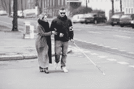
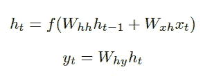
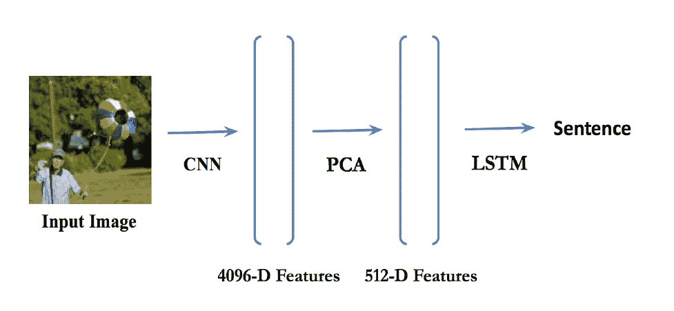
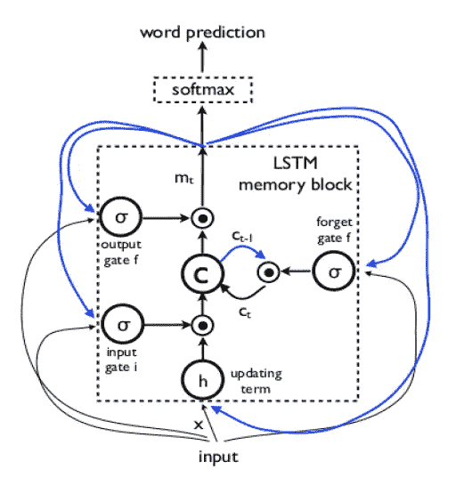
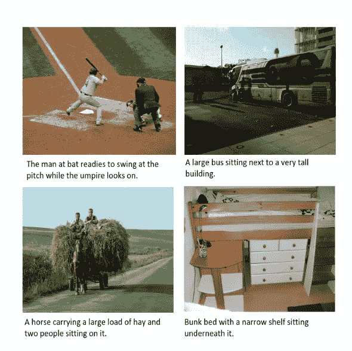
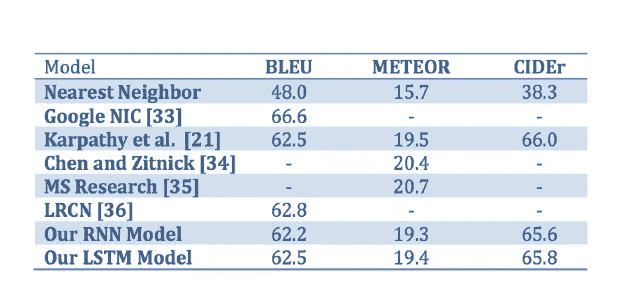
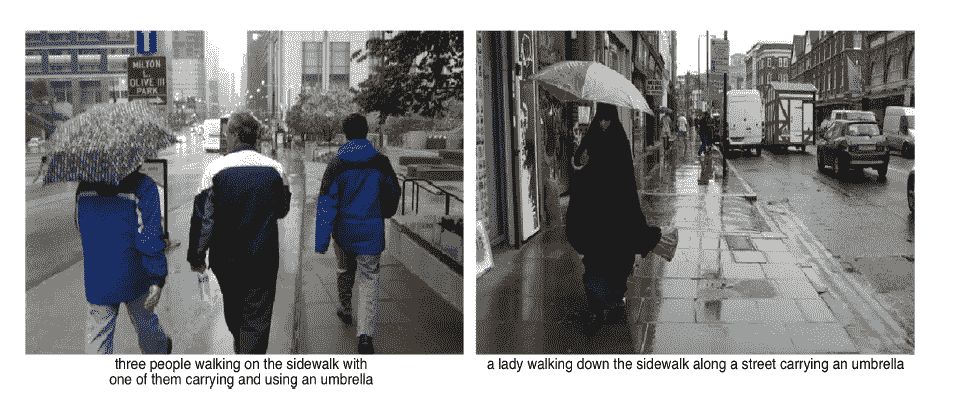
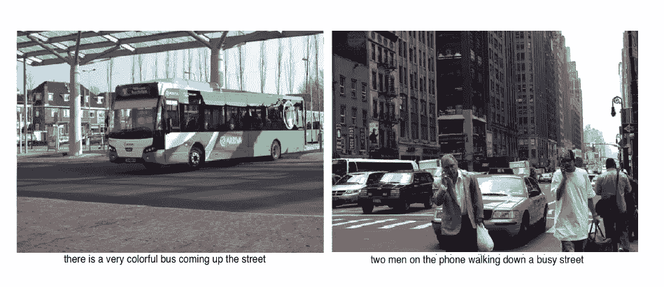

# 为视障人士提供的自动图像字幕生成器

> 原文：<https://medium.com/analytics-vidhya/automated-image-caption-generator-for-visually-impaired-people-7279c42cb638?source=collection_archive---------7----------------------->

能够使用正确形成的英语句子自动描述图像的内容是一项具有挑战性的任务，但它可以帮助视障人士更好地了解他们的周围环境，从而产生巨大的影响。

然后，这些图像可以用来生成字幕，这些字幕可以大声地读给视障人士听，这样他们就可以更好地了解周围发生的事情。

盲人面临的挑战

# **解决问题的技术途径**

我们实现了一个深度递归架构，可以自动生成图像的简短描述。我们的模型使用在 ImageNet 上预先训练的 CNN 来获取图像特征。然后，我们将这些特征输入到一个普通的 RNN 或 LSTM 网络中(图 2 ),用有效的英语生成图像的描述。

# **基于 CNN 的图像特征提取器**

对于特征提取，我们使用 CNN。CNN 已经被广泛用于和研究图像任务，并且是当前用于对象识别和检测的最先进的方法。具体而言，对于所有输入图像，我们从 VGG-16 网络的 fc7 层提取特征，该网络在 ImageNet 上预先训练，该网络非常适合于对象检测。我们获得了一个 4096 维的图像特征向量，由于计算限制，我们使用主成分分析(PCA)将其减少到 512 维的图像特征向量。在第一次迭代中，我们将这些特性加入到 RNN 或 LSTM 的第一层中。

# **基于 RNN 的句子生成器**

我们首先用普通的 rnn 进行实验，因为它们已经被证明是处理序列数据的强大模型[25，26]。通过将输入序列映射到一系列隐藏状态，以及通过给定的等式将隐藏状态映射到输出，标准 RNNs 可以学习复杂的时间动态。

其中 f 是元素式非线性，ht 2 RN 是具有 N 个隐藏单元的隐藏状态，yt 是时间 t 的输出，在我们的实现中，我们使用双曲正切作为元素式非线性。对于长度为 T 输入序列 x1；x2；:::;xT，以上更新按 h1(设 h0 = 0)，y1，h2，y2，… hT，yT 顺序计算。

图 2:图像检索系统和语言生成管道。

# **基于 LSTM 的句子生成器**

虽然 rnn 已经被证明在文本生成和语音识别等任务上是成功的[25，26]，但训练它们学习长期动力学是困难的。这个问题可能是由于梯度通过递归网络的许多层向下传播所导致的消失和爆炸梯度问题。LSTM 网络(图 3)提供了一个解决方案，它结合了存储单元，允许网络学习何时忘记以前的隐藏状态，以及何时在获得新信息时更新隐藏状态。

# 培养

我们训练 LSTM 模型以基于当前单词(xt)和前一上下文(ht􀀀1).)正确预测下一个单词(yt)我们这样做:我们设置 h0 = 0，x1 为起始向量，期望的标签 y1 为序列中的第一个单词。然后，我们将 x2 设置为与网络生成的第一个单词相对应的单词向量。基于这个第一单词向量和先前的上下文，网络然后预测第二单词，等等。使用 Mikolov 等人描述的 word2vec 嵌入模型来生成单词向量。阿尔[1]。在最后一步中，xT 表示最后一个字，yT 被设置为结束标记。

# 测试

为了预测句子，我们获得图像特征 bv，设置 h0 = 0，设置 x1 为起始向量，并计算第一个单词 y1 上的分布。因此，我们从分布中挑选 argmax，将其嵌入向量设置为 x2，并重复该过程，直到生成结束令牌。

图 3: LSTM 单元及其门

# 最佳化

我们使用随机梯度下降(SGD)和 25 个图像句子对的小批量，动量为 0.95。我们交叉验证了学习率和权重衰减。我们使用 Adam 获得了最好的结果，Adam 是一种有效的随机优化方法，它只需要一阶梯度，并根据梯度的一阶和二阶矩的估计值计算不同参数的个体自适应学习率。Adam 的主要优点是参数更新的幅度对于梯度的重新标度是不变的，它的步长近似地由步长超参数限定，并且它自动执行一种形式的步长退火。

# 资料组

在本练习中，我们将使用 2014 版的 Microsoft COCO 数据集，该数据集已成为图像字幕的标准测试平台。该数据集由 80，000 张训练图像和 40，000 张验证图像组成，每张图像都由亚马逊机械土耳其公司的工作人员编写的 5 个标题进行了注释。在图 4 中可以看到四个带有标题的示例图像。我们将所有句子转换成小写，并丢弃非字母数字字符。

图 4:来自微软 COCO 标题数据集的示例图像和标题。

# **定性结果**

我们的模型用有效的英语生成图像的合理描述(图 6 和 7)。从图 5 中的示例背景可以看出，该模型发现了可解释的视觉语义对应，即使对于相对较小的对象，例如图 7 中的电话。生成的描述足够准确，对有视觉障碍的人很有帮助。总的来说，我们发现在训练数据中可以找到相对大部分的生成句子(60%)。

图 5:对 Microsoft COCO 2014 数据集的 1，000 张测试图像的完整图像预测评估

图 6:使用 RNN 结构生成的示例图像描述。

图 7:使用 LSTM 结构生成的示例图像描述。

# **结论**

我们创建了一个深度学习模型，它可以自动生成图像标题，目的是帮助视障人士更好地了解他们的周围环境。

# 参考

[*https://cs224d.stanford.edu 报道麦克拉姆里*](https://cs224d.stanford.edu/reports/mcelamri.pdf)

[https://www . semantic scholar . org/paper/Automated-Neural-Image-Caption-Generator-for-People-El amri-Planque/cc 61 CD 90529 fede 6 E1 bfb 14042d 021 BC 2a 076 e 99](https://www.semanticscholar.org/paper/Automated-Neural-Image-Caption-Generator-for-People-Elamri-Planque/cc61cd90529fede6e1bfb14042d021bc2a076e99)

[*https://www . livestrong . com/article/241936-挑战盲人脸*](https://www.livestrong.com/article/241936-challenges-that-blind-people-face/)

[1]米科洛夫、托马斯、伊利亚·苏茨基弗、程凯、格雷戈·s·科拉多和杰夫·迪恩。"单词和短语的分布式表示及其组合性."神经信息处理系统进展 26:3111–3119(2013)。网络。2016 年 4 月 29 日