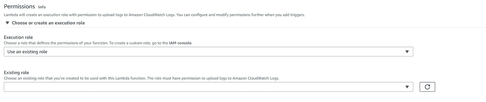
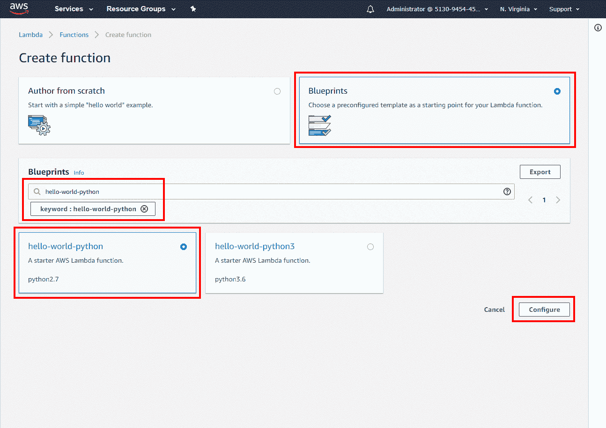
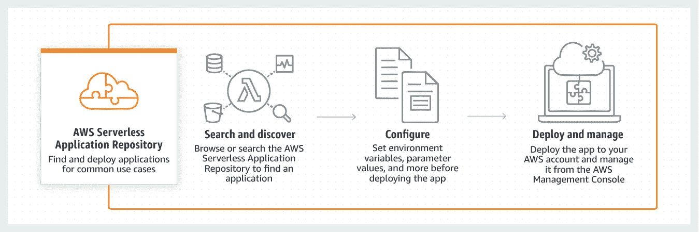
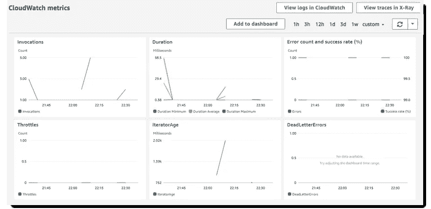

# 使用 Lambda 函数的自动化基础设施

> 原文：<https://medium.com/analytics-vidhya/automated-infrastructure-using-lambda-function-17bb0c373990?source=collection_archive---------17----------------------->

[AWS Lambda](https://docs.aws.amazon.com/lambda/latest/dg/welcome.html) 是一种事件驱动的无服务器架构，允许开发人员在 AWS (Amazon Web Services)控制台中创建和配置所需的功能，并执行代码，而无需配置物理或虚拟服务器，因此只需为执行期间使用的资源付费。代码自动管理运行它所需的计算资源。


AWS Lambda 的符号

通常，Lambda 代码和依赖项可以包装在一个 [Terraform](https://www.terraform.io/) 部署包中，以完全自动化整个基础设施，从而构建一个云不可知的 [IaC](https://infrastructure-as-code.com/) 。出于本教程的目的，我们将在 AWS 控制台中手动部署 Lambda 函数。

***设置 Lambda 功能包括三个步骤-*-**

# 提供 IAM 权限

要运行一个 Lambda 函数，我们需要为该函数分配一个[执行角色](https://docs.aws.amazon.com/lambda/latest/dg/lambda-permissions.html#lambda-intro-execution-role)和 [IAM 策略](https://docs.aws.amazon.com/IAM/latest/UserGuide/access_policies_create.html#access_policies_create-json-editor)，以便它有足够的权限访问目标 AWS 服务和资源并与之交互。

**以下是构建 IAM 策略的步骤:**

1.  在 AWS 控制台左侧的导航窗格中，选择*策略*。
2.  点击*创建策略*。
3.  选择 *JSON* 选项卡。
4.  为 Lambda 函数键入您各自的策略。请看下面的例子。
5.  完成后，选择*查看策略*。[策略验证器](https://docs.aws.amazon.com/IAM/latest/UserGuide/access_policies_policy-validator.html)报告任何语法错误。

```
{ “Version”: “2020–04–22”, 
“Statement”: [ 
 { 
  “Effect”: “Allow”, 
  “Action”: [ 
  “logs:CreateLogGroup”, 
  “logs:CreateLogStream”, 
  “logs:PutLogEvents” 
  ], 
  “Resource”: “arn:aws:logs:*:*:*” 
 }, 
 { 
  “Effect”: “Allow”, 
  “Action”: [ 
  “ec2:Start*”, 
  “ec2:Stop*” 
   ], 
  “Resource”: “*” 
 }
```

*IAM 政策示例*

一旦您有了 IAM 角色，下一步就是创建一个用户*用户*,他拥有这些权限，稍后将被分配给新创建的 Lambda 函数来执行所需的操作。

**这是如何为 AWS 服务(控制台)创建角色的方法:**

*   在 IAM 控制台的导航窗格中，选择*角色*，然后选择*创建角色。*
*   对于*选择可信实体的类型*，选择 *AWS 服务。*
*   在*策略*中，插入新创建的策略。
*   选择*下一步:复习。*

对于*角色名称*，给出一个定义 Lambda 功能目的的适当名称，例如 EC2-reboot。在给定的 AWS 帐户中，角色名称应该是唯一的，不能区分大小写，即 *EC2* 与 *Ec2* 相同。

*   查看角色，然后选择*创建角色*。

# **创建一个 Lambda 函数**

建立 Lambda 函数最关键的一步是编写它的代码。

为了构建 Lambda 函数的代码，请遵循以下步骤:

1.  进入**λ控制台* 并选择*创建功能。**
2.  *在*权限*下，展开*选择*或*创建一个执行角色*。*
3.  *在*执行角色*下，选择*使用现有角色*。*
4.  *在*角色*中，选择新创建的角色。*

**

*创建 Lambda 函数时的权限屏幕*

*下一步是编写要执行的函数。有三种方法可以编写 Lambda 函数:*

*   *使用 AWS 提供的样本代码的**模板**；或者*
*   *从**开始写；**或者*
*   *从其他开发者和公司的**库**中搜索它。*

***1。使用 AWS** 提供的样本代码模板*

*如果你不熟悉 AWS Lambda 和编码，或者对自己编写代码不感兴趣，AWS 提供了几个 Lambda 模板，用于与其服务相关的基本执行，如 EC2 和 S3。这可能是理解和使用该服务的良好起点。*

*用这种方法创建功能时，可以从 ***蓝图*** 中选择。*

**

***2。作者从零开始***

*如果你已经处于编程的高级阶段，或者找不到你想要 Lambda 执行的功能，那么你可以修改*蓝图*中已经提供的功能，或者从头开始编写代码。*

*为了构建一个函数，选择您想要用于此目的的运行时语言**。AWS 提供了使用以下语言编写函数的可能性:***

*   *C#/ Powershell*
*   *计算机编程语言*
*   *Java 语言(一种计算机语言，尤用于创建网站)*
*   *节点. js*
*   *红宝石*

*我们将在 Python 2.7 中编写该函数，因为它似乎在 RAM 和 CPU 时间方面都具有[最佳启动](https://github.com/berezovskyi/lambda-test)性能。*

*代码的语法如下所示:*

```
*import boto3
region = ‘eu-central-1’
instances = [<instance>]
def lambda_handler(event, context):
ec2 = boto3.client(‘ec2’, region_name=region)
ec2.reboot_instances(InstanceIds=instances)
print ‘started your instances: ‘ + str(instances)*
```

*在*区域*中，您必须用您的区域替换 *eu-central-1* ，并且在*实例*中，您必须填充您想要启动的 *EC2* 实例的 ID。这个函数将启动您的 EC2 实例。这里， [boto3](https://boto3.amazonaws.com/v1/documentation/api/latest/guide/quickstart.html) 是一个针对 Python 的 AWS 软件开发包(SDK)。*

*类似地，停止实例的代码也是一样的，但是我们需要用`stop.`替换`reboot`*

```
*import boto3
region = ‘eu-central-1’
instances = [<instance>]
def lambda_handler(event, context):
ec2 = boto3.client(‘ec2’, region_name=region)
ec2.stop_instances(InstanceIds=instances)
print ‘stoped your instances: ‘ + str(instances)*
```

***3。使用 AWS 无服务器应用程序库***

**

*来源:https://aws.amazon.com/serverless/serverlessrepo/*

*AWS 有一个由独立程序员、公司及其合作伙伴发布的已经构建好的无服务器应用程序的巨大资源库。*

*它包含许多常见的用例，并且该平台对公众开放，以丰富知识库。这些代码是免费提供的，以鼓励重用和鼓励新用户选择 AWS 服务。*

*一旦您建立或配置了您的代码，按底部的 ***保存*** 进入最后一步。*

# *调用 Lambda 函数*

*最后一步是构建一个**触发器**，由启动该功能。*

*可以配置触发器来响应事件，例如 DynamoDB 表中的更改、上传到 S3 的新文件或类似的 AWS 事件。你也可以配置 Lambda 函数来响应对 AWS API Gateway 的请求，或者基于 AWS Cloudwatch 触发的定时器，使用 Alexa 或者使用亚马逊的[按需 SDK。](https://docs.aws.amazon.com/lambda/latest/dg/lambda-services.html#api-gateway-with-lambda)*

*对于本教程，我们将使用 AWS 提供的示例事件数据:*

1.  *在控制台右上角，选择*测试*。*
2.  *在*配置测试事件*页面，选择*创建新的测试事件*，在*事件模板*中，保留默认的 *Hello World* 选项。输入一个*事件名称*，并注意以下示例事件模板:*

*`{ "key3": "value3", "key2": "value2", "key1": "value1" }`*

*3.选择*创建*，然后选择*测试*。每个用户可以为每个功能创建多达 10 个测试事件。其他用户无法使用这些测试事件。*

*4.AWS Lambda 代表您执行您的函数。Lambda 函数中的**处理程序**接收并处理样本事件。*

*5.运行几次 Lambda 函数来收集一些指标，您可以在下一步中查看这些指标。*

*6.成功执行后，在控制台中查看结果。选择*监控*。该页面显示了 Lambda 发送给 CloudWatch 的指标的图表。*

**