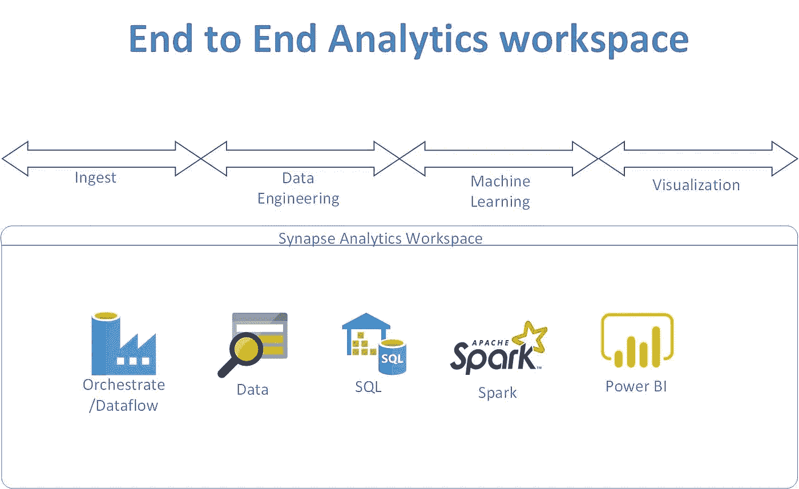

# Azure Synapse Analytics 的自动化 ML。

> 原文：<https://medium.com/analytics-vidhya/automated-ml-with-azure-synapse-analytics-258bd1f51be8?source=collection_archive---------14----------------------->

统一的分析工具，可摄取、计算或处理数据、存储数据、高级分析或机器学习，并在一个工具中显示所有内容。端到端数据分析平台专为扩展和易用性而构建。



Synapse 能够运行基于 spark 的代码，从而实现数据工程或特征工程以及机器学习。本文描述了如何在 synapse 中使用 spark 训练机器学习模型。

*   创建 Azure 机器学习服务。选择与 synapse analytics 相同的区域。
*   创建 pyspark 笔记本。
*   在笔记本的单独单元格中运行每个批处理语句。

```
import azureml.core 
print(azureml.core.VERSION)import os 
subscription_id = "xxxxxxxxx-xxxxxxxxxxx-xxxxxxxxxx-xxxxxxx" resource_group = "eastus_xxxxx_rg" 
workspace_name = "eastus_xxxxx_ws" 
workspace_region = "East US 2"
```

工作区不存在下面的代码也将创建工作区

```
from azureml.core import Workspace 
try:
  ws = Workspace(subscription_id = subscription_id, resource_group = resource_group, workspace_name = workspace_name) # write the details of the workspace to a configuration file to the notebook library 
  ws.write_config()

  print("Workspace configuration succeeded. Skip the workspace creation steps below") 
except: 
  print("Workspace not accessible. Change your parameters or create a new workspace below")
```

从配置文件中加载工作区信息。通常配置文件是一个 JSON 文件。

```
import azureml.core from azureml.core 
import Workspace, Datastore 
ws = Workspace.from_config()
```

构建 CPU 或 GPU 集群:根据所需的处理量创建 CPU 或 GPU 集群。下面的代码为教程创建了 CPU 集群。如果集群已经存在，那么也使用它。

```
from azureml.core.compute import ComputeTarget, AmlCompute 
from azureml.core.compute_target import ComputeTargetException # Choose a name for your CPU cluster 
cpu_cluster_name = "cpucluster" 
# Verify that cluster does not exist already 
try: 
  cpu_cluster = ComputeTarget(workspace=ws, name=cpu_cluster_name) 
  print("Found existing cpucluster") 
except ComputeTargetException: 
  print("Creating new cpucluster") # Specify the configuration for the new cluster 
compute_config = AmlCompute.provisioning_configuration(vm_size="STANDARD_D2_V2", min_nodes=0, max_nodes=4)

# Create the cluster with the specified name and configuration cpu_cluster = ComputeTarget.create(ws, cpu_cluster_name, compute_config)

# Wait for the cluster to complete, show the output log cpu_cluster.wait_for_completion(show_output=True)
```

Python 数据准备 sdk。以下是详细信息的链接。[https://docs . Microsoft . com/en-us/python/API/azure ml-data prep/？view=azure-ml-py](https://docs.microsoft.com/en-us/python/api/azureml-dataprep/?view=azure-ml-py)

```
import azureml.dataprep as dprep
```

使用数据准备库加载特征工程的样本数据集。这个数据集用于我们的自动化机器学习。

```
dataset_root = "https://dprepdata.blob.core.windows.net/demo" green_path = "/".join([dataset_root, "green-small/*"]) 
yellow_path = "/".join([dataset_root, "yellow-small/*"]) green_df = dprep.read_csv(path=green_path, header=dprep.PromoteHeadersMode.GROUPED) # auto_read_file will automatically identify and parse the file type, and is useful if you don't know the file type 
yellow_df = dprep.auto_read_file(path=yellow_path) green_df.head(5) 
yellow_df.head(5)
```

删除为空值的列。获取可用于机器学习模型的列。

```
all_columns = dprep.ColumnSelector(term=".*", use_regex=True) drop_if_all_null = [all_columns, dprep.ColumnRelationship(dprep.ColumnRelationship.ALL)] useful_columns = [ "cost", "distance", "dropoff_datetime", "dropoff_latitude", "dropoff_longitude", "passengers", "pickup_datetime", "pickup_latitude", "pickup_longitude", "store_forward", "vendor" 
]
```

替换 NA，删除空值，并将列名更改为数据集之间通用的名称。将两个数据集合并成一个完整的数据集。

新单元格:

```
tmp_df = (green_df     
	.replace_na(columns=all_columns)     	.drop_nulls(*drop_if_all_null)     	.rename_columns(column_pairs={
         "VendorID": "vendor",
         "lpep_pickup_datetime": "pickup_datetime",
         "Lpep_dropoff_datetime": "dropoff_datetime",
         "lpep_dropoff_datetime": "dropoff_datetime",
         "Store_and_fwd_flag": "store_forward",
         "store_and_fwd_flag": "store_forward",
         "Pickup_longitude": "pickup_longitude",
         "Pickup_latitude": "pickup_latitude",
         "Dropoff_longitude": "dropoff_longitude",
         "Dropoff_latitude": "dropoff_latitude",
         "Passenger_count": "passengers",
         "Fare_amount": "cost",
         "Trip_distance": "distance"
      })
     .keep_columns(columns=useful_columns)) tmp_df.head(5)
```

新单元格:

```
green_df = tmp_df
```

新单元格:

```
tmp_df = (yellow_df 
	.replace_na(columns=all_columns)
 	.drop_nulls(*drop_if_all_null)
	.rename_columns(column_pairs={
	 "vendor_name": "vendor",
	 "VendorID": "vendor", 
	 "vendor_id": "vendor",
	 "Trip_Pickup_DateTime": "pickup_datetime",
	 "tpep_pickup_datetime": "pickup_datetime",
	 "Trip_Dropoff_DateTime": "dropoff_datetime",
	 "tpep_dropoff_datetime": "dropoff_datetime",
	 "store_and_forward": "store_forward",
 	 "store_and_fwd_flag": "store_forward",
	 "Start_Lon": "pickup_longitude",
	 "Start_Lat": "pickup_latitude",
	 "End_Lon": "dropoff_longitude",
	 "End_Lat": "dropoff_latitude",
	 "Passenger_Count": "passengers",
	 "passenger_count": "passengers",
	 "Fare_Amt": "cost",
	 "fare_amount": "cost",
	 "Trip_Distance": "distance",
	 "trip_distance": "distance" })
	 .keep_columns(columns=useful_columns)) tmp_df.head(5)
```

新单元格:

```
yellow_df = tmp_df combined_df = green_df.append_rows([yellow_df])
```

请求数据配置文件，该文件收集数据流产生的全部数据的汇总统计信息。数据配置文件对于理解输入数据、识别异常和缺失值以及验证数据准备操作是否产生了预期结果非常有用。[https://docs . Microsoft . com/en-us/python/API/azure ml-data prep/azure ml . data prep . data flow？view=azure-ml-py](https://docs.microsoft.com/en-us/python/api/azureml-dataprep/azureml.dataprep.dataflow?view=azure-ml-py)

```
decimal_type = dprep.TypeConverter(data_type=dprep.FieldType.DECIMAL) combined_df = combined_df.set_column_types(type_conversions={ 
	"pickup_longitude": decimal_type, 
	"pickup_latitude": decimal_type, 
	"dropoff_longitude": decimal_type, 
	"dropoff_latitude": decimal_type 
}) combined_df.keep_columns(columns=[
	 "pickup_longitude", "pickup_latitude", "dropoff_longitude", "dropoff_latitude" 
]).get_profile() tmp_df = (combined_df
	 .drop_nulls( columns=[
		"pickup_longitude",
		"pickup_latitude", 
		"dropoff_longitude", 
		"dropoff_latitude"],
column_relationship=dprep.ColumnRelationship(dprep.ColumnRelationship.ANY) ) 
	.filter(dprep.f_and( 
		dprep.col("pickup_longitude") <= -73.72,
		dprep.col("pickup_longitude") >= -74.09,
		dprep.col("pickup_latitude") <= 40.88,
		dprep.col("pickup_latitude") >= 40.53,
		dprep.col("dropoff_longitude") <= -73.72, 		
		dprep.col("dropoff_longitude") >= -74.09, 
		dprep.col("dropoff_latitude") <= 40.88, 
		dprep.col("dropoff_latitude") >= 40.53
 )))
 tmp_df.keep_columns(columns=[ 
"pickup_longitude", "pickup_latitude", 
"dropoff_longitude", "dropoff_latitude" 
]).get_profile()
```

将 tmp_df 重新分配给 combined_df

```
combined_df = tmp_df
```

对组合测向进行分析。

```
combined_df.keep_columns(columns='store_forward').get_profile()
```

对于 Store_forward 列，用 N 替换 0。也将空值填充为 n。

```
combined_df = combined_df.replace(columns="store_forward", find="0", replace_with="N").fill_nulls("store_forward", "N")
```

对于距离列，将. 00 替换为 0。也将空值填充为 0。

```
combined_df = combined_df.replace(columns="distance", find=".00", replace_with=0).fill_nulls("distance", 0) combined_df = combined_df.to_number(["distance"])
```

重命名列，合并和分析。

```
tmp_df_renamed = (tmp_df 
	.rename_columns(column_pairs={ 
		"pickup_datetime_1": "pickup_date",
		"pickup_datetime_2": "pickup_time", 		"dropoff_datetime_1": "dropoff_date", 		"dropoff_datetime_2": "dropoff_time"
})) tmp_df_renamed.head(5)combined_df = tmp_df_renamed combined_df.get_profile()tmp_df = tmp_df.drop_columns(columns=["pickup_datetime", "dropoff_datetime"])
```

对数据执行“拉”操作，并用为每列自动推断的转换候选项填充 conversion_candidates。[https://docs . Microsoft . com/en-us/python/API/azure ml-data prep/azure ml . data prep . API . builders . columntypesbuilder？view=azure-ml-py](https://docs.microsoft.com/en-us/python/api/azureml-dataprep/azureml.dataprep.api.builders.columntypesbuilder?view=azure-ml-py)

```
type_infer = tmp_df.builders.set_column_types() 
type_infer.learn() 
type_infer
```

使用此对象的当前状态将“set_column_types”步骤添加到原始数据流[https://docs . Microsoft . com/en-us/python/API/azure ml-data prep/azure ml . data prep . API . builders . columntypesbuilder？view=azure-ml-py](https://docs.microsoft.com/en-us/python/api/azureml-dataprep/azureml.dataprep.api.builders.columntypesbuilder?view=azure-ml-py)

```
tmp_df = type_infer.to_dataflow() 
tmp_df.get_profile()
```

仅取大于 0 的值。

```
tmp_df = tmp_df.filter(dprep.col("distance") > 0) 
tmp_df = tmp_df.filter(dprep.col("cost") > 0)import azureml.dataprep as dprep
```

此时，数据已经准备好了。现在，我们将使用规范或参数来配置自动机器学习。然后提交给自动机器学习来运行。

为自动机器学习加载必要的导入。

```
import azureml.core import pandas as pd 
from azureml.core.workspace import Workspace 
import logging
```

加载工作空间配置以提交建模。

```
ws = Workspace.from_config() # choose a name for the run history container in the workspace experiment_name = 'automated-ml-regression' # project folder project_folder = './automated-ml-regression' 
import os output = {} 
output['SDK version'] = azureml.core.VERSION 
output['Subscription ID'] = ws.subscription_id 
output['Workspace'] = ws.name 
output['Resource Group'] = ws.resource_group 
output['Location'] = ws.location 
output['Project Directory'] = project_folder pd.set_option('display.max_colwidth', -1) 
outputDf = pd.DataFrame(data = output, index = ['']) 
outputDf.T
```

*   设置功能的列
*   设置标签列

```
dflow_X = dflow_prepared.keep_columns(['pickup_weekday','pickup_hour', 'distance','passengers', 'vendor']) dflow_y = dflow_prepared.keep_columns('cost')
```

拆分数据集用于训练和测试。训练用于训练模型。测试用于验证。拆分就是 80%训练，20%测试。值是随机选择的。展平数据框，使其可用于模型。

```
from sklearn.model_selection import train_test_split 
x_df = dflow_X.to_pandas_dataframe() 
y_df = dflow_y.to_pandas_dataframe() x_train, x_test, y_train, y_test = train_test_split(x_df, y_df, test_size=0.2, random_state=223) # flatten y_train to 1d array 
y_train.values.flatten()
```

配置自动机器学习参数或规范。设置迭代、超时、要计算的主要指标、日志记录信息和交叉验证值。

```
automl_settings = {
 "iteration_timeout_minutes" : 10,
 "iterations" : 30,
 "primary_metric" : 'spearman_correlation',
 "preprocess" : True,
 "verbosity" : logging.INFO,
 "n_cross_validations": 5
}
```

将上述配置设置为自动机器学习。选择回归模型，提供路径、特征和标签的训练值，以及要运行的上述自动机器学习参数/规格。

```
from azureml.train.automl import AutoMLConfig # local compute 
automated_ml_config = AutoMLConfig(task = 'regression',
 debug_log = 'automated_ml_errors.log',
 path = project_folder,
 X = x_train.values,
 y = y_train.values.flatten(),
 **automl_settings)
```

提交要运行的模型。这一步将采取。我的花了将近 12 分钟。我使用最多 4 个节点的 cpu 集群。

```
from azureml.core.experiment import Experiment experiment=Experiment(ws, experiment_name) local_run = experiment.submit(automated_ml_config, show_output=True)
```

从迭代中计算度量，并对它们进行平均。

```
children = list(local_run.get_children()) metricslist = {}

for run in children: 
	properties = run.get_properties() 
	metrics = {k: v for k, v in run.get_metrics().items() 
	 if isinstance(v, float)
	}
	metricslist[int(properties['iteration'])] = metrics rundata = pd.DataFrame(metricslist).sort_index(1) 
rundata
```

展示最佳模型。获取模型的输出指标，以显示模型的准确性。

```
best_run, fitted_model = local_run.get_output() 
print(best_run) 
print(fitted_model)
```

注册模型，这样我们就可以使用 id 作为 web 服务部署到推理。

```
description = 'Automated Machine Learning Model' 
tags = None 
local_run.register_model(description=description, tags=tags) print(local_run.model_id) 
# Use this id to deploy the model as a web service in Azure
```

显示预测输出并验证输出，以确保模型运行良好。

```
y_predict = fitted_model.predict(x_test.values) 
print(y_predict[:10])
```

为了使模型更好地工作于特征工程，尝试重新运行模型，并查看哪个模型表现良好。

*最初发表于*[T5【https://github.com】](https://github.com/balakreshnan/synapseAnalytics/blob/master/AzureMLSDKtest.md)*。*