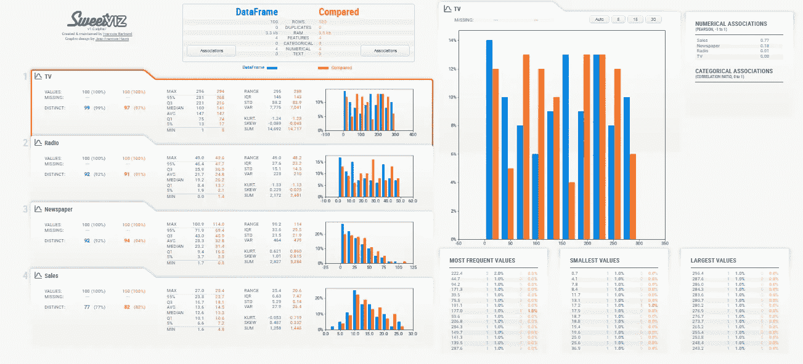

# 利用 Sweetviz 库实现自动化、快速、强大的 EDA！

> 原文：<https://medium.com/analytics-vidhya/automated-quick-and-powerful-eda-with-sweetviz-library-a1b3591e0dc9?source=collection_archive---------6----------------------->

Sweetviz 分析报告概述

**探索性数据分析(EDA)** 用于探索我们正在处理的数据的不同方面。应该执行 EDA，以便找到模式、视觉洞察等。在创建模型或通过数据集预测某些东西之前。EDA 是一种通过可视化数据集来识别我们正在处理的数据特征的通用方法。EDA…