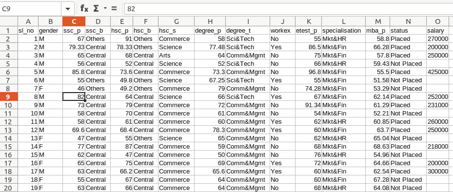
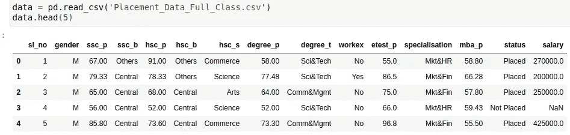
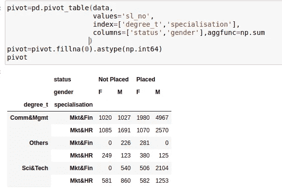
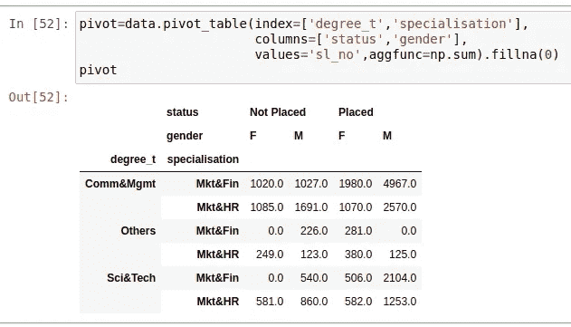
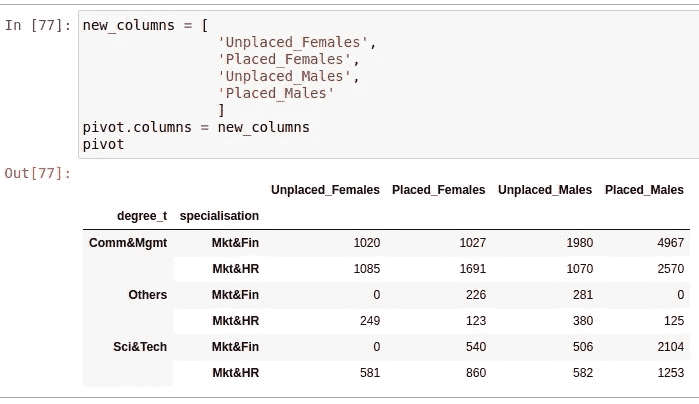
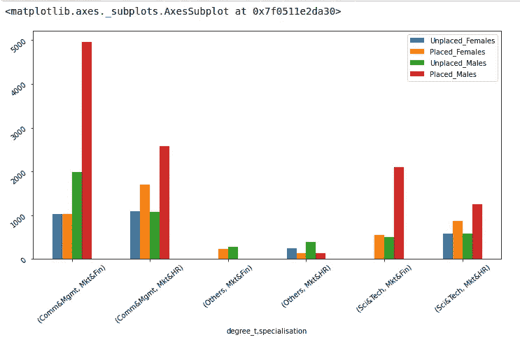
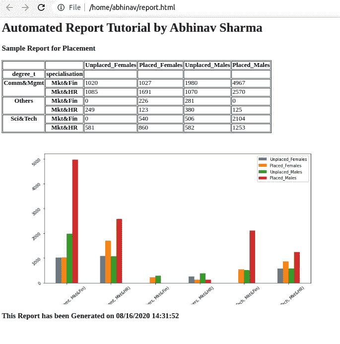

# 用 Python 自动生成报告(第 1 部分):生成数据透视表和图表并保存到 HTML

> 原文：<https://medium.com/analytics-vidhya/automated-reporting-with-python-part-1-generating-pivot-tables-and-charts-and-saving-to-html-ecd6590cd1b1?source=collection_archive---------0----------------------->


在 [Unsplash](https://unsplash.com/s/photos/data?utm_source=unsplash&utm_medium=referral&utm_content=creditCopyText) 上由 [Adeolu Eletu](https://unsplash.com/@adeolueletu?utm_source=unsplash&utm_medium=referral&utm_content=creditCopyText) 拍摄的照片

你做过 Excel 吗？它是创建和生成报告的强大工具。但是，如果您的任务非常耗时且重复，或者数据集太大，excel 无法处理(比如 100，000 行 x 50 列)，该怎么办呢？你可以使用 VB 脚本，但是这也很难，而且容易出错。

Python 是编写脚本和编程的绝佳语言，有 Pandas 这样的大数据友好库，Matplotlib 和 Seaborn 这样的可视化库。

本教程由两部分组成，这将是第一部分，包括在 pandas 中创建数据帧和用 MatplotLib 可视化，然后我将进一步把数据保存为 HTML。

在下一部分，我将展示如何将 HTML 转换成 PDF，并通过 Gmail API 在电子邮件中共享数据

我带了 kaggle.com 的安置日期，[https://www . ka ggle . com/Ben roshan/factors-affecting-campus-Placement](https://www.kaggle.com/benroshan/factors-affecting-campus-placement)



**写代码**(我用的是 Jupyter 笔记本，用 Pandas 和 matplotlib 都很流畅)

导入库和读取文件

```
import pandas as pd
import numpy as npdata = pd.read_csv(‘Placement_Data_Full_Class.csv’)
data.head(5)
```



data.head()显示数据的顶部行

透视数据(检查后) :根据需要检查要包含在数据透视表中的行和列

```
pivot=pd.pivot_table(
                     data,
                     values=’sl_no’,
                     index=[‘degree_t’,’specialisation’],
                     columns=[‘status’,’gender’],aggfunc=np.sum
                     )pivot=pivot.fillna(0).astype(np.int64)pivot
```



或者您可以更改语法以获得简单性。

```
pivot=data.pivot_table(index=[‘degree_t’,’specialisation’],
 columns=[‘status’,’gender’],
 values=’sl_no’,aggfunc=np.sum).fillna(0)pivot
```



函数的作用是:用需要的值替换 na 值

列名看起来是不是有点奇怪？让我们用更易读的东西来改变它们。可读字段总是有利于表示。

```
new_columns = [
                'Unplaced_Females',
                'Placed_Females',
                'Unplaced_Males',
                'Placed_Males'
                ]pivot.columns = new_columns
```



**绘制数据:**我们将为数据绘制一个**条形图**以便更好地可视化，因为条形图似乎适合此处，您也可以尝试不同的图。

```
plot = pivot.plot(kind=’bar’,figsize=(12,6))
plot.tick_params(rotation=40)
plot
```

**Kind** 是选择图表类型的关键字参数，可以使用 kind="line "进行折线图绘制，使用 **figsize** 可以改变绘图的大小。

**tick_params()** 用于修改标签的参数。这里我们将标签倾斜以便于阅读。



```
**#Converting to HTML****# saving plot image to local file**
image = plot.get_figure().savefig('plot.png')
image_tag = ''**#writing HTML Content**
heading = '<h1> Automated Report Tutorial by Abhinav Sharma</h1>'
subheading = '<h3> Sample Report for Placement </h3>'**# Using .now() from datetime library to add Time stamp**
now = datetime.now()
current_time = now.strftime("%m/%d/%Y %H:%M:%S")
header = '<div class="top">' + heading + subheading +'</div>'
footer = '<div class="bottom"> <h3> This Report has been Generated\n
          on '+ current_time +'</h3> </div>'content = '<div class="table"> '+pivot.to_html()+' </div> \n
          <div class="chart"> '+ image_tag +'</div>'**# Concating everything to a single string**
html = header + content + footer 
```

写完标签后，我们需要在 HTML 文件中写下所有内容。如果我们对 div 有把握，我们可以事先在 HTML 文件中添加 CSS，或者我们也可以使用 Jinja 在 sode HTML 中传递数据，这里我已经写了一个完整的 HTML，只需很少的努力就可以用 2 行 CSS 来设置样式。

```
**# Writing the file**
with open(‘report.html’,’w+’) as file:
 file.write(html)
```



在下一部分中，我将展示如何用**样式化这个 HTML** ，**将其转换成 PDF** ，并使用 **Gmail API** 将报告发送给多个收件人。

**链接到下一部分** → [使用 Python 自动报告，第 2 部分](/@abhinavsharma150/automated-reporting-with-python-part-2-converting-an-html-file-to-pdf-and-sending-automated-2fb85eec89e9)


非常感谢

祝你有美好的一天！！

**更多来自作者:**

1.  [大数据技术](https://abhinavsharma150.medium.com/the-big-data-technology-what-why-where-and-how-fdeac3dc1c7b)
2.  自动电报机器人
3.  [堆数据结构](/@abhinavsharma150/didnt-understand-heap-lets-implement-and-know-eeb80395198)