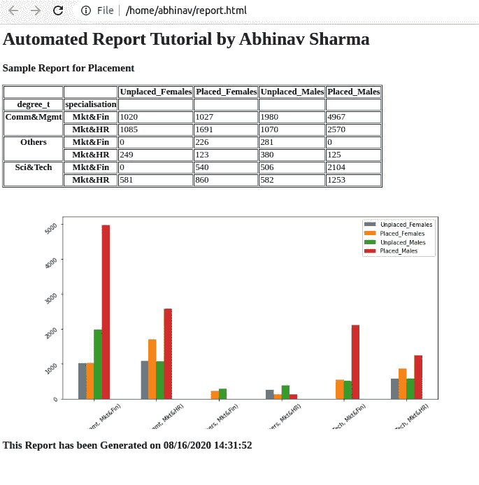
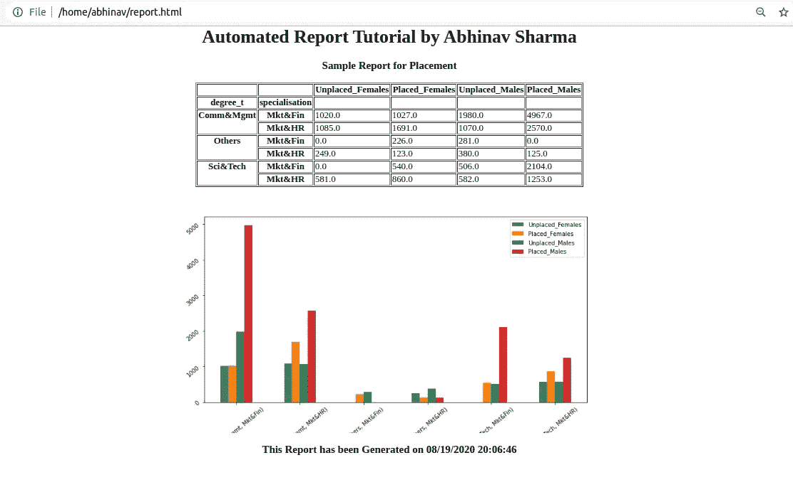
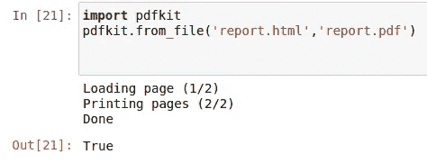
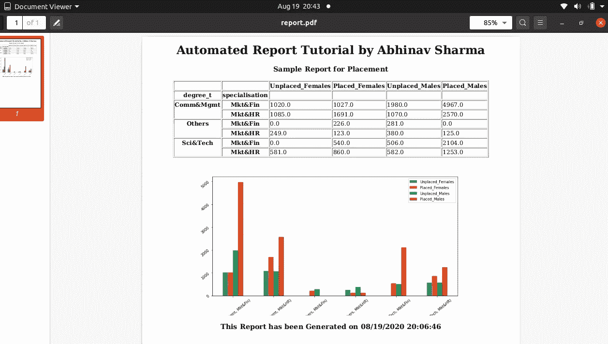
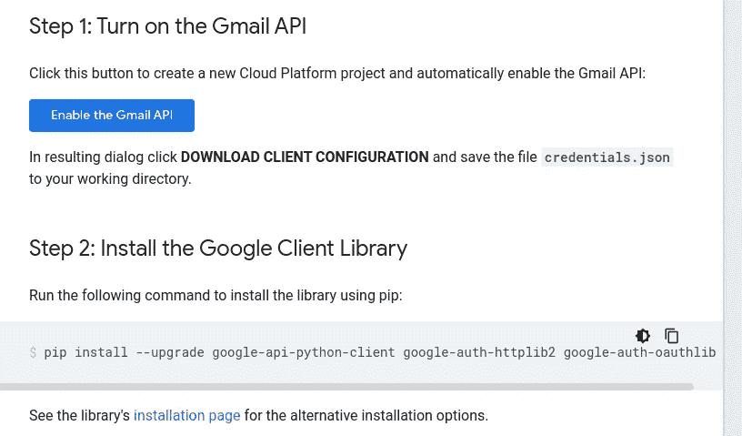
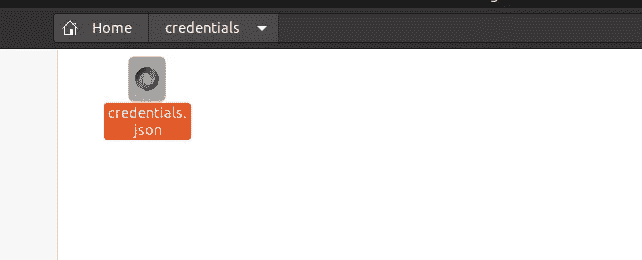
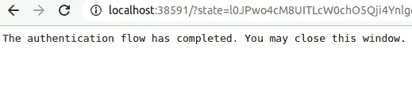
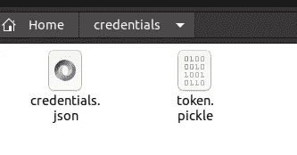
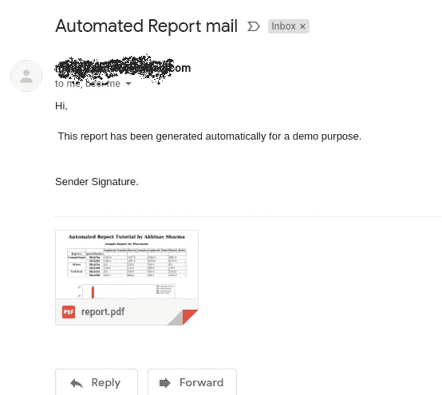

# 使用 Python 自动生成报告(第 2 部分) :将 HTML 文件转换为 PDF，并使用 Gmail API 发送自动邮件

> 原文：<https://medium.com/analytics-vidhya/automated-reporting-with-python-part-2-converting-an-html-file-to-pdf-and-sending-automated-2fb85eec89e9?source=collection_archive---------3----------------------->


斯蒂芬·菲利普斯-Hostreviews.co.uk 在 Unsplash[拍摄的照片](https://unsplash.com/s/photos/gmail?utm_source=unsplash&utm_medium=referral&utm_content=creditCopyText)

在最后一部分中，我在生成图表和数据透视表并将其转换为 HTML 后结束了这篇文章。如果你需要阅读，请打开下面的链接。

[https://medium . com/@ abhinavsharma 150/automated-reporting-with-python-part-1-generating-pivot tables-and-charts-and-saving-to-html-ECD 6590 CD 1 b 1](/@abhinavsharma150/automated-reporting-with-python-part-1-generating-pivot-tables-and-charts-and-saving-to-html-ecd6590cd1b1)

**本部分将讨论两个主题:**
a .将 HTML 转换为 PDF(应用 CSS 后)
b .使用 GMAIL API 发送自动邮件



这份报告看起来是不是有点尴尬？**让我们添加一些样式**

对于表格，我们会做"**margin:0px auto；**"为了使它居中，为了 div，我们将为 body 本身提供一个公共 CSS:-**" text-align:center；"然后重新编写 HTML 代码。**

```
# Adding CSS to HTMLcss = ‘<style> body {\n text-align:center; \n}\n table{\n margin:0px auto;\n}</style>’html = html + csswith open(‘report.html’,’w+’) as file:
 file.write(html)
```



转换为 PDF(您需要导入 pdfkit 库，如果没有安装，请在终端上做:-"**sudo apt-get install-y python-PDF kit**或" **pip3 install pdfkit** )。

**注**:为了简单起见，我使用的是主目录，你可以根据自己的意愿更改目录名。

```
import pdfkit
pdfkit.from_file(‘report.html’,’report.pdf’)
```



> **Gmail API :-** 你需要向 Gmail 请求一个 API。请参考谷歌开发者 Python 快速入门快速浏览
> 
> [https://developers.google.com/gmail/api/quickstart/python](https://developers.google.com/gmail/api/quickstart/python)，进入链接，打开 Gmail API，下载“credentials.json”文件，安全保存。请记住→“如果丢失，几乎无法从谷歌回收或找回”。



建议将 credentials.json 保存在单独的文件夹中

对于“Python3 ”,在终端→中运行命令，改为尝试“pip3”

`pip install --upgrade google-api-python-client google-auth-httplib2 google-auth-oauthlib`

使用 google API 库开始导入:-

```
from __future__ import print_function
import pickle
import os.path
from googleapiclient.discovery import build
from google_auth_oauthlib.flow import InstalledAppFlow
from google.auth.transport.requests import Request
```

导入(如果不可用，则安装)邮件库:-

```
# Local Libraries
import base64
from email.mime.text import MIMEText
from email.mime.application import MIMEApplication
from email.mime.multipart import MIMEMultipart
```

将作用域设置为 SCOPES =['[https://mail.google.com/'](https://mail.google.com/')]以获得完全访问权限。

```
SCOPES = [‘[https://mail.google.com/'](https://mail.google.com/')]
```

> **主认证类** :-这将在第一次运行时创建一个**令牌. pickle** 文件。不要改变代码，这是令人满意的，如果需要，只需改变目录。
> 
> 下面的代码将使您首次登录，并生成一个 token.pickle 文件进行验证

```
class Main:def __init__(self):
        self.creds = None

        if os.path.exists('path_to/token.pickle'):
            with open('path_to/token.pickle', 'rb') as token:
                self.creds = pickle.load(token)
 # If there are no (valid)credentials available letuserlog in.
        if not self.creds or not self.creds.valid:
            if self.creds and self.creds.expired and self.creds.refresh_token:
                self.creds.refresh(Request())
            else:
                flow = InstalledAppFlow.from_client_secrets_file(
                    'path_to/credentials.json', SCOPES)
                self.creds = flow.run_local_server(port=0)
            # Save the credentials for the next run
            with open('credentials/token.pickle', 'wb') as token:
                pickle.dump(self.creds, token)self.service = build('gmail', 'v1', credentials=self.creds)
```



一旦谷歌认证完成，你就会看到这个屏幕



它将在您的系统上生成一个 token.pickle 文件

**创建和发送邮件:**上面已经导入了所需的**电子邮件库。**

```
class CreateAndSend:def __init__(self,service, to, sender, user_id, subject, message_text,attachment):message = MIMEMultipart()
        message['to'] = to
        message['from'] = sender
        message['bcc'] = 'if_any_bcc@gmail.com'
        message['subject'] = subject
        body = MIMEText(message_text)
        message.attach(body)

        with open(attachment, "rb") as f:

            attach = MIMEApplication(f.read(),_subtype="pdf")
        attach.add_header('Content-Disposition',
                          'attachment',
                          filename=str(attachment))
        message.attach(attach)

        to_send = {
                    'raw': base64.urlsafe_b64encode(message.as_string().encode()).decode()
                    }
        #print(message)try:
            to_send = (service.users().messages().send(userId=user_id, body=to_send)
                       .execute())
            print('Message Id: %s' % to_send['id'])except Exception as e:
            print('An error occurred', e)main = Main()
service = main.service
to = '[t](mailto:abhinavsharma150@gmail.com)o_id@gmail.com'
sender = ''
user_id = '[y](mailto:mailstream99@gmail.com)our_id@gmail.com'
subject = 'Automated Report mail'
message_text = 'Hi,\n\n This report has been generated automatically for a demo purpose.\n \nRegards, \nSender Signature.'
attachment='path_to/report.pdf'def send_mail():
    CreateAndSend(service, to, sender, user_id, subject, message_text,attachment)send_mail()
```

****

**邮件自动发送给所需用户**

**我希望这能帮助你在几秒钟内生成自动报告。**

****猜**！，在这个系列中还可以添加更多的东西吗？假设您需要每小时、每天或一周中的某一天发送这些报告。我们不能安排它吗？我将在自动化报告的下一部分中介绍“**任务调度**”。**

****谢谢！！！！****

****

**在这里阅读我的非技术性博客:**

**1. [**印度宗教:一种潜在的软实力**](https://abhinav1321.wordpress.com/2021/05/05/religions-in-india-the-soft-power-potential/)**

**2. [**新闻伦理:新闻自由 Vs 秃鹫媒体**](https://abhinav1321.wordpress.com/2021/05/03/journalistic-ethics-freedom-of-press-media/)**

**3. [**疫苗与群体免疫。疫苗安全吗？**](https://abhinav1321.wordpress.com/2021/05/02/vaccine-and-herd-immunity-are-vaccines-safe/)**