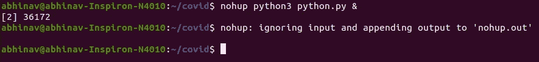

# 用 Python 自动报告(第 3 部分) :调度、创建和发送定期的 COVID19 数据作为报告。

> 原文：<https://medium.com/analytics-vidhya/automated-reporting-with-python-part-3-scheduling-creating-and-sending-periodical-covid19-842f6794421d?source=collection_archive---------9----------------------->


Tobias Rehbein 在 [Unsplash](https://unsplash.com/s/photos/covid-data?utm_source=unsplash&utm_medium=referral&utm_content=creditCopyText) 上的照片

你可以在这里找到前两部分→

第 1 部分→ [**数据透视表、图表和报表转 HTML**](/@abhinavsharma150/automated-reporting-with-python-part-1-generating-pivot-tables-and-charts-and-saving-to-html-ecd6590cd1b1)

第 2 部分→ [**HTML 到 PDF 和 Gmail API 自动发送邮件**](/@abhinavsharma150/automated-reporting-with-python-part-2-converting-an-html-file-to-pdf-and-sending-automated-2fb85eec89e9)

假设每天、每周或每天 n 次，您需要从某个 API 链接、共享驱动器或手动归档等来源获取或下载数据。你正在创建一份报告，并将其发送给你的老板。它重复、无聊又耗时。为什么不自动化呢？

在这一部分，我将解释一个**定期报告机制，用于在邮件**中发送自动报告。

为了便于说明，我从下面的链接[https://api.covid19india.org/csv/latest/district_wise.csv](https://api.covid19india.org/csv/latest/district_wise.csv)获取 COVID19 数据

我建议你同时使用 Jupyter 笔记本和一些 IDE，如果不可用，使用文本编辑器- Sublime Text3，它与 Python 配合得很好。

创建两个独立的文件: **report.py** 和 **scheduler.py**

可以用 IDE 或使用终端上的**触摸**命令来完成


为了简单起见，我们将首先在 Jupyter 上工作，然后将代码移到。py 文件

**导入库**

```
import numpy as np
import pandas as pd
import matplotlib.pyplot as pltimport requests
import datetime
```

**获取数据**:

```
link = '[https://api.covid19india.org/csv/latest/district_wise.csv'](https://api.covid19india.org/csv/latest/district_wise.csv')response = requests.get(link)
content = response.content# Name the file as current day
file = open('covid/covid_data_'
            +str(datetime.date.today())+
            '.csv','wb')
file.write(content)df = pd.read_csv('covid/covid_data_'+str(datetime.date.today())+'.csv')
df.head()
```


**df.head()** 显示顶行，而 **df.columns** 显示列名

争论:让我们把它分组

```
state_wise_data = df.groupby(‘State’)
```


我们将通过 Covid 选择受影响最大的州的数据。**让我们在“已确认”栏上对数据帧进行排序。**

```
state_wise_data = df.groupby('State')state_data = []for state,data in state_wise_data:
# summing all the districts data[columns->confirmed:deceased ] to a variablerow_list=[]
    row_list.append(state)
    for d in data.iloc[:,5:14].sum():
        row_list.append(d)
    state_data.append(row_list)new_columns=['state']
for col in df.columns[5:14]:
    new_columns.append(col)new_data = pd.DataFrame(state_data,
                        columns=new_columns
                       ).sort_values(
                        by=['Confirmed'],
                        ascending=False
                                       )
new_data
```


让我们从排序的数据帧中获取前 5 行和前 5 列

```
df_to_plot = new_data.iloc[:5,:5]
```

绘制它:

```
plt=df_to_plot.plot(kind=’bar’,width=0.5,figsize=(10,5))
plt.set_xticklabels(df_to_plot[‘state’],rotation=’30')
```


**保存为 HTML，转换为 PDF，Gmail API** : →已经在 [**报表第一部分**](/@abhinavsharma150/automated-reporting-with-python-part-1-generating-pivot-tables-and-charts-and-saving-to-html-ecd6590cd1b1)[**报表第二部分**](/@abhinavsharma150/automated-reporting-with-python-part-2-converting-an-html-file-to-pdf-and-sending-automated-2fb85eec89e9) **< -** 请点击打开**。**

```
from datetime import datetime
#Converting to HTML# saving plot image to local file
image = plt.get_figure().savefig(‘covid_plot.png’)
image_tag = ‘’#Table
table = data_to_plot.set_index(‘state’)#writing HTML Content
heading = ‘<h1> Scheduled Covid Report</h1>’# Using .now() from datetime library
now = datetime.now()
current_time = now.strftime(“%m/%d/%Y %H:%M:%S”)
header = ‘<div class=”top”>’ + heading +’</div>’footer = ‘<div class=”bottom”> <h3> This Report has been Generated on ‘
footer = footer+current_time +’</h3> </div>’content = ‘<div class=”table”> ‘+ table.to_html()+’ </div> <div class=”chart”> ‘
content = content+ image_tag +’</div>’html = ‘<body>’ + header + content + footer +’</body>’# Writing the file
with open(‘covid_report.html’,’w+’) as file:
 file.write(html)# HTML to PDF 
import pdfkit
pdfkit.from_file(‘covid_report.html’,’covid_report.pdf’)
```

Gmail API :-在 [**部分解释**](/@abhinavsharma150/automated-reporting-with-python-part-2-converting-an-html-file-to-pdf-and-sending-automated-2fb85eec89e9) **2 :** 在此粘贴代码

```
from googleapiclient.discovery import build
from google_auth_oauthlib.flow import InstalledAppFlow
from google.auth.transport.requests import Request# Local Libraries
import base64
from email.mime.text import MIMEText
from email.mime.audio import MIMEAudio
from email.mime.application import MIMEApplication
from email.mime.multipart import MIMEMultipartSCOPES = [‘[https://mail.google.com/'](https://mail.google.com/')]
class Main:def __init__(self):
 self.creds = None
 # The file token.pickle stores the user’s access and refresh tokens, and is
 # created automatically when the authorization flow completes for the first
 # time.
 if os.path.exists(‘credentials/token.pickle’):
 with open(‘credentials/token.pickle’, ‘rb’) as token:
 self.creds = pickle.load(token)
 # If there are no (valid) credentials available, let the user log in.
 if not self.creds or not self.creds.valid:
 if self.creds and self.creds.expired and self.creds.refresh_token:
 self.creds.refresh(Request())
 else:
 flow = InstalledAppFlow.from_client_secrets_file(
 ‘credentials/credentials.json’, SCOPES)
 self.creds = flow.run_local_server(port=0)
 # Save the credentials for the next run
 with open(‘credentials/token.pickle’, ‘wb’) as token:
 pickle.dump(self.creds, token)self.service = build(‘gmail’, ‘v1’, credentials=self.creds)class CreateAndSend:def __init__(self,service, to, sender, user_id, subject, message_text,attachment):message = MIMEMultipart()
 message[‘to’] = to
 message[‘from’] = sender
 message[‘bcc’] = ‘’
 message[‘subject’] = subject
 body = MIMEText(message_text)
 message.attach(body)

 with open(attachment, “rb”) as f:
 #attach = email.mime.application.MIMEApplication(f.read(),_subtype=”pdf”)
 attach = MIMEApplication(f.read(),_subtype=”pdf”)

 attach.add_header(‘Content-Disposition’,
 ‘attachment’,
 filename=str(attachment))
 message.attach(attach)

 to_send = {
 ‘raw’: base64.urlsafe_b64encode(message.as_string().encode()).decode()
 }
 print(message)try:
 to_send = (service.users().messages().send(userId=user_id, body=to_send)
 .execute())
 print(‘Message Id: %s’ % to_send[‘id’])except Exception as e:
 print(‘An error occurred’, e)main = Main()
service = main.service
to = ‘[sender_id@something.com](mailto:abhinavsharma150@gmail.com)’
sender = ‘’
user_id = ‘[gmailapiid@gmail.com](mailto:mailstream99@gmail.com)’
subject = ‘Automated Report mail’
message_text = ‘Hi,\n\n This report has been generated automatically for a demo purpose.\n\n\nSender Signature.’
attachment=’covid_report.pdf’def send_mail():
 CreateAndSend(service, to, sender, user_id, subject, message_text,attachment)send_mail()
```

**使用 nohup (linux)调度任务**

nohup 是一个 POSIX 命令，这里的“hup”代表“挂断”。当用户注销时，hup 被发送给系统以通知挂断，nohup 截获该命令并允许进程继续运行。

**语法:**

```
**nohup** *command* [*command-argument* ...]**nohup** *command* [*command-argument* ...] &
```

命令末尾的&指示 bash 在前台运行命令。让我们试一个例子:


创建 Python 文件


编辑 Python 文件



作为 nohup 运行

当我们运行 nohup 时，它会创建一个带有输出的 nohup.out 文件

关闭 nohup 进程:可以通过将进程置于前台来完成


我们可以通过 fg %n 将作业放到前台来停止运行作业，其中 n 是作业的数量


现在让我们创建一个 scheduler.py 并在其中编写一些代码

**Python 进度表库**点击此处 **→** [**进度表库**](https://pypi.org/project/schedule/#:~:text=Schedule%20lets%20you%20run%20Python,and%20the%20clockwork%20Ruby%20module.) **:-** 获取官方文档。可以通过 **pip3 安装进度表**下载

让我们试着安排每 3 分钟报告一次。

```
import schedule
import time,datetime
import osdef run_report():
 # os.system runs system commands same as in os
 os.system(‘python3 report.py’)schedule.every(2).minutes.do(run_report)while True:
 schedule.run_pending()
 time.sleep(1)
```


**完整代码如下:**

1.  **Report.py**

```
import numpy as np
import pandas as pd
import matplotlib.pyplot as plt
import requests
import datetime
import oslink = ‘[https://api.covid19india.org/csv/latest/district_wise.csv'](https://api.covid19india.org/csv/latest/district_wise.csv')
response = requests.get(link)
content = response.content
# Name the file as current day
file = open(‘covid_data_’
 +str(datetime.date.today())+
 ‘.csv’,’wb’)file.write(content)
df = pd.read_csv(‘covid_data_’+str(datetime.date.today())+’.csv’)state_wise_data = df.groupby(‘State’)state_data = []
for state,data in state_wise_data:
# summing all the districts data[columns->confirmed:deceased ] to a variable
 row_list=[]
 row_list.append(state)
 for d in data.iloc[:,5:14].sum():
 row_list.append(d)
 state_data.append(row_list)
 new_columns=[‘state’]
 for col in df.columns[5:14]:
 new_columns.append(col)new_data = pd.DataFrame(state_data,
 columns=new_columns
 ).sort_values(
 by=[‘Confirmed’],
 ascending=False
 )# Lets plot first 5 rows
df_to_plot = new_data.iloc[:5,:5]plt=df_to_plot.plot(kind=’bar’,width=0.5,figsize=(10,5))
plt.set_xticklabels(df_to_plot[‘state’],rotation=’30')# to HTML
from datetime import datetime
#Converting to HTML
# saving plot image to local file
image = plt.get_figure().savefig(‘covid_plot.png’)
image_tag = ‘’
#Table
table = df_to_plot.set_index(‘state’)
#writing HTML Content
heading = ‘<h1> Scheduled Covid Report</h1>’
# Using .now() from datetime library
now = datetime.now()
current_time = now.strftime(“%m/%d/%Y %H:%M:%S”)
header = ‘<div class=”top”>’ + heading +’</div>’
footer = ‘<div class=”bottom”> <h3> This Report has been Generated on ‘
footer = footer+current_time +’</h3> </div>’
content = ‘<div class=”table”> ‘+ table.to_html()+’ </div> <div class=”chart”> ‘
content = content+ image_tag +’</div>’
html = ‘<body>’ + header + content + footer +’</body>’
# Writing the file
with open(‘covid_report.html’,’w+’) as file:
 file.write(html)# HTML to PDF 
import pdfkit
pdfkit.from_file(‘covid_report.html’,’covid_report.pdf’)# Running Gmail File to Send mail
os.system(‘python3 gmail.py’) 
```

3.谷歌邮箱

```
# Google API Libraries
from __future__ import print_function
import pickle
import os.path
from googleapiclient.discovery import build
from google_auth_oauthlib.flow import InstalledAppFlow
from google.auth.transport.requests import Request# Local Libraries
import base64
from email.mime.text import MIMEText
from email.mime.audio import MIMEAudio
from email.mime.application import MIMEApplication
from email.mime.multipart import MIMEMultipartSCOPES = [‘[https://mail.google.com/'](https://mail.google.com/')]
class Main:def __init__(self):
 self.creds = None
 # The file token.pickle stores the user’s access and refresh tokens, and is
 # created automatically when the authorization flow completes for the first
 # time.
 if os.path.exists(‘../credentials/token.pickle’):
 with open(‘../credentials/token.pickle’, ‘rb’) as token:
 self.creds = pickle.load(token)

# If there are no (valid) credentials available, let the user log in.
 if not self.creds or not self.creds.valid:
 if self.creds and self.creds.expired and self.creds.refresh_token:
 self.creds.refresh(Request())
 else:
 flow = InstalledAppFlow.from_client_secrets_file(
 ‘../credentials/credentials.json’, SCOPES)
 self.creds = flow.run_local_server(port=0)
 # Save the credentials for the next run
 with open(‘../credentials/token.pickle’, ‘wb’) as token:
 pickle.dump(self.creds, token)self.service = build(‘gmail’, ‘v1’, credentials=self.creds)class CreateAndSend:def __init__(self,service, to, sender, user_id, subject, message_text,attachment):message = MIMEMultipart()
 message[‘to’] = to
 message[‘from’] = sender
 message[‘bcc’] = ‘’
 message[‘subject’] = subject
 body = MIMEText(message_text)
 message.attach(body)

 with open(attachment, “rb”) as f:
 #attach = email.mime.application.MIMEApplication(f.read(),_subtype=”pdf”)
 attach = MIMEApplication(f.read(),_subtype=”pdf”)

 attach.add_header(‘Content-Disposition’,
 ‘attachment’,
 filename=str(attachment))
 message.attach(attach)

 to_send = {
 ‘raw’: base64.urlsafe_b64encode(message.as_string().encode()).decode()
 }
 print(message)try:
 to_send = (service.users().messages().send(userId=user_id, body=to_send)
 .execute())
 print(‘Message Id: %s’ % to_send[‘id’])except Exception as e:
 print(‘An error occurred’, e)main = Main()
service = main.service
to = ‘to_recipient[@g](mailto:abhinavsharma150@gmail.com)mail.com’
sender = ‘’
user_id = ‘your_api_gmail_id@gmail.com’
subject = ‘Automated Report mail’
message_text = ‘Hi,\n\n This report has been generated automatically for a demo purpose.\n\n\nSender Signature.’
attachment=’covid_report.pdf’def send_mail():
 CreateAndSend(service, to, sender, user_id, subject, message_text,attachment)send_mail()
```

3.scheduler.py

```
import schedule
import time
import datetime
import osdef run_report():
 # os.system runs command same as system command line 
 os.system(‘python3 report.py’)# Just select or edit the way the scheduling is needed from below 
schedule.every(2).minutes.do(run_report)#-------- SOME MORE WAYS IT CAN BE SCHEDULED-------
# schedule.every(10).minutes.do(job)
# schedule.every().hour.do(job)
# schedule.every().day.at(“10:30”).do(job)
# schedule.every(5).to(10).minutes.do(job)
# schedule.every().monday.do(job)
# schedule.every().wednesday.at(“13:15”).do(job)
# schedule.every().minute.at(“:17”).do(job)while True:
 schedule.run_pending()
 time.sleep(1)
```

如果对报告制作或 Gmail API 有任何疑问，你可以阅读我之前的两篇博客，链接如下

> [用 Python 自动报告(第 1 部分):生成数据透视表和图表并保存到 HTML](/@abhinavsharma150/automated-reporting-with-python-part-1-generating-pivot-tables-and-charts-and-saving-to-html-ecd6590cd1b1)
> 
> [用 Python 实现自动报告(第 2 部分) :将 HTML 文件转换成 PDF，并用 Gmail API 发送自动邮件](/@abhinavsharma150/automated-reporting-with-python-part-2-converting-an-html-file-to-pdf-and-sending-automated-2fb85eec89e9)


如果博客有任何问题，任何你认为合适的修改或编辑，请随意评论。

再见！！！！！！！