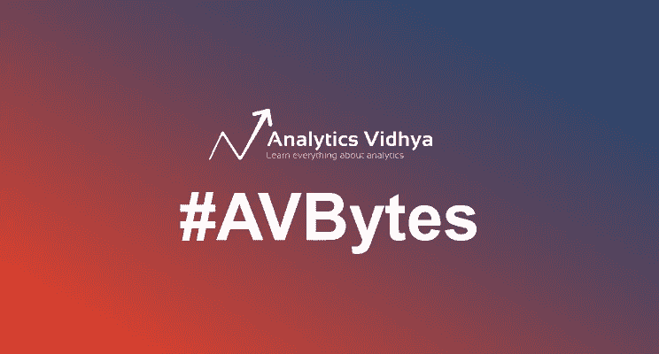
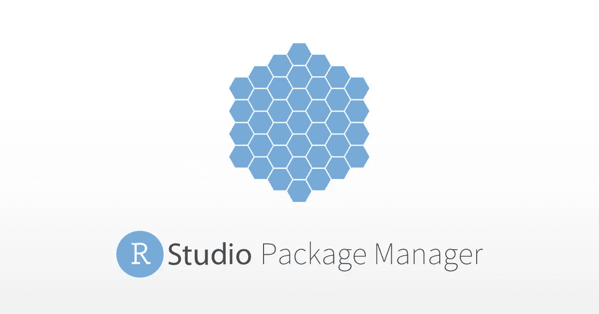
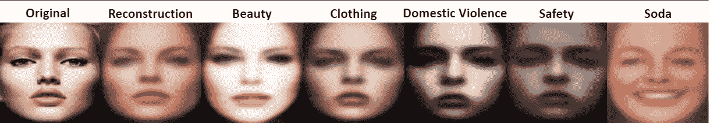

# Fast.ai v Google，自动化时间序列建模，RStudio 最新的改变游戏的发布，以及更多的机器学习资源！

> 原文：<https://medium.com/analytics-vidhya/automated-time-series-rstudio-release-avbytes-ml-ai-3e16d6364b58?source=collection_archive---------1----------------------->

r 在编程语言竞赛中有点落后，但随着 RStudio 的最新发布，即“包管理器”工具，它无疑提高了赌注。到目前为止，组织都以安全问题作为不采用 R 的理由，这个工具已经过时了。

**过去一周的亮点:** [RStudio 的包管理器](https://www.analyticsvidhya.com/blog/2018/08/do-not-miss-rstudios-game-changing-package-manager-tool/)，[自动化时间序列建模](https://www.analyticsvidhya.com/blog/2018/08/perform-automated-time-series-modeling-datarobots/)，[快了 50 倍的自动化欺诈检测系统](https://www.analyticsvidhya.com/blog/2018/08/feedzai-automl-a-ml-platform-for-fraud-prevention-thats-50-times-faster/)，下面还有更令人兴奋的开发！

最近市场上出现了相当多的自动化机器学习工具。 [**订阅此处**](https://feedburner.google.com/fb/a/mailverify?uri=Avbytes) 获取每日一剂 [**AVBytes**](https://www.analyticsvidhya.com/blog/category/avbytes/) 直达您的收件箱！

*   [**用 DataRobot 的最新工具**](https://www.analyticsvidhya.com/blog/2018/08/perform-automated-time-series-modeling-datarobots/) **:** 时间序列建模是数据科学中最复杂、最棘手的任务之一。那么自动化怎么样呢？这正是 DataRobot 的最新工具所做的！它自动化:1)特征工程，2)检测平稳性，3)检测季节性，4)转换目标变量，等等！

*   [**Fast.ai 的算法在一次流行的图像识别挑战中击败了谷歌的代码**](https://www.analyticsvidhya.com/blog/2018/08/fast-ais-algorithm-beat-googles-code-in-a-popular-image-recognition-challenge/) **:** 根据斯坦福大学的 DAWNBench 基准测试，由杰瑞米·霍华德领导的 Fast.ai 的一个小团队的表现超过了谷歌的机器学习代码。他们的模型花了 18 分钟训练，整个过程只花了 40 美元！你并不总是需要 TPU 才能在 AI 上取得成功！

*   [**Feedzai AutoML —反欺诈的 ML 平台，速度快 50 倍**](https://www.analyticsvidhya.com/blog/2018/08/feedzai-automl-a-ml-platform-for-fraud-prevention-thats-50-times-faster/)**:**feed zai AutoML 是一个自动化反欺诈的平台，速度比手动 ML 流程快 50 倍！它自动执行功能工程、模型训练和选择以及超参数优化等任务。关于里面平台的细节！

*   [**在广告中生成人脸的有趣的机器学习方法**](https://www.analyticsvidhya.com/blog/2018/08/machine-learning-approach-gans-generate-faces-advertisements/) **:** 在这项真正有趣的研究中，gan 被用来根据广告中的产品生成人脸！从美容产品到饮料，这种技术(在给定的研究论文中解释)可以相应地操纵和生成人脸。

*   [**想加快自己在 Python 中的建模过程？试试工作室。ML**](https://www.analyticsvidhya.com/blog/2018/08/want-to-speed-up-your-model-building-process-in-python-try-studio-ml/) :你有没有遇到过这样的情况，你想加速你的模型开发过程，并以很快的周转时间投入生产？试试 Studio ml 吧！这是一个 Python 框架，将大大加快你的机器学习过程。

*以上 AVBytes 发布于 2018 年 8 月 6 日至 12 日。*