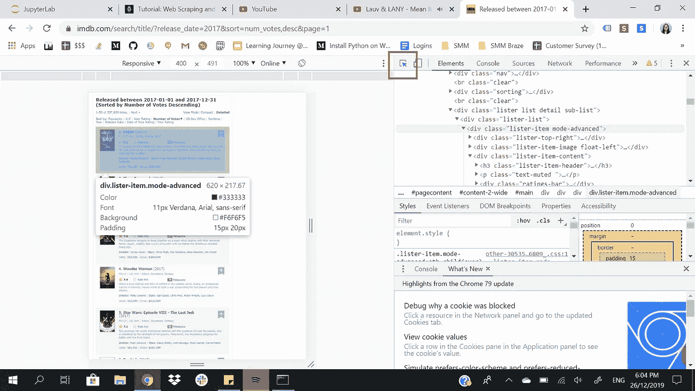
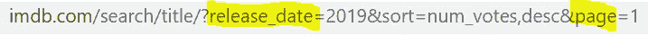

# 如何使用 BeautifulSoup for Dummies 自动抓取网页

> 原文：<https://medium.com/analytics-vidhya/automated-web-scraping-using-beautifulsoup-for-dummies-free-python-code-41925125774e?source=collection_archive---------5----------------------->

## 网络抓取，数据科学

简单的网页抓取教程

自己纠结了一下，决定给我这样的假人创建一个教程，用**Jupyter 笔记本里的完整 Python 代码。这里有 Jupyter 笔记本的粉丝吗？[👐](https://fsymbols.com/signs/hand/)**

本教程受到了 [Dataquest](https://www.dataquest.io/blog/web-scraping-beautifulsoup/) 的启发，我在其中加入了更多的解释、额外的提取和探索性数据分析(EDA)。

以下是您将通过本教程学到的内容:

1.  使用请求下载页面
2.  使用 BeautifulSoup 解析 HTML 内容
3.  理解 HTML 结构
4.  抓取数据
5.  更改 URL 的参数(自动化开始的地方)
6.  控制爬行速率
7.  当它还在运行时，监视循环
8.  将一切拼凑在一起(循环)[🎉](https://emojipedia.org/party-popper/)
9.  将抓取的数据转换成 CSV 格式

让我们的乐趣开始吧！

## 1.使用请求下载页面

要开始抓取网页，首先我们需要使用 Python `requests library`下载页面。请求库将向 web 服务器发出一个`GET`请求，它将为我们下载给定网页的 HTML 内容。我们可以使用请求发出几种不同类型的请求，GET 只是其中一种。


您可以通过运行下面的代码轻松安装该库

```
pip install requests 
```

## 2.使用 BeautifulSoup 解析 HTML 内容

为了解析我们的 HTML 文档并提取 50 个 div 容器，我们需要安装一个名为 BeautifulSoup 的 Python 模块:

```
pip install BeautifulSoup4
```

然后，我们将:

*   从包 bs4 中导入 BeautifulSoup 类创建者。
*   通过创建一个 BeautifulSoup 对象来解析`response.text`，并将该对象分配给`html_soup`。


## 3.理解 HTML 结构

在你为网络抓取大肆宣传之前，你需要了解你想要抓取的网站的 HTML。请注意，每个网站都有不同的结构。



将鼠标悬停在您想要的项目上，以获取其 HTML 代码

1.  右击网站
2.  左键点击`Inspect`
3.  打开左上方的悬停光标按钮。

每部电影都在一个带有类`lister-item-mode-advanced`的`div`标签中。让我们使用`find_all()`方法提取所有具有`lister-item mode-advanced`类属性的`div containers`:


如图所示，有 50 个容器，也就是说每页列出 50 部电影。


现在我们将只选择第一个容器，并依次提取每个感兴趣的项目:

*   电影的名字。
*   发行年份。
*   IMDB 评级。
*   Metascore。
*   董事
*   票数。
*   总的

让我们从`first_movie`开始吧


## 4.抓取数据

从我们存储的`first_movie` html 中，我们将使用`find`和`find_all`以及`str slicing`来施展魔法。

*   **电影的名字。**


*   **发布年份。**


*   **IMDB 评级**


*   **Metascore**


*   **董事**

这就更复杂了，因为这个类包含了**导演**和**明星**。所以我用切片和分割的方法只提取导演。你也可以用同样的逻辑来提取星星。


*   **票数**


*   **总收入**


## 5.更改 URL 的参数(自动化开始的地方)

随着网页的变化，URL 遵循一定的逻辑。当我们发出请求时，我们只需改变 URL 的两个参数的值:

*   `release_date`:创建一个名为 **years_url** 的列表，并用 2000-2017 年对应的字符串填充它。
*   `page`:创建一个名为 **pages** 的列表，用前 4 页对应的字符串填充。



## 6.控制爬行速率

我们需要两个函数:

1.  `sleep()`:控制循环速率。它将在指定的秒数内暂停循环的执行。
2.  `randint()`:为了模仿人类行为，我们将改变请求之间的等待时间。它在指定的时间间隔内随机生成整数。

## 7.当它还在运行时，监视循环

监控在测试和调试过程中非常有用，尤其是当您打算在一次代码运行中抓取数百或数千个网页时。以下是我们要监控的参数:

*   请求的频率(速度):确保我们的程序没有使服务器超载。

`Frequency value = the number of requests / the time elapsed since the first request.`

*   **请求数**:如果超出预期请求数，可以停止循环。
*   我们请求的**状态代码**:确保服务器发回正确的响应。

让我们先在小范围内试验一下这种监控技术。


## 8.拼凑一切(循环)[🎉](https://emojipedia.org/party-popper/)

唷~艰难的工作完成了，现在让我们把迄今为止所做的一切拼凑起来。

1.  **导入**必要的库
2.  **重新声明列表变量**，这样它们又变空了。
3.  准备循环。
4.  **在间隔 2010–2019 中循环遍历 years_url 列表**，在间隔 1–4 中循环遍历页面列表**。**
5.  使 **GET 请求**进入页面循环
6.  给 **headers** 参数一个正确的值，以确保我们只获得英文内容。
7.  在 8 到 15 秒的时间间隔内暂停循环。
8.  对非 200 状态码抛出**警告。**
9.  如果**请求数量大于预期数量**，则中断循环。
10.  将响应的 HTML 内容转换为 BeautifulSoup 对象。
11.  从这个 BeautifulSoup 对象中提取所有的电影容器。
12.  **循环通过**所有这些容器。
13.  如果容器有**元得分**，则提取数据。
14.  如果一个集装箱有**毛重**，则提取数据，否则追加("-")。

## 9.将抓取的数据转换成 CSV 格式

在下一个代码块中，我们:

*   将数据合并到熊猫数据框架中。
*   打印一些关于新创建的数据帧的信息。
*   显示最后 10 个条目。


数据集的峰值

最后但同样重要的是，将数据帧保存到 CSV，以便我们稍后进行数据辩论和 EDA:


## 免费访问所有运行代码

下面是获取 Python 代码的 GitHub [**链接**](https://github.com/shanyi1023/Data-Science/blob/master/IMDb%20Movie%20Ratings/BeautifulSoup%20tutorial%20-%20IMDb%20.ipynb) 。👉

下一篇:电影评分数据集的数据争论和 EDA

敬请期待！[😊](https://emojipedia.org/smiling-face-with-smiling-eyes/)