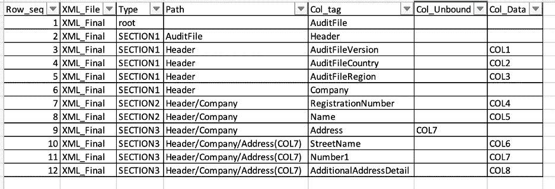
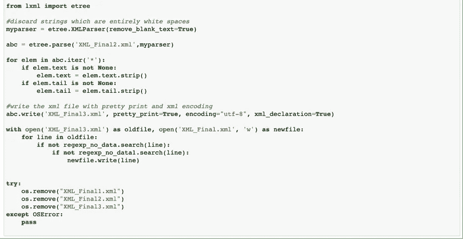

# 使用 Python 自动创建 XML 文件

> 原文：<https://medium.com/analytics-vidhya/automated-xml-file-creation-using-python-877c24feba66?source=collection_archive---------5----------------------->

> *作者* [***德巴斯***](/@itsdeb82)*&*[***普里扬卡·米什拉***](/@priyankamishra1)*—2020 年 9 月 28 日*

可扩展标记语言或 XML 是一种标记语言，就像 HTML 一样。它用于存储更少的数据，而不需要类似 SQL 的结构。它是万维网联盟推荐使用的开放标准。

Python 标准库有几个非常有助于处理 XML 文件的包。要使用它，你必须对 XML 文件有相当多的了解，对所需的 Python 包以及如何使用它们有广泛的了解。

研究如何使用各种软件包会消耗大量的时间和资源，并且还需要技术知识。

**解决方案**

在本文中，我们将介绍一个创建 XML 文件的端到端解决方案，只需很少的 Python 知识，使用源作为 Teradata(可以修改连接以从任何数据库获取)和一个配置文件(即 excel 文件)。

配置文件将提供详细信息，例如:

XML 的结构

绑定/未绑定节点/标签

用于数据提取的 SQL

让我们深入了解一下所使用的解决方案:

**配置文件**:这是一个 excel 文件，包含 2 个选项卡。文件的内容也可以放在一个表中，数据也可以从这个表中获取，但是出于我的研究目的，我将内容保存在一个 excel 中。

Tab1 包含需要执行的查询的详细信息，以便为文件中的标签提供数据。以下是选项卡中的列:

1.Type —这是行的唯一标识符，在包含标记详细信息的 Tab2 中再次引用。

2.Sql —这包含为 XML 提取数据所需执行的 Sql。

表 1 的快照

表 2 包含 XML 的详细结构和以下各列:

1.row _ seq——顾名思义，这就是行的顺序或次序。这对建议标签的顺序很重要。

2.XML_File —这是可选的，simple 表示输出文件的名称。如果 excel 需要维护多个 XML 的数据。

3.类型—此列是指表 1 中的类型列。这将使用 Tab1 中的 query 提取的数据映射到 Tab2 中的标记名

4.路径—这是节点的路径。它提供了每个节点的排列结构。在父节点被定义为 unbounded 的情况下，所有子节点都应该有路径，无界列的唯一标识符在括号中，就在无界字段之后。

5.col _ tag——以 XML 的形式给出列的节点名

6.Col_Unbound —这是一个可空字段，表示该结构是否需要重复。即特定节点是否可以有多个值。只需要为父节点提及这一点，而不需要为子节点下的每个子节点提及这一点。

7.Col_Data —这将使用所执行的查询中的确切列来映射节点。

选项卡 2 的快照

**代码**:

工艺流程

*摘录*

*映射*

提取 XML 结构

用于 XML 创建的函数

主代码和函数调用

*格式化*

**最终文件**

**总结**

上述解决方案用于自动创建符合法规要求的 XML 文件，例如 SAF-T(标准税务审计文件)。XML 文件结构已经被经济合作与发展组织标准化了。

该代码被开发成通用的，即使是对 Python 了解很少的非技术用户也可以使用。