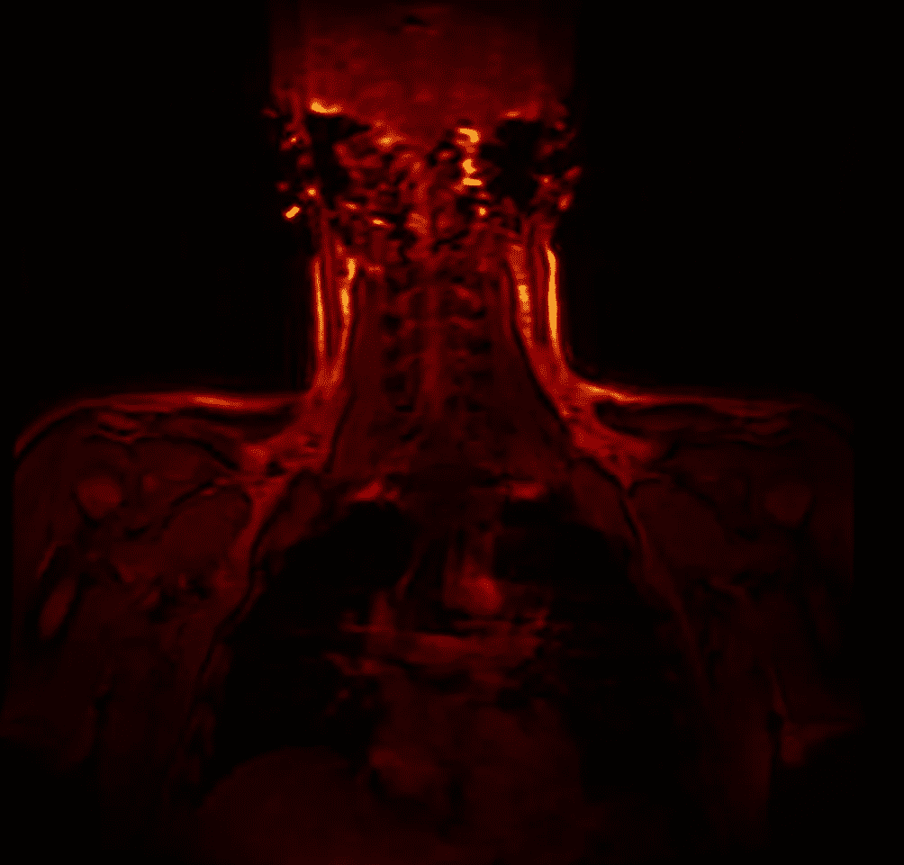
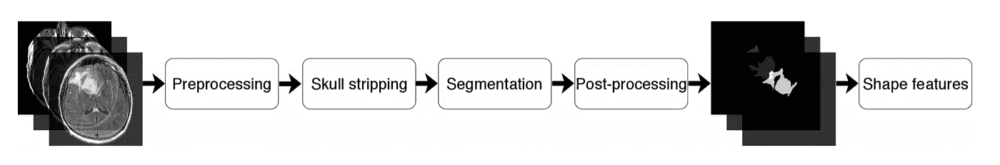
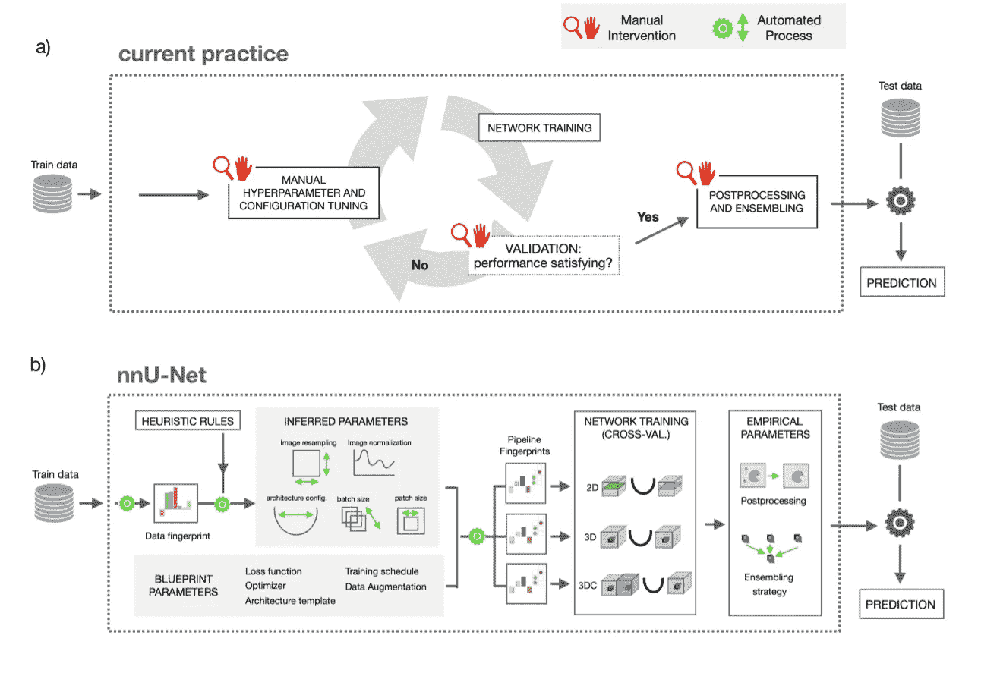

# 自动深度学习框架:设计和含义(生物医学分割)

> 原文：<https://medium.com/analytics-vidhya/automatic-deep-learning-frameworks-design-and-implications-biomedical-segmentation-34cdf07fd65a?source=collection_archive---------15----------------------->

怪异的核磁共振扫描

医学图像的分割可能是深度学习在生物医学领域最广泛的应用。然而，深度学习框架(即 nnU-Net)的最新进展可能会导致分割问题中对专门的深度学习方法的需求减少。这并不是说深度学习方法在细分任务中将变得不那么有用，而是说在没有深度学习专家监督的情况下，使用深度学习将变得更容易应用。

nnU-Net 是一个用于生物医学分割问题的开箱即用的深度学习框架，具有自动化深度学习从业者的潜力。它通过利用启发式规则来实现这一点，启发式规则自动调整框架的参数以适应特定的数据集。不需要额外的培训，也不需要任何手动调整过程。更重要的是，nnU-Net 经常可以输出超过最先进性能的结果。

但是在我们进入关于 nnU-Net 的细节之前，我想定义医学图像分割任务的问题及其意义。

# 分段任务

生物医学分割是指标记医学图像中感兴趣的特定对象的任务，它可用于人口分析、诊断疾病和计划治疗。在深度学习之前，这涉及到手动指示图像中的每个像素，这是一项艰巨的任务，通常只能由专业的放射科医生和神经科学家才能令人满意地完成。深度学习分割模型使这一过程自动化，但每个模型只能应用于特定的任务，如标记大脑中的神经胶质瘤肿瘤。

在[神经胶质瘤肿瘤](https://www.mayoclinic.org/diseases-conditions/glioma/symptoms-causes/syc-20350251#:~:text=Malignant%20glioma%20cells,-Glioblastoma%20multiforme%20(malignant&text=Glioma%20is%20a%20type%20of,glial%20cells%20can%20produce%20tumors.)的例子中，医学成像也可以用于对肿瘤的严重程度进行分类，因为肿瘤的结构不规则性与其侵袭性之间存在联系。此外，医学成像是非侵入性的，并且在手术前可用，从而为下一步治疗提供指导。

从医学成像到导出形状特征的过程。[【1】](https://arxiv.org/pdf/1906.03720.pdf)

然而，从医学成像中提取基因组特征的关键步骤是分割 MRI。因此，在颅骨剥离(MRI 图像的预处理步骤)以及其他预处理步骤之后，医学图像必须被转换成分割图像。这就是深度学习模型被证明是有用的地方，因为它们使这种费力的手动分割任务变得快速而廉价。此外，在两个人类专家之间的分割之间存在差异，但是深度学习模型的预测是确定性的(在给定一些输入的情况下只有一个输出)，因此使得该过程不受读者之间的可变性的影响。

除了在成本和时间方面使用深度学习算法的纯粹实用性之外，这些模型目前在分割任务方面也与人类专家不相上下。根据 dice 相似性系数，一种测量两个样本之间相似性的度量，在分割神经胶质肿瘤中，两个人类专家之间的分割以及人类专家和深度学习模型之间的分割都大致为 82-85%左右的 dice 相似性。

然而，深度学习实践者可能不总是能够在每个生物医学细分领域应用专门的模型。为了解决这个问题，nnU-Net 允许领域专家部署一个自动的、开箱即用的深度学习模型。

# nnU-Net(“无新网络”)

nnU-net 是一个通用框架，它利用标准的 U-net 体系结构，通过启发式规则使所有形式的手动超参数调整自动化，允许对不同的任务使用现成的分段算法。这听起来可能是一个坏主意，但在提交给 49 个具有一系列生物医学分割任务的比赛后，nnU-Net 在其中 29 个比赛中创造了最先进的技术，并在其他比赛中表现强劲。

这些结果是非凡的:一个通用框架如何能最好地处理这么多专门的、手动调整的深度学习模型？答案在于这样一个前提，即良好的超参数调优的重要性使任何专门的架构考虑的效果都相形见绌。

nnU-Net 的作者在分析 KiTS 等大规模深度学习竞赛的结果时发现了这个前提。获胜的提交物的架构碰巧与散布在排行榜上的提交物的架构相似，这表明架构修改不是获胜的必要条件。相比之下，获胜的提交文件与类似架构的低性能提交文件相比，具有非常不同的超参数配置。nnU-Net 的作者得出结论，专用模型架构不一定优于具有良好调整的超参数的基线方法，这说明了良好调整但架构简单的模型(如 nnU-Net)作为专用架构的替代品的合理性。

## 了解 nnU-Net(面向技术读者)

那么 nnU-Net 实际上是如何工作的呢？构建实际上是一个优化问题，它将管道的参数与特定的数据集相匹配。换言之，nnU-Net:

*   对包含*数据指纹*(数据集的特征，如图像尺寸/体素间距比)和*管道指纹*(模型中的关键设计选择)的管道优化问题进行建模。
*   使用自动启发式规则从该数据指纹生成良好的管道指纹。

重点介绍 nnU-Net 的当前实践和设计。[【2】](https://arxiv.org/pdf/1904.08128v2.pdf)

如上所示，nnU-Net 的设计包含三个组件:

*   蓝图参数:基本的设计选择，例如作为普通 U-net 的模型架构(不依赖于数据)
*   推断参数:通过启发式规则对数据集特征(如批量大小)进行的精确调整，产生管道指纹(取决于数据)
*   经验参数:基于管道指纹的最佳性能配置或集合(取决于三个潜在模型的交叉验证结果)

这些组件按以下顺序相互作用:

*   推断出的参数由训练集的特征来确定，该训练集具有启发式经验规则，以找到好的超参数调整。
*   推断的参数与预定的蓝图参数相结合以形成管线指纹。
*   三个模型——2D U 网、3D U 网和对下采样图像进行操作的 3D U 网级联——被映射到管道指纹，并且每个模型执行交叉验证。
*   经验参数选择这些模型中性能最好的来使用，或者利用集合来确定最终框架。

然后框架就完成了，可以输入测试数据了。请注意，该管道没有经过任何额外的训练:训练集仅用于通过启发式规则来确定管道配置。这是因为每个模型都已经在 10 个不同的分割训练集上进行了训练，从而允许其通用用途。这使得医疗专业人员可以在没有实时深度学习专家帮助的情况下使用开箱即用的深度学习框架。

# 通用框架的影响

普遍应用的自动深度学习框架 nnU-Net 的成功说明了开发过度专业化架构的方法的贫乏。nnU-Net 的作者断言许多这样的模型过于专业化:截至 2019 年年中，12，000 项研究引用了 U-Net，其中许多研究提出了扩展，但许多这样的模型被 nnU-Net 取代，nnU-Net 是一种使用普通 U-Net 架构的框架。

然而，如果不指明它的局限性，就不能说明这种通用模型的威力。用骰子相似性系数训练 nnU-net，使用其他度量的分割任务可能需要不同的通用框架。这是因为 nnU-Net 在未经训练的情况下可能表现不佳。例如，在一次细分竞争中，一个高度领域特定的目标指标导致 nnU-Net 排名 6/39，这是一个有竞争力但不令人满意的结果。

因此，至关重要的是，不要把 nnU-Net 视为最终产品，而是一个起点，标志着利用类似启发式系统的大量自动化通用框架的开始，每个框架都适合自己的度量和任务。这种通用的开箱即用的框架为领域专家提供了实现最先进的深度学习技术的机会，而无需繁琐而费力的超参数优化过程。

## 结论

nnU-Net 的发展表明了生物医学领域的一种范式转变，其中更大的关注点集中在通用模型上，因为它们在各种任务中的实用性和易用性。将专用架构用于每个特定分割任务的现有方法被证明通常不如利用适用于特定分割任务的通用框架有效。

nnU-Net 代表了在给定特定任务的情况下寻找最佳深度学习算法的过程中的自动化，因为它适应训练集的特征。nnU-Net 是一个框架，用于确定特定任务的最佳深度学习模型，或者换句话说，是一种找到最佳算法的算法。这种方法通过放弃过度专业化的架构和手动超参数调整过程，在深度学习模型的使用中实现了更大的灵活性。

## 致谢:

1.  [神经胶质瘤的基因组亚型分析](https://arxiv.org/pdf/1906.03720v1.pdf)
2.  [nnU-Net](https://arxiv.org/pdf/1904.08128v2.pdf)

*   [“你心里有什么？”](https://www.flickr.com/photos/24101775@N07/5054932125)by[aяmen](https://www.flickr.com/photos/24101775@N07)被 [CC BY 2.0](https://creativecommons.org/licenses/by/2.0/?ref=ccsearch&atype=rich) 授权(标题图片)