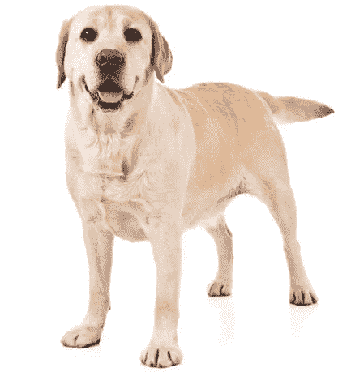
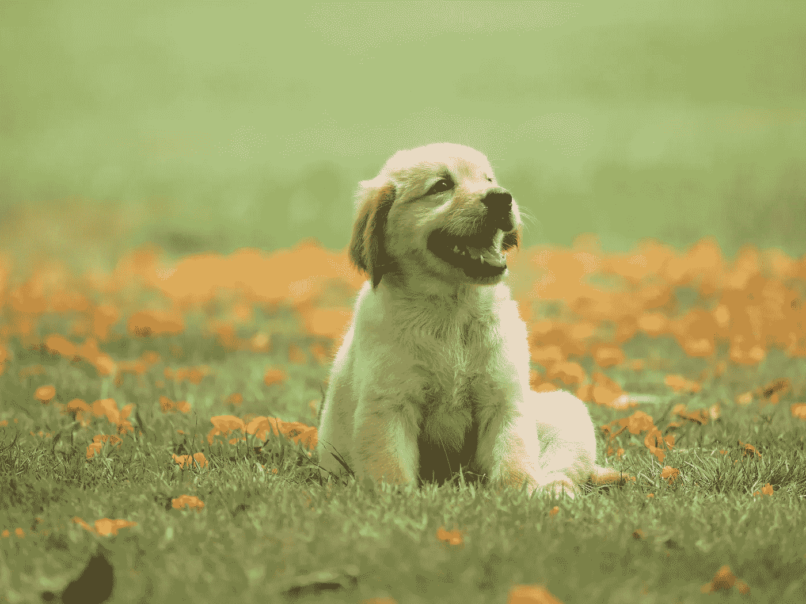
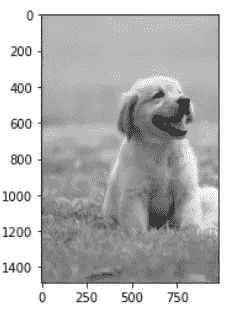

# 使用局部特征的自动图像裁剪

> 原文：<https://medium.com/analytics-vidhya/automatic-image-cropping-using-local-features-5280ac45df7a?source=collection_archive---------7----------------------->

在进行计算机视觉项目的培训之前，图像裁剪是一项具有挑战性的工作。在将图像数据用于 CNN 模型或其他计算机视觉材料之前，我们需要知道如何最好地准备图像数据。

我们可以自己根据感兴趣的区域裁剪图像。但是这要花很多时间，而且我讨厌那种工作。

我发现了另一种方法，如何使用局部特征(如 SIFT，SURF，ORB 等)自动裁剪图像。).在我看来，这种方法对于裁剪图像是非常有效的。

OpenCV

> 在这个例子中，我将使用 OpenCV 版本 3.4.2，因为我将使用 SIFT 算法。

首先，我有一个裁剪标准的狗图像。正如你在下面的图片上看到的，它有一个白色的背景，所以在那个图片上能找到的关键点都集中在主要的物体上。

*来源:*[*https://S3 . amazonaws . com/cdn-origin-ETR . AKC . org/WP-content/uploads/2019/12/03202400/Yellow-Labrador-retriever . jpg*](https://s3.amazonaws.com/cdn-origin-etr.akc.org/wp-content/uploads/2019/12/03202400/Yellow-Labrador-Retriever.jpg)

之后，我有第二个图像将被裁剪。

来源:[https://hips . hearstapps . com/HMG-prod . S3 . Amazon AWS . com/images/dog-puppy-on-garden-royalty-free-image-1586966191 . jpg](https://hips.hearstapps.com/hmg-prod.s3.amazonaws.com/images/dog-puppy-on-garden-royalty-free-image-1586966191.jpg)

在上面的代码中，我们加载图像，然后应用 SIFT 算法找到每张图像的关键点和描述符

在提取出每幅图像的所有特征后，根据裁剪标准找到目标图像的匹配特征，在匹配关键点上基于像素进行裁剪。

结果会是这样的:

裁剪图像

最后，我们使用局部特征(SIFT)成功地裁剪了图像。我们可以通过改变局部特征提取算法或描述符匹配算法来改进这种方法。

也许这种方法不是最好的方法，但我认为我们可以看看这种方法。

希望你喜欢它！！谢谢你

 [## 特征匹配- OpenCV-Python 教程 1 文档

### 在这一章中，我们将看到如何将一幅图像中的特征与其他图像进行匹配。我们将使用蛮力匹配器和…

opencv-python-tutro als . readthedocs . io](https://opencv-python-tutroals.readthedocs.io/en/latest/py_tutorials/py_feature2d/py_matcher/py_matcher.html)  [## OpenCV

### 开放计算机视觉库

opencv.org](https://opencv.org/)