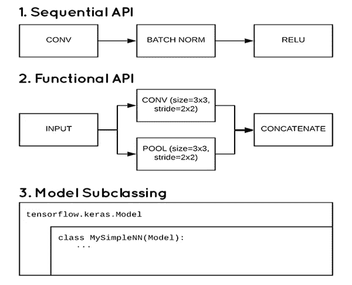
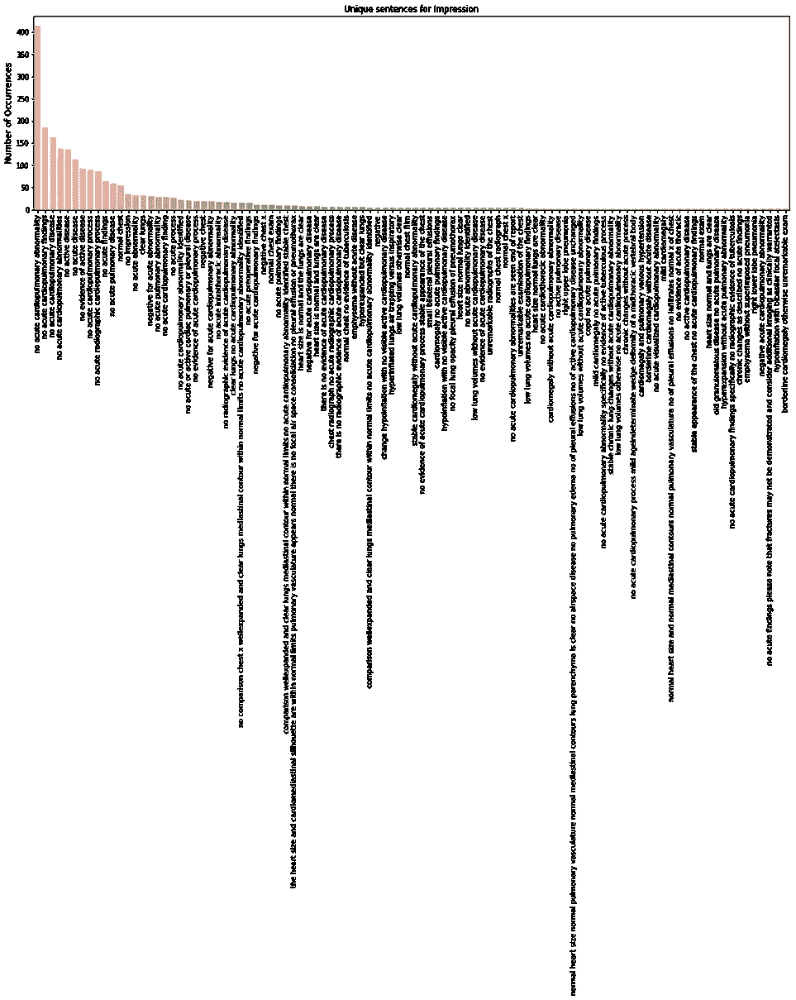

# 从医学成像报告中自动生成印象

> 原文：<https://medium.com/analytics-vidhya/automatic-impression-generation-from-medical-imaging-report-3077d1d77d20?source=collection_archive---------12----------------------->

## 从医疗报告生成文本描述的过程——端到端深度学习模型

[来源](https://www.boldbusiness.com/health/artificial-intelligence-radiology-evolving/)

# 目录

1.  商业问题
2.  数据集简介
3.  先决条件
4.  现有研究论文/解决方案
5.  我的方法—解决方案
6.  XML 解析创建数据点
7.  数据预处理
8.  探索性数据分析
9.  数据点构造
10.  训练测试和验证分离
11.  标记化和数据集准备
12.  基本模型[CNN]
13.  主模式[CNN-BiLSTM]
14.  结论
15.  误差分析
16.  未来的工作
17.  参考

# 1.商业问题

这里的问题陈述是从给定的胸部 x 光图像中找到印象。这些图像是胸部的两种类型的正面和侧面视图。使用这两种类型的图像作为输入，我们需要找到给定 X 射线的印象。

为了解决这个问题陈述，我们将建立一个预测模型，该模型涉及图像和文本处理，以建立一个深度学习模型。自动描述给定图像的内容是最近连接计算机视觉和自然语言处理的人工智能模型之一。

# 2.数据集简介

**印第安纳大学 Open-i 胸部 x 光片采集**

该数据集是来自印第安纳大学医院网络的大约 7，470 张胸部 x 射线和 3，955 份胸部 x 射线图像的放射学报告。—图像以 png 格式下载—报告以 xml 格式下载。

每个 xml 都是相应患者的报告。为了识别与报告相关联的图像，我们需要检查 id 中的 xml tag <parentimages id="”image-id”">id 属性，我们有对应于 png 图像的图像名称。一个报告或 xml 可以关联多个图像。</parentimages>

原始数据来源:[https://openi.nlm.nih.gov/](https://openi.nlm.nih.gov/)

其他资源:[https://www . ka ggle . com/rad Dar/chest-x rays-Indiana-university](https://www.kaggle.com/raddar/chest-xrays-indiana-university)

**样本数据点:**

openi nlm 数据点示例

# 3.先决条件

在我们深入研究这项工作之前，我假设您熟悉以下深度学习概念和 python 库。

卷积神经网络，递归神经网络，LSTM，转移学习，激活函数，优化技术，如 SGD，Adam。损失函数如分类交叉熵、稀疏分类交叉熵。最后，TensorBoard 用于性能可视化和调试

Python，tensorflow，Keras，tokenizer，Pandas，numpy，Matplotlib。理解顺序 Api、函数 Api 和模型子类 keras 模型实现的概念。我选择子类模型的原因是，它是**完全可定制的**，并且使你能够**实现你自己定制的模型的前向传递**。此外，我们可以控制网络和培训过程的每一个细节。

[来源](https://www.pyimagesearch.com/2019/10/28/3-ways-to-create-a-keras-model-with-tensorflow-2-0-sequential-functional-and-model-subclassing/)

下面我已经提到了开始导入博客和教程。

1.[https://www . tensor flow . org/tutorials/text/NMT _ with _ attention](https://www.tensorflow.org/tutorials/text/nmt_with_attention)—tensor flow 教程

2.[https://www.tensorflow.org/tutorials/text/image_captioning](https://www.tensorflow.org/tutorials/text/image_captioning)—张量流教程

3.[https://becoming human . ai/Transfer-Learning-re training-inception-v3-for-custom-image-class ification-2820 f 653 c 557](https://becominghuman.ai/transfer-learning-retraining-inception-v3-for-custom-image-classification-2820f653c557)—转学教程

4.[https://towards data science . com/a-simple-guide-to-the-versions-of-the-inception-network-7fc 52 b 863202](https://towardsdatascience.com/a-simple-guide-to-the-versions-of-the-inception-network-7fc52b863202)—inception v3 模型教程

5.[https://www . pyimagesearch . com/2017/03/20/ImageNet-vggnet-resnet-inception-xception-keras/](https://www.pyimagesearch.com/2017/03/20/imagenet-vggnet-resnet-inception-xception-keras/)—为什么是 ImageNet —为什么是 InceptionV3

6.[https://www . pyimagesearch . com/2019/10/28/3-ways-to-create-a-keras-model-with-tensor flow-2-0-sequential-functional-and-model-subclass 化/](https://www.pyimagesearch.com/2019/10/28/3-ways-to-create-a-keras-model-with-tensorflow-2-0-sequential-functional-and-model-subclassing/) — 3 种 Keras 模型实现方式

7.[https://www.tensorflow.org/tensorboard/get_started](https://www.tensorflow.org/tensorboard/get_started)—冲浪板教程

# 4.现有研究论文/解决方案

这项工作的灵感来自以下研究和博客:

[展示、参与和讲述:具有视觉注意力的神经图像字幕生成](https://arxiv.org/abs/1502.03044)

在提到的论文中，他们使用了具有注意机制的编码器和解码器模型。在编码器部分，他们使用 CNN 从图像中提取特征。在解码器中，他们使用长短期记忆(LSTM)网络，该网络根据上下文向量、先前的隐藏状态和先前生成的单词，通过在每个时间步长生成一个单词来产生字幕。他们使用 BLEU 评分来衡量模型的性能。

我引用的其他博客很少。

1.[https://towards data science . com/image-captioning-in-deep-learning-9cd 23 FB 4d 8d 2](https://towardsdatascience.com/image-captioning-in-deep-learning-9cd23fb4d8d2)

2.[https://www . analyticsvidhya . com/blog/2018/04/solving-an-image-captioning-task-using-deep-learning/](https://www.analyticsvidhya.com/blog/2018/04/solving-an-image-captioning-task-using-deep-learning/)

# 5.我的方法—解决方案

最初，我将使用 EDA 进行探索性数据分析第一部分，包括图像输入和文本输出。我可以发现数据不平衡、每个患者的图像可用性、每个患者的相关图像类型。在 EDA 之后，我将使用两种不同的方法来实现深度学习模型，以找到彼此的改进之处。

## 1.基本模型:

一个简单的编码器和解码器架构。在编码器部分，它将具有 CNN 单个全连接层，以从预训练的 InceptionV3 模型中获取图像的特征向量。解码器部分将有 LSTM 层，它需要两个输入，一个是图像特征向量和每个时间步的文本到单词的序列。

## 2.主型号:

我将使用编码器-解码器架构来生成来自胸部 x 光的印象。编码器将输出图像特征向量。然后将特征向量传递给具有注意机制的解码器，这将为图像内容生成下一个单词。使用与基本模型相同的模型方法，我将创建一个新的架构，使用研究论文[基于注意力的双向长短期记忆网络进行关系分类](https://www.aclweb.org/anthology/P16-2034.pdf)

作为第一步，我将使用 InceptionV3 模型对该数据集进行图像分类[https://www . ka ggle . com/yash 612/covid net-mini-and-gan-generated-chest-Xray](https://www.kaggle.com/yash612/covidnet-mini-and-gan-enerated-chest-xray)。利用该分类模型，我将保存该训练的权重，并通过将保存的权重加载到 InceptionV3 来在编码器特征提取中使用该权重。

## **编码器:**

编码器是一个单一的全连接线性模型。输入图像被提供给 InceptionV3 以提取特征。这两个图像的提取特征被相加并输入到 FC 层以获得输出向量。编码器的最后一个隐藏状态连接到解码器。

## **解码器:**

解码器是一个具有双向 LSTM 层的解码器，它在单词级别进行语言建模。第一次步骤接收来自编码器的编码输出和<start>向量。该输入传递到具有注意机制的两级双向 LSTM 层。输出向量是两个向量，一个是预测标签，另一个是解码器的先前隐藏状态，这在每个时间步长再次反馈给解码器。详细的架构在下面提到。</start>

高级模型架构

# 6.XML 解析创建数据点

在这一节中，我们将看到如何将原始 xml 数据解析和结构化为数据点，然后将数据点存储在 csv 文件中以满足未来的模型需求。

**原始 XML 树视图:**

我们将从 xml 文件中提取抽象节点和 ParentImage 节点。在这我们有印象和图像文件名如下。

**印象等级:**

我们将检索抽象文本值

**图像文件名:**

id 属性中可用的图像文件名。我们可以忽略其他细节，因为这些数据与我们的报告无关。正如我们所看到的，有两个 parentImage 节点，我们为这个报告准备了两个图像。

XML 解析器代码来检索上面提到的细节。

xml 解析

提取后，我们有 3955 行，数据帧视图中的数据，

解析的数据

# 7.数据预处理

在这个阶段，文本数据被预处理以去除不想要的标签、文本、标点和数字。我们还将检查空单元格或 NaN 值。

*   如果图像名称列中有任何空单元格，我们将删除这些单元格。
*   如果文本数据中有任何空值或 NaN 值，我们将用“No <column name="">”(例如:No Impression)替换它</column>
*   计算每个文本列的字数，并将其添加到 dataframe 列。

在数据预处理之后，缺失值处理下面是 dataframe 视图，我们在最终数据点中总共有 3851 行。

*   唯一图像总数 3851
*   唯一标题 402 的总数
*   唯一比较总数 281
*   独特标志总数 2098
*   独特调查结果总数 2545
*   唯一印象总数 1692

# 8.探索性数据分析

在本节中，我们将看到通过总结和可视化数据集的主要特征来分析数据集的不同方法。

## 8.1 文本数据上的 EDA

在文本分析中，我们将采用印象列目标变量。通过下面的可视化，我们可以看到出现频率最高的 100 个句子。

**印象的句子出现次数**

印象的句子出现

*   从上面的可视化我们可以看到，“没有急性心肺异常”发生了近 600 次。
*   大多数较长的句子出现的次数少于 10 次

**印象词出现次数**

我们将使用印象栏的单词云来查看单词智能出现

词云

*   上面的词云是在前 1000 个最大出现词上生成的。
*   急性、心肺、异常、疾病、胸膜、积液、活动性这些是上面可视化中突出显示的词。

**字数分布**

让我们看看 impression 列中的字数分布，因为我们已经计算了 impression_count 列中的字数，我们看到的分布如下所示。

*最小字数为 1 —最大字数为 122 —平均字数为 5.0*

*   我们可以从这个分布中看出最大和最小字数。
*   最大出现次数通常为 5
*   大多数情况下，字数在 5 到 10 之间。

## 8.2 图像数据的 EDA

让我们分析每个数据点或报告呈现的总图像。

*最小图像数为 1 —最大图像数为 5 —中值图像数为 2.0*

*   每条记录最常见的图像数是 2。
*   其次是单一图像。
*   我们每张唱片也有 5 张图片。

**显示随机 25 个病人的 x 光片**

正如我们所看到的，这些图像是正面和侧面的。并且每个患者具有与其相关联的一个或多于两个图像。让我们看看一些随机数据点的图像。

**样本数据点**

## 8.3 EDA 结果

*   来自 xml 文件的所有原始文本被解析并创建数据集。
*   每个病人都有多张 x 光片。
*   主要发现是图像是如何按顺序排列的，或者图像的数量与每个记录有关。
*   我们每次记录主要有 2 张正面和侧面的图像。此外，我们有 1、3、4、5 张图像与每条记录相关联。
*   没有丢失文件。我们总共有 3955 条记录和 3 个额外的特征(比较、指示和发现)，我们不会在这个模型和 1 个印象目标变量中使用。
*   出现最多的词:印象-急性心肺
*   图像有不同的形状。
*   所有的 x 光图像都是人体上半身，尤其是胸部。
*   在文本特征中有一些未知的值，如 XXXX XXXXX，它们被替换为空字符串。

## 8.4 数据冲突

只有正面和侧面两种图像类型，但是我们为每个数据点关联了 1、3、4 和 5 个图像。我们在这里遇到了一个冲突，如何为我们建立的模型提供数据点。由于这种冲突，我们需要想出一个办法来处理如何将数据输入到模型中。在构建我们的模型之前，我们看到一些数据点结构化方法可以帮助我们处理这种情况。

# 9.数据点构造

因为我们有多于 2 个图像或者在某些情况下少于 2 个图像与每个数据点相关联。如果我们没有图像，我们就丢弃那些数据点。

让我们处理有 1，3，4，5 个图像的数据点。以下是图像集数量的数据点计数。

具有两个图像的数据点是 3208

具有 1 个图像的数据点是 446

具有 3 个图像的数据点是 181

具有 4 个图像的数据点是 15

具有 1 个图像的数据点是 1

总数据点是 3851 个数据点

方法，

将数据点限制为每个数据点 2 个图像，如果我们有 5 个图像，则它是 4+1(所有图像+最后一个图像),因此使它成为 4 个数据点，如下所示。

如果剩下的图像是正面的，那么最后一张图像应该是侧面的。

**如果我有 5 个图像，这里第 5 个图像是侧面其他或正面，**

第一张图像+第五张图像= >正面+侧面

第二张图像+第五张图像= >正面+侧面

第三幅图像+第五幅图像= >正面+侧面

第四幅图像+第五幅图像= >正面+侧面

从单个数据点增加到 4 个数据点

同样，对于其他数据点，

**如果我有 4 个图像，那么，**

第一(正面)+第四(侧面)

第二(正面)+第四(侧面)

第三(正面)+第四(侧面)

从 1 个数据点增加到 3 个数据点

**如果我有 3 个图像，那么，**

第一(正面)+第三(侧面)

第二(正面)+第三(侧面)

从单个数据点增加到 2 个数据点

**如果我们只有一个图像，那么**

第一张图像(正面或侧面)+复制第一张图像

相同的数据点计数。我们需要确保这个重复的数据点应该在训练测试和验证集中平均分配。如果我们没有侧面图像，那么保持正面作为最后的图像数据点。

因此，使用这种数据构造方法，我们还可以增加数据点，并得到精细的输入数据点。用于上述数据结构的代码。

构建完数据点后，我们将把<start>和<end>标记添加到文本数据中。</end></start>

最终数据点，

# 10.训练测试和验证分离

我们有一个单独的数据，一个没有重复的数据点，另一个有重复的数据点。我们需要拆分数据点，因为重复的数据点在所有三个拆分中是同等可用的。

在获取两个不同的数据集后，我们需要同等地连接数据集。

我们得到如上的最终数据点形状。

# 11.标记化和数据集准备

## 11.1.标记化

我们不能向我们的深度学习模型输入原始文本。文本数据需要编码为数字，然后在机器学习和深度学习模型中使用。Keras 深度学习库提供了一些基本的工具来执行这个操作。

总词汇量(vocab_size)为 1339，输出句子的最大长度为 60。

## 11.2.数据集准备

对于数据集准备，我们将使用迁移学习方法进行图像到特征向量的转换和文本数据标记化。

关于我为什么选择《盗梦空间》模型而非其他模型，请参考这篇博客[https://www . pyimagesearch . com/2017/03/20/imagenet-vggnet-resnet-inception-xception-keras/](https://www.pyimagesearch.com/2017/03/20/imagenet-vggnet-resnet-inception-xception-keras/)

我将使用在 ImageNet 数据集上训练的 InceptionV3 模型。最初，我将使用下面提到的数据集做一个 x 光分类任务。[https://www . ka ggle . com/yash 612/covid net-mini-and-gan-generated-chest-Xray](https://www.kaggle.com/yash612/covidnet-mini-and-gan-enerated-chest-xray)。这是一个三级分类任务，我们需要对患者的 x 光片进行分类，看它是属于这三级电晕、正常还是肺炎。

分类完成后，我将保存已训练模型的权重，并使用移除了顶层形状(1，2048)的模型作为我们模型的特征向量，并准备数据集。

下面是这个分类任务的模型架构。

迁移学习

分类任务的准确度图。

准确度图

模型权重保存为 hdf5 文件，以备将来使用。

我已经使用图像净权重和无图像净权重训练了该模型，其中图像净权重在该分类中表现良好。

有了训练好的权重，我将像下面这样为我们的图像数据提取特征。

装载重量

我将为所有可用的图像创建一个图像张量，如下图所示。

创建图像张量

这些图像张量用于 TensorFlow 数据集准备，基本上我在这里做一个缓存机制，以备将来使用。

**使用 tf.data 创建张量流**

关于 TF . data:[https://www.tensorflow.org/guide/data](https://www.tensorflow.org/guide/data)的进一步阅读，请参考链接

需要阅读的教程:[https://adventuresinmachinehlearning . com/tensor flow-dataset-tutorial/](https://adventuresinmachinelearning.com/tensorflow-dataset-tutorial/)

现在我们有了图像张量和文本向量，我们可以构建 tf.data 数据集

tf .数据创建

Multi_image()函数将形状的双输入张量(1，2048)和(1，2048)转换为(2，1，2048)。提到了 Batch_size、嵌入维数和单元大小，这些是我们可以根据我们的模型进行调整的超参数。

因此，我们已经为我们的模型工作完成了特征提取和标记化，并且我们有了 tf.data 数据集，现在让我们构建所需的模型。

# 12.基本模型

## 12.1.模型架构

正如我已经解释过的子类模型。我将直接跳到模型架构中。

我已经构建了用于检查模型架构的功能 Api 模型

基本模型架构

## 编码器架构:

具有单个全连接层线性输出。在我们传递到 FC 层之前，我们将两个图像张量相加并传递到 FC 层。该层输出(批量大小，1，嵌入尺寸)的形状

编码器

## 解码器架构:

在这一部分中，我们有一个嵌入层 LSTM 层和输出形状的密集层

LSTM 层是长短期记忆网络——通常简称为“lstm”——是一种特殊的 RNN，能够学习长期依赖关系。

要了解更多关于 LSTM 的信息，请点击此链接:[了解 LSTM 网络](http://colah.github.io/posts/2015-08-Understanding-LSTMs/)

解码器

## 12.2 模型度量和优化器初始化

## 12.3 模型培训

对于培训阶段，我们使用教师强制。教师强制是一种训练递归神经网络的策略，它使用前一时间步的模型输出作为输入。

在训练中，可以使用“序列开始”标记来开始该过程，并且在输出序列中生成的单词被用作后续时间步骤的输入，可能与图像或源文本等其他输入一起使用。

这个相同的递归输出-输入过程被使用，直到模型收敛到更好的结果。下面我已经提到了出处。

关于教师强迫的进一步阅读:链接到[教师强迫](https://machinelearningmastery.com/teacher-forcing-for-recurrent-neural-networks/)

训练步骤

## 12.4.在 TensorBoard 中可视化模型性能

我们已经使用`[tf.summary](https://www.tensorflow.org/api_docs/python/tf/summary)`记录了损失和精确度

准确(性)

失败

## 12.5.模型评估

在评估或测试阶段，我使用了基于 argmax 搜索的教师强制查找输出句子。在时间步骤 t 中，我们使用<start>令牌生成一个字，预测的字再次反馈到下一个步骤，并在时间 t+1 成为解码器的输入。下面提到了 argmax 搜索的代码。</start>

评估阶段

**样本输出如下图所示**

让我们先试一个长一点的句子

在较长的句子中预测是不完美的，让我们看看较短的句子。

即使在短句模式中表现不佳。

## 12.6.基本模型结论

*   这个模型是建立在一个简单的 LSTM 编码器和解码器上的。
*   得到不完美或不最坏的预测
*   验证的准确性并没有提高很多，但损失是趋同的
*   我们甚至可以对这个模型进行微调，使其表现良好。

我们将看到一个更好的性能和修改的架构，具有双向 LSTM 层和附加注意机制。

# 13.主模型

## 13.1 模型架构

这个模型架构是使用我看到的一篇研究论文[重新实现的，基于注意力的双向长短期记忆网络用于关系分类](https://www.aclweb.org/anthology/P16-2034.pdf)

在我们理解这个模型的模型架构之前，请参考这篇论文。

在这篇文章中，他们详细地提出了注意力-BLSTM 模型。

如下图所示，本文提出的模型包含五个组件:

*   输入层:将句子输入到这个模型中，并与图像特征向量相加
*   嵌入层:将每个单词映射到一个低维向量中
*   LSTM 层:利用 BLSTM 从步骤(2)获得高级特征。为了更深入地理解特征，BLSTM 层被重复两次
*   注意层:产生一个权重向量，通过乘以权重向量，将每个时间步的单词级特征合并为句子级特征向量
*   输出层:句子级特征向量最终用于关系分类。这些组件将在接下来的章节中以详细的功能视图呈现。

[来源](https://www.aclweb.org/anthology/P16-2034.pdf)

让我们看看使用功能 Api 的模型功能层。在该模型中，超参数与基本模型相同，唯一的变化是最大句子长度取为 80。

下面相同的功能模型将使用模型子类实现，正如我已经提到的，子类模型在调试你的架构时更容易。我们可以控制每一层。

现在我们可以看到上面的架构是如何使用模型子类实现的。具有独立的编码器和解码器部分。

## 编码器架构:

在编码器部分，它与具有单个全连接层的图像向量相加的基本模型架构相同。

编码器最终

## 解码器架构:

与上述论文类似的架构，我修改了一个额外的 BiLSTM 层，以获得更好的特性表示。使用注意机制。看看这个[环节](/syncedreview/a-brief-overview-of-attention-mechanism-13c578ba9129)中注意力机制的快速概览。参考资料部分提到了更多关于注意力机制的阅读材料(注意力是你所需要的)

在我们的模型中，我使用了张量流附加注意，它只不过是 Bahdanau 式的注意。请参考参考部分中的实现细节。

解码器最终模型

模型度量和优化初始化器的简要说明和实现，提到了模型训练基本模型部分，同样在主模型中使用。

## 13.2 在 TensorBoard 中可视化的模型性能

我们已经使用`[tf.summary](https://www.tensorflow.org/api_docs/python/tf/summary)`记录了损失和精确度

准确(性)

失败

# 13.3 模型评估

在评估或测试阶段，我使用了基于 Beam 搜索的教师强制查找输出句子。正如我们已经看到的教师强迫简单来说，让我们移动到实施部分。

**Bleu 评分标准:**

我使用 Bleu(双语评估替角)分数作为衡量机器翻译单词到实际单词的质量的标准。快速浏览一下维基蓝[这里](https://en.wikipedia.org/wiki/BLEU)

**光束搜索:**

不是贪婪地(通常选择单个最高概率字)在构建序列时选择最可能的下一步，波束搜索扩展所有可能的下一步，并保持 *k* 最可能的 k 是波束索引。换句话说，其中 *k* 是用户指定的参数，并通过概率序列控制波束或并行搜索的数量。快速浏览一下这个[源链接](https://machinelearningmastery.com/beam-search-decoder-natural-language-processing/)。

波束搜索

**样本输出如下所示，其中 bleu 得分为累积得分和 N gram 得分。**

短句

短句

正如我们所看到的，预测的输出是好的。从 bleu 评分上也能看出来。

较长的句子

使用 Bleu 评分不是一个好的预测，但我们可以看到两个句子的意思有一些相似之处，这两个句子都解释了这个记录没有疾病。这些论文的主要问题在于 Bleu 评分没有考虑单词的含义。

让我们试试另一个长句

这一次也和先前的预测一样。前 4 个单词与预测的单词完全匹配，但我们仍然没有得到好的 Bleu 分数，因为单词数很高。

以上是几个随机预测。

## 13.4 模型结论

*   建立在双向 LSTM 上的模型似乎比基本模型表现得更好。
*   根据在用于关系分类的基于源注意力的双向长短期记忆网络中提到的模型架构，它在分类任务中工作良好。
*   Loss 收敛到 0.3，训练准确率为 89%，验证准确率为 92%。从结果中可以看出，每个预测输出和实际输出之间存在相似性。

# 14.结论

*   与普通 ImageNet 训练的 InceptionV3 模型相比，在 X 射线分类中训练相同的 InceptionV3，并使用该权重提取图像特征，可以提高模型的性能。
*   BiLSTM 体系结构给出了很好的结果，即使在非常少的 Bleu 分值中，我们也能够在预测的句子中看到真实句子的含义。
*   我们可以对预测进行误差分析，以确定是模型问题还是数据点问题。

# 15.误差分析

在本节中，我们将看到错误分析，它是对导致此错误的原因的分析，并使用该发现来改进模式。我们将研究低 Bleu 分数数据点，这是这种情况下的错误，以及如何理解它。在错误识别之后，我们将看到如何使用它来改进模型。

模型中的误差可以是可约的或不可约的，我们将研究可约的误差。在训练模型之后，我们检查验证集以找到错误并进行分析。一旦我们发现错误，如果它是可减少的错误，那么我们在我们未来的模型训练中修正这些错误，这样模型将比你以前的模型有所改进。

让我们看看我是如何进行这个错误分析的。

具有 Bleu 分数的验证集，

开发集上带有 Bleu 分数的数据框

在初始步骤中，我们将取小于 0.08 Bleu 的分数，并检查数据点。

我们也可以忽略重复的数据点。我们在模型中使用了重复的数据点。在两个输入中具有相同的图像，我们认为这是噪声点检查 9。数据点构造一节查找数据构造的细节。

带有重复图像

从总共 139 个差 Bleu 分数数据集，我们有 22 个重复数据集。

最终数据点，

带字数统计

让我们来分析每个数据点，

*   单词长度为 26，实际值中有一个单词重叠“activeacute ”,找不到任何图像问题
*   预测词给出了来自实际的部分含义，这是一个不错的预测。
*   我们得到的值很低，因为 Bleu 分数没有考虑到意义

*   字数为 24，实际字数没有错误。仍然无法找到任何图像模式问题
*   预测词差没有给出任何类似的意思

*   字数是 11，没有实际的话错误，图像是不完美的捕捉，当我们与他人比较。
*   预测给出了相同的含义，问题与 Bleu 评分和图像。

**正如我们可以看到的，值大于 0 的 bleu 分数给出了被认为是良好预测的实际值的部分含义，让我们取值为 0 的 bleu 分数。**

**另一个发现是，当我们拥有的单词超过 20 个时，给出 0 值。这表明我们的模型对于较长的句子表现不好。让我们考虑小于 20 的单词。**

最终数据，有 62 个数据点。

因为我们已经区分了最佳和最差情况的数据点，所以让我们直观地观察并寻找模式

下面是最好的结果数据点。

好的 Bleu 分数数据随机 25

**拍摄最佳效果图像的点数**

*   图像的正确对齐
*   更明亮的胸骨视图
*   没有任何额外的暗线
*   即使在暗淡的图像中，我们也能清楚地看到胸骨

下面是糟糕的结果数据点

0 Bleu 得分数据点

**成绩差的分数**

*   图像在某些情况下有阴影(行，列)(3，2)，(3，4)，(4，2)，(4，3)，(4，4)
*   在某些情况下(1，2)，(3，4)，(5，3)，图像太亮
*   让我们在一个数据点中查看两个图像，以检查是否至少有一个图像存在上述问题。

*   在该数据点中，我们看到第二幅图像拍摄不当。图片底部有明显的指纹，重大错误。

*   不良 x 光捕捉的清晰视野也覆盖了双手
*   右侧图像在左下边缘有额外的暗条纹

*   清楚地看到两幅图像中较差的图像质量。

*   图像质量差的清晰视图。两幅图像中都有珠宝的 x 射线这在任何 x 射线中都找不到，甚至在 x 射线分类任务数据集中也找不到。

## 15.1 结论

*   从上面的分析中我们发现图像的质量起着主要的作用。大多数错误的数据点都是图像质量差，胸片质量差，这是主要的问题。
*   我们还看到了一些指纹，病人的首饰在图像中清晰可见。
*   该模型在清晰可见的胸部骨骼上运行良好。我们已经看到了这一点，并比较了最佳和最差情况下的图像。
*   在模型失败的情况下，有些图像会更亮。我们也看到了没有更亮图像的最佳结果图像。更亮意味着更高的白色像素。
*   另一个发现是，我们的模型在超过 20 个单词的情况下表现不佳。我们可以通过改变架构来改善这一点。比这更好，但我们的模型并不表明它的模型不好。399 个错误中有 62 个，几乎是数据的 15%。并不表明这是一个糟糕的预测。
*   有些情况下，我们在正确的句子中有不正确的单词。
*   我们可以在今后的工作中忽略这些误差，以获得更好的性能。这些都是误差分析中可减少的误差。

本博客源代码 [***GitHub***](https://github.com/Anand2805/Automatic-Impression-Generation-From-Medical-Imaging-Report/tree/master)

# 16 未来的工作

*   我们还可以用最先进的 BERT 变压器代替 att-BiLSTM 来修改整个架构。这可以通过在时间步长中将图像特征和文本输入作为单个向量发送来预测下一句话来实现。这是一种使用变压器的方法。以下是一些其他参考资料

> 1.[图像字幕和 VQA 的统一视觉语言预培训](https://arxiv.org/pdf/1909.11059v3.pdf)
> 
> 2.[https://papers . nips . cc/paper/9293-image-captioning-transforming-objects-into-words . pdf](https://papers.nips.cc/paper/9293-image-captioning-transforming-objects-into-words.pdf)
> 
> 3.[https://arxiv.org/pdf/2004.08070v2.pdf](https://arxiv.org/pdf/2004.08070v2.pdf)—使用 Transformer 的实体感知新闻图像字幕
> 
> 4.[http://papers . nips . cc/paper/8297-vil Bert-pre training-Task-Agnostic-Vision Language-Representations-for-Vision-and-Language-Tasks . pdf](http://papers.nips.cc/paper/8297-vilbert-pretraining-task-agnostic-visiolinguistic-representations-for-vision-and-language-tasks.pdf)-pre training-Task-Agnostic Vision Language Representations for-Vision-and-Language-Tasks

*   我们可以进一步增加编码器 CNN 层到深层进行改进。
*   图像可以在不同的基于 ImageNet 的 keras 模型上进行训练，就像我已经实现了训练阶段来对 X 射线进行分类，并使用该权重来提取特征。
*   从误差分析中，我们发现有一些数据点质量差，图像捕捉不好导致我们性能差。我们可以在今后的工作中消除这些问题。

# 17 篇参考文献

1.[https://machine Learning mastery . com/Prepare-Text-Data-Deep-Learning-keras/](https://machinelearningmastery.com/prepare-text-data-deep-learning-keras/)—深度学习如何准备文本数据

2.[https://towards data science . com/what-is-Teacher-forcing-3da 6217 fed1c](https://towardsdatascience.com/what-is-teacher-forcing-3da6217fed1c)—老师强制进一步阅读

3.[用于关系分类的基于注意力的双向长短期记忆网络](https://www.aclweb.org/anthology/P16-2034.pdf) — BiLSTM 架构

4.[注意力是你所需要的一切](https://papers.nips.cc/paper/7181-attention-is-all-you-need.pdf)

5. [CNN+CNN:用于图像字幕的卷积解码器](https://arxiv.org/pdf/1805.09019.pdf)

6.[查看字幕生成网络](https://arxiv.org/pdf/1605.07912.pdf)

7.[附加注意](https://arxiv.org/pdf/1409.0473.pdf) —巴赫达瑙式的注意

8.[https://yashk 2810 . github . io/Image-Captioning-using-InceptionV3-and-Beam-Search/](https://yashk2810.github.io/Image-Captioning-using-InceptionV3-and-Beam-Search/)—波束搜索教程

9.[使用 Bleu 评估自然语言处理中的文本输出](https://towardsdatascience.com/evaluating-text-output-in-nlp-bleu-at-your-own-risk-e8609665a213) — Bleu 教程

10.[应用人工智能课程](https://www.appliedaicourse.com/)

感谢您的阅读！

如果您有任何意见，请告诉我！！！

*你可以在**[***LinkedIn***](https://www.linkedin.com/in/anand-pandiyan-409818180/)**和*[***GitHub***](https://github.com/Anand2805)*上找到我。***