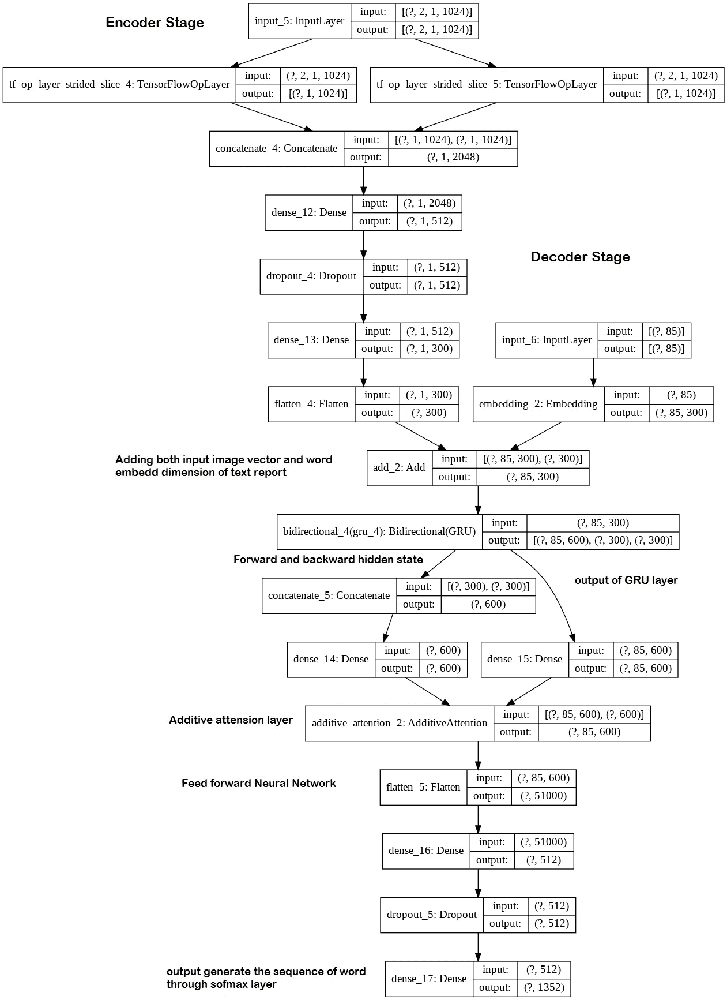

# 通过人工智能从 X 射线图像自动生成医疗报告

> 原文：<https://medium.com/analytics-vidhya/automatic-medical-report-generation-from-x-ray-images-through-ai-fd04de21e0e5?source=collection_archive---------3----------------------->

> 我们能制造一台机器/计算机作为放射科医生为病人生成医疗报告吗

来源谷歌图片

**目录:**

1.  商业问题
2.  数据来源
3.  评估指标
4.  数据预处理
5.  探索性数据分析及其观察
6.  项目现有研究论文
7.  我的第一次切割方法和架构
8.  结论
9.  未来的工作
10.  参考

# 1.业务问题:

在医学领域，放射科医生需要描述医学 X 射线图像。以放射学报告的形式总结 X 射线是一项复杂的任务，在生成报告时应该更加小心。放射学报告是对描述正常和异常情况的 X 射线图像的完整研究，可以做出采取适当药物治疗的正确决定。因此，放射科医师应该努力总结报告。**当今诊断的问题是医疗报告错误，由于缺乏经验丰富的放射科医生，错误日益增加**。这些医疗报告错误将是危险的，并可能因不正确的诊断和药物治疗而危及人的生命。

**1.1 项目目标:**

通过将上述诊断医疗错误考虑在内，并且也为了减少放射科医生的工作，可以使用人工智能来实现该过程，该人工智能可以通过处理 X 射线图像来自动生成报告。

1.  **将医学 X 射线图像输入深度学习模型，并生成放射学报告作为输出。**
2.  **根据模型生成的放射学报告必须与实际报告大致相似。**

# 2.数据来源:

1.  [https://academic torrents . com/details/5a 3a 439 df 24931 f 410 fac 269 b 87b 050203d 9467d](https://academictorrents.com/details/5a3a439df24931f410fac269b87b050203d9467d)
2.  [https://academic torrents . com/details/66450 ba 52 ba 3 f 83 fbf 82 ef 9 c 91 F2 BD E0 e 845 ABA 9](https://academictorrents.com/details/66450ba52ba3f83fbf82ef9c91f2bde0e845aba9)

**印第安纳大学的样本数据**

以上链接为 **open-i 胸部 x 光采集数据集**问题由**印第安纳大学医院网**提出。

**2.1 数据概述:**

数据集包含胸部 x 光图像和放射学文本报告。

1.  **胸部 x 光-** 共有 7471 张图像。png 文件格式。(包含每位患者的侧视图和正视图)。这里是一些随机的病人图像，显示了 X 射线图像的侧位和正视图。

**随机患者图像**

2.**放射报告** -中有大约 3955 份患者文本报告。XML 格式。以下是示例，其中包含中的单个患者报告的原始数据。XML 格式。

**原始数据**

# 3.评估指标:

针对该问题，将 BLEU 评分设置为衡量模型性能的性能指标。

双语评估替角分数(BLEU)是用于评估生成的句子与实际句子的度量。完全匹配的得分为 1.0，而完全不匹配的得分为 0.0。

该度量最常用于序列模型，如机器翻译系统、图像字幕、语音文本检测。

# 4.数据预处理:

从给定的 3955 名患者的原始数据中，每份报告包含 X 射线图像和放射学报告，如 ***适应症*** 、 ***发现*** 和 ***印象*** 。这样从 XML 文件中提取那些细节，x 光图像由<父图像>标签提取，文本报告由<摘要>标签提取。xml 文件。

下面是提取原始数据的代码片段，

**提取原始数据**

输出:

**4.1 检查数据集中是否存在空值:**

1.  **为图片特征**:

**查找包含多少没有图像的报告**

**输出**:

**观察**:

> 大约有 104 份病历没有图像。
> 
> 每个报告必须包含至少一个需要输入模型的图像。

因此，根据上述结果，我们删除了 104 个没有图像的病历容器。

2.**文本报告:**

在文本报告中，如果存在空值，则没有必要删除记录，而是将值填充到相应的文本含义。

a. ***指示*** 特征- " **无指示**"文本被填充为空值

b. ***寻找*** 特征- " **结果未找到**"文本被填充为空值

c. ***【印象】*** 特征-**【无印象】**文本被填充为空值

**4.2 文本预处理:**

在输入模型之前，清理文本是非常重要的。这是我做的一些文本预处理，

1.  通过**美汤**库移除 HTML 标签
2.  删除特殊字符和数字
3.  修改一些 word 文本，

F *或例*，“不会”会改为“不会”，“不能”会改为“不能”。

4.删除文本中的一些不相关的词，如“XXXX”和“岁”。

5.去掉像“a”、“the”、“is”、“and”这样的停用词并不是很重要的词。但是有必要的是，包含“不”和“不”这样的停用词的单词不应该从句子中删除。

例如，“心肌没有胸痛”如果我们把“没有”这个词从句子中去掉，整个意思就会改变。

6.把句子中的所有单词都改成小写。

下面是文本预处理的代码片段，

**清理文本数据**

输出:

**清理数据集**

# 5.探索性数据分析及其观察:

在继续模型架构之前，让我们先了解一下数据的洞察力。

这里我们有图像功能和文本报告功能。让我们先来看看文本特征，

**5.1 分析并可视化文本特征:**

1.  “指示”特征

a.发现并绘制独特的指示报告与重复的指示报告。

**指示分析**

输出:

**观察:**

> 从上面的图中我们可以观察到，报告的大多数适应症是给予患者的独特建议。
> 
> 假设这些报告应该是医学领域中的常用术语，我们可以观察到较少种类的重复报告。

b.绘制每个指示报告的句子长度:

**观察:**

> 适应症报告中的大多数字数在 0 到 5 的范围内。
> 
> 很少有报告包含的文本长度超过 10。

c.绘制显示报告中出现的前 100 个常用词。

**显示特征前 100 个单词**

让我们在指示报告中绘制单词云，

**文字云为指示特征**

**观察:**

> 上面的图给出了指示报告中出现的重要单词。
> 
> 从用词分析来看，“胸部”、“疼痛”、“呼吸”、“呼吸困难”、“手术”虽然是关于胸部 x 光图像，但在适应症报告中，这些词大多与我们体内的呼吸系统有关。

2.“查找”功能

a.绘制独特的调查报告与重复的调查报告。

**发现分析**

输出:

**观察:**

> 从上面我们可以看到，大多数调查报告都是给病人的独特建议。

b.每个调查报告的绘图句子长度:

**观察:**

> 适应症报告中的大多数字数在 0 到 30 之间。
> 
> 包含超过 40 个单词长度的少数报告文本

c.绘制调查报告中出现的前 100 个常用词。

**查找特征前 100 个单词**

绘制单词云可视化，

**词云的发现特征**

**观察:**

> 上面的图给出了发现报告中最常见的词，就像我们可以看到单词“胸膜”、“心脏”、“病灶肺”、“积液”在发现报告中最常见。

3.“印象”特征

a.绘制独特印象报告与重复印象报告。

输出:

**观察:**

> 从上面我们可以看到，大部分适应症报告都是给患者的独特建议。
> 
> 可以看到较少种类的重复报道，假设它们应该是医学领域的常用术语。

b.绘制每个印象报告的句子长度:

**观察:**

> 适应症报告中的大多数字数在 0 到 20 之间。
> 
> 很少有报告文本包含超过 40 个单词长度。

c.绘制调查报告中出现的前 100 个常用词。

**印象专题前 100 字**

绘制单词云可视化，

**印象特征的词云**

**观察:**

> 上面的图给了我们发现报告中最常见的词，就像我们可以看到“急性”、“心肺”、“异常”、“疾病”是印象报告中最常见的词。

**5.2 图像特征的分析和可视化:**

1.  查找所有患者报告中出现的图像数量

**观察:**

> 从对情节的观察我们可以得出结论，报告的大部分包含两个图像。
> 
> 我们可以看到一些报告包含最多五个 x 光图像。
> 
> 有些报告我们只能观察到一张 x 光图像。

2.可视化一些随机的 10 个病人的 X 射线图像

**随机 X 射线图像**

**观察:**

> 从上面随机的病人图像中，我们可以观察到每张 x 光图像的大小都不一样。
> 
> 因此，我们应该在输入到模型之前调整所有图像的大小。

**5.3 探索性数据分析结论:**

1.  从上面的分析提供的图像是在不同的大小，我们需要调整所有图像的大小，然后再馈入模型。
2.  从图像分析中，我们可以发现一些报告包含一个图像和两个以上的图像。我们需要确保每份报告应该包含两张图像，如 X 射线图像的正面和侧面投影。

# 6.项目的现有研究论文/博客:

解决方案一:[https://www . research gate . net/publication/301837242 _ Learning _ to _ Read _ Chest _ X-ray _ Recurrent _ Neural _ Cascade _ Model _ for _ Automated _ Image _ Annotation](https://www.researchgate.net/publication/301837242_Learning_to_Read_ Chest_X-Rays_Recurrent_Neural_Cascade_Model_for_Automated_Image_ Annotation)

在上面的论文中，是他们设计的深度学习模型的现有解决方案之一，该模型可以从图像中有效地检测疾病并注释其上下文(例如，位置、严重性和受影响的器官)。他们使用了印第安纳大学公开的胸部 x 光放射数据集。

论文摘要:

医学图像分析中的一个常见挑战是数据偏差。从整个人口来看，患病病例比健康病例少得多。为了避免正常与疾病病例的偏差，他们在 CNN 训练中采用了各种正则化技术。

为了用胸部 X 射线图像训练 CNN，他们对每幅图像采样一些重叠较少的频繁注释模式，以便给每幅胸部 X 射线图像分配图像标签，并用交叉熵准则进行训练。他们使用 17 种独特的疾病注释模式来标记图像和训练 CNN。为此，他们采用了各种正则化技术来处理默认的 CNN 模型。他们选择了简单有效的网络中网络模型，因为该模型体积小，训练速度快，并能达到与最常用的 Alexnet 相似或更好的性能。他们重新缩放原始图像，并在训练和测试中以 256*256 的重新缩放图像大小发送 cnn 输入。在报告生成的上下文中，他们使用了自然语言处理中的 LSTM 和 GRU 技术。在训练期间，网格术语描述的范围从 1 到 8(除了正常的一个单词)。因此，通过他们的观察，大多数单词包含多达 5 个单词，只有 9 种情况具有描述长于 6 个单词的图像，他们忽略这些包含 RNN 的图像，以展开多达 5 个时间步长。他们用少于五个单词的零填充注释，用句尾标记来填充五个单词的空间。他们将 RNN 的初始状态设置为 CNN 图像嵌入(CNN(I))，并将第一个无符号单词设置为初始输入。RNN 的输出是以下注释单词序列，并且它们通过最小化输出序列和真实序列的负对数似然来训练 RNN

L(I，S)= NXt = 1 { PRNN(yt = ST)| CNN(I)}

在上面的等式中，其中 yt 是 RNN 在时间步长 t 中的输出字，st 是正确的字，CNN(I)是输入图像 I 的 CNN 嵌入，N 是注释中的字的数量(N = 5，具有序列结尾零填充)。因此，他们使用最后一个空间平均池层的输出作为图像嵌入来初始化 RNN 状态向量。我们的 RNNs 的状态向量的大小是 R1×1024，这与 NIN 和 Google LeNet 的平均池层的输出大小相同。他们在训练、验证和测试中使用评估度量作为图像和注释的总体 BLEU 分数。他们注意到，LSTM 更容易训练，而 GRU 模型通过更仔细选择的超参数产生更好的结果。他们发现很难断定哪个模型更好，GRU 模型似乎平均得分更高。

解决方案 2:

 [## 医学影像报告的自动生成

### 作者:景宝玉，谢，和 Eric P. Xing

medium.com](/@Petuum/on-the-automatic-generation-of-medical-imaging-reports-7d0a7748fe3d) 

上面的博客更令人兴奋，它解释了使用印第安纳大学的 open-i 数据集将胸部 X 射线图像转换为报告。他们面临的挑战是，一份完整的诊断报告由多种不同形式的信息组成，在技术上很难统一到一个框架中。胸部 x 光检查报告包含三个具有不同文本类型的部分:一个句子(印象)、一个段落(发现)和一个关键字列表(MTI 标签)。为了解决这个问题，他们建立了一个多任务框架，将单词列表(标签)的预测视为多标签分类(MLC)任务，并将长描述(印象和发现)的生成视为文本生成任务。

**主模型框架**

在上述架构中，他们首先采用了卷积神经网络(CNN)来提取 x 光报告的视觉特征。这些特征然后被用于通过多标签分类生成关键词(MTI 标签)。接下来，他们采用分级长短期记忆网络(LSTM)来生成医疗报告的较长部分(发现和印象)。在分级 LSTM 中，他们使用共同注意模块来定位异常区域并关注特定的关键词，从而指导句子-LSTM 和单词-LSTM 生成更精确的诊断报告。

# 7.我的第一次切割方法和架构:

让我解释一下我所做工作流程，

在我的部分作品中，以班级标签为“印象”特征。哪两个图像被发送到模型并应生成印象文本报告。

1.  **转换我们所有的医疗报告，使其包含两张 x 光图像(正面视图和侧面视图)。**

从上述数据分析中，我们观察到一些报告包含一个 X 射线图像，一些报告包含两个以上的图像。

a.包含单个图像报告被复制两次。

b.包含两个以上图像的报告拍摄一个正面图像和一个侧面图像，以便正确拍摄一个正面视图和一个侧面视图。该过程通过映射包含在 projection.csv 数据帧中的图像名称来完成。

这是 Projection.csv 数据框，其中包含所有图像文件名及其对整个 3955 份医疗报告的投影。

这是上面两个步骤 a 和 b 的代码片段，

**最终数据**

输出:

这是一个以“正面图像”和“侧面图像”作为输入特征，以“印象报告”作为目标特征的最终数据框。

**2。分割训练，验证和测试来自上述数据框的数据。**

这里，我们将上述数据框架中的 80%数据指定为训练数据，10%数据指定为验证数据，10%数据指定为测试数据。

a.列车输入数据形状→ (3118，2)

b.验证输入数据形状→(386，2)

c.测试输入数据形状→(347，2)

**3。将单词标记化和填充应用于文本类标签。**

a.标记化

在将文本数据输入深度学习模型之前，我们需要创建文本编码，将每个单词映射到唯一的整数值，这种方法称为标记化。这是一种将一段文本分成更小单元的方法，这些单元称为标记。语料库文档中的每个单词都被赋予唯一的标记作为整数值。

**Word_tokenize**

在将标记器应用于 train_data 之后，我们需要找到**词汇库大小**，这是整个语料库中唯一单词标记的数量。通过应用 tokenizer，我们在语料库中获得了 1352 个唯一单词标记。

b.填料

目标“Impression_report”变量中的每个报告句子的大小将不同。有些报告会有长句，有些报告会有短句。在应用于深度学习模型之前，我们需要使所有句子报告具有相同的大小，这种技术被称为填充。从以上对“印象”特征的数据分析中，我发现句子的最大长度约为 85。因此，考虑到这个值，我们通过在末尾添加零标记来制作所有大小为 85 的短句。

**填充**

**4。输入图像特征的提取**

报告中包含的 X 射线图像被视为模型的输入。我们需要将每个图像转换成固定大小的向量，这些向量作为模型的输入。

在这里，我尝试用一些迁移学习技术来提取每个图像特征到向量中。迁移学习是一种技术，其中在大型数据集上训练的深度学习模型用于在另一个数据集上执行类似的任务。我们把这样的深度学习模型称为预训练模型。

这里我使用 Desnenet121 预训练模型，它包含 121 层卷积层。cheXNet 文件中的预训练权重为“Bruce Hou 1983 _ chex net _ Keras _ 0 . 3 . 0 _ weights . H5”。这些权重使用医学 X 射线图像进行预训练，这是最大的公开可用胸部 X 射线数据集，包含 14 种疾病的 100，000 多幅正面 X 射线图像。设置这些权重适合我们的任务。

**图像提取的工作流程**

这是实施的预训练模型，其中最后一层分配有全局平均池。由此产生的输出具有(1，1024)的形状。

**预训练模型**

**预训练模型总结**

**5。基本模型架构(编码器-解码器模型)**

这是由简单的编码器和解码器架构组成的基本模型架构。该模型是使用 tf.keras 库构建的。

**模型架构**

**基本模型架构**

**编码器:**

这是初始阶段，来自预训练模型的两个图像正面视图和侧面视图向量作为输入被馈送到编码器。在下一阶段，两个图像向量被连接成一个向量，并传递到密集层。最后对编码器状态的输出应用大小为 Embedding_dim 的展平层。

**编码器状态**

**解码器:**

在解码器中，文本报告作为输入，通过嵌入层传递。

嵌入层就像单词被嵌入到预定义向量空间的实值向量中。每个单词被映射到一个向量，向量值以类似神经网络的方式学习，这种技术最常用于深度学习。

接下来嵌入层被传递到 LSTM 层，

长短期记忆(LSTM)是 RNN 序列模型中最流行的，它能够学习长期依赖关系。

最后，LSTM 层的输出和编码器输出的输出彼此连接，并且该向量被传递到具有密集层的前馈神经网络模型，并且输出层被定义为 softmax 层，其为语料库中的每个 vocab 单词生成概率输出。

**解码器状态**

**定义损失函数和优化器:**

这里损失函数被定义为这个问题的掩模稀疏分类交叉熵。这种损失背后的原因是

为了前任。接受标记序列-[2]，[4]。[5],[7],[9],[3],[0],[0],[0],[0],[0]

在上面的句子中，我们依次有 6 个单词，零对应于实际上不是报告一部分的填充。因为模型将假设零也是序列的一部分，并试图学习它们。当模型正确预测为零时，损失会减少，因为模型认为自己学习正确。但是只有当模型正确预测实际单词非零令牌时，损失才会减少。

因此，我们应该屏蔽序列中的零，这样模型就不会关注它们，只学习报告中需要的单词。

**屏蔽损失功能**

这里，该模型用 Adam 优化器训练，学习率为 0.001 步长。

**模型训练:**

为了训练一个模型，我们使用了一个叫做强制训练的概念。这是一种训练递归神经网络的策略，它使用前一时间步的模型输出作为输入。

在解码器“<start>”的第一个时间戳 t，通过启动训练过程将令牌作为输入馈送给解码器，并且在随后的时间步长 t+1，将生成的单词输出用作输入，并且连同该图像向量和源文本一起作为输入馈送。提供源文本作为输入的过程被称为强制教学。</start>

**模特培训**

**张量板基本模型性能特性图:**

**车型性能**

**情节观察:**

> 从上图可以看出，随着时间的增加，列车损耗(蓝色曲线)和验证损耗(橙色曲线)均平稳下降。
> 
> 因此，由图可知，列车损失为 0.61，验证损失为 0.65。

**通过 Argmax 搜索的模型推断:**

在训练模型之后，让我们通过使用测试数据集开始测试阶段。这里，执行 argmax 搜索(这是序列模型的模型推断中的常见搜索)，其采用最高概率值，类似于贪婪搜索。

**模型推断**

**结果和观察:**

让我们看看基本模型如何预测测试数据的一些结果。

一些随机测试数据点:

1.

从以上结果来看，该模型预测了实际“印象”报告的几乎大部分单词。

2.

从以上结果来看，模型预测为最坏的情况，它完全做了错误的预测。

3.

从上面的结果来看，该模型准确地预测了实际印象报告的句子的相同单词。

4.

从上述结果中，我们可以观察到预测的模型没有给出与实际句子相同的确切含义。

**基本模型的最终结论:**

1.  通过观察测试数据的一些结果，哪个模型对长句表现不好。
2.  我们可以观察到，一些短句它表现很好，并预测实际句子的相似词。
3.  我们还可以观察到，一些短句预测了相似的单词，但整个意思与实际句子相比发生了变化。

**6。主模型(注意机制):**

通过上面的基本模型(简单的编码器-解码器),它没有给我们一个合适的测试数据结果，需要在模型结构上做一些改进。我们可以观察到基本模型在最坏情况下预测的长句子。

因此，通过添加具有注意力机制(附加注意力)的双向 GRU 来扩展基本模型架构，这有助于在处理长句报告时表现良好。

让我们快速看一下注意机制模型的过程，

**加法注意力架构|** [**来源**](https://lilianweng.github.io/lil-log/2018/06/24/attention-attention.html)

**输入**

**解码器** **阶段-** 这里使用双向 GRU 从输入中获取高层特征，以获得对输入特征的更多理解深度。

**附加注意-** 它为每个单词序列提供权重向量(α),并将来自每个时间戳的单词级特征添加到句子级特征向量中。这是 Bahdanau 注意力的简化形式。

让我们看看权重是如何计算的，

从上图可以看出，权重是由前馈神经网络计算的。作为输出的上述 softmax 通过反向传播技术更新该上下文权重

使用注释的加权和来生成输出单词 yi 的上下文向量 ci:

权重αij 通过由以下等式给出的 softmax 函数来计算:

eij 是由函数 **a** 描述的前馈神经网络的输出分数，该函数试图捕捉在 **j** 的输入和在 **i** 的输出之间的对准。

基本上，如果编码器产生 **Tx** 个“注释”(隐藏状态向量)，每个都具有维度 **d，**，则前馈网络的输入维度为 **(Tx，2d)** (假设解码器的前一状态也具有维度 **d** ，并且这两个向量被连接)**。**这个输入乘以一个矩阵 **Wa** 的 **(2d，1)** 维度(当然后面加上偏置项)得到分数 **eij(具有维度(Tx，1))** 。

在这些 **eij** 分数的顶部，应用 tan 双曲线函数，后跟 softmax，以获得输出 j 的归一化比对分数:

所以， **α** 是一个(Tx，1)维向量，它的元素是输入句子中每个单词对应的权重。

如果你还需要更多关于注意力机制的细节，参考这个博客。注意力机制来源的完整解释摘自这篇博客。

**输出-** 最后，来自注意层的上下文向量被发送到前馈神经网络，最终的输出词由 softmax 层生成。

这是使用 Tensorflow Functional API 实现的注意力机制的架构，

**关注建筑设计**

主模型摘要:

**关注模式总结**

**主模型架构:**

**注意力模型架构**

**编码器:**

在编码器阶段，这里应用了基本模型的相同架构。最后通过 Tensorflow API 中的添加层将图像矢量与文本嵌入矢量相加。

**编码器状态**

**解码器:**

在解码器架构中，包含图像向量和文本报告向量的输入特征被馈送到双向 GRU，该双向提取完整的输入信息并发送到附加注意层，也称为 Bahdanau 注意机制在 Tensorflow 中被实现为简化版本。上下文向量注意层的输出被送入前馈神经网络，最后通过 softmax 层生成输出词。

**解码器状态**

这里使用了基本模型中相同的损失函数、度量、训练方法、优化器、模型推断。这些在基本模型架构中有详细的解释。能否请你参考以上。

**张量板主模型性能特性图:**

**车型性能**

**剧情观察:**

> 这里我们使用掩蔽稀疏分类交叉熵作为损失函数。从损耗部分我们可以清楚地观察到，损耗随着时间的增加而迅速减少。
> 
> 通过用 16 个时期进行训练，得到训练损失为 0.4，验证损失为 0.5。

**结果和观察:**

在这里，通过应用单独的 N-gram 和累积的 N-gram，使用 BLEU 分数来测量由模型生成的报告。

单个 N-gram 分数:

单个 N-gram 分数是对特定顺序的匹配 gram 的评估，例如单个单词(1-gram)或单词对(2-gram 或 bigram)。

累积 N-gram 分数:

累积分数是指计算从 1 到 n 的所有顺序的单个 n-gram 分数，并通过计算加权几何平均值对其进行加权。

要了解有关 BLEU 分数实现的更多细节，请参考[本](https://machinelearningmastery.com/calculate-bleu-score-for-text-python/?unapproved=567745&moderation-hash=48bc6191546531b169b9be233c34169b#comment-567745)。

下面是可视化结果的代码实现，

**结果和度量观察**

**模型的良好结果:**

1.

2.

3.

从上面一些测试数据点的结果我们可以得出结论，it 模型在长句报告中表现良好。并且一些生成的报告给出了与实际报告完全相似的结果。

**模型的坏结果:**

1.

2.

我们不能断定模型在这里总是表现良好，上面的一些结果是模型生成报告的不良性能。

**错误原因:**

我们可以观察到图像不清晰，表现为图像中的一些暗斑和噪声。

在 x 射线图像中，我们可以观察到一些带有手指阴影的图像，这对模型有很大的影响。

**波束搜索算法:**

波束搜索算法基于条件概率在每个时间步长为输入序列选择多个备选项。多个备选方案的数量取决于一个叫做的参数波束宽度 B **。**在每个时间步，波束搜索选择 B 个概率最高的最佳备选方案作为该时间步最可能的选择。如果你还想了解更多关于光束搜索的细节，请浏览[这个](https://towardsdatascience.com/an-intuitive-explanation-of-beam-search-9b1d744e7a0f)和[这个](https://www.youtube.com/watch?v=RLWuzLLSIgw)。

**光束搜索**

**结果和观察:**

在这里，我在所有的结果中应用了大约 3 的光束宽度。

**模型的良好结果:**

1.

2.

**模型的不良结果:**

1.

2.

**波束搜索算法的结论:**

从上面使用短句子的波束宽度为 3 的结果，我们获得了好的 BLEU 分数，并且准确地生成了实际报告。当我们取一个长句子时，预测是最差的，并且与实际报告不完全匹配。我们可以尝试使用较大的数字宽度来获得更好的长句结果，而不是尝试将波束宽度设为 3。

# 8.结论:

1.从以上实验中，我们可以观察并得出结论，当与基本模型算法和波束搜索算法相比时，附加注意算法给出了更好的结果。

2.我们可以清楚地观察到，与基本模型相比，在附加注意模型中具有良好 BLEU 分数，且在长句中表现良好。

3.我们可以观察到，波束搜索在生成短句方面表现良好，但在生成长句方面表现不佳。

# 9.未来作品:

1.  在未来，如果我们用更多的医疗记录进行训练，我们可以期待比上述结果更好的结果，在生成报告方面取得好成绩。
2.  与注意力层相比，我们可以在解码器状态下应用转换器和 Bert 层，以更好地生成文本报告。
3.  最好的模型可以转换成 android 应用程序或桌面应用程序，它们可以用作显示工具，通过放射科医师提供 X 射线图像来生成报告。

# 10.参考:

1.[https://www . research gate . net/publication/301837242 _ Learning _ to _ Read _ Chest _ X-ray _ Recurrent _ Neural _ Cascade _ Model _ for _ Automated _ Image _ Annotation](https://www.researchgate.net/publication/301837242_Learning_to_Read_ Chest_X-Rays_Recurrent_Neural_Cascade_Model_for_Automated_Image_ Annotation)

2.[https://medium . com/@ PE tuum/on-the-automatic-generation-of-medical-imag-reports-7d0a 7748 Fe 3d](/@Petuum/on-the-automatic-generation-of-medical-ima ging-reports-7d0a7748fe3d)

3.[https://lilian Weng . github . io/lil-log/2018/06/24/attention-attention . html](https://lilianweng.github.io/lil-log/2018/06/24/attention-attention.html)

4.[https://machine learning mastery . com/calculate-bleu-score-for-text-python/](https://machinelearningmastery.com/calculate-bleu-score-for-text-python/)

5.[https://towards data science . com/image-captioning-in-deep-learning-9cd 23 FB 4d 8d 2](https://towardsdatascience.com/image-captioning-in-deep-learning-9cd23fb4d8d2)

6.[https://www . analyticsvidhya . com/blog/2019/11/comprehensive-guide-attention-mechanism-deep-learning/](https://www.analyticsvidhya.com/blog/2019/11/comprehensive-guide-attention-mechanism-deep-learning/)

7.[https://medium . com/analytics-vid hya/automatic-impression-generation-from-medical-imaging-report-3077 D1 d77d 20](/analytics-vidhya/automatic-impression-generation-from-medical-imaging-report-3077d1d77d20)

8.[https://medium . com/rurl = https % 3A % 2F % 2f towards data science . com % 2 fan-intuitive-explain-of-beam-search-9b1d 744 e 7a 0 f](https://medium.com/r?url=https%3A%2F%2Ftowardsdatascience.com%2Fan-intuitive-explanation-of-beam-search-9b1d744e7a0f)

9.[https://www.youtube.com/watch?v=RLWuzLLSIgw](https://www.youtube.com/watch?v=RLWuzLLSIgw)

10.[https://www.appliedaicourse.com/](https://www.appliedaicourse.com/)

这是上述项目的笔记本中的全部代码

[https://github . com/dhilip 1997/Automatic-Medical-Report-Generation-From-X-ray-images-through-AI](https://github.com/Dhilip1997/Automatic-Medical-Report-Generation-From-X-ray-images-through-AI)

如果你想和我联系，这是我的 LinkedIn id。