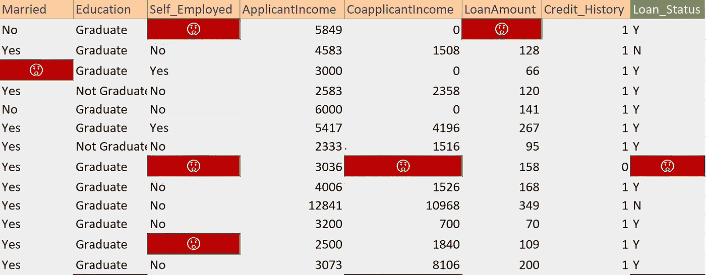
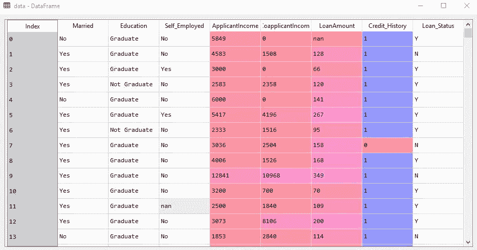
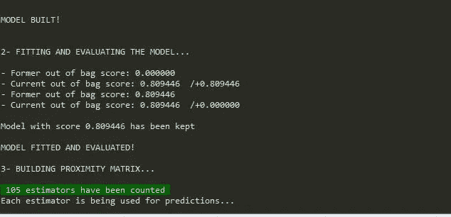
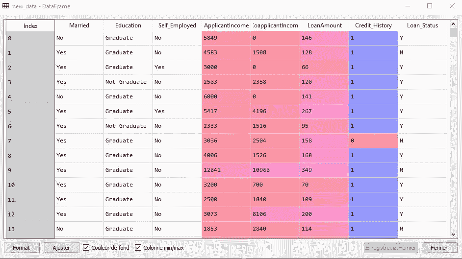
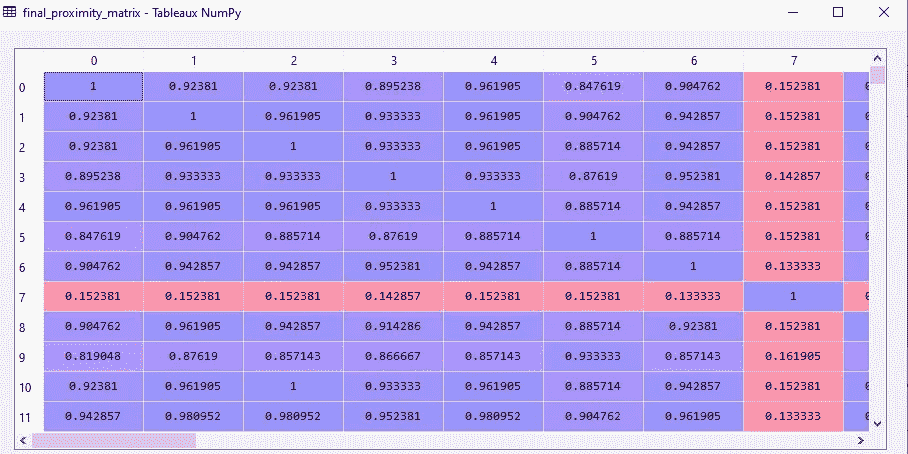
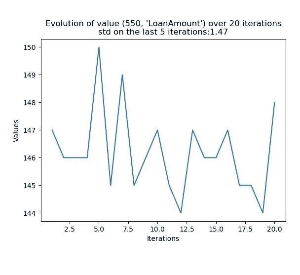
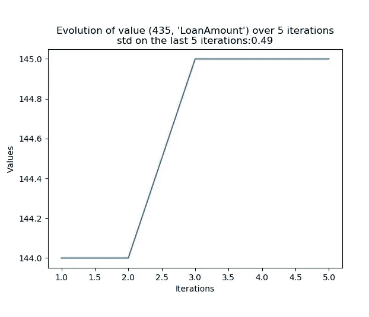

# 自动随机森林估算器

> 原文：<https://medium.com/analytics-vidhya/automatic-missingvalueshandler-library-with-a-random-forest-d8d380da1fe0?source=collection_archive---------7----------------------->

## 在一般机器学习任务中使用 Python 自动处理空单元格

> 定型集和测试集的缺失值替换

您想要在机器学习(监督学习任务)中启动一个新项目，但不幸的是，您注意到您的数据集在一个、两个或多个样本中包含缺失值(在要素或目标变量中也是如此)。摆脱它们是一个快速但鲁莽的解决方案，可能会损害您正在构建的模型的性能。这就是设计和实现一个库的原因:通过利用随机森林的邻近定义，作为一种自动替换空单元的方式。

该模块可通过 **pip** 获得。您可以使用`**pip install MissingValuesHandler**`下载这个库，并在数据集上测试它。事不宜迟，我们将开始简要说明如何利用它。

# 属国

*   Python(版本> =3.6)
*   Numpy
*   熊猫
*   马特普利卜
*   Sklearn
*   张量流(版本> =2.0)

# 怎么用？

***MissingValuesHandler***是在 *Scikit-Learn* 之上用 *Python* 编写的库。它能够自动检测我们的数据集中的特征类型(分类还是数字),并决定随机森林分类器或回归器是否适合该任务。例如，让我们替换以下数据集中的 *nan 值*:

这个数据集只是一个简单的信用评分案例:这是一个分类任务。我们将通过应用以下脚本来替换丢失的值:

**1** -我们首先需要**导入**库并实例化它。

**2-** **运行时**(训练你的算法):

*   我们可以用熊猫来读取数据集。
*   我们必须设置***missing _ data _ handler***对象将要检测和使用的随机森林的参数。除了***additional _ estimator*，**之外，您可以随意使用随机森林的所有常用参数(分类器和回归器)，当模型的开箱得分不够高时，这些参数允许我们添加任意多的树。你不用担心 ***判据*** (mse，gini 或者熵)，模块里已经搞定了。
*   该算法使用随机森林来定义一个 ***邻近矩阵*** 。该矩阵将用于计算新值的 ***加权平均值*** 。
*   如果你没有足够的计算能力，我建议你从低数量的 ***估值器*** 开始。然后，随着训练的继续，您可以决定添加少量的树，直到算法达到其最高的预算外得分。

**3-** 方法**训练**是该类的主要功能。除其他外，它有三个重要论点:

*   **forbidden_variables_list** :不需要编码的变量会放在那个列表里。如果一个变量已经被编码，你必须把它的名字放在列表上，因为默认情况下算法会对每个分类变量进行一次热编码(因为 sklearn 的树不能直接处理分类数据)。
*   **ordinal_variables_list** :适用于顺序分类变量编码。
*   **n _ iterations _ for _ convergence**:n 轮后检查预测值是否收敛。如果没有达到收敛，我们进行另一轮，如果每个值都收敛或者没有改进，训练将停止。未收敛的值将分别替换为分类变量和数值变量的众数和中位数。如果满足收敛，用邻近矩阵计算的 ***加权平均值*** 将替换空单元。
*   根据我的经验， **4 或 5** 回合通常就够了。

训练期间

**4-获得结果**

*   我们得到了新的数据集

具有新值的数据集

*   我们还可以得到对象已经计算并使用的最后一个 ***邻近矩阵*** :

邻近矩阵

# 评估收敛性

> 对于*数值，如果它们各自的标准差在**范围【0，1】****内，则达到收敛，在*上已经对它们进行了最后 n 次迭代。**
> 
> **对于 ***分类值*** ，如果模态**固定**，则达到收敛。**

**我们可以在字典里找到，已经收敛的加权平均值。我们甚至可以画出 n 次迭代后它们的演化图。在 ***行 550*** 和 ***列‘loan amount’***的值不稳定，甚至在 20 ***迭代*** 之后也不收敛 ***。该值的范围很宽[144，150]。在最后 5 次迭代中，标准差是 ***大于 1*** 。 ***中值*** 已被用作替换。*****

****

**对于在 ***行 435*** 和 ***列‘loan amont’***的值，情况并非如此。该值变化的范围[144，145]较小。该值只需要 ***5 次迭代*** 就可以收敛到 ***145*** ，标准差为 ***0.49*** 。 ***加权平均值*** ，等于 145，已作为替代。**

****

# **不收敛值的提示**

*   **你可以用更多的树重新开始这个过程，并随着训练的进行增加一些。**
*   *****training _ resilience***是一个参数，它让算法知道它必须保持搜索多少次与在最后一组迭代中没有收敛的剩余值有关的收敛。它必须大于或等于 2。例如，如果它被设置为 3，该算法将继续进行 3 组以上的迭代(3 次以上的机会),并将评估剩余值是否已经减少。如果它们减少了，算法将追求它的标准目的。如果不是这种情况，它将完全停止后，这三个机会，和模式和中位数将被用来作为替代。**
*   **您可以在引导时使用其他超参数，例如***min _ sample _ split***，***min _ samples _ leaf***， ***max_features*** 等等**

**就是这样！您可以在数据集上尝试这种算法，看看它是如何工作的。**

**算法的参考:**

*   **[1]:利奥·布雷曼的网站。*兰登森林【莱奥布雷曼】和阿黛尔卡特勒*stat.berkeley.edu/~breiman/RandomForests/cc_home.htm*T42***
*   **[2]: 约翰·斯塔默在 Youtube 频道 StatQuest 上的视频。 [*随机森林第二部分:缺失数据和聚类*](https://www.youtube.com/watch?v=sQ870aTKqiM)**