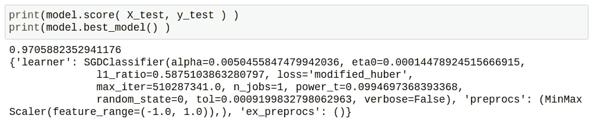
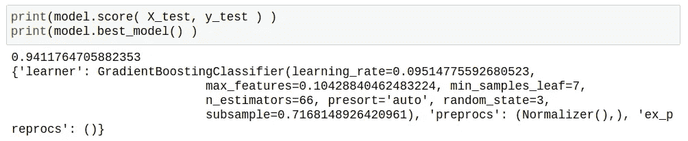
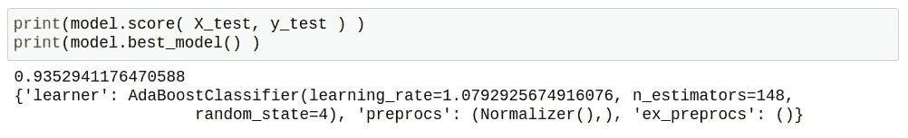
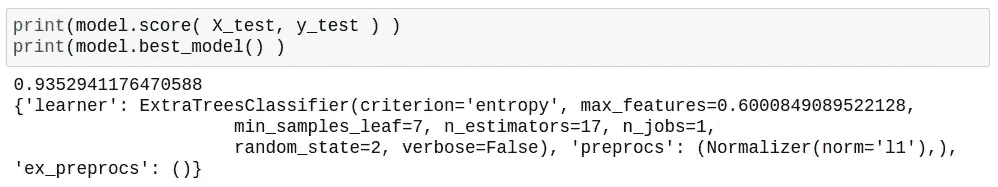
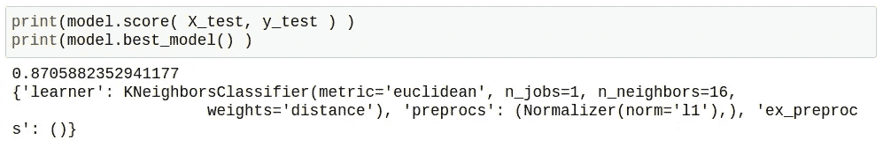

# 基于 hyperpt-sk learn 的乳腺癌分类自动模型选择和参数优化。

> 原文：<https://medium.com/analytics-vidhya/automatic-model-selection-and-parameter-optimization-for-breast-cancer-classification-with-7c912bd66eb3?source=collection_archive---------17----------------------->

在 [Unsplash](https://unsplash.com/s/photos/breast?utm_source=unsplash&utm_medium=referral&utm_content=creditCopyText) 上由[angula Harry](https://unsplash.com/@ang10ze?utm_source=unsplash&utm_medium=referral&utm_content=creditCopyText)拍摄的照片

乳腺癌是美国最常见的癌症，也是仅次于肺癌的第二大癌症死亡原因( [2017 年数据](https://gis.cdc.gov/Cancer/USCS/DataViz.html))。准确的诊断对于正确的乳腺癌管理，包括治疗选择是必不可少的。病理学家评估病变的整体结构和形态学特征，如细胞核与细胞质的比率以及各种细胞质和细胞核特征。细胞核的形态特征在癌症诊断中是必不可少的。

多亏了来自威斯康星大学的研究人员，我们有了一个良性和恶性细胞的核特征的大数据集。乳腺癌数据集包含在 [sklearn.datasets](https://scikit-learn.org/stable/modules/generated/sklearn.datasets.load_breast_cancer.html) 库中。让我们快速浏览一下。

该数据集包含 569 个实例、30 个数值预测属性和两个类。良性类别包含 357 个条目，恶性类别包含 212 个条目，存在轻微的类别不平衡。

现在，让我们看看这些预测属性是如何相互关联的，以及与目标是如何关联的。

由于大量的属性，可能更容易阅读条形图。

正如我们所看到的，“平滑误差”与癌症诊断正相关，但不如“最差凹点”、“最差周长”和“平均凹点”的负相关那么强从病理学家的角度来看，这完全说得通，因为细胞核越大、越不规则，就越有可能是恶性的。

通过对乳腺癌数据集的简短介绍，我们现在可以找到最佳模型和最佳参数，以基于上述 30 种细胞核属性将乳腺病变分类为良性还是癌症。

为了完成这个目标，我们将使用 hyperopt-sklearn。Hyperopt-sklearn 是一个软件项目，它提供了 Scikit-learn 机器学习库的自动算法配置。对该库最好的描述来自 Brent Komer [文章](http://conference.scipy.org/proceedings/scipy2014/pdfs/komer.pdf):“遵循 Scikit-learn 的惯例，hyperopt-sklearn 提供了一个具有 *fit* 方法和 *predict* 方法的*估计器*类。该类的 *fit* 方法执行超参数优化，完成后， *predict* 方法将最佳模型应用于测试数据。优化过程中的每个评估都会对大部分训练集执行训练，估计验证集的测试集准确性，并将验证集分数返回给优化器。在搜索结束时，在整个数据集上重新训练最佳配置，以产生处理后续*预测*调用的分类器。”

让我们看看它在实践中是如何工作的。

我对模型进行了几次训练，这些是我取得的最好结果。

得分 0.97 的 SGDClassifier。

得分为 0.94 的 GradientBoostingClassifier。

AdaBoostClassifier 和 ExtraTreesClassifer 得到相同的分数 0.93。

KNeighborClassifer 得到了最差的 0.87 分。

总之，Hyperopt-sklearn python 包支持自动模型选择和参数搜索。它支持 Scikit-Learn 提供的标准机器学习算法。它易于使用，极大地加快了模型选择和初始参数设置的速度。进一步调整参数可能会改善结果。唯一的缺点是缺乏对 K-fold 交叉验证的支持，这限制了它在明显不平衡的数据集上的使用。

感谢你花时间阅读这篇文章。

在这艰难的时刻致以最美好的祝愿。
安德鲁
@坦帕帕斯