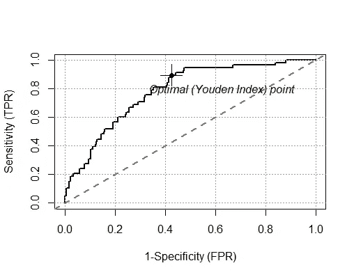

# 使用 R 中的 ROCit 包自动寻找 ROC 曲线中的最佳阈值点

> 原文：<https://medium.com/analytics-vidhya/automatically-find-optimal-threshold-point-in-roc-curve-using-rocit-package-in-r-8955c36c855e?source=collection_archive---------3----------------------->

[第一部分在这里](/analytics-vidhya/roc-curve-classification-metrics-why-metrics-cant-replace-your-common-sense-e82d71c12eb3)

**用 ROCit 包解释带 R 的二元分类器**

灵敏度(或召回率或真阳性率)、假阳性率、特异性、精确度(或阳性预测值)、阴性预测值、误分类率、准确度、F 分数-这些是用于评估二元分类器在某个阈值下的性能的流行度量。这些指标是在特定阈值下计算的。受试者工作特征(ROC)曲线是评估二元分类器整体诊断能力的常用工具。与依赖于某个阈值不同，ROC 曲线下面积(也称为 AUC)是关于二元分类器在分类任务中总体表现如何的汇总统计。ROCit 软件包提供了灵活性，可以轻松评估阈值范围的指标。此外，ROC 曲线以及 AUC 可以使用不同的方法获得，如经验法、双正态法和非参数法。ROCit 包含了多种构建 ROC 曲线和 AUC 置信区间的方法。ROCit 还提供构建经验收益表的选项，这是直接营销的便捷工具。该软件包提供了常用的可视化选项，如 ROC 曲线，KS 图，升降机图。除了内置的默认图形设置，还可以通过提供必要的值作为函数参数来进行手动调整。ROCit 是一个强大的工具，提供了一系列的东西，但它非常容易使用。

**二元分类器的性能度量**

二元分类器的各种性能度量是可用的，它们是截止特定的。可以通过 measure 参数调用以下指标:

*   ACC:分类的整体准确性。
*   MIS:误分类率。
*   SENS:敏感。
*   规格:特异性。
*   PREC:精确。
*   REC:召回。与敏感度相同。
*   PPV:阳性预测值。
*   NPV:阳性预测值。
*   TPR:真阳性率。
*   FPR:假阳性率。
*   TNR:真实负利率。
*   假阴性率。
*   阳性诊断似然比。
*   阴性诊断似然比。
*   FSCR:分数为 F。

**ROC 曲线估计**

rocit 是 ROCit 包的主要功能。利用诊断分数和每个观察值的类别，它在方便的截止值计算真阳性率(灵敏度)和假阳性率(1-特异性),以构建 ROC 曲线。该函数返回“rocit”对象，该对象可以作为其他 S3 方法的参数传递。

糖尿病数据包含来自 1046 名受试者中的 403 名受试者的信息，这些受试者在一项研究中接受了采访，以了解弗吉尼亚州中部非洲裔美国人肥胖、糖尿病和其他心血管危险因素的患病率。根据洪约翰博士的说法，二型糖尿病(成人发病的糖尿病)与肥胖关系最密切。腰臀比可能是糖尿病和心脏病的预测指标。糖尿病 II 型还与高血压有关——它们可能都是“X 综合征”的一部分。这 403 名受试者接受了糖尿病筛查。糖化血红蛋白> 7.0 通常被视为糖尿病的阳性诊断。

在数据中，dtest 变量表示 glyhb 是否大于 7。

```
data("Diabetes")*## first, fit a logistic model*logistic.model <- glm(as.factor(dtest)~chol+age+bmi,data = Diabetes,family = "binomial")*## make the score and class*class <- logistic.model$y*# score = log odds*score <- logit(logistic.model$fitted.values)*## rocit object*rocit_emp <- rocit(score = score,class = class,method = "emp")rocit_bin <- rocit(score = score,class = class,method = "bin")rocit_non <- rocit(score = score,class = class,method = "non")summary(rocit_emp)summary(rocit_bin)summary(rocit_non)*## Plot ROC curve*plot(rocit_emp, col = c(1,"gray50"),legend = **FALSE**, YIndex = **FALSE**) 
```

上述程序将为“糖尿病”数据集创建逻辑回归模型，所创建的 rocit 对象将为我们提供 FPR 和 TPR 之间的图表，并使用尤登指数得出最佳临界值，如下所示



***参考文献:***

*1。*[*https://MedicalBiostatistics.com*](https://MedicalBiostatistics.com)

*2。*[*https://rdrr.io/cran/ROCit/f/vignettes/my-vignette.Rmd*](https://rdrr.io/cran/ROCit/f/vignettes/my-vignette.Rmd)