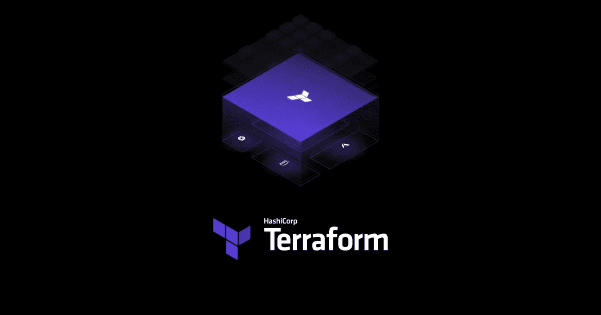
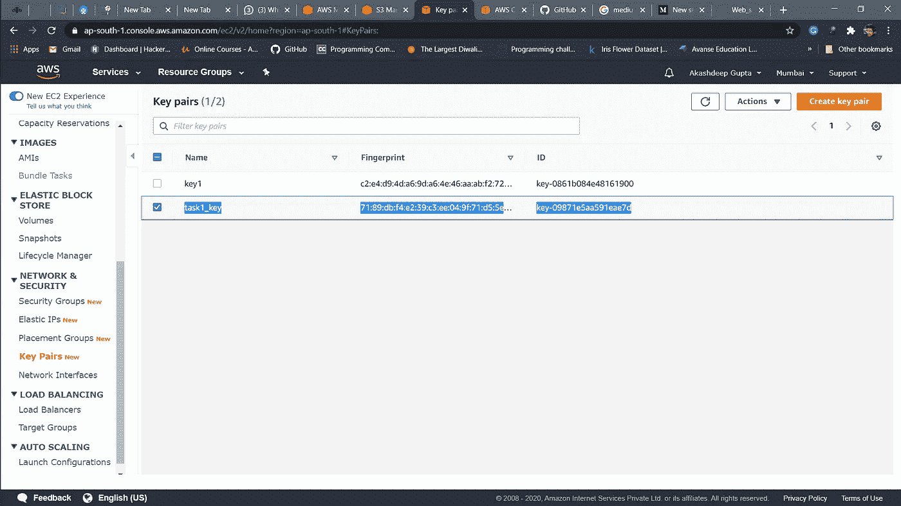
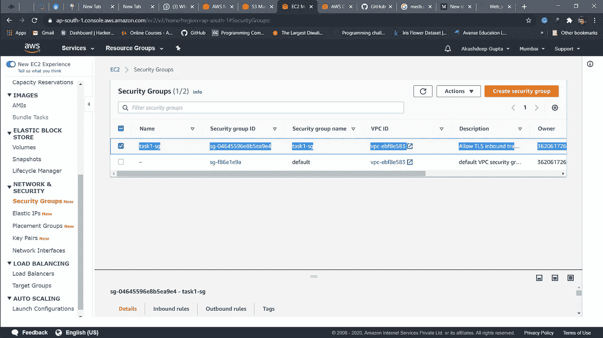
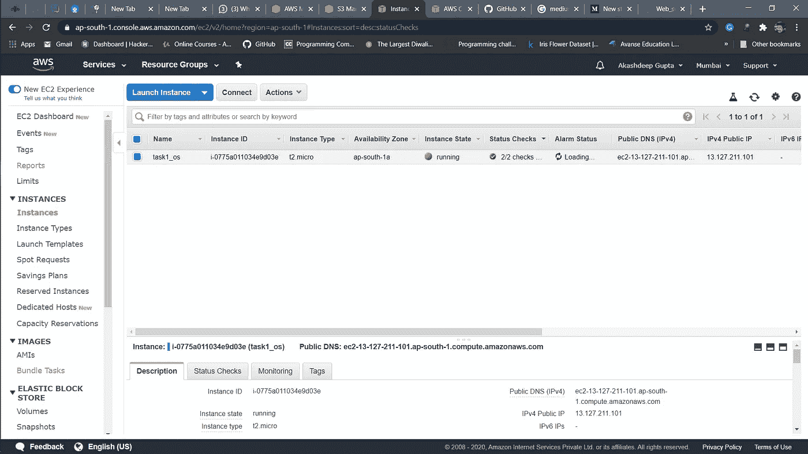
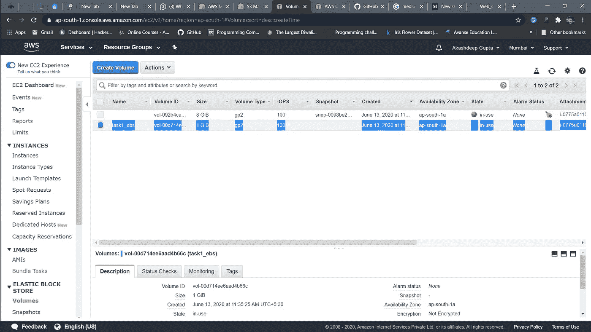
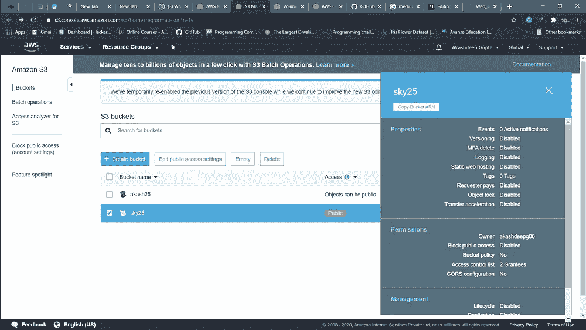
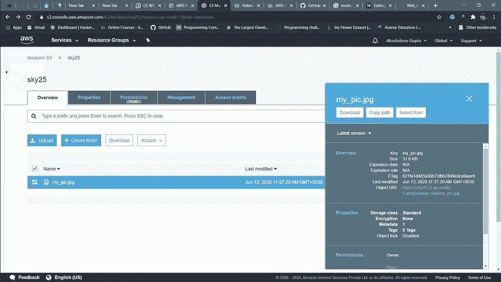
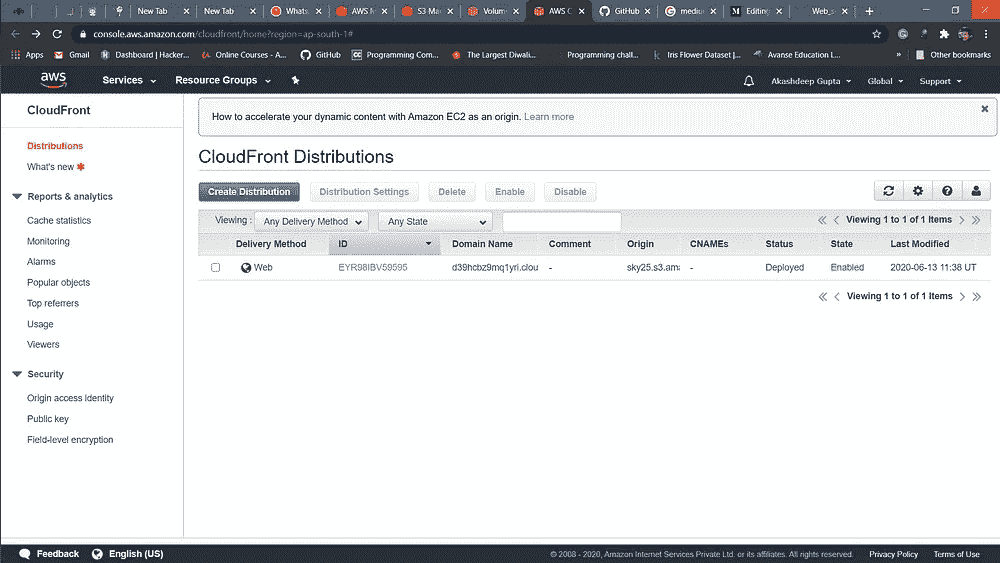
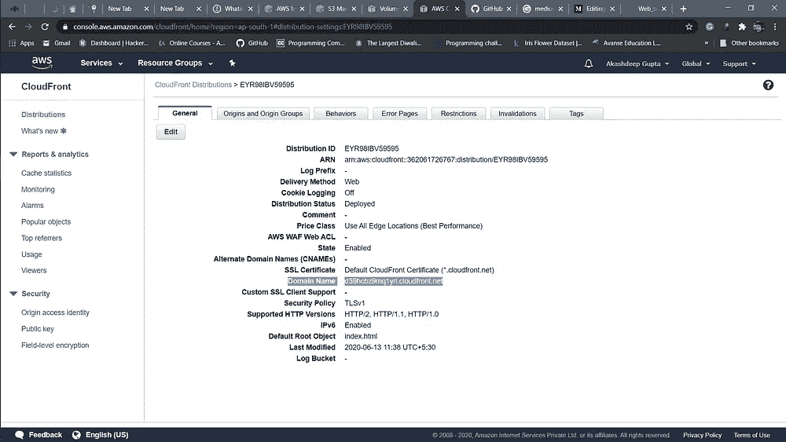
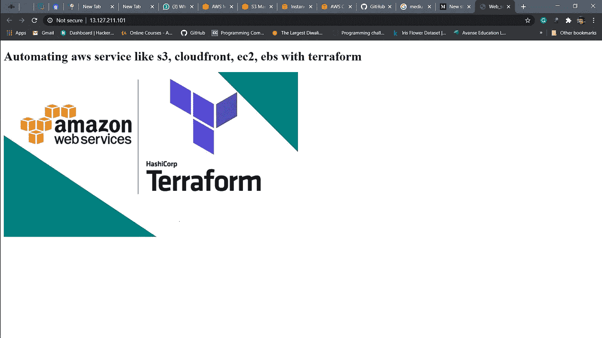

# 使用 Terraform 自动化 AWS 云基础架构

> 原文：<https://medium.com/analytics-vidhya/automating-aws-cloud-infrastructure-with-terraform-45d9d1160475?source=collection_archive---------19----------------------->



## *我们将要做什么？

1.创建允许端口 80 的密钥和安全组。

2.启动 EC2 实例。

3.在这个 EC2 实例中，使用我们在步骤 1 中创建的密钥和安全组。

4.启动一个卷(EBS)并将该卷装入/var/www/html。

5.开发人员已经上传到 GitHub 回购代码，回购也有一些图像。

6.将 GitHub repo 代码复制到/var/www/html 中。

7.创建一个 s3 存储桶，将 GitHub repo 中的映像复制/部署到 S3 存储桶中，并将权限更改为 public readable。

8 使用 s3 bucket(包含图像)创建一个 Cloudfront，并使用 Cloudfront URL 更新/var/www/html 中的代码。

## *先决条件:-

1.  AWS 服务，如 ec2、CloudFront、ebs、s3。
2.  饭桶
3.  开源代码库

## *在进入解决方案部分之前，让我告诉你亚马逊 aws 服务的所有主要术语:-

*   ***什么是 aws？***

A mazon web service 是一个提供灵活、可靠、可扩展、易于使用且经济高效的云计算解决方案的平台。

AWS 是亚马逊提供的一个全面、易于使用的计算平台。该平台结合了基础设施即服务(IaaS)、平台即服务(PaaS)和打包软件即服务(SaaS)产品。

*   ***AWS(亚马逊网络服务)的 7 大优势***

1.  全面的
2.  性价比高
3.  适合的
4.  安全性
5.  创新ˌ革新
6.  全球领导者
7.  提高生产力

*   ***它的服务:-***

> EC2

EElastic Block Store(EBS)是一种易于使用的高性能块存储服务，旨在与 Amazon Elastic Compute Cloud (EC2)配合使用，用于任何规模的吞吐量和事务密集型工作负载。各种各样的工作负载，如关系和非关系数据库、企业应用程序、容器化应用程序、大数据分析引擎、文件系统和媒体工作流，都广泛部署在 Amazon EBS 上。

> 云锋

C loudFront 是一种快速内容交付网络(CDN)服务，能够以低延迟、高传输速度向全球客户安全交付数据、视频、应用和 API，所有这些都在一个开发人员友好的环境中完成。CloudFront 与 AWS 集成，这两个物理位置都直接连接到 AWS 全球基础设施，以及其他 AWS 服务。CloudFront 可以与包括 AWS Shield for DDoS 缓解、Amazon S3、Elastic Load Balancing 或 Amazon EC2 在内的服务无缝协作，作为应用程序的来源，并与 Lambda@Edge 一起运行更接近客户用户的定制代码，并定制用户体验。最后，如果你使用亚马逊 S3、亚马逊 EC2 或弹性负载平衡等 AWS 源，你不需要为这些服务和 CloudFront 之间的任何数据传输付费。

> 3

简单存储服务(亚马逊 S3)是一种对象存储服务，提供行业领先的可扩展性、数据可用性、安全性和性能。这意味着各种规模和行业的客户都可以使用它来存储和保护各种使用情形下的任意数量的数据，例如网站、移动应用程序、备份和恢复、归档、企业应用程序、物联网设备和大数据分析。亚马逊 S3 提供易于使用的管理功能，因此您可以组织您的数据并配置微调的访问控制，以满足您特定的业务、组织和合规性要求。亚马逊 S3 旨在实现 99.999999999% (11 个 9)的耐用性，并为全球公司的数百万个应用程序存储数据。

> 密钥对和安全组

K ey 对由一个私钥和一个公钥组成，是一组安全凭证，用于在连接到实例时证明您的身份。Amazon EC2 存储公钥，您存储私钥。您使用私钥而不是密码来安全地访问您的实例。

Ssecurity group 充当 EC2 实例的虚拟防火墙，控制传入和传出流量。入站规则控制您的实例的传入流量，出站规则控制您的实例的传出流量。…如果没有指定安全组，Amazon EC2 会使用默认的安全组。

*   ***什么是 terraform？***

erraform 是一个安全有效地构建、更改和版本控制基础设施的工具。Terraform 可以管理现有的和受欢迎的服务提供商以及定制的内部解决方案。

配置文件描述了运行单个应用程序或整个数据中心所需组件的平台化。Terraform 生成一个执行计划，描述它将做什么来达到期望的状态，然后执行它来构建所描述的基础设施。随着配置的变化，Terraform 能够确定发生了什么变化，并创建可以应用的增量执行计划。

Terraform 可以管理的基础设施包括低级组件，如计算实例、存储和网络，以及高级组件，如 DNS 条目、SaaS 功能等。

## Terraform 的主要特点是

1.  执行计划
2.  基础设施作为代码
3.  变革自动化
4.  资源图表

## *解决方案:-

*   首先，我们将在 aws 中创建一个概要文件。

```
$ aws configure --profile user
AWS Access Key ID [None]:
AWS Secret Access Key [None]:
Default region name [None]:
Default output format [None]:
```

在这里，提供你的用户名代替用户，如你所愿。然后，提供访问密钥 ID、秘密访问密钥、区域名称、输出格式。

> *如果你不提供输出格式，那么默认情况下它会把它作为 json。*

*   其次，在您的系统中本地设置地形。我使用 windows 作为我的基本操作系统。下面提供了下载 terraform 的官方链接。

[](https://www.terraform.io/) [## 哈希公司的 Terraform

### 使用 Terraform 以代码形式交付基础架构协作和共享配置发展和版本化您的…

www.terraform.io](https://www.terraform.io/) 

下载后，只需提取文件并将其复制到您希望的某个位置，并在您的环境变量中提供该位置，然后运行下面给出的命令来检查 terraform 是否已成功安装在您的系统中。

```
terraform -version
```

*   现在直接进入任务的主要部分。

1.  为 terraform 的工作提供提供者。因为我们在 aws 上工作，所以我们作为我们的提供商提供 aws。

```
provider “aws” {
 region = “ap-south-1”
 profile = “sky”
}
```

在这里，我提供“天空”作为我创建的个人资料。您应该提供您创建的个人资料。

2.现在，转到我们任务的第一部分，即创建允许端口 80 的密钥和安全组。

```
resource “tls_private_key” “key1” {
 algorithm = “RSA”
 rsa_bits = 4096
}resource “local_file” “key2” {
 content = “${tls_private_key.key1.private_key_pem}”
 filename = “task1_key.pem”
 file_permission = 0400
}resource “aws_key_pair” “key3” {
 key_name = “task1_key”
 public_key = “${tls_private_key.key1.public_key_openssh}”
}
```

在这里，我们创建了**中的键*。pem*** 文件为远程登录做 ssh 时 ssh 只接受 key in。pem 格式。

创建任何 aws 服务时，terraform 中的 ***资源*** 关键字通常需要一些名称。这里的 ***key1、key2、key3*** 只是一些名字，它们有很大的意义，同时依赖于在它们之后运行的一些服务，因此您可以提供自己的服务。此外，您可以提及您选择的任何 ***key_name*** 。

> 在创建更多资源时，应记住以上陈述。

现在，创建一个安全组。

```
resource “aws_security_group” “sg” {
 name = “task1-sg”
 description = “Allow TLS inbound traffic”
 vpc_id = “vpc-ebf8e583”ingress {
 description = “SSH”
 from_port = 22
 to_port = 22
 protocol = “tcp”
 cidr_blocks = [ “0.0.0.0/0” ]
 }ingress {
 description = “HTTP”
 from_port = 80
 to_port = 80
 protocol = “tcp”
 cidr_blocks = [ “0.0.0.0/0” ]
 }egress {
 from_port = 0
 to_port = 0
 protocol = “-1”
 cidr_blocks = [“0.0.0.0/0”]
 }tags = {
 Name = “task1-sg”
 }
}
```

由于我们正在创建一个 web 服务器，在这种情况下，我们已经创建了一些入站规则来访问 web 服务器，允许 HTTP 端口和 ssh 端口进行远程登录。

3.启动 EC2 实例。在这个 Ec2 实例中，使用我们在上面创建的密钥和安全组。

```
resource “aws_instance” “web_server” {
 ami = “ami-0447a12f28fddb066”
 instance_type = “t2.micro”
 subnet_id = “subnet-adead0c5”
 availability_zone = “ap-south-1a”
 root_block_device {
 volume_type = “gp2”
 delete_on_termination = true
 }
 key_name = “${aws_key_pair.key3.key_name}”
 security_groups = [ aws_security_group.sg.id ]connection {
 type = “ssh”
 user = “ec2-user”
 private_key = “${tls_private_key.key1.private_key_pem}”
 host = “${aws_instance.web_server.public_ip}”
 }provisioner “remote-exec” {
 inline = [
 “sudo yum install httpd git -y”,
 “sudo systemctl restart httpd”,
 “sudo systemctl enable httpd”,
 ]
 }tags = {
 Name = “task1_os”
 }}
```

我们在 aws WebUI 中创建实例时使用了所有 aws 关键字，因此无需解释。

最后，我们使用 ***提供的 remote-exec*** 远程自动安装我们需要的软件 ***(httpd 和 git)*** ，并使用我们的 ***用户名*** 和 ***private_key*** 在 ssh 的帮助下启动它们的服务。

4.启动一个卷(EBS)并将该卷装入/var/www/html。开发人员已经上传到 GitHub 回购代码，回购也有一些图像。将 GitHub repo 代码复制到/var/www/html 中。

```
resource “aws_volume_attachment” “task1_ebs_mount” {
 device_name = “/dev/xvds”
 volume_id = “${aws_ebs_volume.task1_ebs.id}”
 instance_id = “${aws_instance.web_server.id}”
 force_detach = true

 connection {
 type = “ssh”
 user = “ec2-user”
 private_key = “${tls_private_key.key1.private_key_pem}”
 host = “${aws_instance.web_server.public_ip}”
 }provisioner “remote-exec” {
 inline = [
 “sudo mkfs.ext4 /dev/xvds”,
 “sudo mount /dev/xvds /var/www/html”,
 “sudo rm -rf /var/www/html/*”,
 “sudo git clone [https://github.com/Akashdeep-47/cloud_task1.git](https://github.com/Akashdeep-47/cloud_task1.git) /var/www/html/”
 ]
 }
}
```

成功创建新卷后，我们必须对其进行格式化，然后挂载到 httpd 服务器的默认位置，即 ***/var/www/html*** 。这里，您可以使用除“xvda”之外的任何 ***device_name*** ，因为它通常是他们启动实例时使用的主内存名称。你可以用任何字母代替***【a】***这确实是我的个人研究，因为我在这方面面临很多问题。

5.创建一个 s3 存储桶，将 GitHub repo 中的映像复制/部署到 S3 存储桶中，并将权限更改为 public readable。

```
resource “aws_s3_bucket” “mybucket”{
 bucket = “sky25”
 acl = “public-read”provisioner “local-exec” {
 command = “git clone [https://github.com/Akashdeep-47/cloud_task1.git](https://github.com/Akashdeep-47/cloud_task1.git)" 
 }

 provisioner “local-exec” {
 when = destroy 
 command = “echo y | rmdir /s cloud_task1”
 }
}resource “aws_s3_bucket_object” “file_upload” {
 depends_on = [
 aws_s3_bucket.mybucket,
 ]
 bucket = “${aws_s3_bucket.mybucket.bucket}”
 key = “my_pic.jpg”
 source = “cloud_task1/pic.jpg”
 acl =”public-read”
}
```

在创建 S3 桶和上传文件时，请确保将其设为公共访问，因为我们将在创建 CloudFront 时使用这些文件。

由于开发人员推送代码，所以我使用***provisioner“local-exec”***将它的映像克隆到本地，从而使用它。

6.使用 s3 bucket(包含图片)创建一个 Cloudfront。

```
resource “aws_cloudfront_distribution” “s3_distribution” {
 depends_on = [
 aws_volume_attachment.task1_ebs_mount,
 aws_s3_bucket_object.file_upload,
 ]origin {
 domain_name = “${aws_s3_bucket.mybucket.bucket}.s3.amazonaws.com”
 origin_id = “ak” 
 }enabled = true
 is_ipv6_enabled = true
 default_root_object = “index.html”restrictions {
 geo_restriction {
 restriction_type = “none”
 }
 }default_cache_behavior {
 allowed_methods = [“HEAD”, “GET”]
 cached_methods = [“HEAD”, “GET”]
 forwarded_values {
 query_string = false
 cookies {
 forward = “none”
 }
 }
 default_ttl = 3600
 max_ttl = 86400
 min_ttl = 0
 target_origin_id = “ak”
 viewer_protocol_policy = “allow-all”
 }price_class = “PriceClass_All”viewer_certificate {
 cloudfront_default_certificate = true
 } 
}
```

这里，我们使用 ***depend_on*** 关键字，因为我们希望在成功挂载 ebs 卷并将映像上传到 s3 bucket 之后创建这个 CloudFront。

7.使用 Cloudfront URL 更新/var/www/html 中的代码。

```
resource “null_resource” “nullremote3” {
 depends_on = [
 aws_cloudfront_distribution.s3_distribution,
 ]connection {
 type = “ssh”
 user = “ec2-user”
 private_key = “${tls_private_key.key1.private_key_pem}”
 host = “${aws_instance.web_server.public_ip}”
 }

 provisioner “remote-exec” {
 inline = [
 “sudo sed -i ‘s@twerk@http://${aws_cloudfront_distribution.s3_distribution.domain_name}/${aws_s3_bucket_object.file_upload.key}[@g](http://twitter.com/g)' /var/www/html/index.html”,
 “sudo systemctl restart httpd”
 ]
 }
}
```

这里，我们使用 ***资源“null _ resource”***因为要运行任何置备程序，我们都需要一个服务，如果我们没有，就使用***null _ resource***关键字。

8.最后，我们创建了一个代码，一旦所有服务成功运行，它就会自动运行我们的 web 服务器。

```
resource “null_resource” “nulllocal1” {
 depends_on = [
 null_resource.nullremote3,
 ]provisioner “local-exec” {
 command = “start chrome ${aws_instance.web_server.public_ip}”
 }
}
```

这里，我们使用 chrome 作为浏览器，使用我们的实例 IP 来启动我们的 web 服务器。

> 请注意，我使用了 ***启动 chrome*** 而不是 chrome，因为在我的情况下，它不工作，即使我已经为它传递了路径。因此，选择相应的，因为它在您的系统上工作。

## *运行整个配置所需的一些 terraform 命令

*   terraform init(对 ***初始化*** 一个包含 ***Terraform*** 配置文件的工作目录)

> 这是在编写新的 Terraform 配置或从版本控制中克隆现有配置后应该运行的第一个命令。多次运行该命令是安全的。

*   terraform validate(对 ***验证*** 代码是否有错误)
*   地形计划(给 ***创建*** 一个执行计划)
*   terraform apply -auto-approve(对 ***应用*** 达到所需配置状态所需的更改，或由`terraform plan`执行计划生成的一组预定动作)
*   terraform 销毁-自动批准(到 ***销毁***terra form 管理的基础设施)

## *我们创建的配置的最终输出:-

*   密钥对



密钥对

*   安全组



安全组

*   EC2 实例



ec2 实例

*   ebs 卷



ebs 卷

您可以清楚地看到，创建的 ebs 卷已被使用，这意味着它已成功装载，克隆已完成。

*   S3 水桶



S3 水桶

*   云锋



云锋

*   最终结局。



输出，即网络服务器

# 最后，我们实现了我们想要创造的东西。

感谢阅读这篇文章。我已经尽力解释了。请随意提供建议。

代码帮助的 Github 存储库:-

[](https://github.com/Akashdeep-47/cloud_task1.git) [## 阿卡什迪普-47/云任务 1

### 在 GitHub 上创建一个帐户，为 Akashdeep-47/cloud_task1 开发做贡献。

github.com](https://github.com/Akashdeep-47/cloud_task1.git)