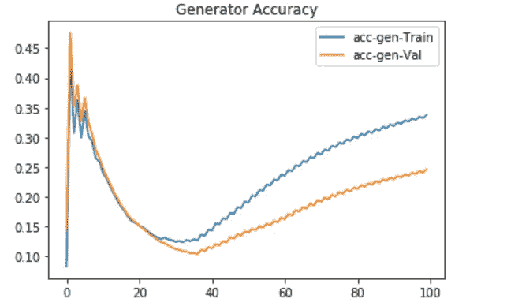

# 从给定草图自动生成彩色图像

> 原文：<https://medium.com/analytics-vidhya/automating-color-image-generation-from-a-given-sketch-22243ae0a339?source=collection_archive---------6----------------------->


草图和相应的彩色图像(取自 Kaggle 数据集)

我们将尝试一些深度学习方法来生成彩色图像。

# 目录:

1.  商业问题
2.  先决条件
3.  深度学习的使用
4.  现实世界/业务目标和约束
5.  数据来源
6.  现有方法
7.  丰富
8.  加载数据:读取图像文件
9.  探索性数据分析
10.  第一次切割溶液
11.  监督学习的性能度量
12.  第一个模型-U-net
13.  第二种模式——生成对抗网络
14.  第三种模式——带有“颜色暗示”的生成对抗网络
15.  第四种模式——带有“颜色提示”的 U-net
16.  模型比较
17.  未来的工作
18.  参考

**1。商业问题**

图像处理中的许多问题涉及将输入图像转换成相应的输出图像。

我们的任务是在**一些深度学习模型的帮助下，从给定的
黑白动漫草图中生成一个兼容的彩色动漫形象。**

以下是给定草图和彩色图像的一些例子-


图一

**2。先决条件**

这篇文章假设读者对视觉任务的深度学习有一定的了解。

**3。深度学习的用途**

我们将尝试使用 U-net 和 GAN CNN 模型生成彩色图像。

模型的输入:-草图图像。

模型输出:-彩色图像

**4。现实世界/业务目标和约束。**

*   没有低延迟要求。
*   生成的图像应具有与原始图像相同的颜色，不应模糊。

**5。数据来源**

我们从下面的 Kaggle 链接下载了数据—

[https://www.kaggle.com/wuhecong/danbooru-sketch-pair-128x](https://www.kaggle.com/wuhecong/danbooru-sketch-pair-128x)

**6。现有方法**

使用生成对抗网络和 U-net 模型解决了一些图像彩色化问题。

**7。改进**

我测试了图像生成模型像素级的不同误差指标

*   绝对平均误差
*   均方误差
*   交叉熵

在所有这些损失函数中，在像素级使用平均绝对误差(L1 距离)似乎产生了最好结果。

并测试了这些方法

*   在 0 到+1 的范围内归一化图像，并使用 Relu 作为图像生成模型的最后一层。
*   在-1 到+1 的范围内归一化图像，并使用 Tanh 作为图像生成模型的最后一层。

第二种方法产生了更好的结果。

还测试了通过颜色提示素描图像。

**8。加载数据:读取图像文件**

由于图像数据的大小是巨大的，我们分批读取它来训练模型。我们实现了以下逻辑来读取图像文件-

a)将所有图像文件的名称加载为“文件夹名+图像名”

b)然后创建训练、验证和测试集，前 20000 幅图像用于训练数据，接下来 3000 幅图像用于验证和测试数据。

```
#Generate List of Train, test and validation images.
img_tr  = img_name[0:20000]
img_val = img_name[20000:23000]
img_tst = img_name[23000:26000]
```

显示了训练、测试和验证数据的形状

```
#Length of train, test and validation data.
print('Number of images in train data:',len(img_tr))
print('Number of images in validation data:',len(img_val))
print('Number of images in test data:',len(img_tst))Number of images in train data: 20000
Number of images in validation data: 3000
Number of images in test data: 3000
```

c)我们编写了一个函数“generate_train_batch”来生成一批训练图像。它使用指针跟踪处理的图像数量。

输入:-带有图像名称的数组，要生成的样本数。

在我们实现的函数中

*   我们使用 cv2.imread 来读取图像。
*   然后使用 cv2.cvtColor 将图像转换为 RGB 格式。
*   还将像素规范化为-1 到+1 格式。

我们使用类似的函数从验证数据中生成一批图像。

**9。探索性数据分析**

我们有火车设置提供草图和相应的彩色图像。每幅图像都是 128 * 128 像素。有三层颜色。

我们有两个文件夹:-

*   草图—拥有草图图像
*   颜色——具有相应的彩色图像。


我们将从这些文件夹中挑选一些图像来训练模型，然后在模型看不到的一些对上进行测试。

**10。第一次切割解决方案**

我已经按照以下步骤实施了解决方案:-

a)首先，我仅采用 GAN 模型的生成器部分(U-net ),并尝试在像素级以平均绝对误差对其进行优化。并分析结果和检查从模型生成的图像。

b)然后实施完整的 GAN 模型，并分析和查看生成的图像。

c)然后在上面的模型中尝试传递颜色提示，看看它如何提高生成的彩色图像的质量。

**11。监督学习的性能指标**

模型产生的图像和我们想要产生的图像之间的差距就是损失函数。我们将通过最小化损失函数来训练 CNN 模型，以便它产生的图像与真实的艺术品相似。

以下是我们用于模型的损失函数—

*   平均绝对误差/ L1 损耗(每像素 L1 距离)
*   二元交叉熵损失来预测生成的图像是真的还是假的(对于 GAN 模型)

12。第一款- U-net


a)模型输入:-草图图像(格式 128*128*3)

b)模型输出:-彩色图像(格式 128*128*3)

c)建筑

所使用的架构类似于编码器-解码器网络。输入通过一系列层，逐步向下采样，直到一个瓶颈层，在这一点上的过程是相反的。这样的网络要求所有信息流通过所有层，包括瓶颈。

对于图像彩色化问题，输入和输出图像共享显著边缘的位置。因此，将这些信息从模型的输入直接传送到输出是可取的。

为了给模型提供一种绕过这种信息瓶颈的方法，我们按照“U-Net”的一般形状，在编码器-解码器模型中添加了 skip 连接。具体来说，我们在第 I 层和第 n I 层之间增加跳跃连接，其中 n 为总层数。每个 skip 连接只是将 I 层的所有通道与 ni 层的通道相连。

总而言之，模型由以下架构组成

a)编码器-解码器:-

*   在该模型中，最初我们在每一层中向下采样图像，直到它到达瓶颈。
*   然后再次开始上采样，直到它达到输出图像的大小。

b)跳过连接:-

在每个上采样层，我们给出两个输入:-

*   Input_1 :-来自前一层的输出
*   Input_2 :-从生成相同尺寸图像的下采样层输出

d)卷积层的参数:-

*   内核大小:-我们使用 5*5 的每个内核
*   步幅:-我们使用步幅值 2
*   填充:-"相同"
*   激活功能:-
*   a)下采样 Layer-leaky relu(α= 0.2)
*   b)上采样层-Relu
*   c)输出层-tanh

*整流线性装置的泄漏型在装置不工作时允许小的梯度。

*   权重初始化:-我们用标准偏差为 0.02 的随机高斯变量初始化所有卷积层。
*   批量归一化:-我们使用动量=0.9 的批量归一化。
*   优化器:- Adam(学习率=0.0002，beta_1=0.5)
*   损失函数:-我们优化了平均绝对误差/ L1 损失(每像素 L1 距离)

请找到下面的代码:-

培训损失与验证损失


每次迭代后，训练和验证损失都在减少。

下图显示了模型生成彩色图像在每 20 个时期后如何改进


使用列车上的最终模型和验证数据生成的彩色图像-


13。第二种模式——GAN

生成对抗模型由两个神经网络组成:-生成模型 G 和鉴别器模型 d。

发生器模型被训练以产生输出，该输出不能被反向训练的鉴别器 d 从“真实”图像中区分出来。鉴别器网络努力区分从训练数据中提取的目标图像和从发生器中提取的目标图像。它产生一个概率值，即生成的图像是真实的训练样本，而不是从模型中抽取的假样本。


来源—[https://www . oreilly . com/library/view/generative-adversarial-networks/9781789139907/E3 CBF 7 b 1-fe09-465d-81ef-2d 4 fcf 0 db 157 . XHTML](https://www.oreilly.com/library/view/generative-adversarial-networks/9781789139907/e3cbf7b1-fe09-465d-81ef-2d4fcf0db157.xhtml)

生成和鉴别器模型是卷积层、ReLU 和批量归一化的组合。

**a)发电机型号:-**

该模型与我们在上一节中讨论的 U-net 模型相同。唯一的区别是我们不会编译这个单元。

它被训练生成彩色图像，这将欺骗鉴别器，它的真实彩色图像。

**b)鉴别器型号:-**

与发生器相比，鉴别器只有编码器单元。它旨在分类输入的草图-图像对是“真”还是“假”。

训练鉴别器模型来分类彩色图像是真实的还是生成的彩色图像。训练网络以最大化分类精度。


以下是鉴别器单元的元件—

a)模型输入:-彩色图像(格式 128*128*3)

b)模型输出:-指示生成的彩色图像是真的还是假的概率。真实意味着来自目标域的图像是源图像的真实翻译。

c)架构:-我们使用了上述 U-net/ Generator 模型的下采样部分。

卷积层的参数:-

*   内核大小:-我们使用 5*5 的每个内核
*   步幅:-我们使用步幅值 2
*   填充:-"相同"
*   激活函数:- LeakyRelu (alpha=0.2)
*   输出图层-展平，然后是 Sigmoid。
*   权重初始化:-我们用标准偏差为 0.02 的随机高斯变量初始化所有卷积层。
*   批量归一化:-我们使用动量=0.9 的批量归一化。
*   优化器:- Adam(学习率=0.0002，beta_1=0.5)
*   损失函数:-'二元交叉熵'

**c)甘单位:-**

我们将上面详细描述的发生器和鉴别器结合起来形成一个 GAN 单元。

在 GAN 单元中，我们仅更新发电机模型的权重。因此，我们将 discriminator 的可训练参数设置为 False，以便在训练该单元时不会更新其权重。

discriminator.trainable = False

发电机模型被训练来欺骗鉴别器。

*   输入:-这个模型有两个输入-

I)草图图像(128*128*3)

ii)彩色图像(128 *128*3)

*   输出:-来自鉴别器模型的输出，指示彩色图像是真的还是假的概率
*   优化器:- Adam(学习率=0.0002，beta_1=0.5)
*   损失函数-

I)我们使用真实彩色图像和通过生成器生成的彩色图像之间的像素级 L1 距离作为损失函数。

L1 损失会影响与输入匹配的地面真实输出(彩色图像)和可能不匹配的合成输出(生成的彩色图像)之间的距离。

ii)和二进制交叉熵，将图像视为真实的并从鉴别器模型输出。

注意:-我们使用加权损失-100 *像素级 L1 损失+二进制交叉熵。

**d)模特培训:-**

为了训练模型，我们在鉴别器上交替一个梯度下降步骤，然后在发生器上交替一个步骤。我们使用小批量随机梯度下降并应用 Adam 优化器。

首先，我们通过用真实和虚假图像单独训练鉴别器模型来确定鉴别器模型是否正确。然后，依次训练鉴别模型和对抗模型。

生成模型 G 的训练目标是增加鉴别器模型 D 的错误率(即，通过制造看起来来自真实数据分布的新的合成实例来“愚弄”鉴别器)。

在训练 GAN 模型时，我们在每个时期都做了以下工作

I)我们使用了 32 号浴缸。

ii)我们仅在交替迭代中训练鉴别器模型。

iii)训练鉴别器模型-

*   我们生成了一批图像来训练。
*   将目标图像视为真实图像来训练鉴别器。
*   然后训练鉴别器，认为生成的图像是假的。
*   存储损耗和精确度

四)训练甘模型-

*   我们生成了一批训练图像，并在此基础上训练了 GAN 模型。
*   发生器被训练来欺骗鉴别器，并且在 L1 意义上接近地面真实输出。

v)每 20 个时期后，我们绘制结果并打印生成的图像以跟踪进展。

**e)模型结果:-**

发电机损耗-


训练和验证数据损失似乎都在改善。

鉴频器损耗-


此外，鉴别器模型损耗随着时期的增加而改善。

鉴频器精度-


随着 GAN 模型开始学习，鉴别器精度下降，但后来又开始提高。

发电机精度-


一段时间后，验证数据的发电机精度开始下降，因为模型当时没有从验证数据中学到太多东西。

下图显示了模型生成彩色图像在每 20 个时期后如何改进


使用经过训练的最终模型生成的图像


**14。第三种模式——带有“颜色提示”的 GAN(生成对抗网络)**

对于一个看不见的图像，仅仅从草图图像中看到轮廓是很难预测颜色的。因此，我们尝试在草图图像中沿着轮廓边缘传递颜色提示。

以下是一些带有颜色提示的草图图像示例-


为了传递颜色提示，我们在目标彩色图像上应用了一个大 32px 半径的模糊

```
X_sketches[i] = 0.5 *(X_sketches[i] + cv2.blur(X_color[i],(32,32)))
```

**结果**

发电机损耗-


训练和验证数据损失似乎都在改善。此外，颜色提示提高了验证图像的性能。

鉴频器损耗-


鉴别器模型损耗随着时代的增加而不断改善。

鉴频器精度-


鉴别器模型的准确性最初下降，然后随着时期的增加而提高。

发电机精度-



随着训练和验证数据的出现，发生器的准确性得到提高。

下图显示了模型生成彩色图像在每 20 个时期后如何改进


使用经过训练的最终模型生成的图像


15。第四种型号—带“颜色提示”的 U-net

在之前的模型中，我们已经使用模糊图像为所有像素提供了颜色提示，这可能很困难。所以，我们试着给目标图像的一些像素颜色提示。

以下是一些带有颜色提示的草图图像示例-


我们使用下面的代码传递了 20 个 7*7 像素的小块的提示

```
#Set of pixels to pass color hints from target image.pix1=[64,32,96,32,96,32,64,64,96,16,32,16,16,64,16,96,112,112,96,80]pix2=[64,32,96,96,32,64,32,96,64,16,16,32,64,16,96,16,112,96,112,80]#Loop below to generate color hints for all images in sample.for i in range(n_samples): #Passing hints for 20 patches of 7*7 for l in range(20): #Populating color hints for a patch of 7*7 for j in range(7): for k in range(7): X_sketches[i,pix1[l]+j,pix2[l]+k] =  
               X_color[i,pix1[l]+j,pix2[l]+k]
```

**结果**

培训损失与验证损失


验证损失在第 40 个纪元之前有所改善，之后一直停滞不前。此外，获得的损失更好的提示。

下图显示了模型生成彩色图像在每 20 个时期后如何改进


使用经过训练的最终模型生成的图像


**16。型号对比**


通过颜色提示，验证图像的性能有了很大的提高。

**17。未来工作**

我们可以尝试在鉴别器模型中使用补丁。

18。参考文献

*   导师:-[https://www.appliedaicourse.com/](https://www.appliedaicourse.com/)
*   [https://machine learning mastery . com/a-gentle-introduction-to-pix 2 pix-generative-adversarial-network/](https://machinelearningmastery.com/a-gentle-introduction-to-pix2pix-generative-adversarial-network/)
*   [https://machine learning mastery . com/up sampling-and-transpose-convolution-layers-for-generative-adversarial-networks/](https://machinelearningmastery.com/upsampling-and-transpose-convolution-layers-for-generative-adversarial-networks/)
*   [https://arxiv.org/pdf/1611.07004v1.pdf](https://arxiv.org/pdf/1611.07004v1.pdf)
*   [https://machine learning mastery . com/practical-guide-to-gan-failure-modes/](https://machinelearningmastery.com/practical-guide-to-gan-failure-modes/)
*   [https://www.kaggle.com/wuhecong/danbooru-sketch-pair-128x](https://www.kaggle.com/wuhecong/danbooru-sketch-pair-128x)
*   [https://github.com/kvfrans/deepcolor/blob/master/main.py](https://github.com/kvfrans/deepcolor/blob/master/main.py)
*   [https://towards data science . com/sketch-to-color-anime-translation-using-generative-adversarial-networks-gans-8f4f 69594 aeb](https://towardsdatascience.com/sketch-to-color-anime-translation-using-generative-adversarial-networks-gans-8f4f69594aeb)
*   [https://arxiv.org/pdf/1808.03240.pdf](https://arxiv.org/pdf/1808.03240.pdf)
*   [http://kvfrans . com/coloring-and-shading-line-art-automatically-through-conditional-gans/](http://kvfrans.com/coloring-and-shading-line-art-automatically-through-conditional-gans/)
*   [https://arxiv.org/pdf/1705.01908v2.pdf](https://arxiv.org/pdf/1705.01908v2.pdf)
*   https://arxiv.org/pdf/1705.02999.pdf

*你可以在* [*GitHub*](https://github.com/shridharpr/Anime-Sketch-Colorization-Pair) *上找到我的代码。也可以* [*直接发邮件给我*](http://priyadarshi.cse@gmail.com) *或者* [*在 LinkedIn*](http://www.linkedin.com/in/shridhar-priyadarshi-79b96312) *上找我。*