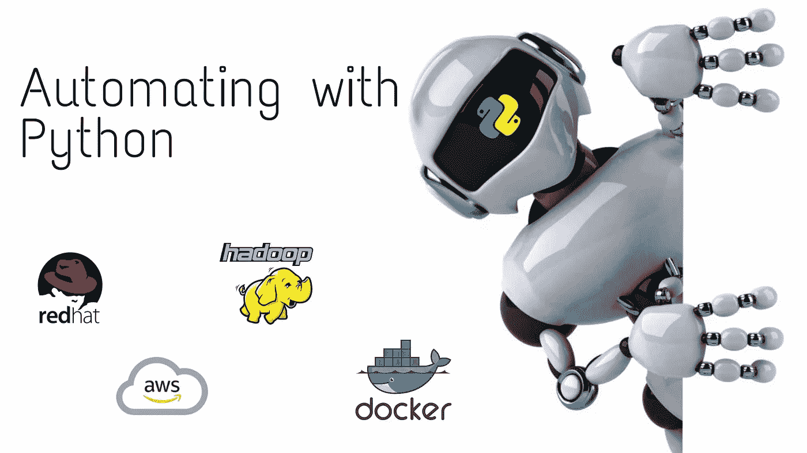
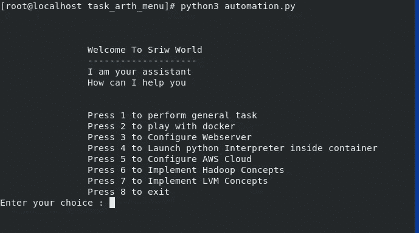
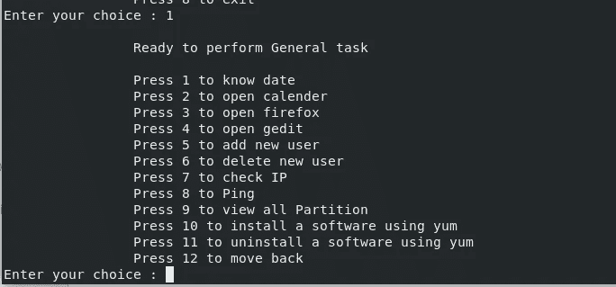
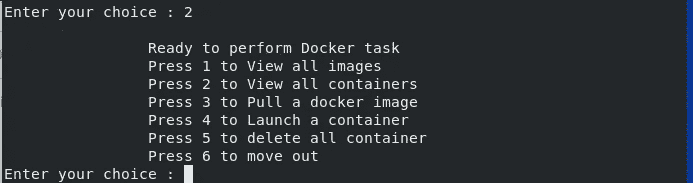
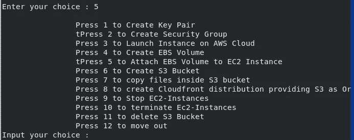
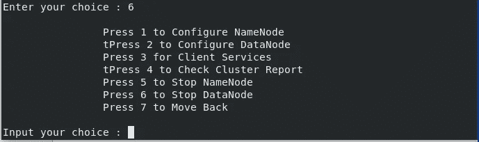
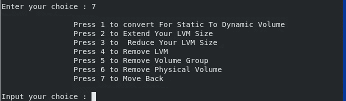

# 使用 Python 自动化不同的技术

> 原文：<https://medium.com/analytics-vidhya/automating-different-technologies-using-python-85542b1929a6?source=collection_archive---------12----------------------->



**自动化**是一种在最少人工协助下执行流程或程序的技术。创建软件和系统以取代可重复过程并减少人工干预的过程。

我已经创建了**一个菜单驱动的程序，它给用户设置和管理 Linux 操作，Docker，Hadoop，AWS 的权力。**

你只需要一个运行命令

```
python3 automation.py 
```

在这个视频中解释了整个程序及其实现:

链接到 Github:[https://github.com/sarthak-sriw/arth_automation_task](https://github.com/sarthak-sriw/arth_automation_task)

## 主菜单:



每个任务中都有一个子任务:

## 一般任务

执行一般任务的主菜单选项 1。它可以打开

*   日历
*   日期
*   创建新用户
*   删除用户
*   用于检查系统 IP
*   对于 Ping
*   用于查看 Linux 中的所有磁盘分区
*   使用 yum 安装软件
*   使用 yum 卸载软件
*   打开浏览器



## 码头工人

Docker 是一个开源的容器化软件，可以创建隔离的环境来运行应用程序。Docker 使您能够将应用程序从基础设施中分离出来，这样您就可以快速交付软件。使用 Docker，您可以像管理应用程序一样管理基础设施。

以下是 docker 包含的一些功能:

*   发射容器
*   查看所有图像
*   查看所有正在运行的容器
*   提取所有图像
*   删除容器



要获得更多关于这项技术的信息，请参考我的博客

[](https://sarthak3398.medium.com/how-to-install-wordpress-on-docker-using-mysql-backend-1611641d14ac) [## 如何使用 MySQL 后端在 Docker 上安装 WordPress

### Docker 是一个开源的容器化软件，可以创建隔离的环境来运行应用程序。

sarthak3398.medium.com](https://sarthak3398.medium.com/how-to-install-wordpress-on-docker-using-mysql-backend-1611641d14ac) 

## 启动 Web 服务器和 Python 解释器

一个**网络服务器**是**服务器**软件，或者专用于运行该软件的硬件。

[](https://sarthak3398.medium.com/launching-webserver-and-python-interpreter-on-docker-container-2718ce2994cb) [## 在 Docker 容器上启动 web 服务器和 Python 解释器

### Docker 是一个开源的容器化软件，可以创建隔离的环境来运行应用程序。码头工人…

sarthak3398.medium.com](https://sarthak3398.medium.com/launching-webserver-and-python-interpreter-on-docker-container-2718ce2994cb) 

## AWS Cli 命令

**AWS 命令行界面** (CLI)是管理 AWS 服务的统一工具。只需下载和配置一个工具，您就可以从命令行控制多个 AWS 服务，并通过脚本实现自动化。

aws-cli 包括以下功能

*   要创建密钥对
*   要创建安全组
*   启动实例
*   创建 EBS 卷
*   将卷附加到实例
*   推出 S3 服务
*   将文件复制到 S3
*   创建云锋分布
*   停止实例
*   删除 S3
*   删除实例



要获得更多关于这项技术的信息，请参考我的博客

[](https://sarthak3398.medium.com/designing-high-availability-architecture-with-s3-and-cloudfront-67684d6aa879) [## 利用 S3 和 CloudFront 设计高可用性架构

### AWS 云锋

sarthak3398.medium.com](https://sarthak3398.medium.com/designing-high-availability-architecture-with-s3-and-cloudfront-67684d6aa879) [](/analytics-vidhya/launching-ec2-instance-using-cli-and-attaching-ebs-volume-6ce00456e55d) [## 使用 CLI 启动 EC2 实例并连接 EBS 卷

### 先决条件:

medium.com](/analytics-vidhya/launching-ec2-instance-using-cli-and-attaching-ebs-volume-6ce00456e55d) 

## 配置 Hadoop

我正在使用 python 配置 Hadoop 集群，并提供以下功能

*   正在启动 Namenode 服务
*   正在启动 Datanode 服务
*   对于客户服务
*   检查集群报告
*   停止 Datanode
*   停止 Namenode



## 配置 LVM

LVM 代表逻辑卷管理。它是一个管理逻辑卷或文件系统的系统，比传统的将磁盘分区为一个或多个段并用文件系统格式化该分区的方法更加先进和灵活。

LVM 命令包括以下功能

*   静态到动态
*   扩大你的 LVM 尺寸
*   缩小你的 LVM 尺寸
*   移除 LVM
*   删除卷组
*   删除物理卷



要获得更多关于这项技术的信息，请参考我的博客

[](https://www.linkedin.com/pulse/integrating-lvm-hadoop-providing-elasticity-datanode-srivastava/) [## 将 LVM 与 Hadoop 集成并为 DataNode 存储提供弹性

### 将 LVM 与 Hadoop 集成并为 DataNode 存储提供弹性什么是 LVM？LVM 是逻辑卷的工具…

www.linkedin.com](https://www.linkedin.com/pulse/integrating-lvm-hadoop-providing-elasticity-datanode-srivastava/) [](https://www.linkedin.com/pulse/contribution-fixed-storage-datanode-hadoop-cluster-sarthak-srivastava/) [## DataNode 的固定存储对 Hadoop 集群的贡献

### Hadoop : Hadoop 是一个开源框架，允许在分布式环境中存储和处理大数据…

www.linkedin.com](https://www.linkedin.com/pulse/contribution-fixed-storage-datanode-hadoop-cluster-sarthak-srivastava/)