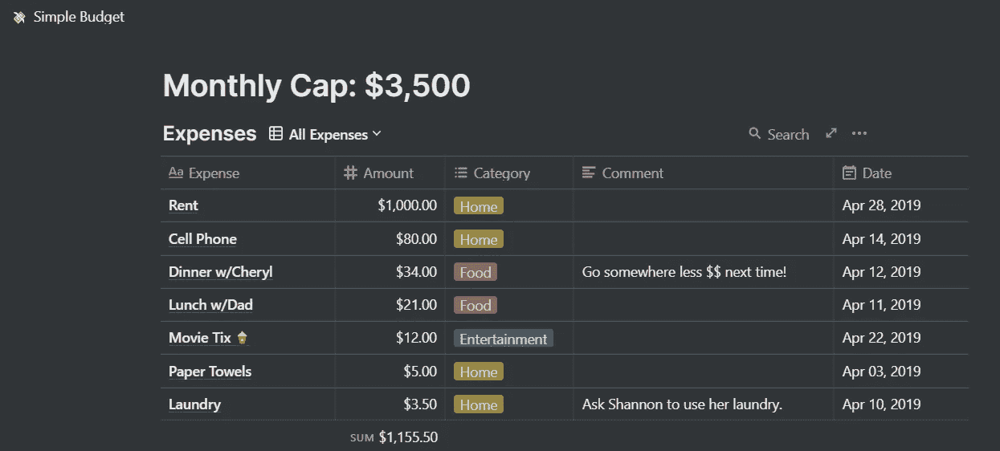
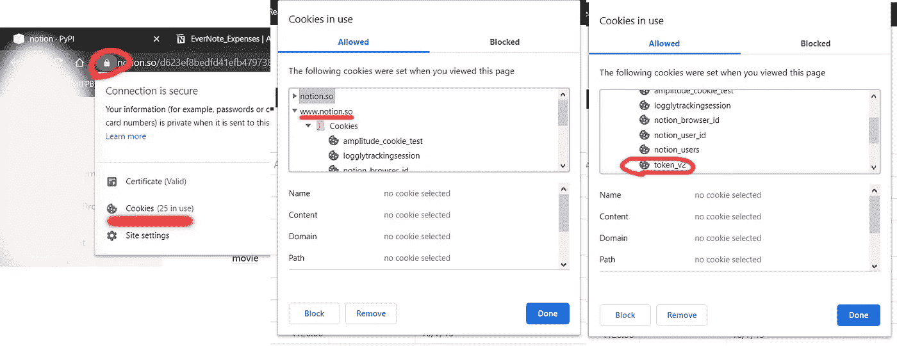
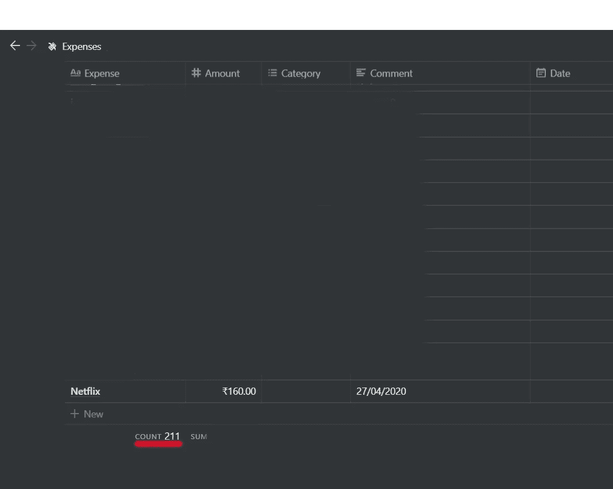

# 使用 idea-py 自动化概念

> 原文：<https://medium.com/analytics-vidhya/automating-notion-using-notion-py-fa0f2e8f089e?source=collection_archive---------15----------------------->

我最近开始使用[概念](https://en.wikipedia.org/wiki/Notion_(app))，感觉棒极了！我用它做任何事情，记笔记，作为一个开支经理，计划项目等等。在 idea 之前，我曾经用 google keep 来记录我的支出，它看起来像这样:


我以前是怎么写费用的

所以基本上只是一堆我的花费，包括金额，我花钱的地方和日期。

概念为管理你的开支提供了一个模板，如下所示:



概念中的默认费用经理模板

这是一个组织得非常好的数据库，带有花哨的颜色编码类别，但问题是从我的旧的随意的文本文件中一个接一个地添加条目到这个漂亮的模板中是一项非常乏味的任务。所以在网上搜索了一下，我找到了这个叫做 n [otion-py](https://pypi.org/project/notion/) 的神奇图书馆。

opinion-py 是一个免费的库，允许你操作你的概念块和数据库。根据他们的官方网站，这是一个“T4 概念的非官方 Python 3 客户端，所以是 API v3”。《观念-py》的作者在 medium 上也有一个博客[你可以在这里找到](/@jamiealexandre/introducing-notion-py-an-unofficial-python-api-wrapper-for-notion-so-603700f92369)。*(我与他们的团队没有联系，我只是在搜索对概念的 API 支持时偶然发现了这个库)*

所以首先，我必须将数据转换成包含费用、成本和日期的三个数组。我用下面的代码做到了:

```
#Open file
raw_data = []
with open("Expenses.txt", "r") as f:
    for line in f:
        if (line):
            raw_data.append(line)

#Get cost in one array(cost[]) & date, expense in second array(data_to_be_formatted)    
cost = []
data_to_be_formatted = []        
for line in raw_data:
    a,b = line.split(' ', 1)
    cost.append(a)
    data_to_be_formatted.append(b)

#Convert str(cost) -> int(cost)    
cost_numeric = []
for t in cost:
    t=int(t)
    cost_numeric.append(t)

#APPEND '_' for ' ' and then split at first '_' in next loop    
count = 0
for line in data_to_be_formatted:
    line_length = len(line)
    for i in range(0,line_length):
        if(line[i]==' '):
            temp = list(line)
            temp[i] = '_'
            line="".join(temp)
    data_to_be_formatted[count] = line
    count = count+1

#Split at first '_' to get date and expense
expense = []
date = []    
for line in data_to_be_formatted:
    a,b = line.rsplit('_',1)
    expense.append(a)
    date.append(b)
```

我确实意识到这可能不是最好的完成方式，但是我仍然在学习 python，这很有效；).如果你有什么建议，请告诉我！:)

在我得到三个数组 cost[ ]，expense[ ]，date[ ]，之后，我继续进行在他们的文档中给定的[的 idea-py API 调用。](https://pypi.org/project/notion/)

代码如下所示:

```
from notion.client import NotionClient
# Obtain the `token_v2` value by inspecting your browser cookies on a logged-in session on Notion.so
client = NotionClient(token_v2="YOUR_V2_TOKEN_HERE")

#GET YOUR COLLECTION/VIEW/DATABASE
cv = client.get_collection_view("YOUR_DB_URL_HERE")

i=0
#Get the values for each row
for Cost, Expense, Date in zip(cost_numeric, expense, date):
    #Add New Row
    row = cv.collection.add_row()
    #Add Values
    row.Expense = Expense
    row.Amount = Cost
    row.Comment = Date
    #Print progress
    print("Completed {} entries".format(i+1))
    i=i+1
```

注意:我在注释中添加了日期，因为概念中的日期需要日期时间对象，而日期是字符串。我可以把它转换成日期时间，但是坦白地说，我忘记了。:/

v2 令牌的获取方式如下:



如何获取 token_v2 参数

单击它并复制内容部分中的值。

瞧，所有的开销都毫不费力地转移到了观念上。



我还制作了一个 Android 应用程序来添加记录，就像我之前添加的一样，(作为一个简单的文本字符串)，然后将其添加到概念数据库中。你可以在这里读到它[。我希望这能对你有所帮助。](/@prathu10/android-app-for-notion-automation-using-chaquopy-863e72fa4ecd)

下次见。干杯！