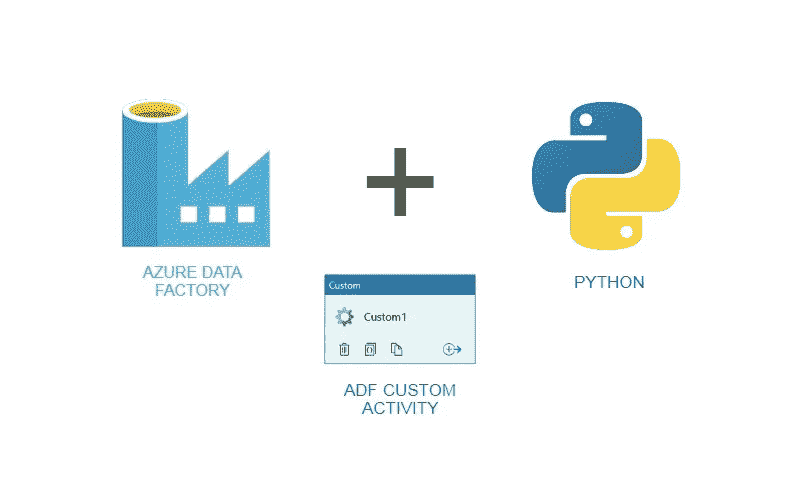

# 用 Azure 自动化基于 Python 的数据转换

> 原文：<https://medium.com/analytics-vidhya/automating-python-based-data-transformations-with-azure-297218478fb7?source=collection_archive---------6----------------------->

## 如何利用 Python 以及 Azure 数据工厂和批处理服务的能力来自动化数据操作

在我担任新角色之前，我所做的工作主要集中在转换数据，分析数据，并从中构建有洞察力的仪表板和可视化。我是数据的消费者…