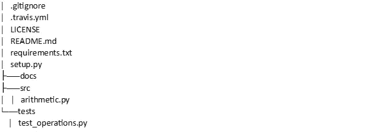
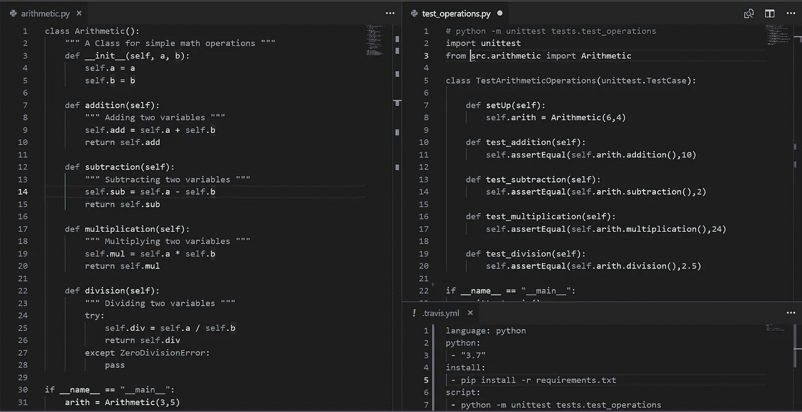
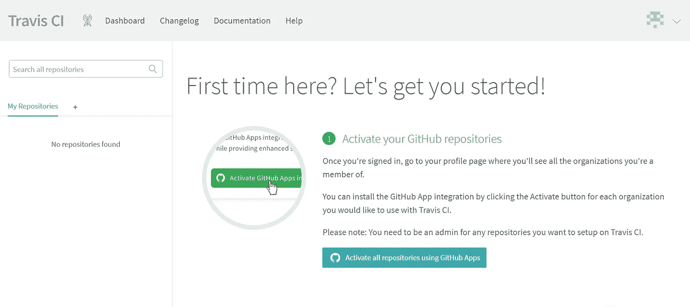
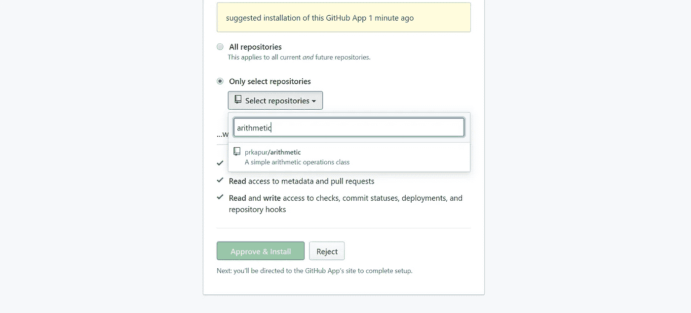
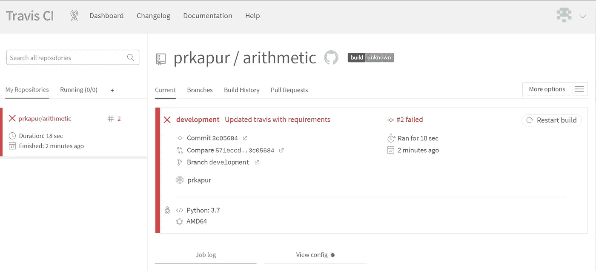
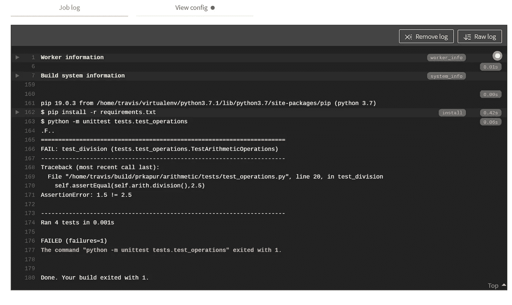
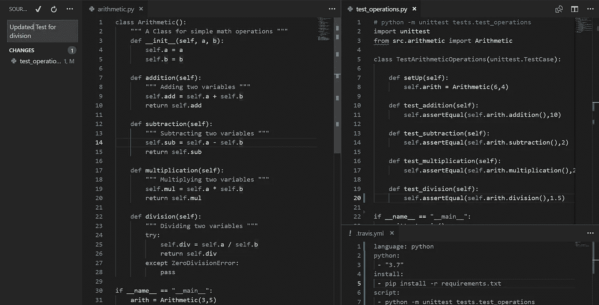
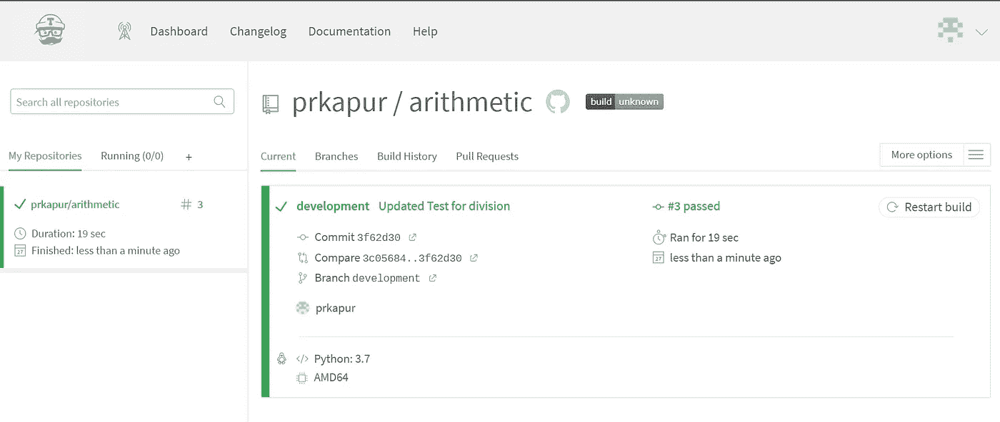
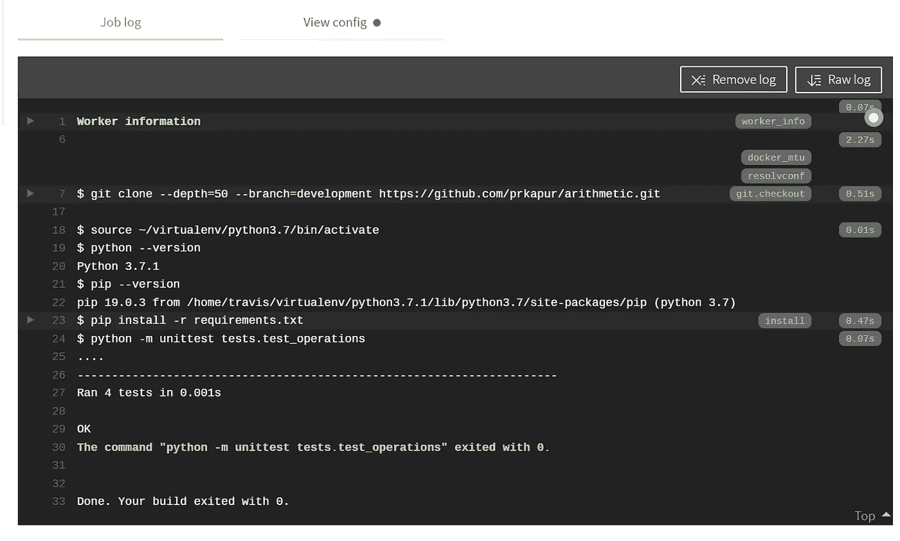

# 使用 Travis CI 自动化 Python 单元测试

> 原文：<https://medium.com/analytics-vidhya/automating-python-unit-testing-using-travis-ci-be4fc965c1c0?source=collection_archive---------3----------------------->

本文简要介绍了如何使用单元测试模块为 python 脚本设置自动化测试，以及如何使用存储在 GitHub 上的存储库 [Travis CI](https://travis-ci.org/) 设置 CI 管道。

虽然测试可以在本地完成，但是 CI 管道可以确保测试在代码被推送到存储库时一直运行，而且 Travis CI 与 Python 配合得很好。

这个简单的程序执行算术运算，并对算术类中定义的方法运行单元测试。该目录的组织如下所示。

该测试已被放置在以“test_”开头的 tests 文件夹中。这允许测试被发现。测试脚本使用 setUp 方法初始化算术类，并运行 assert equal 测试。

. travis.yml 文件包含 travis 的配置，包括测试需要设置的环境以及是否需要安装任何依赖项。

对于 test_division 测试，assert equal 函数被设置为 fail，只是为了显示测试失败时的结果。

Travis CI 需要链接到 GitHub 并激活存储库。

我选择了只允许访问算术存储库。

一旦被激活并链接到 GitHub，代码被推送到开发分支，在测试被设置为失败的场景中，测试失败，如下所示。

作业日志显示了安装需求文件和运行测试的执行流程，测试失败并显示 AssertionError: 1.5！=2.5，测试期望该值为 1.5

在用第 20 行中正确的除法值更新 test_operations.py 文件后，

代码再次被推送到开发分支，Travis 拿起存储库，自动运行测试，这次通过了测试，

作业日志运行了 4 个测试，构建成功退出。

我希望这篇文章是有用的，附带的 GitHub 库可以在[这里](https://github.com/prkapur/arithmetic/tree/development)找到。