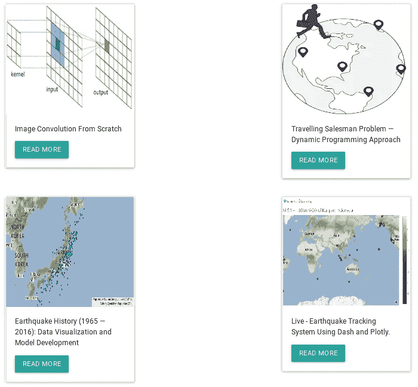
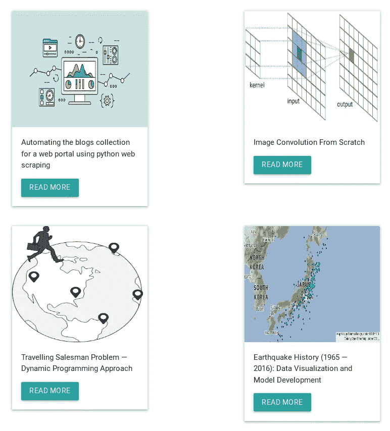

# 使用 python web scraping 为门户网站自动收集博客

> 原文：<https://medium.com/analytics-vidhya/automating-the-blogs-collection-for-a-web-portal-using-python-web-scraping-94442dd98301?source=collection_archive---------10----------------------->

在本文中，我将解释如何使用 python web scraping 自动收集“中型博客”,并将其显示在 web 门户中，而不必不断更新门户。要实现这一点，应该先了解关键的表达式——web 抓取、web 请求和中级 python 编程。


网络抓取——谷歌图片

# 实现背后的想法

我最近开始在 medium 上写博客，我想如果我有自己的门户网站来描述我发表的项目和文章，那该多好。在开发门户时，我想到的一个问题是— *谁会经常更新门户？(介绍进来的新文章，丢弃旧的)。*这么想，我想出了这个可以自动更新门户的程序。

> **注意**:我已经用 python web 框架制作了我的门户。所以对我来说，这是一个自动更新页面的简单方法。

# 程序和实施

因为我在 medium 上写文章，所以我将解释与这个平台相关的过程。对于其他发布平台，可以遵循相同的过程。如果你有一个中等帐户和你写的文章，那么这将是很好的，很好地跟进。

跳转到您的个人资料，看起来类似于`https://medium.com/@<your_name>`。

## 编程部分

```
>>> import requests
>>> from bs4 import BeautifulSoup
>>> import string>>> URL = https://medium.com/@<your_name>
>>> page = requests.get(URL) # request status
>>> soup = BeautifulSoup(page.content, 'html.parser') # source
```

页面的整个源代码存储在一个名为`soup`的变量中。我们正在通过`URL`发出一个 web 请求。如果我们仔细看，每篇文章的标题都是大而粗的。我们对特定的`<a>...</a>`更感兴趣，它包括关于文章的全部信息，即'*标题'*、'*链接'*和'*拇指 _ 图像'*。

```
>>> anchors = soup.find_all('a', href=True)
>>> titles = soup.find_all('h1')
>>> article_section = []
>>> for a in anchors:
...     for h in titles:
...         if str(h.text) in str(a.h1):
...             article_section.append(str(a))
...
```

`article_section`是包含文章信息的列表。它基本上由用`,`分隔的每篇文章的`html`代码组成。下面是通过上面的代码获得的伪响应。

```
['<a href="..." rel="noopener">
 <div>
  <div class="..."></div>
  <section class="...">
   <div>
    <h1 class="..." id="...">Title</h1>
   </div>
   <figure class="...">
    <div class="...">
     <div class="...">
      <div class="...">
       <div class="...">
        
       </div>
       
       <noscript>
        
       </noscript>
      </div>
     </div>
    </div>
   </figure>
   <p class="..." id="...">content of the article</p>
  </section>
 </div>
</a>', '<a>...</a>', '<a>...</a>', ..., '<a>...</a>']
```

我们需要在门户网站上展示每一篇具有特定设计(CardView)的文章。有三件主要的事情可以满足这个需求。它们是——文章链接、缩略图和文章标题。

要获得一篇文章的缩略图，我们必须获取每篇文章的源，并获取当文章打开时可以查看的图像链接。因此文章链接是必需的。

```
>>> title_link = {}
>>> for each_anch in article_section:
...     arty_soup = BeautifulSoup(each_anch, 'html.parser')
...     arty_link = arty_soup.find('a', href=True)
...     arty_title = arty_soup.find('h1')
...     h_ref = arty_link['href'].split('?')[0]
...     blog_link = 'https://medium.com' + str(h_ref)
...     title_link[str(arty_title.text)] = blog_link
...
```

`title_link`是一个字典，其文章标题为`key`，文章链接为`value`。下面可以看到一个虚拟结果。

```
>>> print(title_link)
{'title 1': 'article_link 1', 
 'title 2': 'article_link 2',
 'title 3': 'article_link 3',
 'title 4': 'article_link 4',
 'title 5': 'article_link 5'}
```

现在我们有了所有的文章链接，很容易得到缩略图链接，同样的程序。

```
def get_img_link(blog_link): blog = requests.get(blog_link)
 soup = BeautifulSoup(blog.content, 'html.parser')
 metas = soup.find_all('meta') cons = []
 for meta in metas:
  if '.jpeg' in str(meta):
   cons.append(str(meta['content']))
  if '.png' in str(meta):
   cons.append(str(meta['content']))
  if '.jpg' in str(meta):
   cons.append(str(meta['content'])) con_len = len(cons)
 default_thumb_img = '...'
 if (con_len <= 2) and (con_len > 0):
  thumb_img = cons[0]
 elif (con_len == 0):
  thumb_img = default_thumb_img
 else:
  thumb_img = default_thumb_img

 return thumb_img
```

上面的函数用于获取每篇文章的缩略图。

```
>>> ti_li_img = []
>>> for title, link in title_link.items():
...     ti_li_img.append({title : [link, get_img_link(link)]})
...
```

`ti_li_img`是一个包含所有 3 个重要因素的列表——标题、链接和图片，它们是制作卡片视图所必需的。这是一个具有字典值的列表，其中每个字典包含标题为`key`和`[link, image]`为`value`。下面可以看到一个虚拟结果。

```
>>> print(ti_li_img)
[
 {'title 1': ['article_link 1', 'image 1']},
 {'title 2': ['article_link 2', 'image 2']},
 {'title 3': ['article_link 3', 'image 3']},
 {'title 4': ['article_link 4', 'image 4']},
 {'title 5': ['article_link 5', 'image 5']},
]
```

现在一切都准备好了。我们准备开发博客页面，在 CardView 中显示所有文章。我们将利用`dash_bootstrap_components`和`dash_html_components`进行设计。

```
>>> import dash_bootstrap_components as dbc
>>> import dash_html_components as html
>>> import dash>>> external_stylesheets = [
 dbc.themes.BOOTSTRAP, dbc.themes.GRID,
 '[https://cdnjs.cloudflare.com/ajax/libs/materialize/1.0.0/css/materialize.min.css'](https://cdnjs.cloudflare.com/ajax/libs/materialize/1.0.0/css/materialize.min.css'),
]
>>> external_scripts = [
 '[https://cdnjs.cloudflare.com/ajax/libs/materialize/1.0.0/js/materialize.min.js'](https://cdnjs.cloudflare.com/ajax/libs/materialize/1.0.0/js/materialize.min.js'),
 '[https://maxcdn.bootstrapcdn.com/bootstrap/3.4.1/js/bootstrap.min.js'](https://maxcdn.bootstrapcdn.com/bootstrap/3.4.1/js/bootstrap.min.js'),
]>>> app = dash.Dash(__name__,
... external_scripts=external_scripts,
... external_stylesheets=external_stylesheets)
...
```

下面的代码用于设计 CardView。

```
>>> blogposts = []
>>> for blog in ti_li_img:
...     for head, info in blog.items():
...         blogposts.append(
...             html.Div([
...                 dbc.Card([
...                     dbc.CardImg(src=str(info[1]), top=True, style={'height' : 230}),
...                     dbc.CardBody([
...                         html.P(str(head), className='card-text'),
...                         html.A(dbc.Button("Read more", color='primary'), href=str(info[0]), target='_blank')
...                     ])
...                 ], style={'width' : '18rem'})
...             ])
...         )
...
```

`blogposts`是一个列表，其中包含每篇文章的 CardView 设计。我已经限制了最多 4 篇文章显示在页面上，因为它将足够灵活，有 2 行，其中每行 2 篇文章。早些时候，我的个人资料中有四篇文章。



以前的结果

发布新文章后，结果会按预期更新。Medium 以堆栈形式存储文章，新文章放在顶部。



更新结果

每当我发表一篇新文章，门户网站就会自动更新，而无需我手动更新。