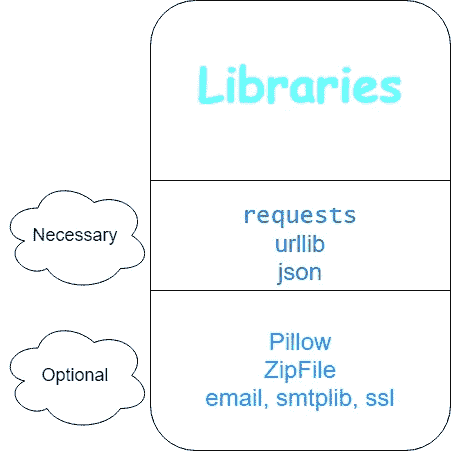
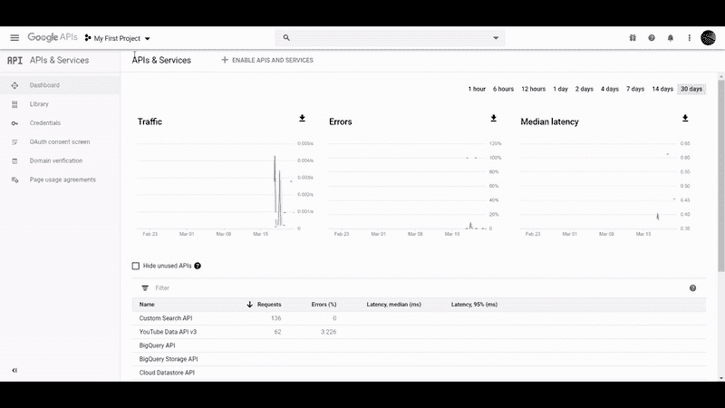
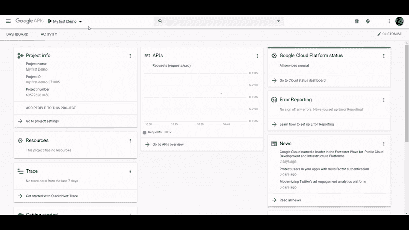
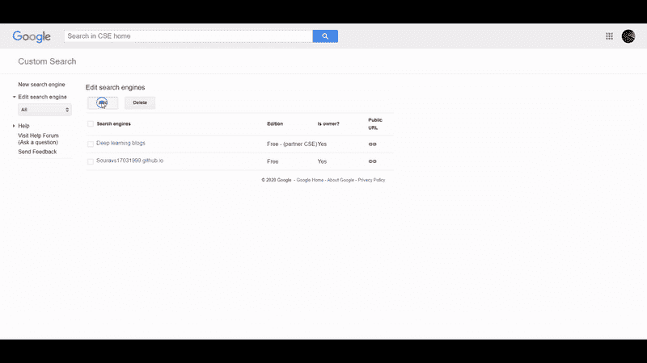
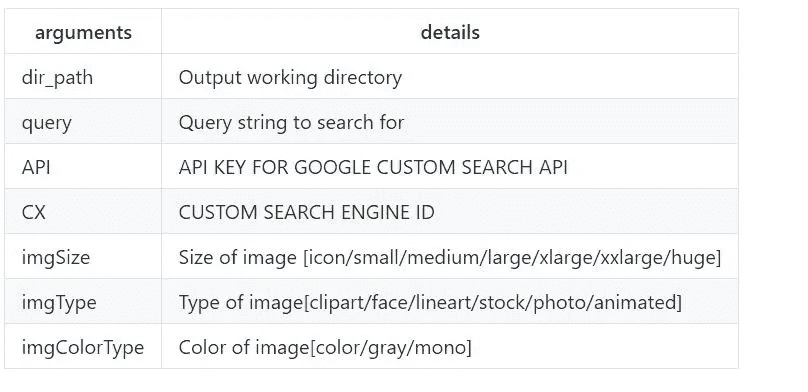
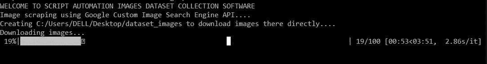
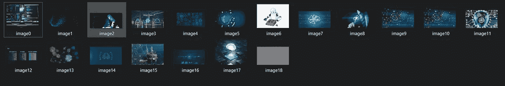
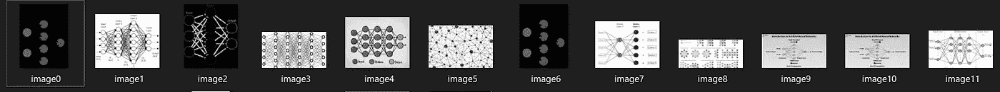
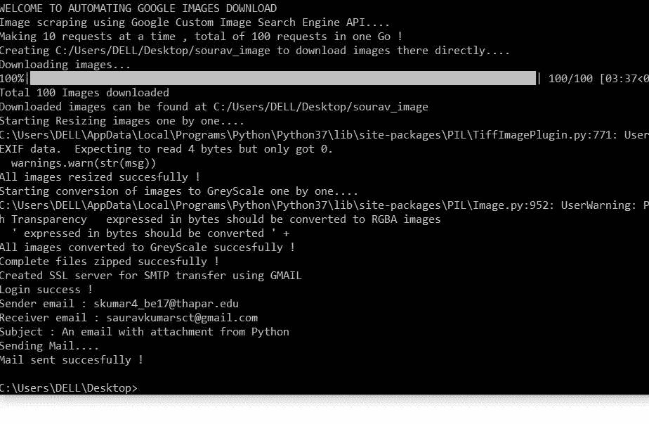
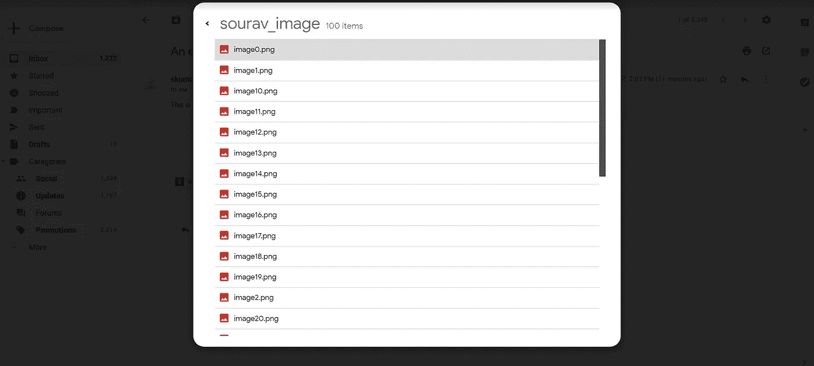

# 自动构建分类数据集管道

> 原文：<https://medium.com/analytics-vidhya/automating-the-building-of-classification-dataset-pipeline-a82aebc14e93?source=collection_archive---------22----------------------->

厌倦了浪费时间手动搜索和下载数据集？


照片由 [Pexels](https://www.pexels.com/photo/person-using-macbook-pro-while-seated-on-couch-3962297/?utm_content=attributionCopyText&utm_medium=referral&utm_source=pexels) 的 [Lisa Fotios](https://www.pexels.com/@fotios-photos?utm_content=attributionCopyText&utm_medium=referral&utm_source=pexels) 拍摄

W 安娜建立了自己的成像数据集，但由于时间有限或其他原因而无法完成？

***数据采集*** 是*数据分析、机器学习和深度学习中的重要步骤之一。这是收集我们感兴趣的信息的过程，在我们的例子中，它是我们想要收集的任何类型的图像。没有数据，我们无法对问题建模并进行分析。*

> 但是谁有时间从网上搜索和下载图片呢，至少软件工程师没有时间😎
> 我们相信尽可能让事情变得更简单！

所以，我们现在就开始吧。

> 目标:

*   👉使用谷歌自定义搜索 API 自动下载图片
*   👉可选:调整图像大小，压缩图像并给自己发送邮件。

> 需要设置:



> 编程:

我们将使用“ [**自定义搜索 JSON API**](https://developers.google.com/custom-search/v1/overview) ”，所以首先让我们设置使用 API 所需的环境。

# 获取访问 API 的凭证所需的步骤:

*   首先，创建一个用于开发(或测试)的 Gmail 账户。
*   接下来，前往[谷歌开发者控制台](https://console.developers.google.com/)，按照以下步骤创建新项目(如果你没有任何项目)，如果你已经有一些正在运行的项目，你可以跳过这一步。



*   从 [API explorer](https://console.developers.google.com/apis/) 中启用 API，并获取凭证作为访问 API 的 API 密钥。



*   创建谷歌自定义搜索引擎[这里](https://cse.google.com/cse/all)将搜索并返回结果。



# 脚本的创建:

现在，让我们看一个如何调用这个 API 的小例子:

所有 API 调用都将对以下 url 发出 GET 请求:

```
https://www.googleapis.com/customsearch/v1?key={API}&cx={CX}&q={query}
```

所有其他参数都通过使用&{parameter_name}={value}类似地附加到链接中。

现在，让我们创建一个函数来获取这个 API 的结果，并将其读入 JSON 格式。然后，按顺序命名文件，将其下载到适当的目录。

让我们定义该函数采用的参数:



*   注意:可以有一个额外的参数(counter ),为了方便起见，它只设置命名文件的开始索引(比如 counter = 0 意味着文件将被命名为 image0，image1…..)

*   首先我们检查目录是否不存在，然后我们开始获取 API。
*   第一个 for 循环从第 5 行开始，用于以名为 URL/links 的列表形式存储所有图像的链接。
*   我们在第 6 行创建 GET 请求，追加尽可能多的参数来过滤搜索。
*   然后，我们在第 7 行使用 json 加载返回结果的文本(字符串形式)。
*   现在，首先我们将从第 9-13 行一次获取 100 张图片的所有 url。

(在一次操作中，Google 将其结果限制为最多 10 个，因此我请求 10 次以获得 100 张图片)。

*   然后，从存储在列表中的所有链接中下载这些图像将在第 23 行开始使用 urllib 中的 urlretrieve()函数。
*   第 27 行的第二个循环使用了 [tqdm](https://github.com/tqdm/tqdm) ，这只是下载过程中显示进度条的一种奇特方式。
*   我们也在处理一些常见的错误，比如一些网站由于隐私问题不允许直接下载，所以我们需要在第 27 行创建我们自己的 POST 安全请求。
*   在这种情况下，我们也以字节形式将它写入目录。
*   现在，在下载完成后，从 39 到 49 的最后几行只是检查目录是否已经存在，然后它给用户选择是否通过删除旧图像再次下载。

> 输出:



用于查询的下载图像的一些例子:“机器学习”:



用于查询的下载图像的一些例子:“神经网络”



> 总结:

我相信这应该给了你一些开始建立你自己的数据集并与社区分享的机会👍

如果您想继续进行项目的可选目标—修改图像，可能转换为灰度(用于构建灰度图像数据集)，压缩图像，然后给自己(或任何人)发送一封包含数据集附件的邮件，然后查看下面参考资料部分中的完整代码。



一些令人兴奋的东西在下面的参考资料部分，一定要去看看。

*注意:所有的图片都是知识共享的，这些图片都有作者的署名，没有署名的都是我的。*

# 资源:

*   包含完整代码的 [Github repo](https://github.com/souravs17031999/Automate-images-download) 包含项目的所有部分，以及在本地机器上开始的说明。
*   这里有一个有趣的 [API explorer](https://developers.google.com/custom-search/v1/cse/list) ，你可以用它来掌握定制搜索 API 的强大功能和更多的参数，根据你的需要过滤你的搜索。
*   安装[请求](https://pypi.org/project/requests/)、 [urllib](https://pypi.org/project/urllib3/) 。
*   💡继续构建一个 GUI 界面，它接受所需的参数，并在给定的输出目录下下载图像。
*   💡我们还可以使用 [Youtube 数据 API V3](https://developers.google.com/youtube/v3/docs) 构建视频数据集。但是让我们把它留到另一篇文章中🙂。