# 使用 AWS Textract 实现表单数据提取和数据库自动化

> 原文：<https://medium.com/analytics-vidhya/automating-your-form-data-extraction-and-data-basing-with-aws-textract-4731961343e?source=collection_archive---------4----------------------->

凯利·西克玛在 [Unsplash](https://unsplash.com?utm_source=medium&utm_medium=referral) 上的照片

如果您所在的环境或行业要求您的同事、客户或委托人手工填写表格，那么您可能面临的一个挑战就是不断地将这些文档输出到数据库或服务器中，以便将来能够更快地进行搜索。

在这种情况下，特定的光学字符识别(OCR)技术可以帮助自动化过程。亚马逊网络服务(AWS)的最新服务是 AWS Textract，这是(像 AWS Rekognition 一样)亚马逊开发的计算机视觉技术。Textract 旨在部署其深度学习算法来检测文本，分析表单数据，并处理表格信息。

因此，如果您希望开发一个完整的面向云的解决方案来提取表单数据，这篇文章将解释部署 AWS 架构来自动化这个过程的过程。

# 语境

在本文记录我的经验之前，我没有使用过任何 Python 或与 AWS 交互过，因此学习如何处理不同的本地 Python IDEs、导航 AWS 接口以及生成输出是一个令人难以置信的学习曲线。理想情况下，下一步是创建一个应用程序，允许你的手机照片和你的表格无缝转换到 S3 桶，以启动这一过程，这将是另一个挑战，可能会在另一篇文章中记录。现在，让我们把注意力集中在云中发生的事情上。

如果你正在阅读这篇文章，我已经写了我应用这个代码的方式，以及一步一步地设置我的 AWS 资源以获得这个项目的最终输出。

# 您部署的服务

## 自动气象站λ

虽然可以在本地 Python IDE 中使用该解决方案；在这种情况下，您需要安装 Boto 3(用于 Python 的 AWS SDK，您可以按照这个[文档](https://boto3.amazonaws.com/v1/documentation/api/latest/index.html)安装)，我们将使用 AWS Lambda 来部署 Textract 算法。您应该注意，如果您直接从 AWS 客户端使用 AWS Lambda(相对于 Python IDE 或无服务器):

*   您会发现 AWS 可以支持一些基本 Python 模块；
*   通过 zip 文件添加新模块可能会禁用 Lambda Python 编辑器；
*   测试你的 Lambda 函数需要更多的时间。

对于本教程，您只需要一个模块，并且可以完全在 AWS Lambda Python 编辑器中工作。AWS Lambda 函数将被触发或触发该过程的一部分。

## AWS S3

为您想要分析的文档/图像提供简单的存储服务。您的 S3 存储桶将容纳输入(pdf、png 或 JPEGs 格式的表单)和输出(JSON 或 CSV 格式的表单键值对)。

## AWS DynamoDB

亚马逊的 NoSQL 数据库服务。这个数据库将存储前面提到的 Lambda 函数输出。对于本教程，期望您从一个现有的空 DynamoDB 表开始。

## AWS 文本摘要

该架构的主要服务。不像其他服务，你不需要在这里设置任何东西。这将被嵌入到你的 Lambda 函数中。

## AWS IAM

身份和访问管理(IAM)帮助 AWS 用户保护访问，并为其他服务创建角色和策略。在这个例子中，我们将使用 IAM 来创建附加到 Lambda 函数的角色。

# 体系结构

添加上述服务是为了创建一个反应式工作流，以达到最终的数据库输出。该体系结构如下面的建议体系结构所示。

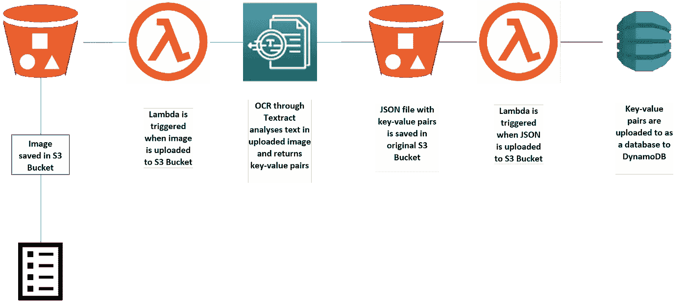

提议的架构

# 基础知识

我们将从基础开始。你的 S3 桶和你的测力台。

我会假设，像我一样，当我开始这个项目时，你不知道如何创建一个 S3 桶。

*   启动 AWS 控制台时，从服务菜单中选择或搜索 S3。

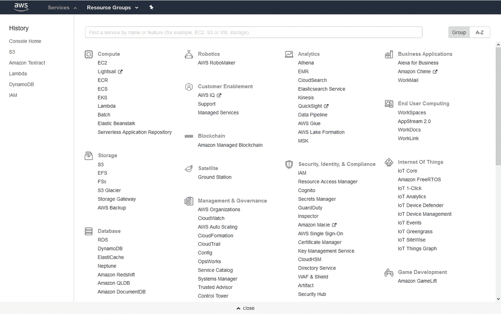

*   在您的 S3 窗口中，选择并单击“创建存储桶”框。
*   输入您的存储桶名称并选择您的地区。您必须跨所有这些服务维护一个区域。对于我的例子，我选择欧盟(爱尔兰)，然后单击“下一步”。
*   在配置选项选项卡中，您几乎可以保留默认值。对于权限选项卡，使用以下公共设置。

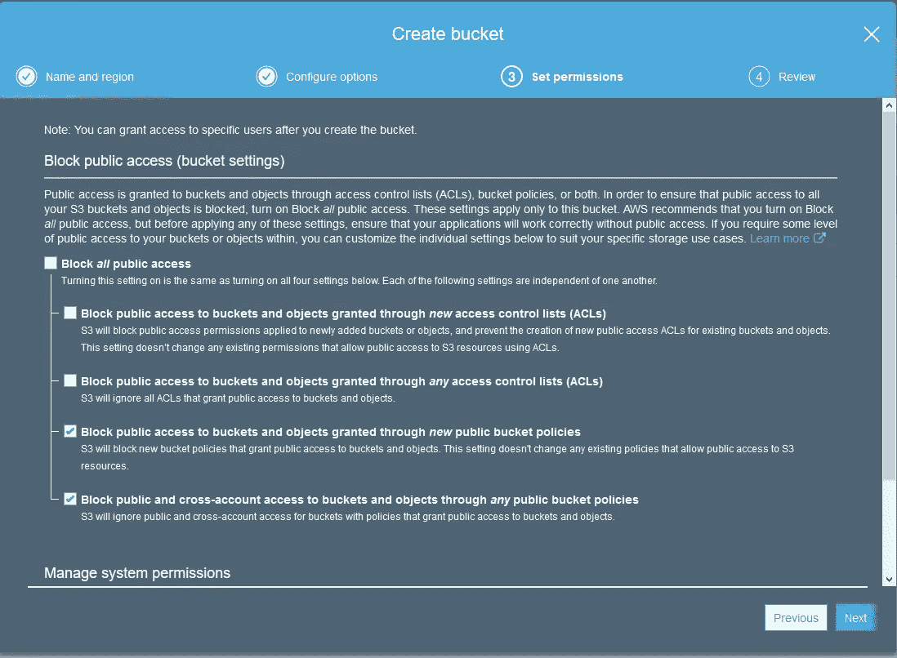

*   单击“下一步”，检查您的存储桶设置，然后在完成 S3 权限后，单击“检查存储桶”。

同样，您也可以创建 DynamoDB 表。您将从服务菜单开始，寻找 DynamoDB。

*   在 DynamoDB 界面点击“创建表格”。

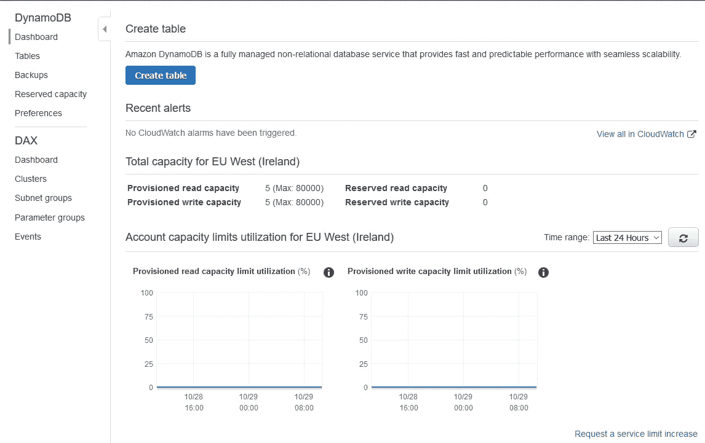

*   给你的表起一个名字，输入你的主键和类型。如果您的表单包含一个数字(ID、表单编号等。)，可以输入 ID，选择类型为 number。

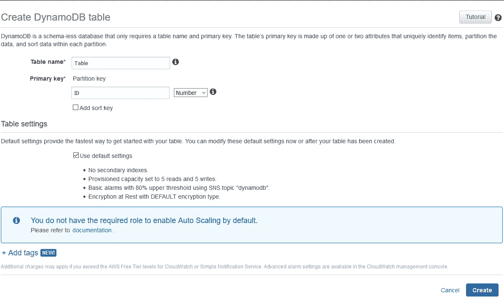

*   保留默认设置，然后单击“创建”完成您的表格设置。

您应该可以开始处理 Lambda 函数和 IAM 角色了，这两者都将在下一步中完成。

# 重要的部分

上面显示的架构需要创建两个 Lambda 函数，每个函数都有自己的 IAM 角色和策略，这就是我们在这里要做的。

## 键值对函数

第一个 Lambda 函数是 S3 到 JSON 函数，它将获取您上传到您创建的 S3 桶中的任何图像或文档，触发该函数，并为同一桶中表单的键值对提供 JSON 输出。

在你的 AWS 控制台中，寻找 Lambda，然后点击“创建函数”。

*   可以从头开始(或作者)；然而，鉴于您正在与 AWS S3 合作，您可以使用一个蓝图来帮助您。
*   在蓝图搜索栏中，查找 S3。
*   从搜索结果中选择 s3-get-object-python，然后单击“配置”

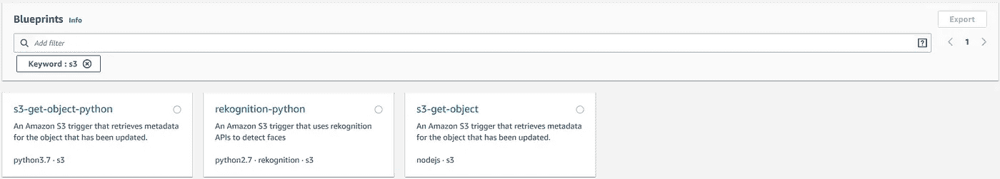

*   给你的函数一个名字。在本例中，它被称为 S3 到 JSON。
*   从“执行角色”下拉列表中选择“从 AWS 策略模板创建新角色”选项，为其命名(如“S3-到-JSON-角色”)，并保留相同的策略模板。

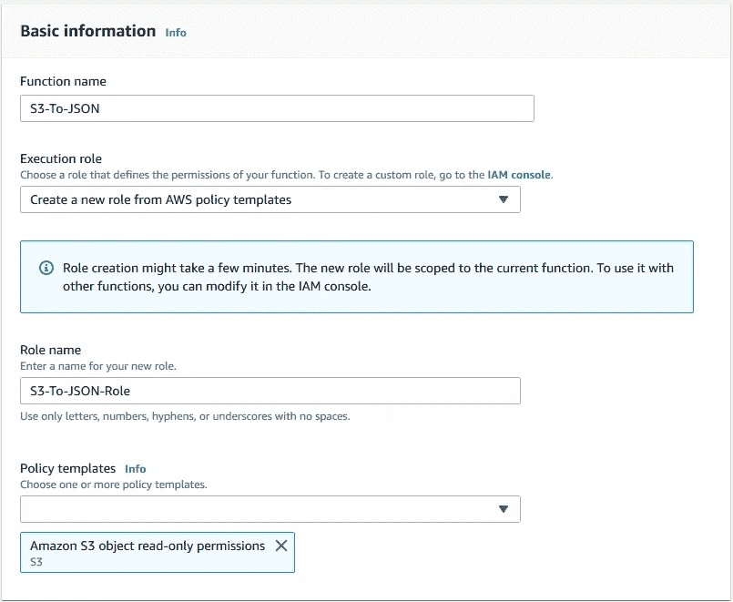

*   在 S3 触发器中，选择 S3 时段作为函数触发器，事件类型为“所有对象创建事件”，然后启用触发器。

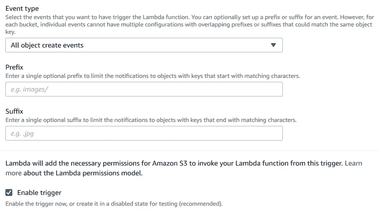

*   单击“创建函数”继续使用 Lambda 函数。您应该看到以下内容。

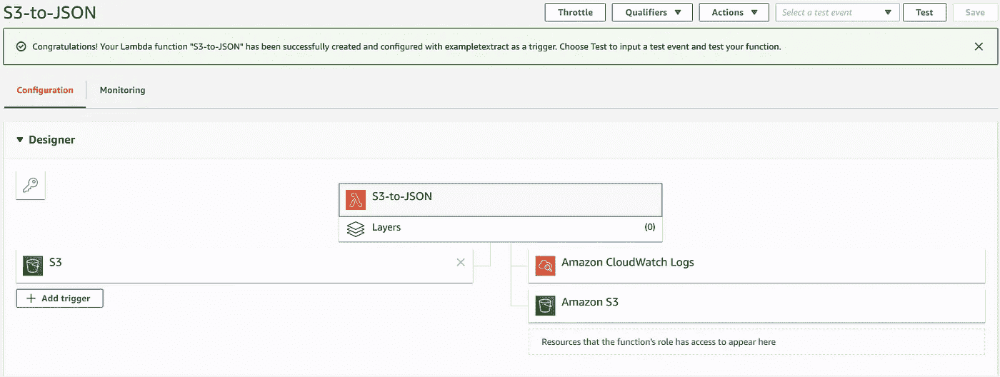

*   请注意，AWS Textract 在这项工作中还没有出现。这是因为你需要将它包含在你的角色中。向下滚动到执行角色，并单击“查看 S3 到 JSON-Role 角色”。

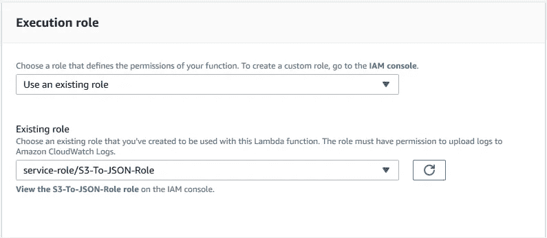

*   这一步是选择蓝图选项的有用之处，因为您只需要为 Textract 添加策略。云观察和 S3 政策已经到位。也就是说，点击“附加策略”。

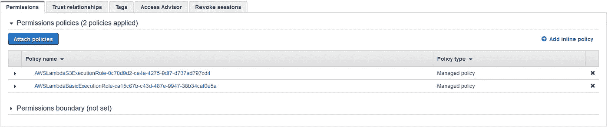

*   在搜索栏中搜索 Textract，选择“AmazonTextractFullAccess”，然后点击屏幕底部的“附加策略”。

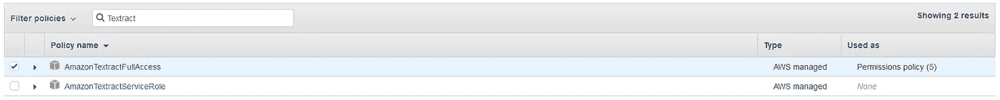

*   返回并刷新 Lambda 函数，您会注意到 Amazon Textract 已经向您的函数添加了一个资源。如果你点击 Amazon Textract，你将得到一个资源的概要，以及如下所示的政策声明。

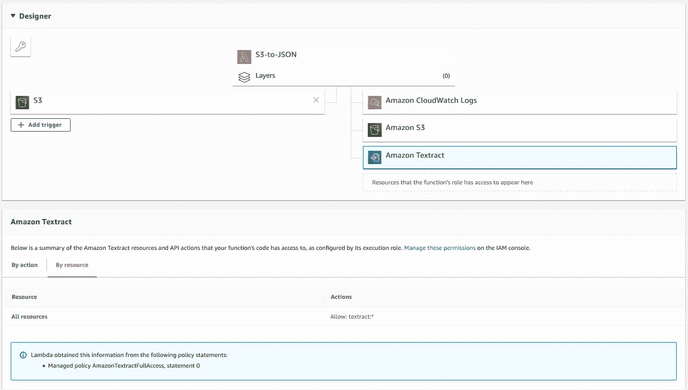

*   至此，您已经准备好在 Lambda 中使用 Python IDE 了。

**添加您的模块**

我之前提到过，使用 Lambda 意味着你不能自由地快速找到你想要的 Python 模块。那么如何添加本例所需的“Trp . py”Python 模块呢？

有很多方法可以做到这一点，但我发现，一般来说，如果你想添加多个模块，最好的方法是通过虚拟环境。虽然我们的例子相对简单，可能不需要这样做，但这是一个很好的技巧，可以放在工具箱中，我发现它非常简洁。

因此，我将稍微偏离主题，使用虚拟环境添加这个模块。我在这个例子中使用的是 Windows 10，因此，如果你使用的是苹果或 Linux，我很抱歉。

*   导航到 Windows 10 任务栏中的开始按钮，然后搜索 Powershell。
*   选择 Windows Powershell，右键单击，然后以管理员身份运行。
*   导航到您的桌面，然后键入以下内容。

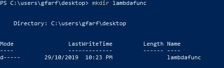

*   如果你去你的桌面，你会注意到一个新的目录，“lambdafunc”被创建。
*   返回 Windows Powershell，使用以下命令继续创建 python 虚拟环境。

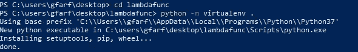

*   您会注意到在“lambdafunc”目录中创建了新的文件夹。
*   此时，您需要激活您的虚拟环境。因此，如果您在 Powershell 中键入以下命令，您可以在使用 pip install 之后开始使用 Python 安装程序包(PIP)。

(您可能会遇到错误，因为您的文件没有经过数字签名。您可以使用来自此[站点](https://devblogs.microsoft.com/scripting/hey-scripting-guy-how-can-i-sign-windows-powershell-scripts-with-an-enterprise-windows-pki-part-2-of-2/)的提示来更改执行策略。或者，您可以键入**“Set-execution policy Unrestricted”**。)

那么 trp.py 模块呢？你不需要使用 pip 来安装它；但是，您可以从上面的 GitHub 链接下载这个模块，然后将它添加到您的 lambdafunc 目录中的 Lib/Site-Packages 文件夹。

如果您将当前的 Lambda Python 代码复制到一个编辑器(如 NotePad++)中，并将其作为 lambda_function.py 保存在 Lib/Site-Packages 文件夹中，您可以压缩模块和 Lambda 文件。

*   回到你的 Lambda 控制台，滚动到函数代码空间，从代码输入类型中选择“上传一个. zip 文件”并点击“上传”

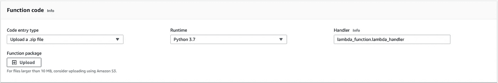

*   选择最近创建的 zip 文件，然后按“保存”。
*   你会注意到你的 Lambda 函数现在有了 trp.py 模块。

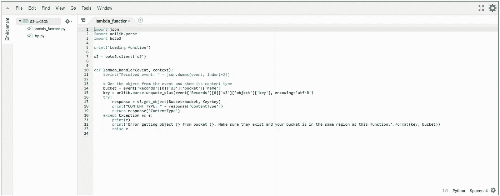

现在已经添加了这个模块，可以用下面的代码替换 lambda_function.py。

*   注意，这段代码还上传了一个到 s3 bucket 中图像的 URL，作为 JSON 输出的一部分。
*   测试您的函数的最好方法是将一个图像上传到 bucket，然后等待输出。或者，您可以上传一张图片，点击“测试”检查功能。如果您选择“亚马逊 S3 Put”作为事件模板，请更改时段名称、时段 ARN 和对象关键字，以匹配您的时段名称和文件名。成功的测试应该返回以下内容。

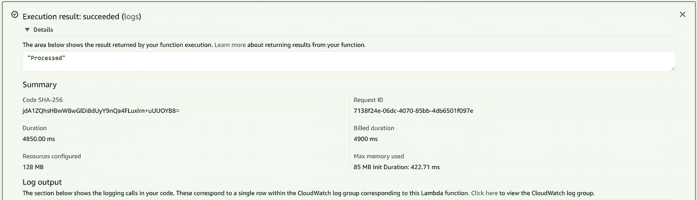

*   将在您的 S3 桶中创建一个包含您的表单键值表单的 JSON 文件。

到目前为止，您只完成了架构的一半，但是不要担心，因为另一半更容易实现。

## 数据库功能

以类似于键-值对函数的方式，您将创建另一个 lambda 函数(jsonS3ToDynamoDB ),它会自动将键-值对保存到 DynamoDB 表中。这意味着您将:

1.  使用 S3 放置对象蓝图
2.  创建一个新的 IAM 角色(jsonS3ToDynamoDB-Role)，
3.  使用你的 S3 桶作为函数的触发器。唯一的区别是你的后缀是。' JSON '，如下所示。

类似地，您需要将 DynamoDB 访问策略附加到您为这个 Lambda 函数创建的 IAM 角色上。请注意，这将连接许多层到您的 Lambda 函数，如下所示。

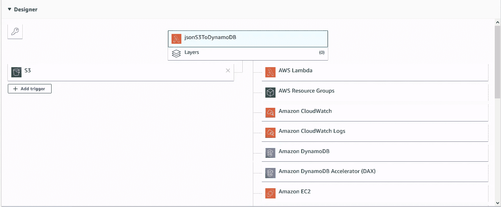

最重要的是，你应该能够访问 DynamoDB、S3 和 Cloudwatch。

将 JSON 内容移动到 DynamoDB 的代码如下所示。

*   您还可以使用“Amazon S3 Put”事件来测试该函数，并将 bucket、bucket ARN 和 Object 键更改为 bucket 和 JSON 对象，如下所示。

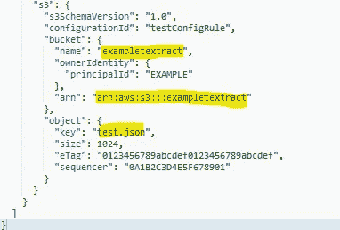

# 学习成果

正如本文开头所述，直到两个月前，我还没有任何使用 Python(本地或云)、AWS 和虚拟环境的经验。

更重要的是，我发现数据科学和编程社区是一个非常有用和足智多谋的社区。我有潜在的方法来改进这段代码，并实现无缝的电话到数据库的过程，这可能会在以后的帖子中出现。

# 前进的道路

这项技术可以在许多方面帮助一个企业或一个部门。也来自 AWS 的自然语言处理(NLP)可以被添加来寻找特定的主题或关键词。你能想出更多的用例吗？请在评论区告诉我。

# 摘要

在这个例子中，我解释了使用 Amazon Textract 从上传到 S3 桶的图像中提取文本和表单数据的许多方法之一。该解决方案完全依赖于亚马逊服务。

如果你有任何关于代码或这个帖子的任何项目的问题，请给我发电子邮件到 g.farfour@gmail.com，我可以讨论代码的细节。