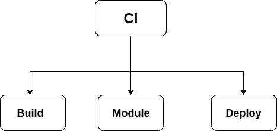
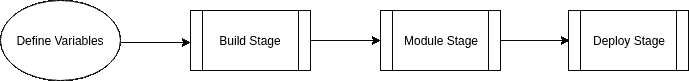
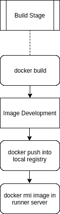
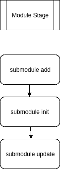
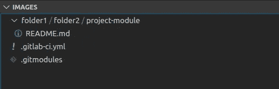
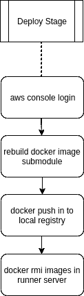

# 使用 CI/CD 管道的自动化部署(使用 Docker builder、Git 子模块和 Amazon Web Service)

> 原文：<https://medium.com/analytics-vidhya/automation-deployment-using-ci-cd-pipelines-with-docker-builder-git-submodules-and-amazon-web-ecd09a38f14?source=collection_archive---------3----------------------->


**CI/CD 管道**

部署过程是通过利用 docker 服务将产品放置在客户端的服务器(premis)或云服务上，以获得一些相关的依赖。作为 docker 服务的输出，docker 映像将作为 docker 容器在每个服务器上运行。在先进技术领域，技术部署应该快速、准确和可靠。过去我们习惯于手工构建系统，但现在 CI 管道可以提供系统构建器和打包器。

CI(持续集成)是如何使我们的应用程序在同一个过程中自动构建或运行并到达同一个地方的方法。CI 渠道通常必须包括 5 个阶段(构建阶段、测试、部署、最终测试、生产部署)，但在这种情况下，我们总结为 3 个阶段。构建、模块和部署。



**添加变量**

```
IMAGE_DEVELOPMENT : images development nameIMAGE_RELEASE: images production nameIMAGE_TAG_DEVELOPMENT: image development tagIMAGE_TAG_RELEASE: image production tag
```

**变量:**

```
**IMAGE_DEVELOPMENT:group/project/image****IMAGE_RELEASE:$CI_REGISTRY/group/project/image****IMAGE_TAG_DEVELOPMENT:dev****IMAGE_TAG_RELEASE:v1.0.0**
```

**阶段构建**

在阶段构建中，我们将 docker 文件构建为开发映像，然后将该映像 docker 推送到本地注册表或其他服务中。当代码被推送到存储库、运行 unittest 和 cythonize 每个依赖项时，这个阶段被触发。



```
docker build -f Dockerfile --squash --build-arg SSH_PRIVATE_KEY=
"${SSH_PRIVATE_KEY}" -t $IMAGE_DEVELOPMENT:$IMAGE_TAG_DEVELOPMENT .
```

**相位模块**

子模块是作为模块添加到另一个 git 存储库中的存储库。这个特性允许您将其他存储库分开，但仍然引用它们。如果您有一些项目更新，使用子模块更新命令。



```
git submodule add url_repos_project folder1/folder2/project-module
```

*   你制作了 folder 1/folder 2/project _ modules 并生成。gitmodules 文件



*   编辑。gitmodules 文件并从许可证模块添加当前分支/标签。

```
[submodule “folder1/folder2/project-module”]path = folder1/folder2/project-moduleurl = https://gitserver.com/group/project-module.git
```

*   更新配置项中的子模块

当您使用*子模块更新-远程*时。更新仅发生在您注册的分行。gitmodules 文件。

```
git submodule initgit submodule update --init --recursivegit submodule update --remote
```

**阶段部署**

Amazon Web 服务提供了映像 dockers 存储，以简化不同位置一致性和远程部署步骤。映像部署是您用作生产的映像，包括许可证。第一步。在 docker 映像上安装 aws cli 并登录 aws 控制台，如果您使用 aws 服务，请获取其他映像。将图像推送到 runner 注册表服务器和 gitlab 注册表，然后删除 runner 服务器中的其他图像。确保该服务器始终保持清洁。



*   登录 aws 控制台

```
$(aws ecr get-login --no-include-email --region “regional-user”)
```

*   转到许可证路径，使用以下命令重建映像

```
docker build --squash --build-arg SSH_PRIVATE_KEY="${SSH_PRIVATE_KEY}" --build-arg     IMG_NAME="${IMAGE_DEVELOPMENT}:${IMAGE_TAG_DEVELOPMENT}" -t $IMAGE_RELEASE:$IMAGE_TAG_RELEASE .
```

构建过程完成后。下一步，QA 团队进行产品最终测试并发布产品报告。使用 CI 渠道更有价值，每个团队可以推动更多的改进。所有参与这个项目的开发人员总是注意到并不断重复。这就是为什么我们应该移动并重复我们生产系统的方式。