# 使用 Jenkins 实现深度学习模型的自动化

> 原文：<https://medium.com/analytics-vidhya/automation-of-deep-learning-model-using-jenkins-79c2e732445b?source=collection_archive---------6----------------------->

在[机器学习](https://en.wikipedia.org/wiki/Machine_learning)、**超参数优化**或者调优就是为一个学习算法选择一组最优[超参数](https://en.wikipedia.org/wiki/Hyperparameter_(machine_learning))的问题。超参数是一个[参数](https://en.wikipedia.org/wiki/Parameter)，其值用于控制学习过程。相比之下，其他参数(通常是节点权重)的值是学习来的。

同一种机器学习模型可能需要不同的约束、权重或学习速率来概括不同的数据模式。这些度量被称为超参数，必须进行调整，以便模型可以最优地解决机器学习问题。

因此，我们不再手动调整超参数，而是将这项工作交给 Jenkins 进行自动化。

# 使用的工具-

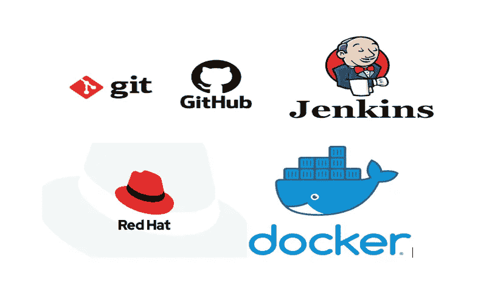

*   Git 和 Github——用于版本控制和托管我们的存储库。
*   詹金斯-自动化各种工作。
*   Rhel8-作为运行 httpd、jenkins、ngrok 等服务的基础操作系统。
*   Docker-运行我们的 python 模型。

# 数据集-

我将时尚 MNIST 数据集用于我的深度学习模型。时尚-MNIST 是 Zalando 文章图像的数据集，由 60，000 个样本的训练集和 10，000 个样本的测试集组成。每个示例都是 28x28 灰度图像，与 10 个类别的标签相关联。

时尚 MNIST 数据集

# 自动化步骤-

## 任务描述

1.  使用 dockerfile 创建一个容器映像，其中包含 Python3、Keras、numpy 和所有必需的库
2.  当我们启动这个图像时，它应该会自动开始训练容器中的模型。
3.  使用 Jenkins 中的构建管道插件创建 job1、job2、job3、job4 和 job5 的作业链
4.  Job1:部分开发者向 Github 推送回购时自动拉取 Github 回购。
5.  Job2:通过查看代码或程序文件，Jenkins 应该自动启动安装的相应机器学习软件，解释器安装映像容器以部署代码并开始训练(例如，如果代码使用 cnn，则 Jenkins 应该启动已经安装了 CNN 处理所需的所有软件的容器)。
6.  作业 3:在 webbrowser 中显示精确度(本地连接)
7.  Job4:如果度量准确度低于 88%，那么调整机器学习模型架构。
8.  Job5:重新训练模型或通知正在创建最佳模型。
9.  Job6:将通知开发人员，由于模型精度低于要求，调整已经开始。
10.  为 monitor : If 容器创建一个额外的 job job7，其中应用程序正在运行。由于任何原因失败，则该作业应该从最后一个训练模型离开的地方自动再次启动容器

## 让我们开始工作-

1.  **设置我们的本地 git 存储库-**

首先，我创建了一个名为[machine learning _ Automation](https://github.com/Harasis/MachineLearning_Automation)的空 [Github](https://github.com/Harasis/MachineLearning_Automation) 存储库。然后，通过使用基本的 git 命令，我将代码上传到了那个 Repo。

我已经配置了一个提交后脚本，每当我提交任何新的更改时，它都会自动推送我的代码。

*   为此，您必须转到您的代码文件夹，在该文件夹中您设置了。饭桶
*   然后使用[$cd /。git/hooks ]转到钩子目录
*   然后使用[$cat > post-commit]创建一个脚本，当您提交时，该脚本将推送您的代码
*   在提交后，写下下图中的内容，按 ctrl+d 保存。
*   然后转到主代码文件夹，尝试提交

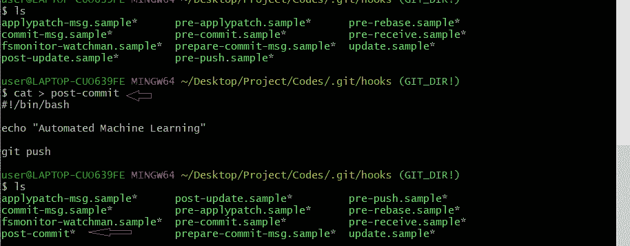

**2。在 Rhel-** 中为私有 ip 设置 [**隧道**](https://ddos-guard.net/en/terminology/technology/ip-tunnel)

**在第 3 步中，我们必须在 Github repo 中设置 web-hooks，我使用的是私有 ip，但是 Github 在公共世界上，Github 需要访问我们的私有 ip，Jenkins 在这个私有 IP 上运行。隧道的概念将帮助我们。**

**我们为詹金斯正在运行的端口和协议设置了 [ngrok](https://ngrok.com/download) 软件。在我的例子中，Jenkins 运行在端口 8080 上，并使用 http 协议。使用命令-**

> **]#./ngrok http 8080**

**我们将使用 ngrok 提供的 ip 在 Github repo 中设置我们的 web-hooks。**

**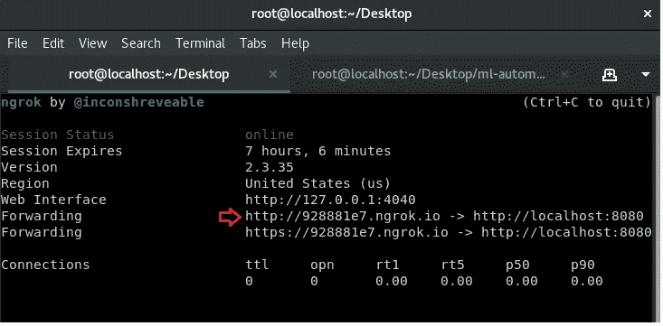**

****3。在 Github Repo 中设置 Web-hooks-****

**我们将需要我们的 Jenkis JOB1 的 web-hooks，它将检测 Github repo 中的任何变化，并将其发送到我们指定位置的 Rehl Os**

*   **要设置 Web 挂钩，我们必须访问我们的 git hub 库，然后**

> **->设置->在选项中->Webhooks ->添加 Webhook ->输入您的密码->在有效负载 url 中输入[ngrok_ip/github-webhook/] ->将内容类型更改为[application/json] ->然后保存 Webhook**

**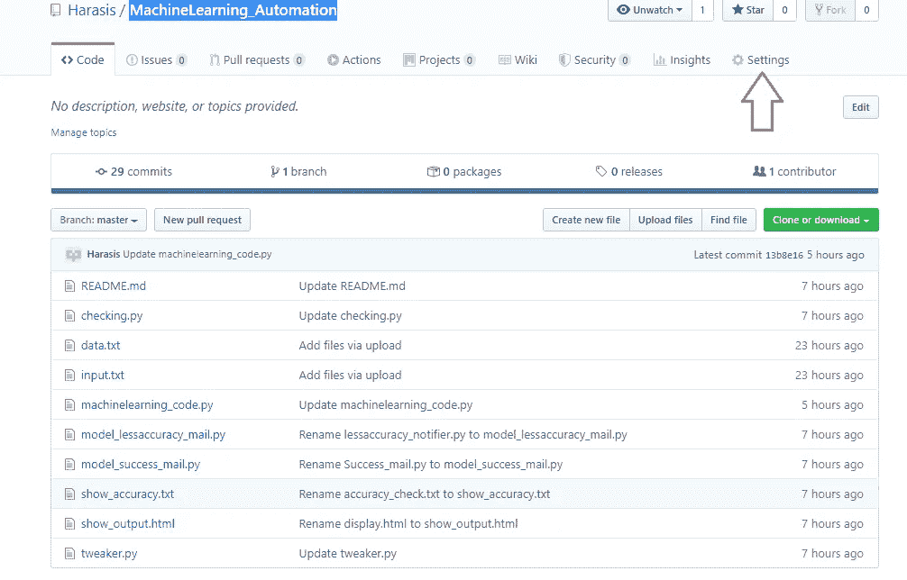****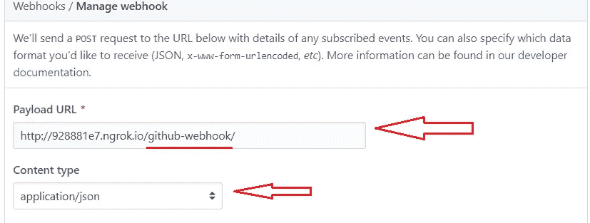**

****4。在 Jenkins 中创建工单 1-****

**每当开发人员推送任何新代码时，JOB1 都会自动将 Github repo 拉至我们 Rhel Os 中的指定目录。**

**工单 1 配置-**

**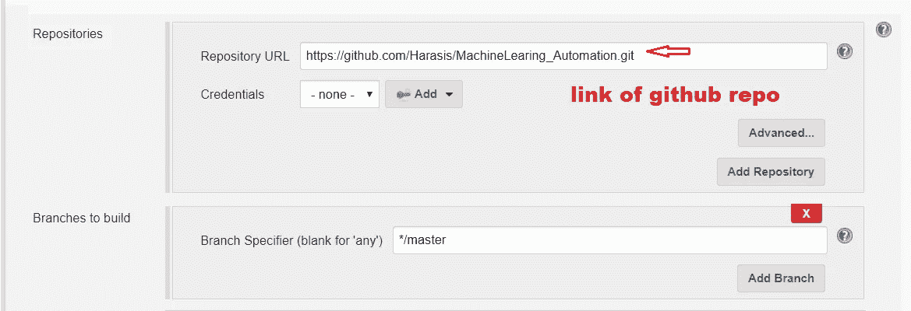****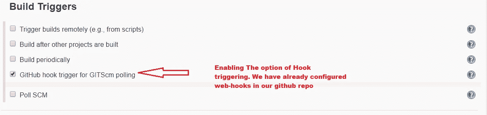****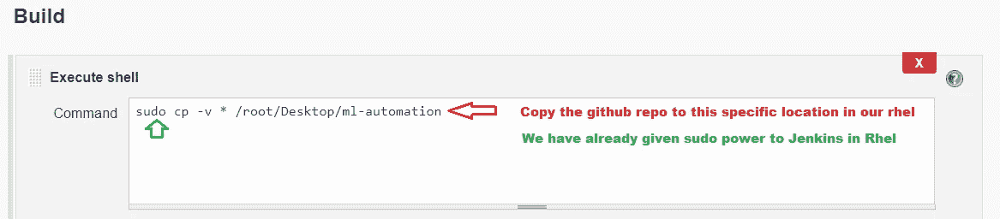**

**如果一切顺利，我们将-**

**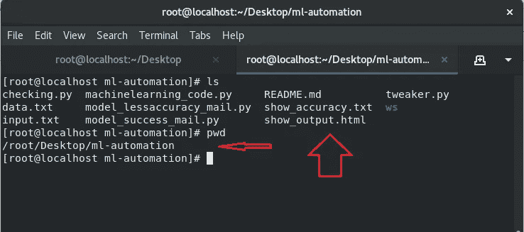**

****5。创造我们自己的码头工人形象-****

**要在 Docker 容器中运行我们名为[machine learning _ code . py](https://github.com/Harasis/MachineLearning_Automation/blob/master/machinelearning_code.py)的 ML 代码，我们必须创建自己的 Docker 映像，以 Centos 为基础，并在其中安装所有需要的库和 python36。**

*   **要创建 Docker 映像，首先使用-创建一个名为 ws 的新文件夹**

> **]# mkdir ws/**
> 
> **]#cd /ws**

*   **然后使用以下命令在 ws 目录中创建 docker 文件**

> **]#gedit Dockerfile**

*   **在文档中写下-**

**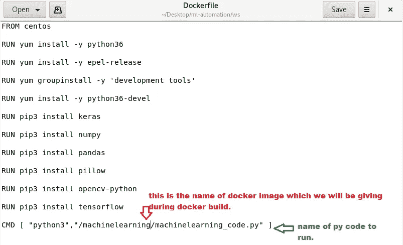**

*   **保存 docker 文件后，进入父目录**

> **]#cd..**

*   **运行命令创建图像-**

> **]# docker build-t machine learning:v1/root/Desktop/ml-automation/ws/**

*   **建造完成后，我们将看到-**

**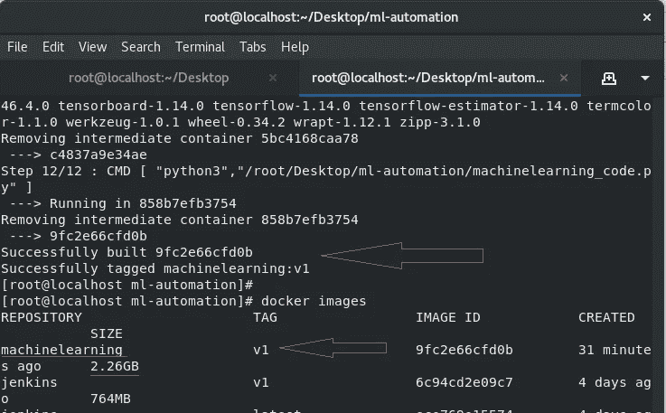**

****6。在 Jenkins 中创建工单 2-****

**JOB2 通过查看代码或程序文件来执行任务，自动启动安装的相应机器学习软件，解释器安装映像容器来部署代码并开始训练(例如，如果代码使用 cnn，那么 Jenkins 应该启动已经安装了 CNN 处理所需的所有软件的容器)即从*步骤 5*中创建的 Docker 映像运行 Docker 容器。**

**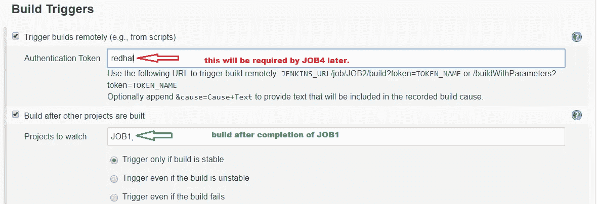**

*   **从这里可以看到 checking . py-[checking . py](https://github.com/Harasis/MachineLearning_Automation/blob/master/checking.py)**

**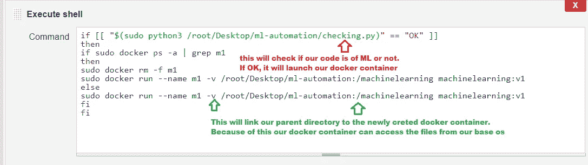**

*   **成功构建 JOB2 后，控制台输出必须如下所示**

**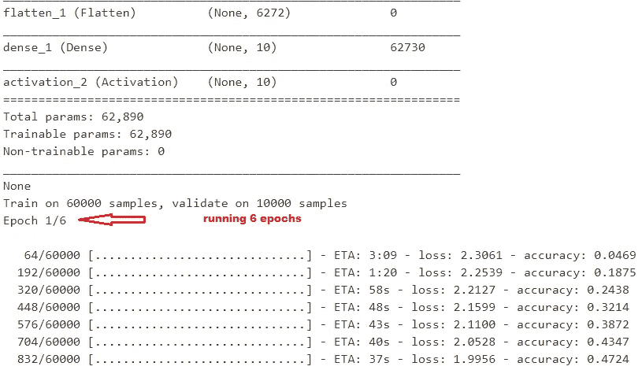**

****7。在 Jenkins 中创建工单 3-****

**JOB3 的任务是将[show_output.html]文件从父目录复制到/var/www/html，这是 Apache Webserver 中网页的默认目录。**

**这个[show_output.html]文件将向我们展示所使用的超参数以及我们的模型的准确性。**

*   **在进入 Jenkins 之前，运行以下命令来启动 rhel 中的 httpd 服务器-**

> **]#systemctl 启动 httpd**

*   **工单 3 配置-**

**将构建触发器设置为->在其他项目构建之后构建->将 JOB2 放入其中。在那之后-**

**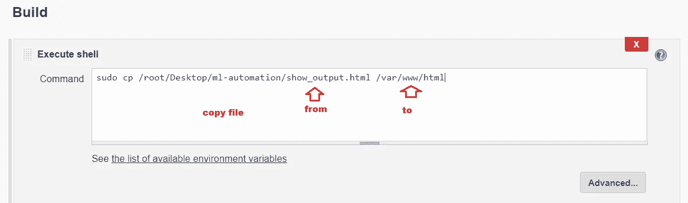**

*   **在成功构建 JOB3 之后，我们可以在本地 web 浏览器中看到 show_output.html 文件。**

**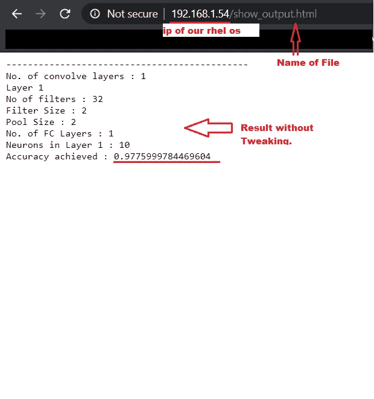**

****8。在 Jenkins 中创建工单 4-****

**JOB4 将监控模型的准确性，如果模型的准确性低于 98%。它将启动 [tweaker.py](https://github.com/Harasis/MachineLearning_Automation/blob/master/tweaker.py) 程序，该程序将添加额外的卷积层，并再次运行 JOB2 来训练 model，JOB6 向开发人员发送电子邮件“精确度很低，正在运行 tweaker 程序”。**

**如果模型达到了要求的精度，JOB5 将运行，因为 JOB4 将被[exit 0]命令终止。**

*   **JOB4 配置-**

**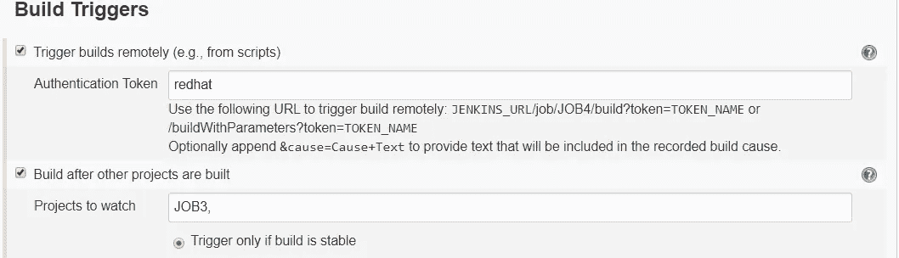****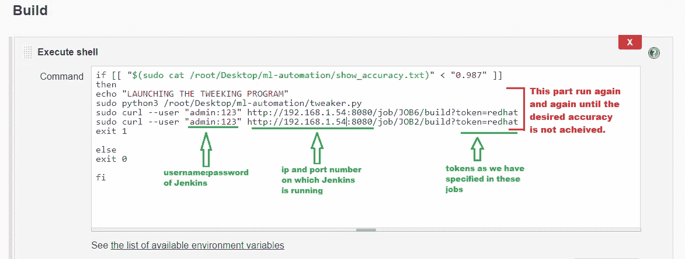**

*   **由于 JOB4 将一次又一次地运行，直到没有达到期望的精度，我们的 show_display.html 文件也将被 JOB3 更改，并将显示 JOB2 模型每次运行的不同精度和超参数。**

**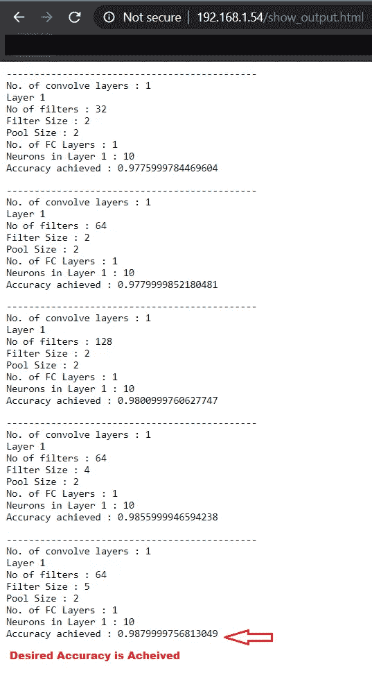**

****9。在 Jenkins 中创建工单 5-****

**从 JOB2 模型获得所需的精度后，JOB4 将终止，JOB5 将运行。该作业将运行 [model_success_mail.py](https://github.com/Harasis/MachineLearning_Automation/blob/master/model_success_mail.py) 并向开发人员发送项目完成通知。**

*   **JOB5 配置-**

**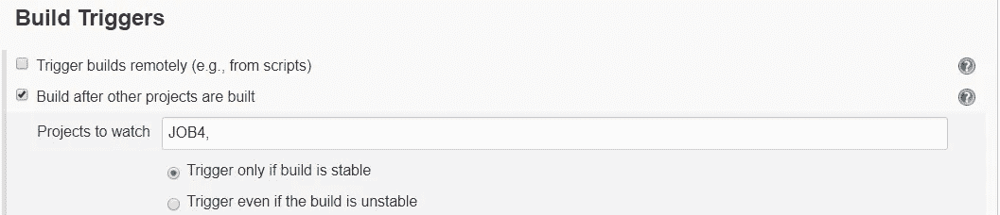****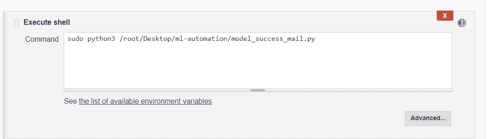****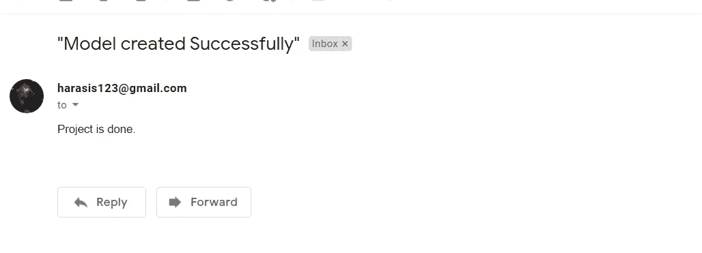**

*   **Python 文件发送电子邮件，使用 gedit 在 Rhel 中编辑此代码，并将您自己的凭据放入此-**

**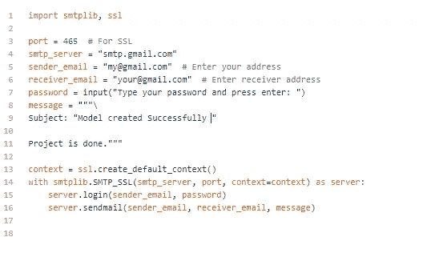**

**10。在 Jenkins 中创建工单 6-**

**当作业 2 模型没有达到期望的精度时，作业 4 将运行作业 2 和作业 6。JOB6 将通过运行[model _ less accuracy _ mail . py](https://github.com/Harasis/MachineLearning_Automation/blob/master/model_lessaccuracy_mail.py)发送不成功的消息并运行调整代码。**

*   **工单 6 配置-**

**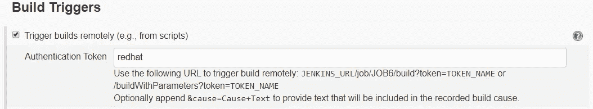****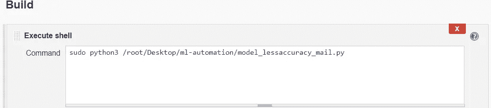****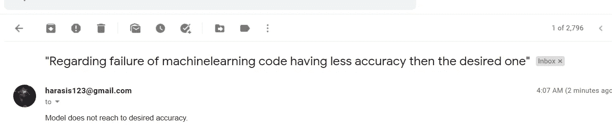**

*   **这个的 Python 代码-**

**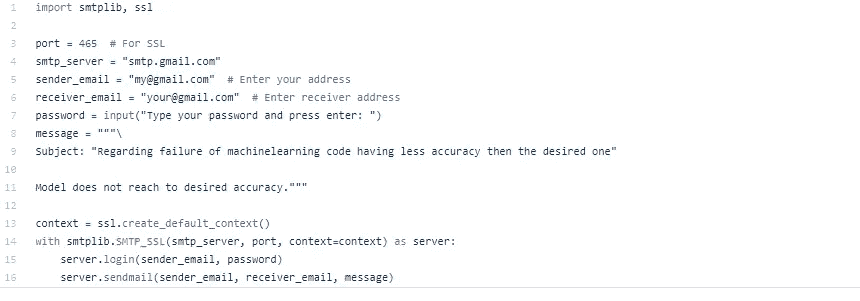**

****11。在 Jenkins 中创建工单 7-****

**JOB7 将每小时运行一次，并检查运行模型的容器是否由于任何原因而失败，然后该作业将从上次训练的模型离开的地方自动再次启动容器。**

*   **正在配置一小时的轮询 SCM 计划-**

**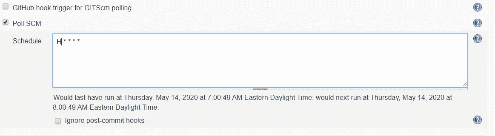**

*   **执行 shell 命令-**

**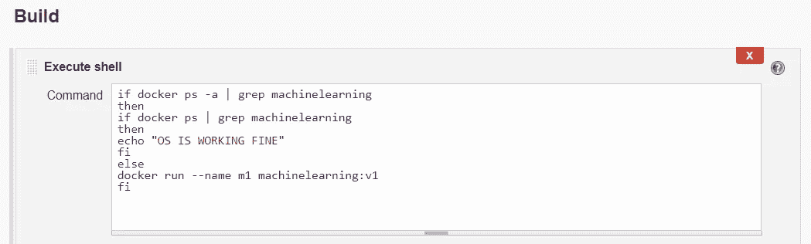**

*   **如果容器运行良好，控制台输出-**

**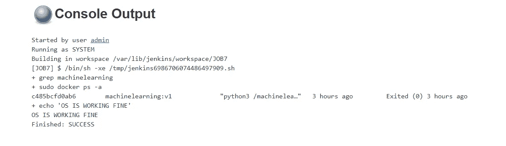**

## **项目完成！！！**

**瞧啊。！！！这就是如何使用 jenkins 实现机器学习模型自动化。**

**GITHUB 回购-[https://github.com/Harasis/MachineLearning_Automation](https://github.com/Harasis/MachineLearning_Automation)**