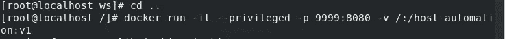
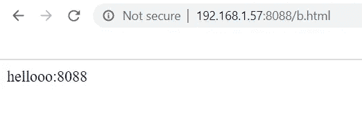
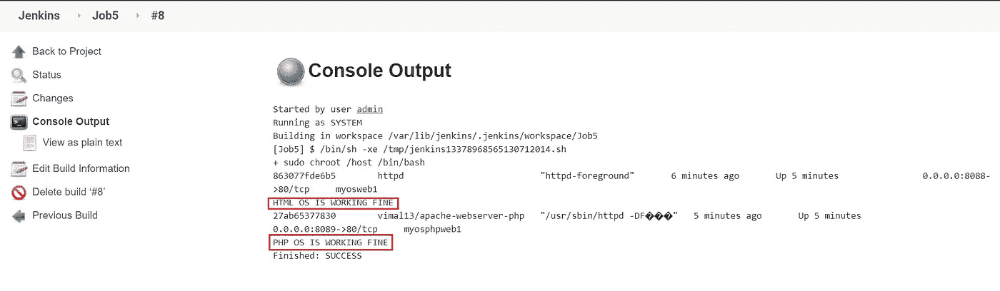

# 在 Docker - A Devops 项目上使用 Jenkins 实现网站部署自动化

> 原文：<https://medium.com/analytics-vidhya/automation-of-docker-git-and-github-with-jenkins-a-devops-project-72dda6ee8355?source=collection_archive---------4----------------------->

这种自动化将帮助我们在扩展**的 Github 上部署由开发者上传的**网页**。html** 和**。docker 容器上的 php** 。每个部分都是使用 Jenkins 自动完成的，Jenkins 本身在 docker 上运行。用户甚至会在站点部署时收到一封电子邮件。

# 使用的工具-

*   Git 和 Github——用于版本控制和托管我们的存储库。
*   詹金斯-自动化各种工作。
*   Rhel8-作为运行 docker 和 ngrok 等服务的基础操作系统。
*   部署网页和詹金斯。

# 任务描述-

1.使用 Dockerfile 创建安装了 Jenkins 的容器映像。

2.当我们启动这个映像时，它应该会自动启动容器中的 Jenkins 服务。

3.使用 Jenkins 中的构建管道插件创建 Job1、Job2、Job3 和 Job4 的作业链

4.Job1:当开发者将 repository 推送到 Github 时，自动拉取 Github repo。

5.Job2:通过查看代码或程序文件，Jenkins 应该自动启动相应的语言解释器安装映像容器来部署代码(例如，如果代码是 PHP 的，那么 Jenkins 应该启动已经安装了 PHP 的容器)。

6.工作 3:测试你的应用程序是否工作正常。

7.工作 4:如果网页的工作，然后发送确认电子邮件给开发商。

8.为 monitor : If 容器创建一个额外的 job Job5，其中应用程序正在运行。由于任何原因失败，则该作业应自动再次启动容器。

# 自动化步骤-

## 1.创建安装了 Jenkins 的个性化 Docker 映像-

我们可以使用 Dockerfile 创建个性化的 Docker 图像。

一个 **Dockerfile** 是一个文本文档，它包含用户可以在命令行上调用的所有命令来组合一个图像。使用 docker build，用户可以创建一个连续执行几个命令行指令的自动化构建。**简而言之 Dockerfile 用于创建我们自己的个性化 Docker 图像。**

*   为了创建 dockerfile，我创建了一个名为 ws 的新文件夹。

*]# mkdir ws/*

*]#cd /ws*

*   然后使用以下命令在 ws 目录中创建 docker 文件

> *]#gedit Dockerfile*

*   因此，我们将使用从 docker hub 中提取的 **centos** 图像开始创建 Dockerfile，如下图所示。

*   保存 docker 文件后，进入父目录

> *]#cd..*

*   运行命令以创建映像

*]# docker build-t automation:v1/ws/*

Dockerfile 成功

## 2.运行 Docker 图像-

在我们创建了 docker 映像之后，我们必须使用-

*   特权用于赋予主机的容器根功能，允许访问普通容器中无法访问的资源。
*   我们设置了主机的**端口 9999** 来访问 jenkins 工作的 docker 容器的**端口 8080** 。
*   -v 将主机的/连接到 docker 容器的/主机。

运行该命令后，我们得到-

## 3.建立詹金斯-

*   复制运行 docker 映像后给出的密码。
*   转到浏览器
*   然后输入主机的 URL-Ip:9999

*   您可以通过进入**管理 jenkins 选项卡来更改 admin 的密码。**
*   成功完成后，您将获得-

## **4。设置我们的本地 git 存储库-**

首先，我创建了一个名为 [Jenkins_Automation_T2](https://github.com/Harasis/Jenkins_Automation_T2) 的空 [Github](https://github.com/Harasis/MachineLearning_Automation) 存储库。然后，通过使用基本的 git 命令，我将代码上传到了那个 Repo。

然后，我配置了一个提交后脚本，每当开发人员提交任何新的更改时，它将自动推送我的代码。

*   为此，您必须转到您的代码文件夹，在该文件夹中您设置了。饭桶
*   然后使用[$cd /。git/hooks ]转到钩子目录
*   然后使用[$cat > post-commit]创建一个脚本，当您提交时，该脚本将推送您的代码
*   在提交后，写下下图中的内容，按 ctrl+d 保存。
*   然后转到主代码文件夹，尝试提交。

**5。在 Rhel-** 中为私有 ip 设置 [**隧道**](https://ddos-guard.net/en/terminology/technology/ip-tunnel)

**在第 3 步中，我们必须在 Github repo 中设置 web-hooks，我使用的是私有 ip，但是 Github 在公共世界上，Github 需要访问我们的私有 ip，Jenkins 在这个私有 IP 上运行。隧道的概念将帮助我们。**

**我们为詹金斯正在运行的端口和协议设置了 ngrok T21 软件。在我的例子中，Jenkins 运行在 docker 的端口 9999 上，并使用 http 协议。使用命令-**

> ***]#。/ngrok http 9999***

**我们将使用 ngrok 提供的 ip 在 Github repo 中设置我们的 web-hooks。**

****

****6。在 Github Repo 中设置 Web 挂钩-****

**我们将需要我们的 Jenkis JOB1 的 web-hooks，它将检测 Github repo 中的任何变化，并将其发送到我们指定位置的 Rehl Os**

*   **要设置 Web 挂钩，我们必须访问我们的 git hub 库，然后**

> ***- >设置- >在选项- > Webhooks - >添加 Webhook - >输入您的密码- >在有效负载 url 中输入【ngrok _ IP/github-web hook/】->将内容类型更改为【应用程序/JSON】->然后保存 Webhook***

********

*   **然后更新 webhook**

**如果一切正常，你会看到绿色箭头-**

****

## **7.在詹金斯创建工作 1-**

**当开发者推送任何更新时，Job1 会自动提取 github 库。**

************

## **8.在詹金斯创建 Job2**

**Job2 将查看代码或程序文件，然后自动启动相应的语言解释器安装映像容器来部署代码，即，如果代码是 PHP，那么 jenkins 应该启动已经安装了 PHP 的容器，如果代码是 HTML，那么 Jenkins 应该使用 httpd 启动容器。**

**你必须从 **dockerhub 中提取**相应的图片。**

**对我来说，我有-**

*   **html 文件的 Httpd 图像。**

> **]#docker pull httpd**

*   **php 文件的个性化图像。**

> **]# docker pull vimal 13/Apache-web server-PHP**

> *****这些图片下载到基础操作系统*****

****

****工单 2 配置-****

********

**这里的 **chroot** 用于将 docker 容器的目录复制到我们的 BaseOS。换句话说，Jenkins 正在处理一个容器，因此 github 文件将被复制到 docker 容器中的文件夹 **/host/git_repository** 中。但是我们已经在基本操作系统中安装了 docker 镜像，我们需要运行。html 和。php 文件。**

**因此，使用 chroot 可以将/git_repository 从 conatiner 复制到 BaseOS。**

****如果一切正常，您可以检查网页是否已部署。****

****

**php 站点已部署**

****

**html 网站已部署**

## **9.在詹金斯创建工作 3-**

**Job3 将测试我们的网站是否工作。**

**我已经把 Job3 分成了 **Job3_html** 和 **Job3_php。****

**Job3_html 将检查 html 页面的状态。**

**Job3_php 将检查 php 页面的状态。**

****************

## **10.在詹金斯创造就业机会 4-**

**Job4 将向开发人员发送确认邮件。**

**我再次把 Job4 分成了 **Job4_html** 和 **Job4_php。****

*   **Job4_html 将发送的确认邮件。html 站点开发者使用 python 文件-[***mail . py***](https://github.com/Harasis/Jenkins_Automation_T2/blob/master/mail.py)**
*   **Job4_php 将发送确认邮件。php 站点开发者使用 python 文件-[***mail _ PHP . py***](https://github.com/Harasis/Jenkins_Automation_T2/blob/master/mail_php.py)**

****

**将在 Job3_html 之后触发**

********

**Job3_php 后会触发**

****

## **11.构建管道-**

**可以使用 Jenkins 中的构建管道插件来创建。**

****

## **12.在詹金斯创造就业机会 5-**

**这项工作超出了我们的能力范围。该任务将**监控**网站运行的容器。由于任何原因失败，则该作业应**自动再次启动**相应的容器。**

********

**如果一切正常，那么 Job5 的控制台输出将是-**

****

# *****项目完成！！*****

**谢谢你阅读我的博客。**

**祝你有愉快的一天。**

**Github 报告-**

**【https://github.com/Harasis/Jenkins_Automation_T2 **