# Python 中 Selenium 和 Web 抓取的自动化

> 原文：<https://medium.com/analytics-vidhya/automation-with-selenium-and-web-scraping-in-python-c53f0c0602d6?source=collection_archive---------10----------------------->

哈尔·盖特伍德在 [Unsplash](https://unsplash.com?utm_source=medium&utm_medium=referral) 上拍摄的照片

Selenium 是最流行的自动化库之一。您可以使用它来自动化广泛的 web 应用程序。最受欢迎的应用是测试 web 应用程序。但是硒的应用不仅仅局限于测试。Selenium 允许您打开自己选择的浏览器，并像正常人一样执行任务，例如:

点击按钮

填写表格

在网页上搜索信息。

与 selenium 一起使用的流行语言是 Java 和 Python，但是在自动化方面，Python 比 Java 有很多优势。同样在数据科学中，数据收集是最重要的步骤之一。很多时候，我们需要从不同的网站收集数据。有时，这可能会成为一项非常麻烦的任务。在这种情况下，Selenium 和 web scraping 就派上了用场，这样我们就可以自动完成日常任务。

在本文中，我们将提取特定农产品的价格(例如马铃薯)的数据，这些数据来自一个农业网站 agmarknet.gov.in。该网站要求我们填写一份表格，并提交它来检索数据。我们的任务是检索给定年份范围内所有州的马铃薯价格。因此，我们将编写一个脚本，自动为我们收集数据。收集的数据将下载到 CSV 文件中。

**加载所需模块**

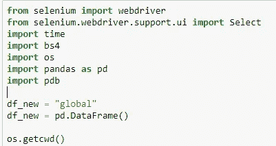

*webdriver* —允许您启动浏览器

*选择* —允许您选择网页上的元素，以便您可以对它们执行操作。

*bs4* —我们使用这个模块进行网页抓取

*熊猫* —用于处理表格格式的数据

*pdb* —用于调试目的

**打开网络浏览器**

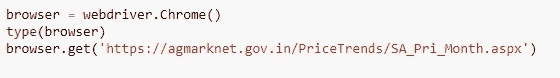

您可以使用 webdriver 启动您选择的浏览器。在这种情况下，我们推出了 chrome 浏览器。

**调用函数**

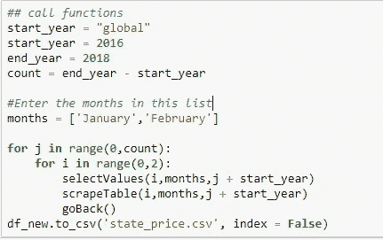

这段代码片段是我们调用所有函数的起点，这些函数将执行自动化任务，并抓取所有需要的网页

信息。当你浏览文档时，你会找到这些函数的定义。

选择值 () —执行填写表单的任务

*scrapeTable* () —用于提交表单后获取所需数据。

您可以通过月份列表中的任意多个月份。现在，为了简单起见，我们将使用 2 个月。对于年的范围，使用变量 start_year 和 end_year。

**在硒的帮助下填表**

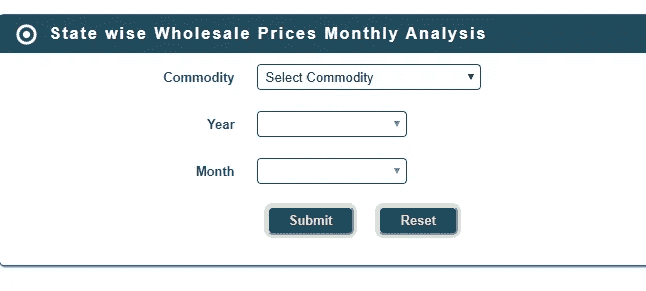

这是需要填写和提交的表格。在 selenium 的帮助下，我们将填充这些下拉列表中的值。代码如下。

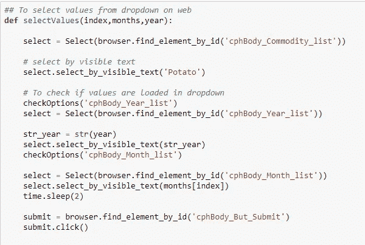

您需要创建选择类的实例。创建 select 类的实例后，可以对该实例执行 Select 方法，从下拉列表中选择选项。您需要找到想要选择的元素的“id ”,并将其传递给*选择*()函数。

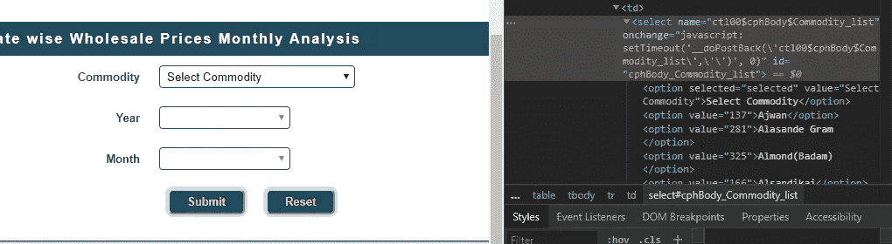

我们使用 *checkOptions* ()来检查下拉列表是否已经加载了值。下面是代码片段

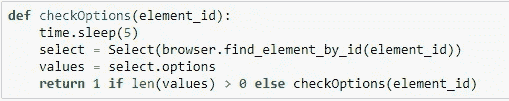

*submit.click* ()在提交按钮上执行点击动作。结果是我们得到如下页面

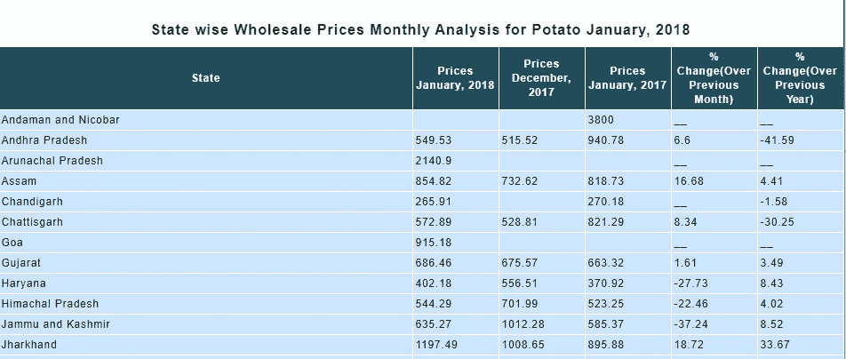

我们感兴趣的是只提取已经在表单中填充了值的列。在这种情况下，“2018 年 1 月价格”。

为此，我们需要在 *BeautifulSoup* 的帮助下进行网络抓取。下面是代码片段。

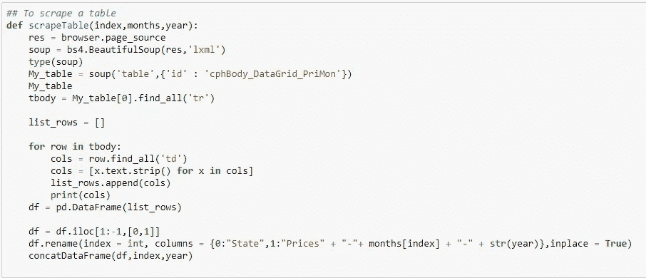

BeautifulSoup 是一个 Python 库，用于从 HTML 和 XML 文件中提取数据。它与您喜欢的解析器一起工作，提供导航、搜索和修改解析树的惯用方式。它通常为程序员节省数小时或数天的工作。

首先，我们将页面源转换成一个 BeautifulSoup 对象。它有助于轻松导航该结构。下面是刮桌子的步骤。

*   我们首先读取给定网页的源代码，并使用“BeautifulSoup”函数创建一个 BeautifulSoup (soup)对象。
*   然后，我们检查所有表格的 HTML 脚本
*   然后，我们在表的所有行上迭代一个循环，去掉 html 标记的元素，并将其转换为表中所有行的列表。
*   然后，我们使用 pandas 库将这个列表转换成数据帧。
*   然后我们调用一个 *concatDataFrame* ()函数来连接所有月份的列。
*   最后，我们将这个数据帧输出到一个 CSV 文件中。下面是连接数据帧的代码片段

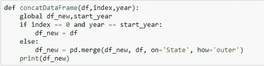

此外，我们将在一个循环中执行此任务，这要求我们返回到我们填写表单的同一页面。我们可以用下面的代码在浏览器上执行反压。

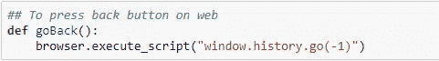

这个过程将继续循环工作，直到我们根据提供的输入提取数据。最终结果将是一个 CSV 文件，如下所示。

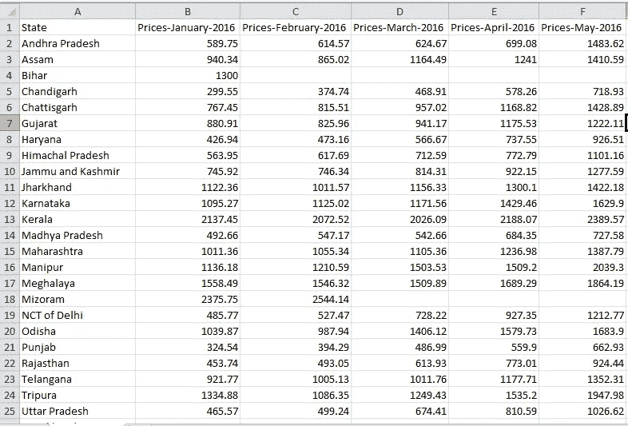

**结论**

Selenium 有助于将原本可能需要几个小时才能完成的任务自动化。

通过对该代码进行微小的修改，您可以提取任意年份范围内的任意商品的数据。

*   提取的数据如果收集了较长的时间周期，则对于执行时间序列分析是空闲的。

**参考文献**

 [## 美丽的汤文档-美丽的汤 4.4.0 文档

### Beautiful Soup 是一个 Python 库，用于从 HTML 和 XML 文件中提取数据。它与您最喜欢的解析器一起工作…

www.crummy.com](https://www.crummy.com/software/BeautifulSoup/bs4/doc/)  [## Selenium 与 Python - Selenium Python 绑定 2 文档

### 请注意，这不是正式文档。如果你想对这个文档有所贡献，你可以叉这个…

selenium-python.readthedocs.io](https://selenium-python.readthedocs.io/)