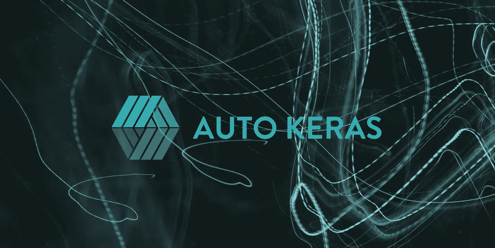

# AutoML:在不定义架构的情况下创建最高性能的神经网络

> 原文：<https://medium.com/analytics-vidhya/automl-creating-top-performing-neural-networks-without-defining-architectures-c7d3b08cddc?source=collection_archive---------0----------------------->

## 用 AutoKeras 在 Python 中编程 AutoML

自动机器学习，通常缩写为 AutoML，是神经网络结构构建的自动化。通过智能架构操作，AutoML 不仅可以让每个人更容易获得深度学习，还可以加速深度学习