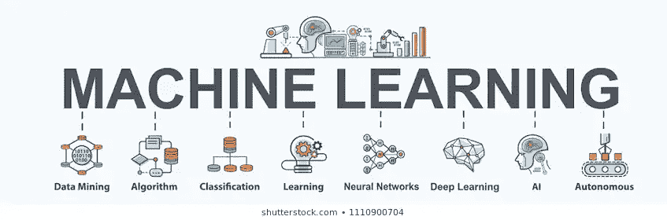
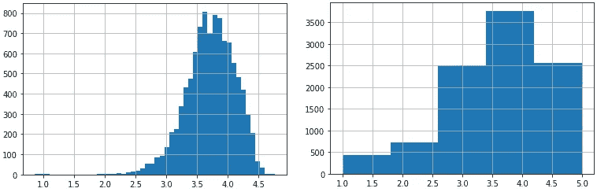
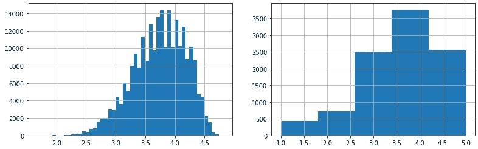

# 带 TPOT 去看电影

> 原文：<https://medium.com/analytics-vidhya/automl-taking-tpot-to-the-movies-cf7e6f67f876?source=collection_archive---------9----------------------->



# 概观

本文的目的是详细介绍我对自动机器学习工具 TPOT 的探索。首先，我将简要介绍 autoML 的概念。然后，我将给出一个 TPOT 工具的概述。了解背景信息后，我们将进入电影推荐场景。我将介绍问题、数据、我们场景中 TPOT 的实现，以及从场景中收集的结果。最后，我将提供一些 TPOT 作为工具的分析，并提出一些如何将其构建到机器学习操作中的想法。

# 什么是 AutoML？

机器学习行业在过去几年已经起飞。根据 Tractica 的数据，全球机器学习行业预计到 2025 年将增长到 1260 亿美元，年复合增长率为 43%。

标准的机器学习模型开发需要在机器学习和应用领域都有很强的领域知识。它还需要大量的时间来运行实验，使用强力试错法来寻找解决方案。埃德·费尔南德斯在《机器学习的现状》中解释了人工智能产业。

> 尽管付出了巨大的努力，包括公司在过去几年对 ML 项目和计划的投资，但只有一小部分 ML 模型进入生产并交付切实的成果。

由于缺乏有经验的机器学习专业人员以及他们要求的高薪，许多公司难以投入生产。在写这篇文章的时候，LinkedIn 上目前有 3.8 万个与机器学习相关的工作，机器学习员工的年薪通常为 10 万至 30 万美元。⁴

AutoML 试图解决其中的一些问题。目标是自动化模型开发的数据预处理和模型优化步骤。这包括数据整形、特征选择、算法选择和算法评估。这不仅提高了机器学习工程师的生产率，还降低了对领域知识的需求。

一些流行的 autoML 开源工具有 [MLBox](https://mlbox.readthedocs.io/en/latest/) 、 [Auto-Sklearn](https://automl.github.io/auto-sklearn/master/) 、 [H2O.ai](https://www.h2o.ai/) 和 [AutoKeras](https://autokeras.com/) 。

大型行业领导者也在将 autoML 工具产品化，如 Google 的 [Cloud AutoML](https://cloud.google.com/automl/) 和 SaleForce 的 [TransmogrifAI](https://transmogrif.ai/) 。

然而，今天我们要看一看 [TPOT](https://epistasislab.github.io/tpot/) 。

# 什么是 TPOT？

TPOT 代表“基于树的管道优化工具”。它是一个 autoML 工具，专注于创建一个优化的 ML 管道。这个管道包括选择最佳的预处理器步骤、机器学习算法和模型超参数。


【http://epistasislab.github.io/tpot/ 号

TPOT 是由宾夕法尼亚大学的 Randal S. Olson 等人创建的一个自动化工具。它建立在流行的 python 机器学习库 [scikit-learn](https://scikit-learn.org/stable/) 之上，并使用相同的 API 语法。这样一来，开发者就很容易拿起来。

TPOT 使用遗传编程(一种进化计算技术)来寻找选择器、转换器和估计器的最佳组合，以解决机器学习问题，同时试图限制流水线的复杂性。

## TPOT 的基因编程

如果您对如何实现 TPOT 更感兴趣，而不是对其内部工作方式感兴趣，请随意跳过这一节。

TPOT 是用 python 编写的，使用 [DEAP 库](https://deap.readthedocs.io/en/master/)来实现遗传编程。在初级水平上，TPOT 使用遗传编程的方式和 follows:⁵一样

1.  TPOT 根据指定的总体初始化许多随机管道。对于这个例子，我们假设有 100 个管道。
2.  使用交叉验证和用户定义的评分函数来评估初始管道。
3.  基于优化评分函数的结果和最小化流水线步骤的数量来对流水线进行排序。生成的前 20 个管道被选择用于下一代。
4.  在下一代中，基于我们最初假设的 100 个群体，每个顶部管道产生 5 个子管道。5%的后代与其他管道交叉或混合，以创建一个部分类似于被组合来创建它的两个管道的管道。剩下的 90%的后代接受随机突变。这种变异可以在管道中添加一个步骤，从管道中删除一个步骤，改变步骤中使用的函数，或者改变函数的超参数。
5.  这些新管道再次使用交叉验证和用户定义的评分函数进行排名。
6.  TPOT 继续这一过程，直到它已经评估了每一代产生的所有管道。(代数由用户指定)

这实际上类似于自然选择。最佳管线的特性在每一代中都存在，而小的突变被应用来搜索更大的优化。最终把最好的管道还给用户。

# 电影推荐


查尔斯·德鲁维奥在 [Unsplash](https://unsplash.com?utm_source=medium&utm_medium=referral) 上拍摄的照片

我们将使用 TPOT 的领域是一直流行的电影推荐引擎。在这个简单的场景中，我们正在构建一个基于流媒体服务的电影推荐系统，类似于网飞。我使用了 Kafka 服务，该服务可以传输用户正在观看的电影和他们提交的电影评级的数据。原始数据有大约 100 万用户和大约 2.7 万部电影。我流式传输这些数据，对其进行解析，并将其保存在数据库中。

解决这个问题的一种常见方法是基于相似用户的偏好进行推荐，也称为协同过滤。然而，TPOT 在其默认算法集中没有任何协同过滤算法。TPOT 允许重要的[定制](https://epistasislab.github.io/tpot/using/#customizing-tpots-operators-and-parameters)，所以添加一个像 [surprise](https://surprise.readthedocs.io/en/stable/getting_started.html) 包这样的库并不困难，它通常用于简单的协作过滤。

我们将使用关于用户和电影的数据来预测用户将如何在 1-5 的范围内对电影进行评分。如果我们想要对最高预测评级进行排序并推荐前 n 部电影，这可以用于推荐服务。我们将保持这个例子尽可能的简单，以保持对 autoML 方面的关注；因此，我们将只根据模型预测用户评分的准确性来评估模型，而不是根据它生成前 n 名推荐列表的准确性来评估模型。然而，在整个示例中，我们将牢记建议方面，以考虑该场景的含义。

## 数据

让我们来看看我们的数据。这些是我们正在使用的功能:

*   年龄—我们预测其评级的用户的年龄
*   性别—用户的性别
*   职业——用户的职业
*   预算——电影的预算
*   类型——电影的类型分为二元特征
*   流行度—来自第三方 API 的流行度指标
*   production _ companies 生产中涉及的公司分为二元要素
*   制片国家——电影的制片国家
*   年份—电影发行的年份
*   月份——电影发行的月份
*   收入——电影的总收入
*   运行时间—电影的长度
*   口语—电影中使用的语言
*   vote_average —来自第三方 API 的评级
*   vote_count —提交给第三方 API 的评级数量

由于二进制特性，我们总共有 227 个特性(列)和 740，732 个实例(行)。正如你可能想象的那样，这些特性中的一些看起来像是用户评级的重要指标，而另一些看起来几乎毫无用处。比如投票数大概和热门电影有关联；因此，用户可能更有可能对这些电影进行高度评价。另一方面，这部电影是在埃及制作的这一事实似乎并没有提供太多的信息。

## 履行

现在我们有了一些数据，我们准备使用 TPOT。我将在这里强调实现的主要方面，但是如果您想了解更多细节，有三种方法。

*   [GitHub Repo](https://github.com/bialesdaniel/se4ai-i5-tpot) —这是 TPOT 管道优化的代码实现。它使用模块化代码，与您实际实现 TPOT 的方式非常相似。

[](https://github.com/bialesdaniel/se4ai-i5-tpot) [## bialesdaniel/se4ai-i5-tpot

### 这个回购展示了如何使用 TPOT 来训练一个最佳的管道来预测用户将如何评价电影中的电影…

github.com](https://github.com/bialesdaniel/se4ai-i5-tpot) 

*   [Python 笔记本](https://github.com/bialesdaniel/se4ai-i5-tpot/blob/master/notebooks/TPOT_Movies_Explained.ipynb) —在 GitHub repo 中，我创建了一个可以本地运行的 Python 笔记本。

[](https://github.com/bialesdaniel/se4ai-i5-tpot/blob/master/notebooks/TPOT_Movies_Explained.ipynb) [## biales Daniel/se4ai-i5-tpot/notebooks/TPOT _ 电影 _Explaied.ipynb

### 在这个简单的场景中，我们正在构建一个基于流媒体服务的电影推荐系统…

github.com](https://github.com/bialesdaniel/se4ai-i5-tpot/blob/master/notebooks/TPOT_Movies_Explained.ipynb) 

*   [Google Colab](https://colab.research.google.com/drive/1nsFIhZ13uOkHjBzv_26IqAHXcfBeB9rV?usp=sharing) —如果你想在网上玩这个例子，只需将 Google Colab 笔记本复制到你的硬盘上。

[](https://colab.research.google.com/drive/1nsFIhZ13uOkHjBzv_26IqAHXcfBeB9rV?usp=sharing) [## 谷歌联合实验室

### TPOT 电影推荐

colab.research.google.com](https://colab.research.google.com/drive/1nsFIhZ13uOkHjBzv_26IqAHXcfBeB9rV?usp=sharing) 

首先，为了加快训练速度，我将使用一小部分数据样本。我用 10，000 个实例进行训练，用 10，000 个实例进行测试。

```
from tpot import TPOTRegressorpipeline_optimizer=
  TPOTRegressor(generations=100, population_size=100, verbosity=2, random_state=42, template='Selector-Transformer-Regressor', n_jobs=-1, warm_start=True, periodic_checkpoint_folder='/content/tpot-intermediate-save/')pipeline_optimizer.fit(X_train, y_train)pipeline_optimizer.score(X_test, y_test)
```

哇，那很简单。这将运行 TPOT，创建最佳管道，并使用均方误差评估管道。让我们来看看我们指定的一些 TPOT 参数。

*   `generations` -这是 TPOT 将运行的管道生成的迭代次数。或者，您可以指定一个`max_time_minutes`在一定时间后停止 TPOT。
*   `population_size` -这是每一代人训练的管道数量。
*   这只是给了我们一些反馈，让我们知道 TPOT 正在沸腾。搜索可能会花很长时间，所以我觉得这样可以确保它没有冻结。
*   `random_state` -这确保我们第二次运行时使用相同的种子。
*   `template` -这描述了我希望我的管道是什么样子。我几乎没有做过功能工程，所以我想从选择器开始寻找最佳功能，然后转换这些功能，最后使用回归变量。如果我没有指定一个模板，TPOT 会选择最合适的组合。在我的试验中，管道的形状最终会变成`Regressor-Regresssor-Regressor`。
*   `n_jobs` -用于评估的并行进程的数量
*   `warm_start` -这告诉 TPOT 是否重用最后一次调用‘fit()’时的群体。如果您想停止并重新开始拟合过程，这是很好的。
*   `periodic_checkpoint_folder` -训练期间在哪里间歇保存管线。这有助于确保你得到一个输出，即使 TPOT 突然去世或者你决定提前停止训练。

基于`generations`和`population_size`参数，TPOT 将训练 10，100 条管道，并使用 5 重(另一个配置选项，但我只是使用默认)交叉验证和负均方误差评分函数对它们进行比较。它可能不会生成 10，100 个唯一管道，因为它会跳过生成的任何重复管道。此示例生成了大约 2，500 个不同的管道。可以想象，生成这么多管道并使用交叉验证对它们进行评估是非常耗时的。在我的本地机器上运行 python 笔记本花了大约 6 个小时。

有了机器学习，数据往往越多越好；因此，我决定尝试用 50 万个实例来训练 TPOT，并用其余的数据进行测试。为了加快实验速度，我决定将`generations`减少到 10，将`population_size`减少到 50。即使减少了参数，数据量也大大降低了训练速度。使用本地笔记本运行它花了 15 个多小时，我从未能在 Google Colab 上成功完成。

## 结果

为了比较结果，我使用 scikit-learn 中的默认参数在大型数据集上训练了一个决策树。这个基本模型给了我 1.44 的均方误差。在小数据集上训练的 TPOT 模型具有 0.99 的均方误差。但是，如果我们将预测评级的分布与实际评级的分布进行比较，我们可以看到该模型主要预测的是多数类(~4)。



预测评分(左)和实际评分(右)的分布。

在大型数据集上训练的模型的均方误差为 0.98，但预测的分布看起来好得多。



预测评分(左)和实际评分(右)的分布。

然而，如果我们回想起我们试图解决的问题，这种改进的分配可能没有多大意义。在我们的场景中，错误值是没有意义的，因为我们只关心排序。如果一个预测错了整整两个点，但是所有的电影推荐对用户来说都是正确的顺序，那么这将是一个完美的模型。为了评估基于推荐等级的模型，我们需要提出一种不同的评估方法。然而，这超出了本文的范围。

# 结论

## 好人

总的来说，TPOT 似乎是一个非常强大的工具。根据 Adithya Balaji 和 Alexander Allen 的论文，该论文对 auto-sklearn、TPOT、auto ml 和 H2O 进行了基准测试，当涉及到回归问题时，TPOT 比其他三个表现得更好。⁶这个工具还有一些好处，从我上面对实现的描述中还看不出来。

1.  易于使用——如前所述，TPOT 建立在 scikit-learn 之上，这使得它非常容易获取和使用。TPOT 甚至可以选择将最终模型导出为 python 代码。这使得即使是开发新手也能很容易地使用这个工具。
2.  可定制性——TPOT 允许您定制优化过程的许多方面。您可以定义要将哪些算法或超参数引入随机突变。甚至可以定制用于确定最佳模型的评分函数。
3.  大量的控制——TPOT 允许您配置模型生成的所有主要方面。您可以定义从管线搜索应该运行的时间长度到最终管线的所需形状的所有内容。
4.  节省时间——TPOT 在功能工程方面节省了大量时间。我很少考虑哪些功能将是最有用的，但 TPOT 能够使用所有这些数据来生成一个有用的模型。
5.  积极开发——TPOT 目前维护良好。看起来维护者对 GitHub 问题的反应很迅速，并且正在努力为这个工具提供新的特性。从工程的角度来看，这一点很重要，因为您希望确保您使用的工具得到很好的支持并持续改进。

## 坏事

在探索这个工具的时候，我发现了 TPOT 的一些缺点。我打赌你能猜到第一个是什么。

1.  耗时——虽然我们节省了大量的特征工程时间，但在等待模型被训练时，我们又浪费了很多时间。根据要素的数量、数据的大小以及需要更新模型的频率，这可能会变得非常昂贵。记住，时间就是金钱。
2.  数据类型——不幸的是，TPOT 目前在数据类型输入方面并不智能。它只处理数字数据类型。因此，我必须编写代码将一些分类特征转换成二进制特征。然而，TPOT 可能正在努力增加一些智能数据清理。这个相关的数据清理[问题](https://github.com/rhiever/datacleaner/issues/1)从 2016 年就开始了。
3.  可解释性——由于 TPOT 是随机生成管道的，所以很难理解为什么某个模型可能表现得最好。这有点令人担忧，因为这可能意味着以后调试模型问题会很困难。
4.  没有回归神经网络——由于 TPOT 可以为分类问题生成神经网络，我想在我们的问题空间中试验一下这个特性。然而，TPOT 还不支持回归问题的神经网络。目前在 [GitHub](https://github.com/EpistasisLab/tpot/issues/1081) 上有一个问题正在追踪这个问题。

# 你怎么能利用 TPOT 呢？


以下是关于如何在你的模型开发过程中使用 TPOT 的想法。这些想法处于不同的成熟阶段。我想澄清一下，我还没有在生产系统中实现 TPOT，所以这些想法完全是基于我的实验和研究。

1.  探索一个新的领域——TPOT 的目的之一是，你不需要有太多问题空间领域的知识就能有效。在全新的领域，TPOT 可能是一个很好的起点。把你所有的数据传给它，看看它会给出什么样的模型。这可以帮助你更好地理解这个领域，因为你知道为什么 TPOT 会产生这样的模型。
2.  创建一个管道——显然，TPOT 可以用来创建一个管道。如果您有时间生成模型并且互操作性不是问题，那么您可以通过 TPOT 运行您的数据来生成模型并在生产中使用该模型。
3.  使用最佳模型解决难以调试的问题——在这种情况下，您有一个已经存在的模型，但是有一个问题您无法解决。例如，一个子群体欺骗了模型，而你却找不到解决方案。您可以使用 TPOT 生成解决您的问题的最佳模型。正如 TPOT documentation,⁷所说，“TPOT 旨在成为一个助手，通过探索你可能从未考虑过的管道配置，为你提供如何解决特定机器学习问题的想法，然后将微调留给更受约束的参数调整技术，如网格搜索。”在这种情况下，TPOT 是作为集思广益的合作伙伴，提出新的想法来解决一个难题。
4.  监控—您可以将 TPOT 作为监控的一部分(作为上限基准)。你可以花很长时间生成一个最优的 TPOT 管道，并跟踪该模型的性能。然后，当您生成您的实际生产模型(不使用 TPOT)时，您可以看到您的模型有多接近最优解。
5.  测量模型退化——这个想法肯定有点离谱，所以请原谅我。对于您不经常重新训练您的模型的场景，您可以使用 TPOT 不断地重新训练一个基准模型。随着新数据的到来，它会重新训练并试图产生一个更好的模型。然后，您将对照 TPOT 模型跟踪您的实际生产模型的性能。这将有助于识别数据随着时间的推移实际上变得更加相关的情况。通过只跟踪生产模型的准确性，您不会注意到数据变得更加相关，因为模型将继续类似地执行。然而，通过不断地重新训练 TPOT 模型，你会发现它能够生成越来越好的模型，因为数据的相关性增加了。这会让你意识到你的生产模式已经过时，需要重新培训。

这是我目前掌握的全部信息。感谢您阅读我的文章。想了解更多关于 TPOT 的信息，请查看他们的文档。

**参考文献**

[1]“人工智能软件市场到 2025 年全球年收入将达到 1260 亿美元”，【Tractica.omdia.com】T4，2020 年。【在线】。可用:[https://tractica . om dia . com/news room/press-releases/artificial-intelligence-software-market-to-reach-1260 亿年全球收入到 2025 年/。](https://tractica.omdia.com/newsroom/press-releases/artificial-intelligence-software-market-to-reach-126-0-billion-in-annual-worldwide-revenue-by-2025/.)【访问时间:2020 年 7 月 15 日】。

[2] E. Fernandez，《机器学习& AI*产业的现状》，*中*，2020。【在线】。可用:[https://towardsdatascience . com/state-of-the-machine-learning-ai-industry-9bb 477 f 840 c 8。](https://towardsdatascience.com/state-of-the-machine-learning-ai-industry-9bb477f840c8.)【访问时间:2020 年 7 月 15 日】。

[3]“美国 38000+机器学习岗位(新增 1734 个)”，*Linkedin.com*，2020。【在线】。可用:[https://www.linkedin.com/jobs/search/?geoId=103644278&关键字=机器% 20 学习&地点=美国% 20 州。](https://www.linkedin.com/jobs/search/?geoId=103644278&keywords=machine%20learning&location=United%20States.)【访问时间:2020 年 7 月 15 日】。

[4]《机器学习乔布斯| Glassdoor》， *Glassdoor* ，2020。【在线】。可用:[https://www . glass door . com/Job/machine-learning-jobs-SRCH _ ko0，16.htm？job type = full time&min salary = 113600&maxSalary = 318800。](https://www.glassdoor.com/Job/machine-learning-jobs-SRCH_KO0,16.htm?jobType=fulltime&minSalary=113600&maxSalary=318800.)【访问时间:2020 年 7 月 15 日】。

[5] R. Olson，“TPOT:用于自动化机器学习的基于树的流水线优化工具”，载于 *ICML: 2016 AutoML 研讨会*，纽约州，2016 年。

[6] A. Balaji 和 A. Allen，“自动机器学习框架的基准测试”，Arxiv.org，2018 年。【在线】。可用:[https://arxiv.org/pdf/1808.06492v1.pdf](https://arxiv.org/pdf/1808.06492v1.pdf)。[访问日期:2020 年 7 月 15 日]。

[7] R .奥尔森，《利用 TPOT — TPOT》， *Epistasislab.github.io* ，2020 年。【在线】。可用:[https://epistasislab . github . io/tpot/using/# what-to-expect-from-automl-software。](https://epistasislab.github.io/tpot/using/#what-to-expect-from-automl-software.)【访问时间:2020 年 7 月 15 日】。