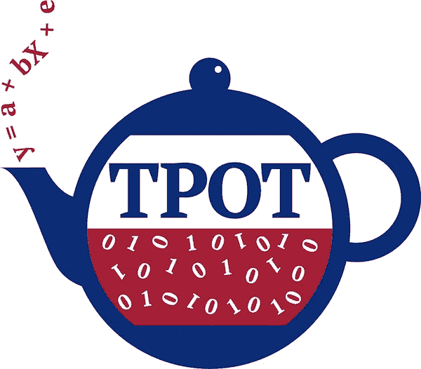

# TPOT 汽车公司

> 原文：<https://medium.com/analytics-vidhya/automl-tpot-9a83509e021f?source=collection_archive---------15----------------------->



自动化[机器学习](https://en.wikipedia.org/wiki/Machine_learning) (AutoML)是一个热门的新领域，其目标是使选择机器学习算法、它们的参数设置和预处理方法变得容易，从而提高它们在大数据中检测复杂模式的能力。

基于树的管道优化工具(TPOT)是为数据科学社区开发的首批 AutoML 方法和开源软件包之一。TPOT 是由 Randal Olson 博士在宾夕法尼亚大学计算遗传学实验室与 Jason H. Moore 博士一起做博士后时开发的，目前仍由该团队扩展和支持。

TPOT 代表基于树的管道优化工具。把 TPOT 当成你的数据科学助理。TPOT 是一个 Python 自动化机器学习工具，它使用遗传编程优化机器学习管道。TPOT 利用基于 Python 的 scikit-learn 库作为它的 ML 菜单。


【https://github.com/EpistasisLab/tpot】参考:Github 网址:[](https://github.com/EpistasisLab/tpot)

# 遗传表演程序

遗传编程(GP)是进化算法(EA)的一种，是机器学习的一个子集。进化算法用于发现人类不知道如何直接解决的问题的解决方案。摆脱了人类的先入之见或偏见，EAs 的自适应特性可以产生与人类最大努力相当甚至更好的解决方案。*

有了正确的数据、计算能力和机器学习模型，你可以发现任何问题的解决方案，但知道使用哪个模型对你来说可能是一个挑战，因为有太多这样的模型，如决策树、SVM、KNN 等。

这就是基因编程可以发挥巨大作用并提供帮助的地方。遗传算法受达尔文自然选择过程的启发，它们用于生成计算机科学中优化和搜索问题的解决方案。

广义地说，遗传算法有三个特性:

*   选择:你有一个给定问题的可能解决方案的群体和一个适应度函数。在每次迭代中，您都要评估如何用您的适应度函数来适应每个解决方案。
*   交叉:然后你选择最合适的，并执行交叉，以创造一个新的群体。
*   变异:你用一些随机的修改使这些孩子变异，并重复这个过程，直到你得到最合适或最好的解决方案。

# 装置

**要在您的系统上安装 tpot，您可以运行命令**

**> > > pip 安装 tpot**

**在命令行终端上。它建立在几个现有的 Python 库之上**

**或点击** [**链接**](https://pypi.org/project/TPOT/#files) **下载。**

# 手写数字数据集

下面是一个手写数字数据集光学识别的最小工作示例。

```
from tpot import TPOTClassifier
from sklearn.datasets import load_digits
from sklearn.model_selection import train_test_splitdigits = load_digits()
X_train, X_test, y_train, y_test = train_test_split(digits.data, digits.target,
                                                    train_size=0.75, test_size=0.25, random_state=42)tpot = TPOTClassifier(generations=5, population_size=50, verbosity=2, random_state=42)
tpot.fit(X_train, y_train)
print(tpot.score(X_test, y_test))
tpot.export('tpot_digits_pipeline.py')
```

运行这段代码应该会发现一个达到大约 98%测试准确率的管道，相应的 Python 代码应该会导出到 **tpot_pipeline.py** 文件中，如下所示:

```
import numpy as np
import pandas as pd
from sklearn.ensemble import RandomForestClassifier
from sklearn.linear_model import LogisticRegression
from sklearn.model_selection import train_test_split
from sklearn.pipeline import make_pipeline, make_union
from sklearn.preprocessing import PolynomialFeatures
from tpot.builtins import StackingEstimator
from tpot.export_utils import set_param_recursive**# NOTE: Make sure that the outcome column is labeled 'target' in the data file**
tpot_data = pd.read_csv('PATH/TO/DATA/FILE', sep='COLUMN_SEPARATOR', dtype=np.float64)features = tpot_data.drop('target', axis=1) training_features, testing_features, training_target, testing_target =train_test_split(features, tpot_data['target'], random_state=42)**# Average CV score on the training set was: 0.9799428471757372**exported_pipeline = make_pipeline(
    PolynomialFeatures(degree=2, include_bias=False, interaction_only=False),
    StackingEstimator(estimator=LogisticRegression(C=0.1, dual=False, penalty="l1")),
    RandomForestClassifier(bootstrap=True, criterion="entropy", max_features=0.35000000000000003, min_samples_leaf=20, min_samples_split=19, n_estimators=100)
)**# Fix random state for all the steps in exported pipeline**set_param_recursive(exported_pipeline.steps, 'random_state', 42)exported_pipeline.fit(training_features, training_target)
results = exported_pipeline.predict(testing_features)
```

希望以上的解释能让你对 AutoML 有一个清晰的总结。