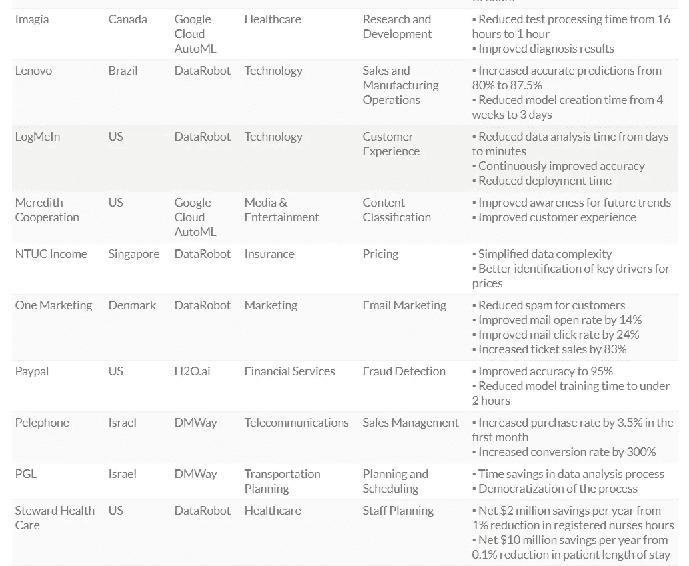

# 汽车——值得吗？

> 原文：<https://medium.com/analytics-vidhya/automl-worthy-or-not-349350e02fb7?source=collection_archive---------32----------------------->

当您开始自动化自动化过程本身时,“没错，这就是结局！! "

AutoML 有能力成为 AI-ML 世界中的下一个主要阶段，并且凭借其执行数据预处理、ETL 任务和转换的能力，将可能成为今年最流行的趋势。

在一年的时间里，数据科学相关的库和方法有了很大的发展，因此也需要一个更加强大和可扩展的解决方案来支持数据科学相关的研究活动。

在这篇博文中，我们将探讨对基于 AutoML 的解决方案的需求、它们的功能，以及投入时间学习 AutoML 工具的可行性。

# **什么是 AutoML？**

Auto ML 是使机器学习周期的不同子过程自动化的过程，并为以下每个子过程提出架构和配置:

1.  *数据预处理，*
2.  *特色工程，*
3.  *功能选择，*
4.  *特征提取*
5.  *算法选择，*
6.  *超参数调谐*

并找到参数的最佳组合以创建一个高效的优化的 ML 模型。

# **为什么需要 AutoML？**

1.  机器学习过程的不同阶段/子过程(*如上所述*)需要不同的时间。
2.  上述每种方法都需要针对价值和配置进行优化，这是一项非常耗时的任务。
3.  对于高性能和中等复杂性的模型，优化过程可能需要几周到几个月的时间。
4.  AutoML 大大减少了上述管道中某些(但不是全部)阶段的时间和精力。
5.  通过为数据科学技能较少的公司引入 ML 功能，实现 AI-ML 空间的民主化。AutoML 可以帮助完成这些过程，并且不需要高级知识。

# AutoML 值得你花时间吗？

随着越来越需要从大数据中获得更多见解，组织正在转向通过利用复杂的自动化机器学习能力来增强其预测能力。

让我们根据数据科学领域中的各种角色来探讨 AutoML 工具的使用，以及谁能够更好地利用这些工具的功能。

## **业务分析师:**

在通常的机器学习管道中，业务分析师的角色是:

1.  识别业务用例，
2.  收集数据，
3.  基于主题专业知识假设特征。
4.  验证模型的可视化结果。

***示例:*** 考虑一个典型的问题，其中一个电子商务组织需要一个解决方案来根据过去的数据预测一年中各种产品的销售情况。通常情况下，业务分析师会花费大量时间来了解影响结果的特征，从现有特征中可视化和创建新特征，计算特征的相关性，并提出可以产生良好结果的组合。

同样，该过程可能会花费大量时间，并且不能确保可能的最佳结果，因为解决方案将受限于分析师的专业知识和时间限制。

在这种情况下，AutoML 解决方案可以发挥巨大作用，因为即使对 ML 算法实现的了解有限，业务分析师也可以使用流行的 AutoML 工具，利用手头的数据，立即对准确性/误差进行初步评估。

AutoML 解决方案可以为业务分析师提供自动的特性选择、特性提取，产生与最适合用例的算法相混合的相关特性组合，并在最少的时间内生成最佳结果。

这些工具为大多数机器学习过程提供了恰到好处的抽象，并且只需要数据集、优化指标名称和学习时间约束作为输入。

AutoML 工具对于业务分析师和主题专家来说是革命性的，他们不能投入足够的时间深入 ML 算法实现。

## **数据科学家:**

虽然数据科学家拥有构建从统计模型到深度学习模型的基本和高级机器学习模型的知识，但有一些条件会影响这些模型的最终性能:

1.  **时间限制**:

在算法池中为您的问题找到最佳算法，然后为这些算法确定最佳超参数集是一项非常耗时的任务。基本模型可能需要几天时间，但深度学习模型可能需要几周到几个月的时间。

**2。对所有算法的深入了解:**

对于这些算法的超参数调整，应该深入了解每一种基本的和先进的算法。此外，这个机器学习领域的算法不断改进，因此保持对最新解决方案的关注也是必须的。

**3。在正确的过程中给出时间:**

虽然模型选择和超参数调整同等重要，但是我们知道模型和它的数据一样好。

特征工程需要足够的时间和专业知识，以便算法可以充分利用数据，其结果与现实世界更相关。

**AutoML 可以作为数据科学家的辅助工具**，协助:

1.  结构化和非结构化数据的必要数据预处理，
2.  通过自动执行从池中选择模型的过程，为功能工程提供足够的时间，然后调整模型以实现最佳用途。
3.  收到数据后，立即创建端到端管道，为初始结果建立基线。
4.  在获得基线模型之后，可以进一步手动调整它，以获得更精确的结果。

# **案例分析:**

下面是由不同的 AutoML 供应商进行的一些案例研究。

来源:https://research.aimultiple.com/automl-case-studies/

来源:https://research.aimultiple.com/automl-case-studies/

# 结论:

AutoML 有望帮助非技术公司或数据科学专业知识较少的公司构建他们的 ML 应用程序，并帮助减少实施 ML 流程的时间。

AutoML 是一个解决方案，帮助公司找到弥合人才缺口的方法。它不仅有利于技能较低的数据科学家，而且还为高技能科学家节省了一次时间，以便他们可以管理其他高优先级的任务，而不是浪费时间在可以由 AutoML 自动执行的任务上。

有趣的观察:H2O(一个非常流行的 AutoML 工具)可以创建和调整大约。对于中等复杂度的数据集，1 小时内有 400 个模型。

## **一些值得探索的有趣的 AutoML 工具:**

1.  [H2O 汽车](http://docs.h2o.ai/h2o/latest-stable/h2o-docs/automl.html)(强烈推荐)
2.  [TPOT](http://epistasislab.github.io/tpot/) (基于 sklearn 打造)
3.  [AutoKeras](https://autokeras.com/) (可能是最好的深度学习 AutoML 工具)
4.  [MLBox](https://mlbox.readthedocs.io/en/latest/)
5.  谷歌云汽车
6.  IBM Watson AutoAI
7.  亚马逊 SageMaker AutoML
8.  Microsoft Azure ML Studio

***另外，如果你想在后续文章中看到对上述工具的详细分析，请在评论区告诉我。***

如果你喜欢这篇文章，请表示你的赞赏。我愿意接受所有的反馈和建议，以改善内容。

您可以通过以下方式联系到我:

领英:[https://www.linkedin.com/in/deepak-kushwaha818/](https://www.linkedin.com/in/deepak-kushwaha818/)

github:[https://github.com/KushwahaDK/](https://github.com/KushwahaDK/)