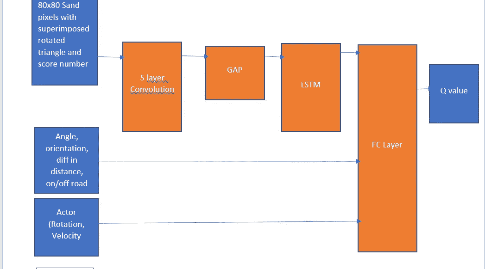
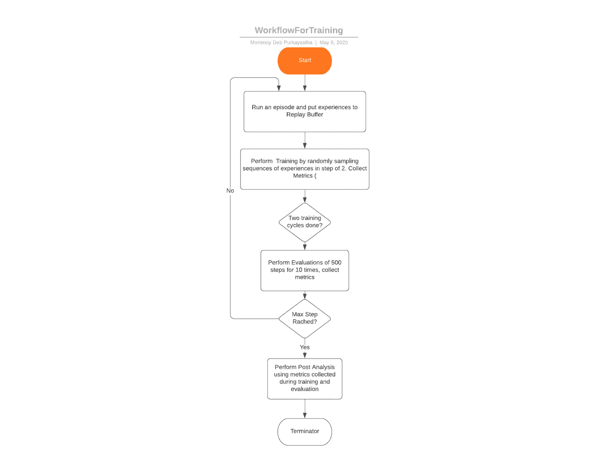
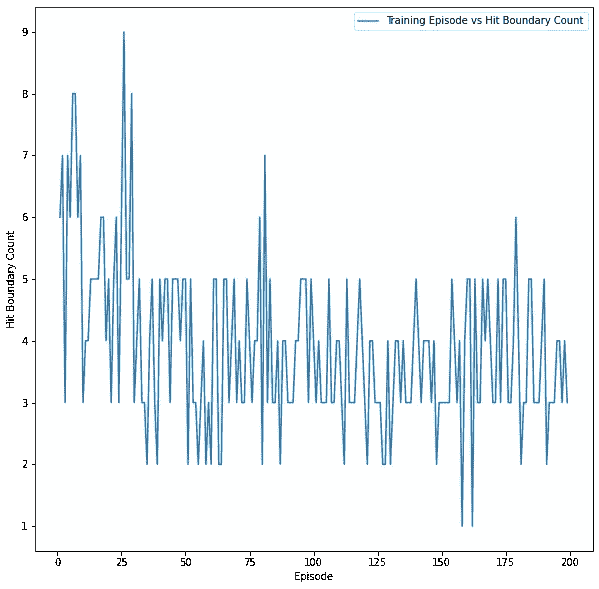

# 使用具有 LSTM 的双延迟深度确定性(TD3)深度强化学习算法的自动驾驶模拟

> 原文：<https://medium.com/analytics-vidhya/autonomous-driving-simulations-using-twin-delayed-deep-deterministic-td3-deep-reinforcement-c846bf6882e5?source=collection_archive---------14----------------------->


城市地图

**由于复杂的道路场景和密集的周围动态物体，自动驾驶**具有挑战性。因此，高度智能的决策对于处理复杂场景至关重要。

**Twin Delayed Deep Deterministic(TD3)**算法([https://arxiv.org/pdf/1706.02275.pdf](https://arxiv.org/pdf/1706.02275.pdf))是一种最先进的、非策略的深度强化学习算法，可以高效地应用于连续动作空间，如自动驾驶场景。

TD3 使用行动者评价方法，其中行动者功能指定给定环境当前状态的行动。批评值函数指定一个信号(TD 误差)来批评演员所做的动作。TD3 使用两个评论家网络和一个演员网络。TD3 算法还为每个代理的演员和评论家使用单独的目标神经网络。TD3 算法的细节在[https://github.com/monimoyd/P2_S9](https://github.com/monimoyd/P2_S9)中解释

在这篇文章中，提供了一个带有道路的城市地图以及一辆用于自动驾驶的汽车。目标如下:

1.  让汽车尽可能多的行驶在路上
2.  在最短的时间内达到目标。

我已经为这个项目使用了 Kivy 环境

[https://kivy . org/doc/stable/installation/installation-windows . html](https://kivy.org/doc/stable/installation/installation-windows.html)。

Github 链接:

[https://github.com/monimoyd/EndGameAssignment](https://github.com/monimoyd/EndGameAssignment)

该项目的亮点如下:

*   创建了一个基于 Kivy 环境的模拟健身房环境
*   使用双延迟深度确定性(TD3)算法进行训练
*   使用基于 LSTM 和卷积神经网络(CNN)的 DNN 模型。经验的随机序列被从重放缓冲器中取出作为对 LSTM 的输入
*   对于状态空间，遮罩与一辆三角形旋转汽车以及一个基于汽车在该步骤中所做操作的编号分数叠加在一起
*   最初对动作进行随机采样，以填充重放缓冲区
*   随机动作和策略动作的混合是基于探索因子ε值来完成的，该探索因子ε值在每一集都减少
*   每两次训练后，进行评估
*   在每次培训和评估中都会计算指标(总奖励、上路/越野次数、目标命中次数、边界命中次数)
*   每集存储后的演员和评论家模型
*   根据对收集的评估和培训指标的分析，我选择了合适的测试模型
*   调整学习率、权重衰减等参数以克服代理循环效应

# 一.环境

代理(即 car)根据策略和环境从当前状态采取行动，告知下一个状态并给予奖励。

# a.观察状态空间

观察状态空间由对应于道路上汽车当前状态的图像组成，如下所示:

*   80×80 的数字阵列是通过在当前汽车位置周围取 40 个像素由沙子构成的
*   一个等腰三角形(即只有两条边相等)在汽车移动方向上旋转，叠加在图像上。等腰三角形有助于在自然界中发现不对称特征
*   还叠加了一个数字分数(0-5 ),代表汽车在这一步的表现。编号分数如下表所示:


下面显示了一些示例图像:


该图像由 CNN 和 LSTM 处理。此外，在状态空间中使用了以下附加属性


# b.行动空间:

的动作空间由两个动作组成。沿 x 轴的速度

动作描述旋转沿 x 轴的旋转角度。它可以有连续的值-3 到 3 个沿 x 轴的速度位移。它可以具有 0.4 到 2.4 之间值


注意:在策略网络中，策略被实现来为旋转和速度给出-5 到 5 之间的连续值。在应用到汽车之前，该值被标准化为表中为每个动作指定的范围

# c.奖励:

奖励是由环境在代理人的每一步给予的


每次训练都有固定的 2500 步。剧集结束后，变量设置为真。

# 二。方法和解决方案

# I .模拟健身房环境，以封装 Kivy 环境

Kivy 环境没有提供像 reset，step 这样的方法，这对于任何 RL 项目来说都是非常容易的。为了解决这个问题，我基于 Python 提供的多进程队列和事件机制创建了一个与 Kivy 交互的模拟健身房环境。真实的 Kivy 环境在一个单独的过程上工作，而 TD3 训练在一个单独的过程上工作


TD3 列车过程首先启动，它将启动 Kivy 环境。有一个模拟的体育馆环境，TD3 Train 进程可以调用类似 env.reset()的方法来重置环境，调用 env.step(action)来采取行动并获得下一个状态。内部模拟的健身房环境使用事件和消息队列与真实的 Kivy 环境交互。

# 二。演员网络


# 参与者输入:

Actor 网络将输入作为两个元素的元组 i. 80x80 numpy 数组，表示沙子，叠加等腰三角形，旋转方向与汽车相同，数字得分(1–5)ii。第二个元素是具有 4 个参数的 Numpy 数组，它们是 A .汽车的角度 b .汽车到目标的负方向 c .当前汽车位置到目标的距离和前一汽车位置与目标的距离之差除以 4 d .标志 on_road，其值 1 表示汽车在道路上，而-1 表示汽车关闭

# 卷积层:

有 5 个卷积层用于变换道路像素输入。除了最后一层，每一层都使用 16 个 3×3 的滤波器，步长为 2，ReLU 激活。最后一层具有步幅为 1 的 16 个 3x3 滤波器

# 间隙层:

在转换成 16x1x1 的 5 个卷积层之后添加全局平均池层

# LSTM 层:

LSTM 层取一维数组并编码成 32 个矢量张量的隐层

# FC 层:

有三个完全连接的层。

*   第一层层采用来自 LSTM 的隐藏层输出，与 4 个额外参数附加状态信息(角度、到目标的方向、到目标的距离差、道路标志值)连接，并转换成 64 个 1D 张量和应用的 ReLU 激活
*   第二层连接第一层输出，and 输出是 128 1d 张量和应用的 ReLU 激活
*   第三层输出从第二层转换到 1 个张量，在该张量上应用 tanh 并乘以 max_action 以获得 actor 输出

# 三。评论家网络



# 评论家意见:

Critic 网络将输入作为二元元组 i. 80x80 numpy 数组，表示沙子，叠加等腰三角形，旋转方向与汽车相同，数字得分为(1–5)ii。第二个元素是具有 4 个参数的 Numpy 数组，这些参数是 A .汽车的角度 b .汽车到目标的方向 c .当前汽车位置到目标的距离和前一汽车位置与目标的距离之差除以 4 d .标志 on_road，其值 1 表示汽车在道路上，0 表示汽车不在道路上 i. Actor 输出(旋转、速度)

# 卷积层:

有 5 个卷积层用于变换道路像素输入。除了最后一层，每一层都使用 16 个 3×3 的滤波器，步长为 2，ReLU 激活。最后一层具有步幅为 1 的 16 个 3x3 滤波器

# 间隙层:

在转换成 16x1x1 的 5 个卷积层之后添加全局平均池层

# LSTM 层:

LSTM 层取一维数组并编码成 32 个矢量张量的隐层

# FC 层:

*   第一层层采取隐藏层输出形式 LSTM 连接 4 个额外的状态信息(角度，方向目标，距离目标的差异，道路标志值)和行动(旋转，速度)转换成 64 1D 张量和应用 ReLU 激活
*   第二层连接第一层输出，and 输出是 128 1d 张量和应用的 ReLU 激活
*   第三层输出从第二层变换到 1 张量，这是 Critic 的 Q 值

# 三。使用的工作流程

下面的流程图显示了所使用的工作流程。



一、跑一集 2500 步二。在每集标记了集号后，执行训练并保存模型，以便可以检索用于后期分析。收集指标 iii。每两个训练周期后，评估 500 步 10 次，收集指标 iv。对指标进行分析，并选择最佳模型

# 四。培养

# a.训练期间使用的超参数

我使用 Adam optimizer 对演员和评论家网络进行了优化，具有以下超级参数:

```
Batch Size: 128
    Number of time steps : 500000
    Steps per episode: 2500
    Discount Rate (gamma) : 0.99
    Soft update of target parameters for Polyak Averaging (Tau) : 0.005
    Initial warmup episodes without learning: 10000 timesteps
    Number of learning steps for each environment step : 128
    Exploration Noise : 0.1
    Policy Noise : 0.2
    Actor Learning Rate: 1e-5
    Actor Weight Decay: 0.01
    Critic Learning Rate: 2e-5
```

# b.用于改进培训的技术

为了改进训练，我使用了以下技巧

## 一.热身:

初始 10000 个时间戳通过从动作空间中随机选择动作，重放缓冲区被随机填充。这将有助于更好的探索

## 二。LSTM:

由于汽车所采取的步骤是一个序列问题，因此在网络中使用 LSTM 来提高性能。当使用 LSTM 时，不是从重放缓冲器中随机抽取样本，而是使用经验序列。由于我为每集使用了固定数量的时间步长，因此连续剧集的记录会按顺序存储在重播缓冲区中，使用以下代码可以很容易地获得特定剧集的记录:

*   从已完成的剧集列表中随机选择一集。
*   从所选剧集中随机选择一个时间步长。确保选择的时间步长在 0 和 2500–256 之间
*   我没有选择连续体验，而是选择了两次体验间隔，例如，如果当前播放了 100 集，随机选择的集是 10，开始序列是 100，则从重放缓冲区中选择用于训练的记录 id 是:

[100 *2500 + 100，100* 2500 + 102，100 *2500 + 104，…100* 2500 + 356]

## 四。勘探系数ε:

对于剧集探索，我使用了初始化为 0.9 的 epsilon 值，并且在每一集之后，epsilon 值减少 0.05，直到它达到 0.2。在 0 和 1 之间生成一个随机数，如果它小于ε值，则从随机策略中采取下一个动作，否则从基于 DNN 的策略网络中采取动作

## 动词 （verb 的缩写）高斯噪声:

平均值为 0、标准偏差(sigma)为 0.1 的高斯噪声已添加到探索状态的操作中。

## 不及物动词在标记有剧集编号的每集后分别保存模型:

每集结束后，该集使用的模型将分别为演员和评论家保存。由于我已经运行了 200 集，因此有 200 个演员和评论家模型的实例被保存。基于在培训期间收集的指标分析结果和在培训 2 期后完成的评估，有助于决定哪种模型做得最好，以及哪种模型用于部署。

## 动词 （verb 的缩写）评估:

有两种评估模式:

i. Eval:这在两个训练周期之后使用，以通过仅使用迄今为止学习的策略来评估策略网络。每个评估由 500 个时间步组成，每个时间步运行 10 次

二。全面评估(测试):—此模式用于演示和部署。目前，当达到目标时，done 变量设置为 True。(对于运行全集 stop_on_hitting_goal 为 False。但是理想地，在测试时间而不是随机位置期间，它应该在路上，但是还没有实现)。默认情况下，完全评估处于演示模式，如果不想处于演示模式，可以在 map.py 中将变量 full_eval_demo_mode 更改为 False

# 三。对收集的指标进行分析

在每集结束后的培训和评估阶段收集的指标如下:第三次上路。越野计数四。击中边界计数与击中目的地目标计数

对收集的指标进行绘图，如下所示:

# a.培训情节与总体奖励


# 分析:

从该图可以明显看出，总报酬最初依次增加，在 125 和 160 之间达到峰值，然后开始下降

# b.训练情节(即训练后 10 次对 500 步进行评估)与平均总奖励的对比


# 分析:

从该图可以明显看出，总报酬最初依次增加，在 120 和 165 之间达到峰值，然后开始下降

# c.训练情节 vs 路上百分比

使用公式计算在途百分比

上路百分比=上路次数/(上路次数+越野次数)* 100


# 分析:

从图中可以看出，在路上的百分比是波动的，但随着时间的推移，即使在波动，波动的幅度也会变大。在 125 到 160 集左右，振幅处于最高范围，这意味着 car 在这些集期间表现更好

# d.训练后的评估图(即训练后 10 次 500 步的评估)与平均道路百分比


# 分析:

从图中可以看出，在路上的百分比随着情节的增加而增加，在 125 和 160 之间达到峰值，然后下降。与训练相比，我可以看到更少的波动，所以看起来策略网络更稳定，但是在训练期间，因为我仍然使用随机样本，所以系统可能有点不稳定

# e.训练集与边界命中计数的对比图



# 分析:

从图中，我可以看到边界命中计数的波动，但波动的幅度在最初的情节中更大，但在后来的情节中更小(尽管我也可以看到一些峰值)。

# f.训练情节(即训练情节后 10 次评估 500 步)与平均命中界限的关系图


# 分析:

从图中可以明显看出，边界命中次数的平均值随着剧集的增加而降低，在 110 到 150 集的范围内最低，之后有一个小的峰值，但在后面的剧集中基本稳定

# g.训练情节与进球次数


分析:

从剧情来看，很明显，在某些情节中进球次数是 1，而在其他情况下是 0。只有 175 集左右有目标计数 2

# h.训练集后的评估图(即训练集后 10 次 500 步的评估)与平均边界命中数


# 分析:

从剧情来看，很明显，大多数剧集的平均命中率为 0，有些剧集为 0.1。我可以在第 35、125、145、155、175 集附近观察到 0.2 峰值。在接近 65 和接近 200 的两种情况下，我可以看到 0.3 的峰值。

# 不及物动词最佳模型的选择

从分析中可以看出，汽车的最佳性能在 120 和 175 之间。接下来，我检查了实际指标，发现在第 116、120、122、128、130、134、140、142、144、147、148、150 集，特别是表演奖励非常好

接下来，我加载了与该集对应的演员和评论家模型，仅使用策略网络对 2500 个步骤进行了 5 次全面评估，并计算了获得的平均奖励，还观察了 car 的表现，并在如下表格中注意到:


从所有的观察中，我发现虽然第 120 集有最高的奖励，但汽车移动不是很流畅。所以我决定从第 147 集选择演员，评论家模型，它有很好的平均报酬，汽车移动也很平稳。我使用了第 147 集的模型进行部署、演示和任何进一步的微调。我还存储了所有其他的模型权重，以便用于将来的分析

# 四。培训期间面临的问题以及我如何处理

# a.汽车撞上边界并停留在那里:

为了处理这种情况，一旦汽车在 0 像素边界内，我将给予-50 的严重惩罚，并将汽车移动到一个随机位置开始。因为我每集都使用固定的步数，所以我在到达边界后继续

# b.汽车在同一个地方盘旋:

这是我遇到的主要问题之一。当旋转/速度的动作值变得接近+5 或-5 并保持不变时，就会出现这种情况。当没有足够的随机样本来探索时会发生这种情况，并且在训练期间，从重放缓冲器中取出样本，这些样本被馈送到策略网络，并且策略网络还没有学习。我采取了以下方法来解决这个问题

# a.

我最初取了 10000 个随机经验，并使用初始化为 0.9 的探索因子 epsilon，每集减少 0.05，直到它达到 0.2。这确保重放缓冲区中总是有足够的随机经验。

# b.

每当 360 度旋转发生时，无论是顺时针还是逆时针，汽车代理商都会受到惩罚，奖励-50。

# c.

Adam 优化器的默认学习值为 0.001。我把演员的学习率改为 1e-5，评论家改为 2e-5。我还为演员使用了权重衰减(L2 正则化)

# 动词 （verb 的缩写）未来的改进

# a.为状态空间选择更大的维度:

我选择了一个 80x80 的沙盘，上面叠加了等腰三角形和国家等级。可以尝试更大的尺寸，比如 160x160，这可以提供更好的性能

# b.多辆汽车:

为了尝试在道路上行驶的多辆汽车，可以使用 MADDPG(多代理深度确定性算法)。

# c.卡尔曼滤波器:

代替 LSTM，卡尔曼滤波器也可以用于具有更好的性能

# 不及物动词感谢

本文是基于我在人工智能学院的泛视觉人工智能项目中的项目工作。感谢艾的学校。