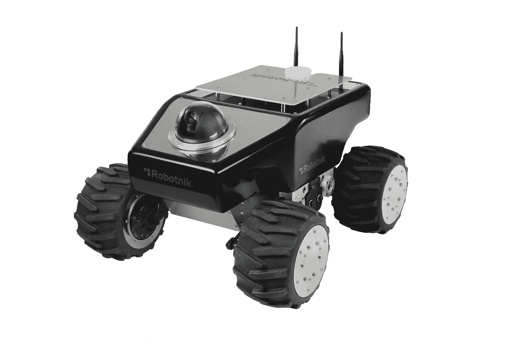
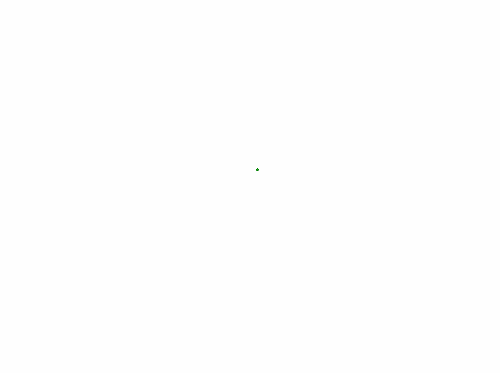
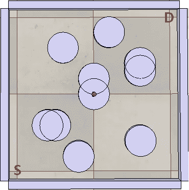
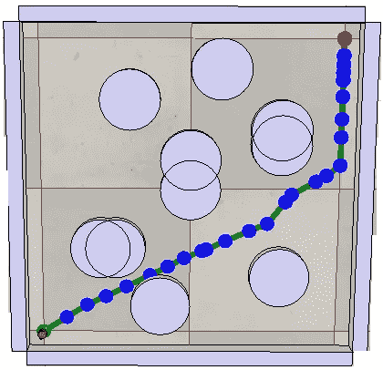
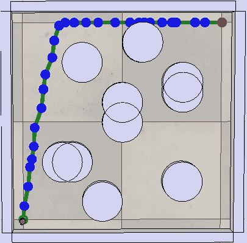
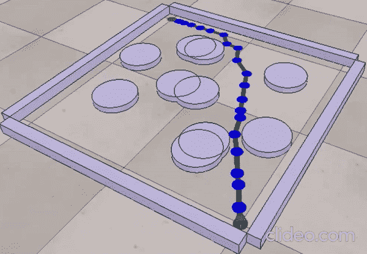

# 移动机器人的自主导航:RRT 路径规划算法

> 原文：<https://medium.com/analytics-vidhya/autonomous-navigation-of-a-mobile-robot-rrt-path-planning-algorithm-a8f780adef9d?source=collection_archive---------18----------------------->



图片(1)，取自 https://imgbin.com/download-png/HJWCJqwy，仅用于个人目的。

用土耳其文/Bu makaleyi türke ol arak oku yun 阅读这篇文章:[https://medium . com/@ kucar 17/Bir-Mobil-robot un-oton om-% C5 % 9 fekilde-yol-bulmas % C4 % B1-RRT-algorit MAS % C4 % B1-57 A8 C51 dfab 4](/@kucar17/bir-mobil-robotun-otonom-şekilde-yol-bulması-rrt-algoritması-57a8c51dfab4)

机器人学中的运动规划是一个术语，指的是找到一组可行的配置，将机器人从初始位置带到期望的位置。基本的 RRT 路径规划算法通过创建连接起点和终点(目标)的节点树来实现。

在每一步中，该算法选择一个随机点，然后将该点连接到已经计算并插入到节点/点树中的最近点。因此，在这两点之间创建了一条边/路径。然后检查连接两点的路径，看它是否与任何障碍物发生碰撞。如果没有与障碍物碰撞，该节点被添加到节点树中。然而，如果路径与任何障碍物发生碰撞，则确定移动是不可行的，并且使用新选取的点再次执行相同的计算。这些操作反复执行，直到达到目标点或公差范围。

该算法广泛应用于机器人领域，因为它可以应用于有障碍物的环境。即使它使机器人到达它的目标点，由基本 RRT 算法计算的路径通常不是最优的，因为它使用随机选取的点。尽管有改进的算法，如 RRT*算法，用于优化路径，我们将检查基本的 RRT 算法，它很少有小的改动。



图像(2)，RRT 算法的动画，它有 10000 次迭代。图片属于贾韦德·侯赛因，取自 wikipedia.org(https://en . Wikipedia . org/wiki/rapid-exploring _ random _ tree)。

在下面，我们将讲述在不撞上任何障碍物的情况下将机器人移动到目标位置的过程。RRT 算法将被运行多次，以便为特定的路径规划问题创建不同的解决方案。

让我们检查一下我们的机器人将要找到路的环境(C 空间):



我们的起点位于(-0.5，-0.5)，期望点位于(0.5，0.5)点。

由于我们的环境相对简单，我们可以期望我们的算法给出一个非常接近最优的结果。

我们可以在下面看到我们算法的 MATLAB 编码版本。首先，我们的代码将一个“barriers . CSV”文件作为输入，然后用它创建一个障碍矩阵。然后，我们将开始(startNode)和目标/结束(endNode)节点分配给两个不同的变量，并将我们的算法限制为 50 个点。因此，我们的算法将试图通过最多计算 50 个不同的点来将我们的机器人传输到其最终配置。如果在计算了 50 个不同的点之后，机器人还没有到达它的目标位置，算法会告诉我们它失败了。

在代码中，有一些事情可能会引起您的注意。其中之一是 X 轴和 Y 轴上的样本空间在每一步中分别变窄。例如，如果我们的机器人到达点
(-0.15，0。20)在没有任何冲突的情况下，我们告诉我们的算法，它的新样本空间在 X 轴和 Y 轴上分别是(-0.15，0.50)和(0.20，0.50)。这样，我们的算法在选择新的随机点时，将使用这些间隔。尽管这种方法有可能在某些环境中导致问题，但它有助于创建一条非常接近我们实例中最佳路径的路径。另一件事是，使用直线是为了将两点相互连接起来。在具有运动约束的系统中，使用不同的运动规划器来代替直线。为了便于理解，我们假设我们的机器人没有运动约束。

```
%% Clearing the command window and workspace
clc
cleartic%% Defining obstacles
obstacles = readmatrix('obstacles.csv');
centerX = obstacles(:,1);
centerY = obstacles(:,2);
radius = obstacles(:,3)/2;obstacleCenterX = zeros(1, length(obstacles));
obstacleCenterY = zeros(1, length(obstacles));
obstacleRadius = zeros(1, length(obstacles));for i = 1 : length(obstacles)
    obstacleCenterX(i) = centerX(i);
    obstacleCenterY(i) = centerY(i);
    obstacleRadius(i) = radius(i);
end%% Setting up the RRT Aims and Parameters:
startNode = [-0.5 -0.5];
endNode = [0.5 0.5];
maxTreeSize = 50;T{1} = startNode;
rangeX = startNode(1) : 0.01 : endNode(1);
rangeY = startNode(2) : 0.01 : endNode(2);
nodeNumber = 1;
edge = [];%% Starting the RRT Algorithm:
while length(T) < maxTreeSize

    if(length(rangeX) ~= 0)
    xAxis = randsample(rangeX*0.1, 1);
    end

    if(length(rangeY) ~= 0)
    yAxis = randsample(rangeY*0.1, 1);   
    end

    xSamp = [xAxis yAxis];

    for i = 1 : length(T)
        distances = sqrt((T{1}(1) - xAxis)^2 + (T{1}(2) - yAxis)^2);
        index = find(distances == min(distances));
        xNearest = T{i};
    end

    dRange = 0 : 0.005: 0.1;
    distanceX = randsample(dRange, 1);
    distanceY = randsample(dRange, 1);

    xNewAxisX = xNearest(1) + distanceX;
    xNewAxisY = xNearest(2) + distanceY;
    xNew = [xNewAxisX xNewAxisY];

    if (xNew(1) - xNearest(1) == 0)
        continue
    end

    lineCoeffs = polyfit([xNearest(1) xNew(1)], [xNearest(2) xNew(2)], 1);
    slope = lineCoeffs(1);
    yIntercept = lineCoeffs(2);

    % Checking if the line intersects any of the obstacles:
    for i = 1 : length(obstacles)
        a = linecirc(slope,yIntercept,obstacleCenterX(i),obstacleCenterY(i),obstacleRadius(i));
        % If a is not a NaN array (1 by 2), this means collision and loop
        % is terminated:
        if (~isnan(a))
            addCondition = 0;
            break
        else
            addCondition = 1;
        end

    end

    if xNew(1)> 0.5
        xNew(1) = 0.5;
    end

    if xNew(2)> 0.5
        xNew(2) = 0.5;
    end

    % If the line does not intersect the obstacles, xNew is added to the
    % tree and vertex/edge is created between xNearest and xNew:
    if (addCondition ~= 0)
        T{length(T) + 1} = xNew;
        nodeDistance = sqrt((xNearest(1) - xNew(1))^2 + (xNearest(2) - xNew(2))^2);
        edge{length(edge) + 1} = [nodeNumber nodeNumber+1 nodeDistance];
        nodeNumber = nodeNumber + 1;
        % Narrowing down the range of sample in order to get closer to the
        % goal node:
        narrowRangeX = rangeX < xNew(1);
        narrowRangeY = rangeY < xNew(2);
        rangeX(narrowRangeX) = [];
        rangeY(narrowRangeY) = [];

        if xNew == endNode
            disp('RRT is completed successfully!')
            for j = 1 : length(T)
                nodes(j, :) = [j T{j}];
            end

            for j = 1 : length(edge)
                edges(j, :) = edge{j};
            end           

            writematrix(edges, 'edges.csv');
            writematrix(nodes, 'nodes.csv');
            writematrix(nodes(:,1)', 'path.csv')
            toc
            return
        end
    end

end
disp('RRT is not completed successfully!')    
toc
```

我们期望得到的结果是“RRT 成功完成！”每次我们运行代码的时候。原因是，我们在代码开始时设置了 50 个最大点数的限制。这个 50 分的限制对于我们的算法来说并不是一个很硬的条件。我运行代码大约 15 次，算法计算的最大点数是 29。然而，如果我们将这个限制设置为 25 或使用不同的环境，我们可以预期我们的算法偶尔会失败。

我们可以看到两个不同的路径，我们的算法计算如下(路径的模拟是在 CoppeliaSim 模拟软件中进行的):



算法计算出的第一条路径(26 分)。



算法计算出的第二条路径(29 分)。

正如两个不同的结果所示，算法每次可能产生不同的结果，因为它使用随机选取的点。



机器人的无碰撞导航。

你可以找到代码。csv 文件，包含障碍物信息以及[我的 GitHub 页面](https://github.com/kucar17)上的其他模拟文件。

我在本文中使用的模拟环境是 MOOC 系列提供的模拟环境包的一部分，该系列名为“现代机器人:力学、规划和控制专门化”，可以在 Coursera 上找到。此外，这个项目的灵感来自同一 MOOC 系列第四门课程的第二周作业。