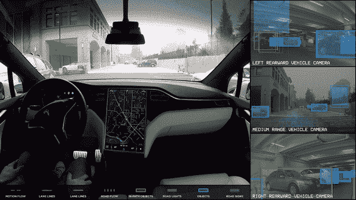
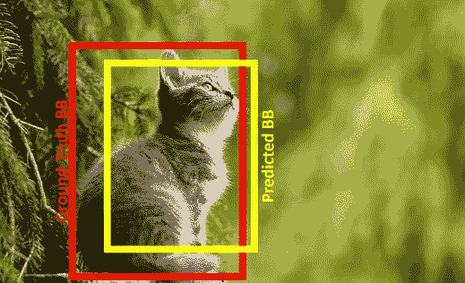
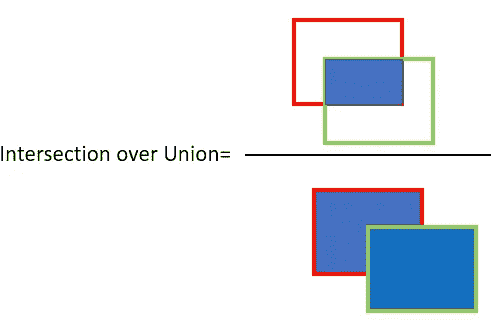
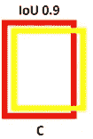
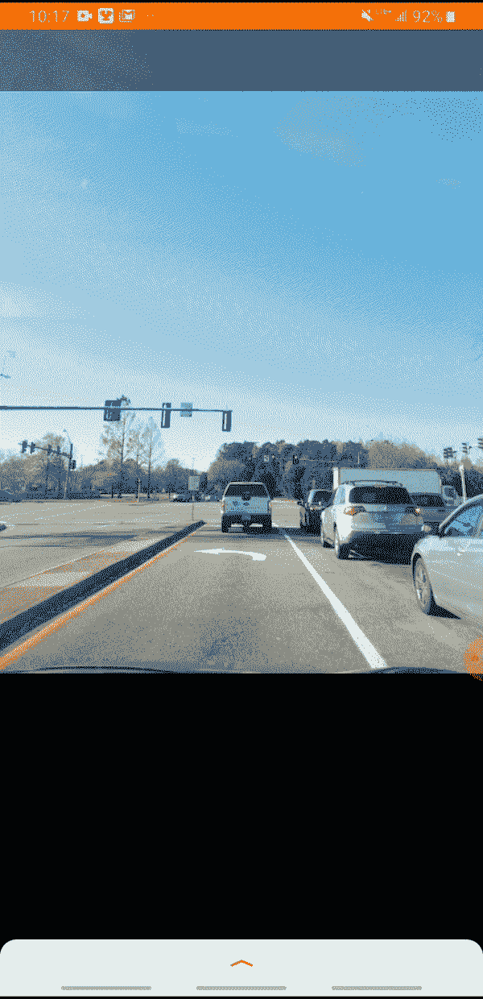

# 具有 YOLOv4 和 Darknet 的自主车辆物体检测器

> 原文：<https://medium.com/analytics-vidhya/autonomous-vehicle-object-detector-with-yolov4-and-darknet-277c645b70c1?source=collection_archive---------5----------------------->

以防你更喜欢看视觉效果…

随着自动驾驶汽车在过去几年中的兴起，我想探索一个对于创建良好的自动驾驶汽车系统来说很有必要的方面，即物体检测。那到底是什么呢？形容它的最佳方式是“汽车的眼睛”。正如你在下面看到的，车辆的摄像头正在向自主系统反馈它看到的物体。在这种情况下，它是一个人，宠物和其他车辆。自治系统然后使用该信息来做出左转、直行等决定。让我们看看是否可以使用 Darknet 和 YOLOv4 复制这个对象检测器，以检测交通标志、交通灯和其他车辆。

# 过程

首先，我想了解如何着手这个项目。人工智能专家向我推荐了一个开源的 Google Colab 笔记本，并用它来帮助我开始建模。为了创建这个模型，我将使用 Darknet 开源神经网络和 YOLO 物体探测器。为了解释 YOLO 的力量，让我们首先把它与利用滑动窗口的传统物体跟踪器进行比较。

# 传统目标检测

来源:https://towardsdatascience . com/how-do-自驾汽车-see-13054aee2503

正如您所观察到的，窗口遍历图像的每个部分，直到它检测到实际的对象，在本例中是汽车。有两个框:一个是地面真实框，在建模之前手动放置在图片中，另一个是预测框，即模型预测对象的位置。这两个框用于计算并集的交集(IoU ),该交集用于计算平均精度(mAP ),这是我们将在本文后面触及的内容。总的来说，这个过程是非常计算机密集型的，并且对于对象检测来说是低效的。就自动驾驶汽车而言，你不会希望你的汽车在 15 秒钟后没有识别出“停车标志”，然后突然停下来。它必须是即时的。

# YOLO

来源:[https://towards data science . com/how-do-self-driving-cars-see-13054 aee 2503](https://towardsdatascience.com/how-do-self-driving-cars-see-13054aee2503)

现在介绍你只看一次或简称 YOLO。约瑟夫·雷德蒙是一名计算机奇才，他在 2015 年创造了 YOLO，他还维护着暗网神经网络(*查看他的 ted 演讲* [*这里*](https://www.youtube.com/watch?v=XS2UWYuh5u0) )。在 YOLO 发生的与上述不同的是这三个步骤:网格分割、分类和图像定位。在这种方法中，模型需要检查一次图像/视频帧。网格分割将图像分割成大小均匀的网格块，因此图像的每个部分都被考虑在内。然后，模型将识别图像的不同类别，在这种情况下，是狗、自行车和卡车。最后，如上所述，使用边界框来定位对象，边界框定位对象在图像中的位置，因此称为图像定位。将所有这些放在一起，您的模型已经成功地识别了一只狗、一辆自行车和一辆卡车，以及它们在图像中的位置。

# 图像收集和预先训练的权重

在我们开始构建模型之前，我们需要收集一些图像。我从 Google Open Images 收集了我所有的汽车、交通灯、交通标志和停车标志的图像。在创建模型之前，我下载了 YOLOv4 预训练权重，这些权重是在微软的 80 个类的 COCO 数据集上训练的。在这 80 节课中，你会看到汽车、交通灯和停车标志。所以利用它来增加地图(平均精度)是明智的。不幸的是，交通标志没有预先训练的权重，因此预测其地图得分将低于其他得分。

# 模型创建和测试

现在模型创建好了，我用它运行我的视频，瞧！

如你所见，它能识别所有的交通灯、汽车，最重要的是交通标志！很好，模型的第一次迭代！

# 结果:平均准确度精密度

如果您还记得上文，我提到过并集的交集(IoU)以及它将如何影响我们的平均精度(mAP)。要再次分解借据，请观察下面这只可爱小猫的照片。

来源:[https://blog.paperspace.com/mean-average-precision/](https://blog.paperspace.com/mean-average-precision/)

正如你所观察到的，有一个真实边界框和预测框。在构建模型之前，手动绘制地面真实边界框，以准确指示对象在图片中的位置。预测框是决定它“认为”对象在哪里的模型。两个边界框之间的交集越大，平均精度(AP)分数就越大。为每个图像中的每个对象类计算 AP，然后对所有分数进行平均以确定贴图分数，这最终决定了模型的表现。

来源:https://blog.paperspace.com/mean-average-precision/

请参见下文，获得更直观的展示。正如你所看到的黄色框,“预测框”与地面实况框有 90%的重叠。

来源:https://blog.paperspace.com/mean-average-precision/

最后，请参见下面模型的单个类别映射和整体映射。

*   汽车:80.70%
*   停车标志:98.20%
*   交通灯:75.06%
*   交通标志:42.49%
*   整体地图:74.11%

正如所料，交通标志具有最低的地图，因为它没有任何预先训练的权重来训练。我希望在未来的迭代中提高这个分数，因为没有人想进入一辆自动驾驶汽车，它只能每两次预测一次它是否是交通标志。不过整体图 74.11%，目前还不错。

# 未来的工作

理想情况下，我希望将这种模式作为 dashcam 应用程序部署在移动应用程序上。有一个我用 Android Studio 从这个[开源回购](https://github.com/hunglc007/tensorflow-yolov4-tflite)部署的 Android 文件夹。它与 YOLOv4 预训练的重量一起部署，如下所示，它可以实时检测汽车，卡车和交通灯。我将应用程序的名称定制为“DashKam ”,并更改了布局，除此之外，所有代码都保持不变。理想情况下，我想用 TensorFlow Lite 格式的我自己的 YOLOv4 定制模型部署这个移动应用程序。

# 道德困境

Joseph Redmon 创造了 YOLO 来推动物体探测的发展。有了他的模型，我们能够瞬间探测到物体。然而，一名军事人员找到了他，告诉他他们使用他的模型来跟踪车辆和人员，最终可以导致无人机袭击。Redmon 听到这个消息非常震惊，以至于在 2020 年初，他宣布他将不再从事计算机视觉(物体检测)方面的工作。他创造的东西是如此美丽和宏伟，但它表明，如果它落入坏人之手，可能会导致毁灭性的后果。为此，我坚信我们需要坚持这样一个理念:为了社会，我们数据科学界有责任在工作中遵守道德规范。

# 其他工作

请访问我的网站、Github repository 和 LinkedIn 来查看我的所有项目。让我知道我下一步应该做什么！

[RidwanAlam.com](https://ridwanalam.com/)

 [## ridwan102 -概述

### 钻研软件工程世界，继续推动人类创新北极代码库贡献者…

github.com](https://github.com/ridwan102)  [## Ridwan Alam -数据科学家- Metis | LinkedIn

### 顶尖技能:Python，回归建模，分类，无监督学习，主题建模，情感分析…

www.linkedin.co](https://www.linkedin.com/in/ridwanalam/) 

# 特别感谢

*   [那个人工智能的家伙](https://github.com/theAIGuysCode/YOLOv4-Cloud-Tutorial)
*   [饥饿 007](https://github.com/hunglc007/tensorflow-yolov4-tflite)